# 汉语学习 (Chinese Learning) —— 老师与学生使用指南

> English version / 英文版本：[TUTOR_GUIDE.md](./TUTOR_GUIDE.md)

本指南介绍如何用"汉语学习"这个应用来教学和学习汉语词汇。主要面向想要布置作业、跟踪学生进度的**辅导老师**，以及用手机学习的**学生**。

应用网址：**https://chinese-learning-2x9.pages.dev** ，任何浏览器都能打开。学生一般用手机；老师录入词汇时用电脑会更方便。

> **说明：** 应用界面目前只有英文。本指南里所有按钮、菜单名称都保留英文原文，并在后面用括号加上中文解释，方便对照屏幕操作。

本指南的截图都是在手机尺寸的屏幕上截取的（两个编辑器另有一张电脑尺寸的截图），图中红色数字圆圈在每张图下面的文字里逐一说明。

### 本次更新（2026 年 9 月 20 日）

如果你以前读过本指南，这些是有变化的部分：

**新界面**

- **底部标签栏**取代了原来点头像弹出的菜单——学生看到 Study · Decks · Tutor · Progress · More（学习 · 卡组 · 老师 · 进度 · 更多），老师看到 Students · Decks · Study · More（学生 · 卡组 · 学习 · 更多）。原来藏在下拉菜单里的东西都在 **More（更多）** 页面上——见[第 3 节](#3-首页)。
- **新首页**：一个 *Study today's cards*（学今天的卡片）按钮、一张 *From your tutor*（来自老师）的作业卡片、一个简短的卡组列表——见[第 3 节](#3-首页)。
- 老师的 **Students dashboard（学生总览）**——每个学生一张卡片，显示需要注意的地方，带 *Message*（发消息）和 *Send homework*（布置作业）——见[第 7 节](#学生总览students-dashboard)。
- **更简洁的学习卡片**（一行操作按钮，其余收进 ⋯）和**更简洁的卡组页面**（Study + ⋯）——见[第 5 节](#5-学习)和[第 6 节](#6-管理词汇)。
- **聊天**里每条消息的工具收进了 ⋯ 菜单，新增 *Help me say it*（帮我说）——见[第 8 节](#聊天)。
- **邀请**会自动给学生一个内置的 **Starter Chinese（入门汉语）** 卡组，可以附带**欢迎语**，新学生第一次打开会看到专门的**首次打开页面**——见[第 2 节](#登录)和[第 7 节](#邀请学生)。

**老师工具**

- 卡组页面新增 **Paste list（粘贴列表）**——从表格、Word 或微信消息里复制一批词直接粘贴，一次添加或修改很多张卡片；拼音和英文会自动补全，卡组里已有的词原地更新，再点一下就能把改动同步到每个学生的副本——见[第 6 节](#一次添加很多词粘贴列表)。
- **邀请链接与二维码**取代了邮件邀请——见[登录](#登录)和[邀请学生](#邀请学生)。没有链接就尝试登录的人，由[管理员页面](#管理员篇访问申请与邀请权限)批准。
- **Insights（课前速览）**——每次上课前的一页简报，附带 **History（历史）**、**Recordings（录音收件箱）** 和**课程记录**——见[第 8 节](#insights课前速览)。
- **课程库与课程编辑器**——编写迷你课程（Claude 可作为共同编辑）、布置给学生、推送更新——见[第 10 节](#课程库与编辑器lesson-library--editor)。
- **读物编辑器**——逐页修改或手写分级读物，可打印、可导出——见[第 10 节](#读物编辑器)。
- **导出到 Anki**——卡组、课程和读物都可以导出为 `.apkg` 文件——见[第 6 节](#导出与导入)。
- [第 15 节](#15-未来功能设想尚未实现)的设想清单再次整理：老师在录音上写的备注现在能传给学生，分享出去的卡组也能原地更新了。

---

## 目录

1. [这个应用能做什么](#1-这个应用能做什么)
2. [开始使用](#2-开始使用)
3. [首页、标签栏与 More 页面](#3-首页)
4. [核心概念：词条、卡片、卡组与间隔重复](#4-核心概念)
5. [学习（学生的每日流程）](#5-学习)
6. [管理词汇](#6-管理词汇)
7. [老师篇：邀请学生与学生总览](#7-老师篇邀请学生与学生总览)
8. [老师篇：聊天、作业、Insights 与进度](#8-老师篇聊天作业insights-与进度)
9. [AI 助手：Ask Claude、句子教练、句子分析](#9-ai-助手)
10. [分级读物、迷你课程、课程库与任务游戏](#10-分级读物迷你课程课程库与任务游戏)
11. [进度与统计](#11-进度与统计)
12. [设置、备份与离线使用](#12-设置备份与离线使用)
13. [让 Claude 当你的助教（MCP 连接）](#13-让-claude-当你的助教mcp-连接)
14. [老师每周工作流程建议](#14-老师每周工作流程建议)
15. [未来功能设想（尚未实现）](#15-未来功能设想尚未实现)

---

## 1. 这个应用能做什么

- **间隔重复闪卡。** 每个词都从三个方向考查（看汉字→说出来；看英文→打出汉字；听音频→打出汉字）。调度算法（FSRS）决定每张卡片什么时候再次出现，让学生把时间花在快要忘记的词上。
- **自动生成地道的普通话音频**，每个词、每个句子都有，并且会自动下载到手机上，离线也能学。
- **老师 ↔ 学生连接。** 老师用一个链接邀请学生，给学生发作业（一组词或一节迷你课程），和学生聊天，并且能看到学生具体复习了什么——包括学生打出的答案和录下的发音——在 **Students dashboard（学生总览）** 上一眼看到，上课前还有一页 **Insights（课前速览）** 把这些汇总起来。
- **AI 助手**（由 Claude 驱动）：生成卡组、讲解句子、批改学生自己写的句子、写分级阅读小故事、生成小课程和小游戏——还能和你一起编辑课程和读物。
- **支持离线。** 学习完全在手机上进行，复习记录之后自动同步。
- **导出到 Anki**，方便同时使用 Anki 的人。

---

## 2. 开始使用

### 登录

这个应用是**邀请制**的：第一次登录需要邀请，之后正常登录即可。

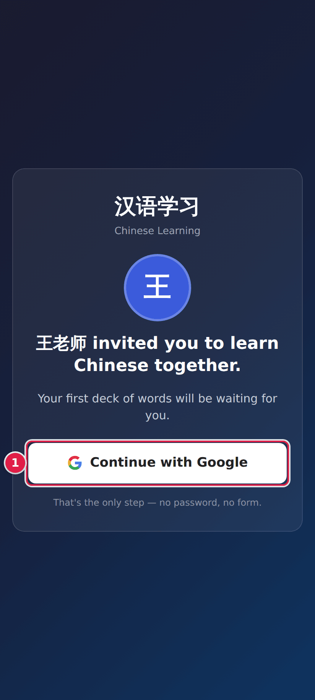

**用邀请链接（最常见）：** 老师会发给你一个形如 `…/join/abc…` 的链接，或者给你看一个二维码。在你要用来学习的手机上打开它。页面会显示是谁邀请了你，以及有一组词在等着你；点 **Continue with Google**（用 Google 继续）（1），选择你的 Google 账号。这就是全部的注册步骤：进入第一屏时你已经和老师建立了联系，老师为你准备的卡组也已经在那里等着学。

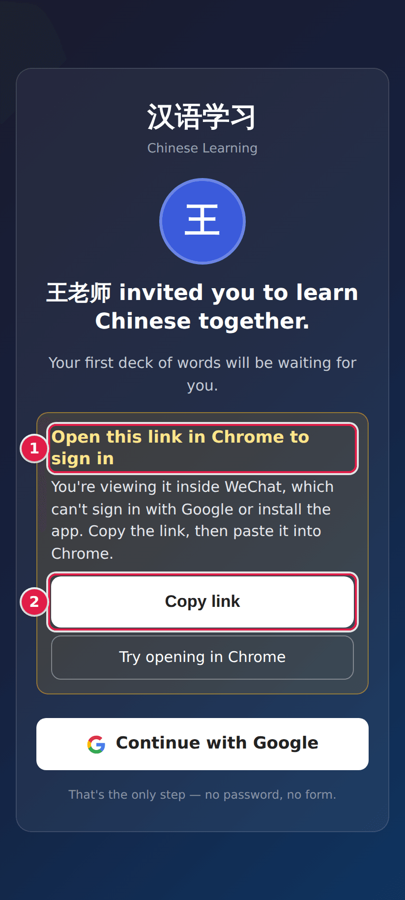

如果你是**在微信里**（或其他 App 内置的浏览器里）打开链接的，Google 登录在那里无法进行。页面会提示这一点（1）：点 **Copy link**（复制链接）（2），粘贴到 Chrome（安卓）或 Safari（iPhone）里打开，或者试试 **Try opening in Chrome**（尝试用 Chrome 打开）。登录之后同一个链接仍然有效——再打开它只是进入应用而已。

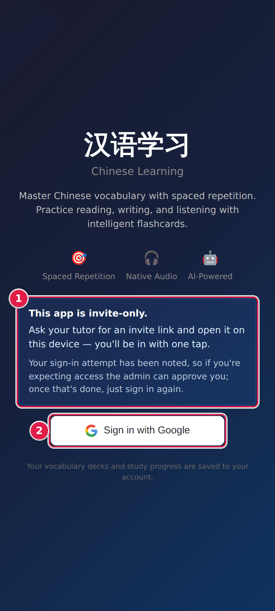

**没有链接：** 打开 https://chinese-learning-2x9.pages.dev ，点击 **Sign in with Google**（用 Google 账号登录）（2）。如果你的邮箱已被邀请（或已由管理员批准），就能直接进入；否则会回到这个页面，并看到提示 *"Ask your tutor for their invite link"*（请向老师要邀请链接）（1）。这次尝试也会记录给管理员，管理员可以批准你（见[第 7 节](#管理员篇访问申请与邀请权限)）；批准后再登录一次即可。

老师和学生的登录方式完全一样，没有单独的"老师账号"；身份是在建立联系时按每段关系设定的（见第 7 节）。如果邀请是发给某个特定邮箱的，而你用了另一个 Google 账号登录，页面会提示这一点——请切换账号，或者向老师要一个新链接。

### 第一次打开看到的页面

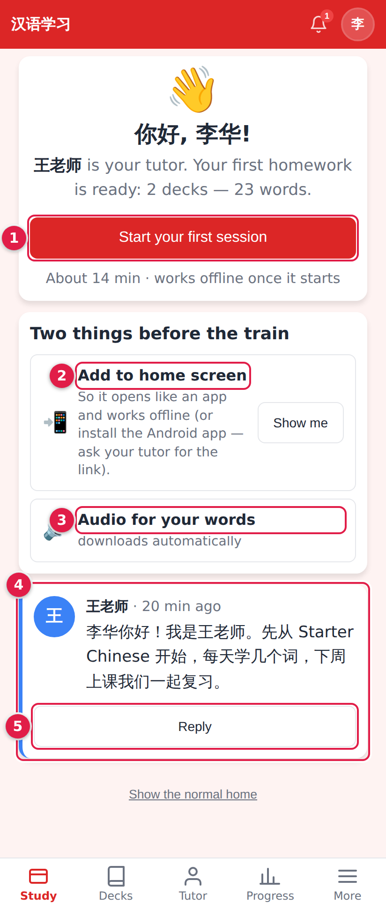

通过老师链接进来的学生，在第一次学习之前会看到这个页面：

1. **Start your first session**（开始第一次学习）——上面写着老师的名字和第一份作业卡组，以及大概需要多长时间。
2. **Add to home screen**（添加到主屏幕）——点 *Show me*（教我）查看在这部手机上安装应用的步骤（安卓和 iPhone 的步骤不同；安卓 Chrome 可能直接弹出安装提示）。
3. **Audio for your words**（词汇的音频）——不需要做任何事，发音音频会自动下载。
4. 老师在生成链接时写的**欢迎语**（如果写了的话）。
5. **Reply**（回复）打开和老师的聊天。

第一次学习结束后，就会显示正常的首页（第 3 节）。

### 安装到手机（建议学生这样做）

这是一个"渐进式网页应用"（PWA），可以像普通 App 一样安装到桌面：

- **安卓（Chrome 浏览器）：** 打开网站，点右上角 ⋮ 菜单 → **添加到主屏幕** / **安装应用**。
- **iPhone（Safari）：** 点"分享"按钮 → **添加到主屏幕**。

安装后会全屏打开、没有网络也能用、并且记住登录状态。老师能看到学生是否已经安装（第 7 节），也可以一键把安装步骤发到聊天里（**Send how-to**，发送安装说明）。

另外还有一个安卓原生外壳（APK），增加了桌面小组件、在任何 App 里选中文字后调用"Sentence Coach（句子教练）"、以及作业提醒通知。获取方式见 [native/README.md](../native/README.md)。

### 新学生的推荐设置

1. 在手机上（用 Chrome 或 Safari，不要在微信里）打开老师的邀请链接，点 **Continue with Google**（用 Google 继续），然后安装应用（见上）。和老师的联系已经自动生效。
2. 如果是没用链接登录的，打开 **Tutor**（老师）标签，接受老师的请求（或者通过邮箱和老师建立联系）。
3. 第一次请在 Wi-Fi 下多停留一分钟——音频会自动下载；**Settings**（设置，在 More → Settings）页面会显示手机上已有多少段音频。
4. 每天点首页的 **Study today's cards**（学今天的卡片）。

---

## 3. 首页

1. **通知** —— 聊天消息、联系请求、收到的共享卡组。
2. **你的头像** —— 打开 **More（更多）** 页面（见下文）。
3. **Study today's cards（学今天的卡片）** —— 开始一次学习，包含所有卡组里今天到期的全部卡片。下面一行写着有多少张卡片、大约需要多久（"28 cards due · about 10 min"，28 张到期 · 约 10 分钟）。
4. **ⓘ** —— 按颜色显示今天卡片的构成：**蓝色** 新卡片，**紫色** 次级新卡片，**橙色** 学习中的卡片，**绿色** 复习卡片（第 4 节详细解释）。
5. **From〈老师〉（来自老师）** —— 作业卡片：老师最近发来的卡组或迷你课程、你在上面的进度（用文字表示，例如"All 24 cards started · 下雪 and 刮风 need work"，24 张卡片都已开始 · 下雪和刮风需要加强），以及老师最新的未读消息。**Reply**（回复）打开聊天；**Open deck**（打开卡组）进入卡组。
6. **Your decks（你的卡组）** —— 到期卡片最多的五个卡组，每个都有一条细进度条（绿色 = 已掌握，蓝色 = 已见过）、词数，以及一个**图钉**，可以把卡组固定在最上面。
7. **All decks →（全部卡组）** —— 完整列表，在 Decks 标签里。
8. **+ Add a deck（添加卡组）** —— 新建空卡组，或者让 Claude 生成一个（第 6 节）。
9. **标签栏**，在每个普通页面上都有（学习过程中、读读物时和聊天时会隐藏，把整块屏幕留给当前的事）。

按钮上方还有一张**连续学习天数（streak）卡片**——连续学习的天数，以及最近一个月的热力图。

### 标签栏

| 标签 | 打开什么 |
|------|----------|
| **Study（学习）** | 上面的首页 |
| **Decks（卡组）** | 所有卡组，以及一个能在所有卡组里找词的搜索框（第 6 节） |
| **Tutor（老师）** | 你的老师、作业和对话（第 8 节） |
| **Progress（进度）** | 30 天统计和每日记录（第 11 节） |
| **More（更多）** | 其他所有功能——见下文 |

老师的标签栏是 **Students · Decks · Study · More**（学生 · 卡组 · 学习 · 更多）（如果老师自己也学习，还会多一个 **Progress**）。老师的 **Students** 标签就是第 7 节的学生总览。在 **Settings → Start on**（设置 → 启动时打开）里，任何人都可以选择应用打开时停在哪个标签。

### More（更多）页面

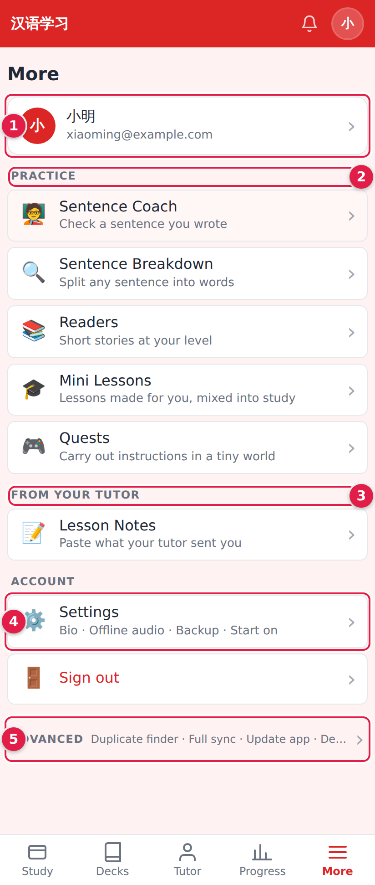

1. **你的名字** —— 点击进入 **Settings（设置）**（第 12 节）。
2. **Practice（练习）** —— **Sentence Coach**（句子教练：检查你写的句子）、**Sentence Breakdown**（句子分析：把任意句子拆成词）、**Readers**（分级读物：适合你水平的小故事）、**Mini Lessons**（迷你课程：为你定制、穿插在学习中的小课程）、**Quests**（任务游戏：在一个小世界里执行中文指令）——都在第 9、10 节。
3. **From your tutor（来自老师）** —— **Lesson Notes（课堂笔记）**：粘贴老师课后发的内容，作为 AI 功能的上下文。
4. **Settings（设置）** 和 **Sign out（退出登录）**。
5. **Advanced（高级）**（默认折叠）—— Duplicate Finder（重复查找）、Sentence Coverage（例句覆盖）、Full Sync（完整同步）、Update App（更新应用）和调试工具。平时很少用到。

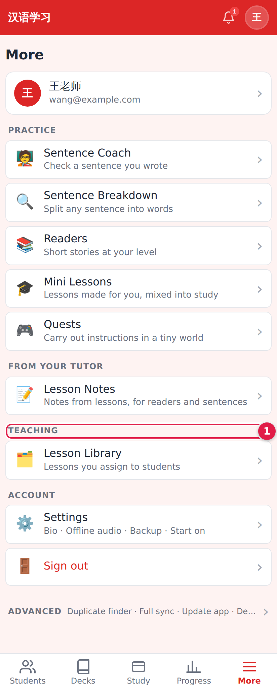

老师的 More 页面多一组 **Teaching（教学）**（1），里面是 **Lesson Library（课程库）**（2）（第 10 节），没有 *From your tutor* 这一组。

---

## 4. 核心概念

### 词条与卡片

一个**词条（note）** 就是一个词汇项：汉字、拼音（**必须用声调符号**，如 nǐ hǎo，不要用 ni3 hao3）、英文释义、可选的备注/趣味知识、可选的例句，以及自动生成的音频。

每个词条自动生成 **三张卡片**，分别对应一种能力：

| 卡片类型 | 学生看到 | 学生要做的 |
|----------|----------|------------|
| Hanzi → Meaning（汉字→意思） | 汉字 | 大声读出来（可以录音），然后翻开看拼音和释义，自我评分 |
| Meaning → Hanzi（意思→汉字） | 英文释义 | 打出汉字；应用逐字比对答案 |
| Audio → Hanzi（音频→汉字） | 听到读音 | 打出汉字 |

**卡组（deck）** 是一组词条（例如"第三周作业：天气"）。可以按卡组学习（卡组页面的 **Study** 按钮），也可以所有卡组一起学（首页的 **Study today's cards**）。

### 间隔重复与四个评分

每张卡片之后，学生给自己评分：

| 评分 | 含义 | 结果 |
|------|------|------|
| **Again（重来）** 红色 | 忘了 | 约 1 分钟后再出现，记一次遗忘 |
| **Hard（困难）** 橙色 | 勉强想起来 | 间隔变短 |
| **Good（良好）** 绿色 | 记得 | 正常间隔 |
| **Easy（简单）** 蓝色 | 太容易 | 间隔大幅加长；新卡片直接跳过学习阶段 |

按钮上会显示评分后的下次间隔（1m、10m、2d……），选择一目了然。算法是 FSRS，一种现代调度算法，在同样记忆保持率下比经典 Anki 算法少 20–30% 的复习量。

### 队列与每日上限

每张卡片处于四个队列之一，学习界面顶部（以及首页 ⓘ 后面）的彩色数字就是各队列的数量：

- **蓝色 —— New（新卡片）**：从未学过。每个卡组每天有上限（默认 **20**），避免大卡组把学生压垮。
- **紫色 —— 次级新卡片**：学生*已经开始学*的词的其他新卡片（例如已经见过汉字的词，它的打字卡）。有单独的每日预算（默认 **10**），保证三种能力都在推进。
- **橙色 —— Learning（学习中）**：刚引入，以分钟为单位反复练习。
- **绿色 —— Review（复习）**：已"毕业"、今天到期的卡片。

两个上限都在 **Deck Settings**（卡组设置，见第 6 节）里按卡组设定。老师可以根据学生情况调整——对进度慢的学生，10 + 5 是不错的选择。

---

## 5. 学习

点首页的 **Study today's cards**，或者卡组页面的 **Study · n due**（学习 · n 张到期）。一次学习会把今天到期的所有卡片一口气学完：先出计时已到的学习中卡片，然后是新卡片和复习卡片的混合。顶栏和标签栏会隐藏，整个屏幕都留给学习。

### "汉字→意思"卡片的正面

1. 本次学习的**队列数量**（蓝 + 紫 + 橙 + 绿）。带下划线的数字表示当前卡片来自哪个队列。
2. **撤销**上一次评分。
3. **离线状态小标签** —— 平时显示 *Auto*（自动）：断网时应用会自己发现并切换到手机本地的音频。点一下可以**强制离线模式**（坐火车时用）；再点一下回到自动。
4. **结束学习**（✕）。只要评过至少一张卡片，它会先问 *End session?*（结束学习？）并显示本次小结（见下文）。
5. 要读出来的词。
6. **Record Your Pronunciation（录下你的发音）** —— 录下学生读这个词的声音。录音会随复习记录保存，**老师可以听**（见第 8 节）。
7. **Skip recording（跳过录音）** —— 直接看答案。上面的 **Use in Sentence（放进句子里）** 会显示一个例句作为提示。

### 卡片背面

1. 汉字、拼音和释义。
2. **From〈老师〉: …（来自老师）** —— 老师把你这个词的某条录音标记为 *needs work*（需要改进）并写了评语时会显示在这里（第 8 节）。它只显示一次，就在这张卡片下次出现时——老师的反馈不用通过聊天就能传到学生手里。
3. **Play（播放）** —— 重放这个词的读音。
4. **Record again（重新录音）** —— 第一次读得不好可以重录。
5. **Example sentences（例句）** —— 一直显示在释义下面：先是这张卡片自己的例句，然后是分级例句（从易到难）。每一行开始都是**空白的**，先听：右边的 **▶** 播放，然后每点一下这一行就依次显示汉字、拼音、英文（全部显示后再点一下就收起）。左边的 **EN** 把这一行切换成反向练习：只显示英文，自己先说成中文，再点一下对照汉字和拼音。全部显示后还有 *What's going on here?*（逐词拆解）和 **+ Add as card**（加为卡片）；第一行标着 *From the card*。例句列表在按钮下方滚动，评分按钮不会动。
6. **Show all（全部显示）** —— 显示这张卡片的所有例句（下一张卡片又从空白开始）。
7. 旁边的 **⋯** —— 重新生成例句、再加五句、定制例句或清空（需要联网）。
8. **Ask Claude（问 Claude）** —— 关于这个词随便问（用法、语法、近义词）。Claude 还可以**修改当前卡片**、**创建一个迷你课程**。问答会保存在词条的历史记录里。需要联网。
9. **Edit card（编辑卡片）** —— 改错别字、添加可接受的其他答案、修改例句。
10. **⋯** —— 其他所有操作（见下图）。
11–14. **Again / Hard / Good / Easy**（重来 / 困难 / 良好 / 简单）。

如果词条有趣味知识，会显示在释义和例句之间。

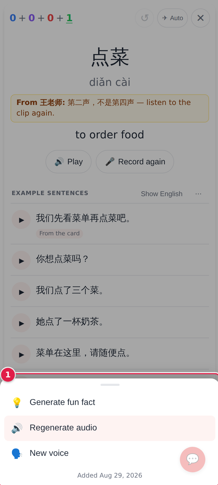

1. **⋯ 面板**：**Generate fun fact**（生成趣味知识：Claude 写一条记忆技巧并保存到词条）、**Regenerate audio**（重新生成音频）、**New voice**（换个声音）、**Roleplay**（围绕这个词的角色扮演对话）、**Play my recording**（播放我的录音，录过之后出现），最下面是这张卡片的添加日期。

### 打字卡片（"意思→汉字"和"音频→汉字"）

1. 打出汉字（任何输入法都行，手机拼音输入法很方便）。
2. **Check Answer（检查答案）**。
3. 卡住的时候有 **Multiple Choice（选择题）**（如果选项几秒钟内没准备好，卡片会退回打字模式），以及 **Use in Sentence** 给提示。

1. 打出的答案会逐字比对——写错的字用红色显示在正确答案上方，学生能清楚看到自己混淆了哪个字。打出的答案会保存，老师可以查看。
2. **Ask Claude** 在这里会多一个 *Check my answer*（检查我的答案）快捷问题，用来判断一个差一点的答案算不算对。

如果一个词有几种都算正确的写法，编辑卡片时在 **Acceptable alternatives（可接受的其他答案）** 里加上（见第 6 节），它们也会被判为正确。

### 卡片之间

- 大约每 8 张卡片，学习中可能插入一节 **迷你课程**（如果有待学的），学习结束时会推荐**今天的读物**故事（见第 10 节）。
- 给一张卡片评 **Again** 时，应用会悄悄为它准备例句，一分钟后卡片再出现时例句已经就绪。

### 提前结束

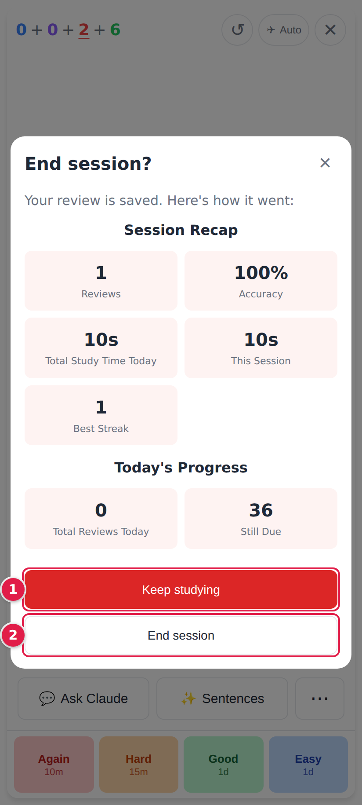

评过至少一张卡片后点 ✕，会先显示本次小结——复习数、正确率、用时、今天的总量——以及 **Keep studying**（继续学）（1）和 **End session**（结束）（2）。怎么选都不会丢东西：每次评分的瞬间就已经保存在手机上了。

### 学习结束

所有卡片学完后，**All Done!（全部完成）** 页面显示同样的小结和今天的总量——还有撒花动画。**Study More（再学一些）** 按钮可以为学有余力的学生追加 10 张新卡片。

每次复习都先保存在本地，断网也不会丢。

---

## 6. 管理词汇

### Decks（卡组）标签

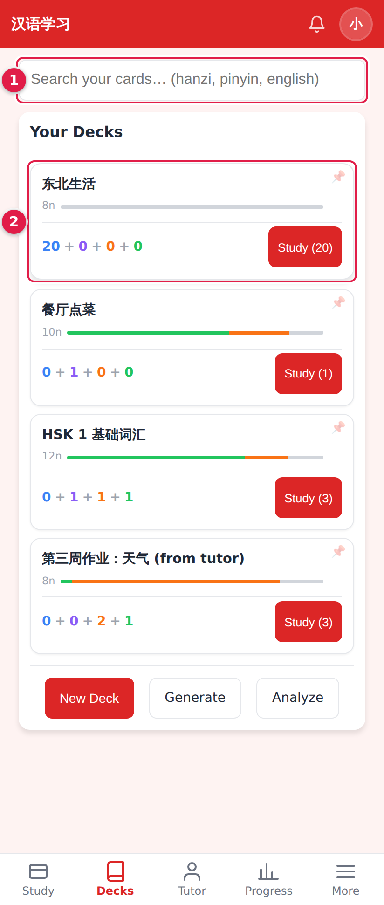

1. **搜索** —— 输入汉字、拼音或英文，在所有卡组里找一个词；结果显示它最近的评分，可以跳到所在卡组、编辑或删除。
2. 一张**卡组卡片** —— 名称、四个彩色队列数量、进度条，以及只学这一个卡组的 **Study** 按钮。点名称进入卡组页面。置顶的卡组排在最前。

列表下面是 **New Deck**（新建卡组）、**Generate**（让 Claude 根据描述生成卡组）和 **Analyze**（句子分析工具）。

### 卡组页面

1. **Study · n due（学习 · n 张到期）** —— 学习这个卡组。
2. **⋯** —— 卡组菜单（见下图）。
3. **📋 Paste list（粘贴列表）** —— 粘贴一批词，一次添加或修改（见下文）；**+ Add word（添加词）** —— 手动添加一个词。

按钮下面是一个**进度块**：掌握百分比、每种卡片类型一条进度条（字→义 / 义→字 / 听→字）、上次学习时间。然后是**词条列表**，每个词后面有最近几次评分（彩色圆点）和掌握百分比。点某一行可以编辑卡片。

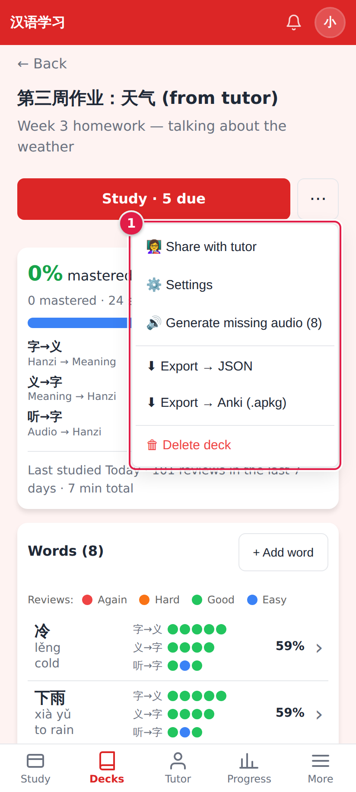

1. ⋯ 菜单：**Share with tutor**（分享给老师，只有连接了老师才显示——让老师看到这个卡组的进度）、**Settings**（设置：名称、每日上限、调度参数）、**Generate missing audio**（生成缺失的音频，有词缺音频时才出现）、**Regenerate audio…**（重新生成音频：选几个词换个声音重录）、**Export → JSON**（导出 JSON）、**Export → Anki (.apkg)**（导出到 Anki）和 **Delete deck**（删除卡组）。

### 添加一个词

1. **Hanzi（汉字）** —— 简体字。
2. **Pinyin（拼音）** —— 带声调符号（nuǎn huo）。请不要用数字声调。
3. **English Meaning（英文释义）** —— 尽量简短；有需要可以在括号里注明词性。
4. **Fun Facts / Notes（趣味知识/备注）** —— 记忆技巧、用法说明、方言说明（例如"东北话：……"）。选填。

保存几秒钟后自动生成音频，例句也会在后台排队生成。

### 一次添加很多词（粘贴列表）

这是建卡组、批量改卡片最快的办法：把词表从你平时放它的地方复制出来——Excel 或 Google 表格、Word 里的表格、微信消息、课堂笔记——然后粘贴进来。卡组页面 → **📋 Paste list（粘贴列表）**。

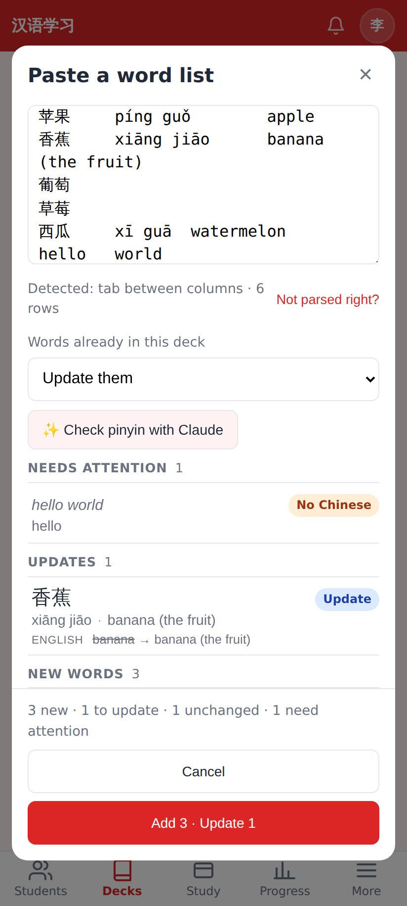

1. **粘贴**到框里，一行一个词。从表格复制来的是 `汉字 [Tab] 拼音 [Tab] 英文`；微信消息那样的 `苹果 píngguǒ apple` 或 `苹果 - apple` 也可以；只有汉字的列表（`葡萄`）同样可以。第四列如果是中文，会当作例句；表头那一行会自动跳过。
2. **Separator（分隔符）** —— 一行里各部分之间用什么隔开。**Auto（自动）** 能处理从表格或聊天里复制来的内容；也可以选 Tab、逗号、空格、`|`、`–`/`:`，或者在小框里输入自己的分隔符（比如写成 `苹果 -- apple` 就填 `--`）。**One word per（每个词占）** 一行或用分号隔开。下面的 "Reading it as: …（读作……）" 说明程序是怎么理解这段文字的。
3. **Words already in this deck（卡组里已有的词）** —— *Update them*（更新，默认：用粘贴的拼音、释义、备注或例句替换旧的，学生在这张卡上的学习记录不受影响）、*Leave them as they are*（保持原样）或 *Add again as new cards*（再加一张新卡）。
4. 预览把各行分组：**Needs attention（需要处理）**（没有中文，或英文还缺）、**Updates（要更新的）**（显示 旧 → 新）、**New words（新词）**、**Skipped（跳过）**（同一个词粘了两次）和 **Already the same（没有变化）**。缺的**拼音**会立刻在手机上补好；缺的**英文**点一下 **✨ Fill in English with Claude（让 Claude 补英文）** 整个列表一起补。自动补上的内容会带 ✨ 标记，直到你改过它；多音字的单字词会提示"check the reading（确认读音）"。
   **然后是讲解。** 一个黄色提示框会统计还没有讲解或例句的词：点 **✨ Write them with Claude（让 Claude 来写）**，Claude 会为每一个词写出卡片背面的讲解（逐字或逐词解释，再说明用法和常见错误）和一句带拼音、带翻译的短例句——和 MCP 助教用的是同一套卡片标准。你自己粘贴或输入的内容会原样保留。这样，一份只有汉字的词表，三下就能变成完整的卡组：粘贴、✨ 补英文、✨ 写讲解。如果没做这一步就保存，最后一页会提醒你，以后把同一份词表再粘贴一次就能补上（学习进度不受影响）。
5. 点某一行可以修改它的汉字、拼音、英文、例句或讲解，或勾选 **Skip this row（跳过这一行）**。
6. **Add n · Update m（添加 n · 更新 m）** 一次保存。音频和例句在后台生成，和手动添加的词一样。

如果这个卡组已经分享给了学生，最后一页会列出每个学生，写明他们的副本还缺什么，旁边有 **Update their copy（更新他们的副本）** 按钮：新词会加进去，你改过的文字会替换他们的——除非学生自己更近期地改过那张卡，那就保留学生的版本。学习进度永远不受影响。

### 编辑卡片

点词条列表里的某一行。除了基本字段还可以设置：

1. 标题栏的 **⋯** 里有 **Delete note**（删除词条）。
2. **Acceptable alternatives（可接受的其他答案）** —— 打字卡片的其他正确答案，一行一个。
3. **Sentence Clue（例句提示）** —— 显示在卡片上作为提示的例句（含拼音和翻译；点 **Regenerate** 让 Claude 写一个）。它有自己的音频。

再往下：**Sentence Set（例句组）**（生成的分级例句——可以再生成、删除）以及这个词的**录音**。

### 卡组设置

卡组页面 → ⋯ → **Settings**：

1. **Deck Info（卡组信息）** —— 名称和描述，然后是两句话说明 FSRS 怎么安排卡片。
2. **Learning（学习）** —— **New cards per day（每天新卡片数）**（蓝色预算）和 **Secondary cards per day（每天次级新卡片数）**（紫色预算），然后是学习步骤。高级调度参数（目标记忆保持率、间隔倍数、最大间隔）在 *Advanced Settings（高级设置）* 下，默认值适合大多数学生。

### 用 AI 生成卡组

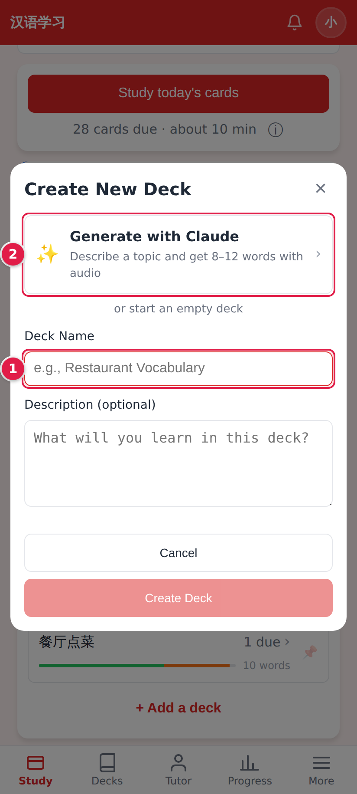

首页的 **+ Add a deck（添加卡组）** 打开这个面板：给空卡组起名（1），或者选 **Generate with Claude**（让 Claude 生成）（2）。

描述想学什么（1）——"在长春坐公交车的词汇"、"HSK 2 日常生活动词"——Claude 会生成 8–12 个词，带拼音、释义、趣味知识和音频。生成后请检查一遍，删掉不需要的词。Decks 标签上的 **Generate** 打开的也是这个页面。

### 搜索、查重与移动词条

**搜索**在 **Decks（卡组）** 标签的最上面（见上文）。**Duplicate Finder（重复查找）**（More → Advanced）扫描重复添加的汉字，并建议保留哪一个。

### 导出与导入

- **More → Settings → Backup → Download Backup**（更多 → 设置 → 备份 → 下载备份）把所有内容（卡组、词条、复习记录）保存为一个 JSON 文件。
- 卡组可以从 JSON 导入——格式见 [IMPORT_EXPORT_FORMAT.md](./IMPORT_EXPORT_FORMAT.md)。

**导出到 Anki。** 在卡组页面点 **⋯ → Export → Anki (.apkg)**，Anki 卡包直接在手机上生成（不经过服务器，所以音频已缓存时离线也能用）：

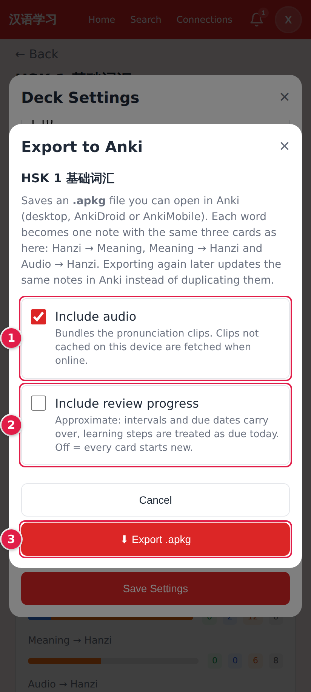

1. **Include audio（包含音频）** —— 打包发音音频（默认开启）。设备上还没有的音频在联网时会自动获取，缺失的只会计数。
2. **Include review progress（包含复习进度）** —— 默认关闭。只有希望 Anki 大致沿用现有复习计划、而不是把每张卡都当作新卡时才打开。
3. **Export .apkg（导出）** —— 生成文件；进度条显示音频收集情况。

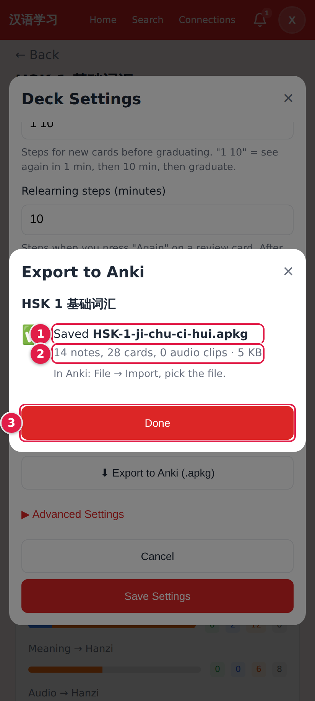

1. 保存的文件名。
2. 导出内容——词条数、卡片数，以及打包（或缺失）的音频数量。
3. **Done（完成）**。在 Anki（电脑版、AnkiDroid 或 AnkiMobile）里用 **File → Import（文件 → 导入）** 打开文件。每个词成为一个词条，和这里一样有三张卡（汉字→意思、意思→汉字、音频→汉字）。之后再次导出同一个卡组，会**更新** Anki 里已有的词条而不是重复添加。

课程和读物也可以导出到 Anki——见第 10 节。

---

## 7. 老师篇：邀请学生与学生总览

所有和老师相关的功能都在 **Students（学生）** 标签里（在学生的手机上叫 **Tutor（老师）**）。

### 邀请学生

注册是邀请制的，"邀请新人"这个权限由管理员按老师逐个开启（见下文）。开启后，Students 标签会出现 **+ Invite student（邀请学生）** 按钮，点开是这个面板：

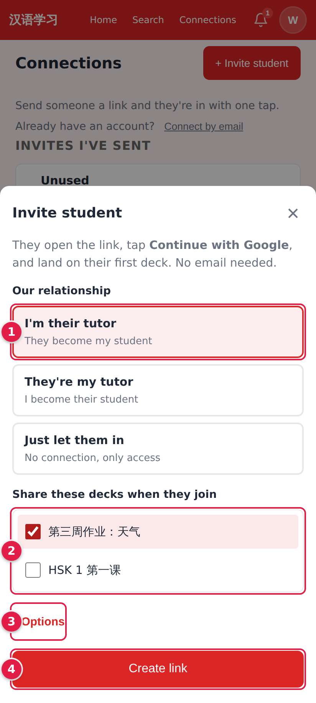

1. **Start them with（他们从这些开始）** —— 内置的 **Starter Chinese（入门汉语）** 卡组（15 个日常词，带例句和音频）默认已勾选，这样新学生一登录就有东西可学。
2. 也可以勾选**你自己的卡组**——学生一进来就会有每个勾选卡组的副本。邀请学生时至少要选一个卡组。
3. **Welcome message（欢迎语）**（选填）—— 学生登录的那一刻会作为你的第一条聊天消息送达，并显示在他们的第一屏上。打个招呼，告诉他们先做什么。
4. **Options（选项）** —— 见下图。
5. **Create link（生成链接）**。

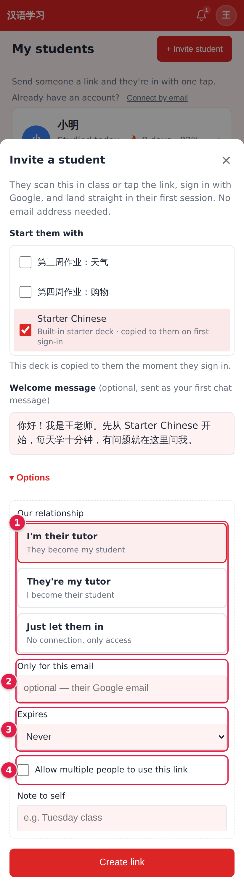

**Options** 里有：

1. **Our relationship（我们的关系）** —— 保持默认选中的 **I'm their tutor**（我是他们的老师）。其他选项是 **They're my tutor**（他们是我的老师）和 **Just let them in**（只开通账号，不建立联系）。
2. **Only for this email（仅限这个邮箱）** —— 限定只有某个 Google 账号能用。
3. **Expires（有效期）** —— 永不过期，或 1–90 天。
4. **Allow multiple people to use this link**（允许多人使用同一个链接，适合整个班），以及 **Note to self**（给自己的备注），方便记住这个链接是给谁的。

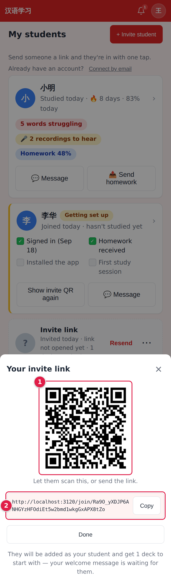

1. **二维码** —— 学生可以直接扫你的屏幕。
2. **邀请链接**，带 **Copy（复制）** 按钮。在手机上还有 **Share…（分享）** 按钮，可以通过微信、WhatsApp、邮件等发送。

学生打开链接，点 **Continue with Google（用 Google 继续）**，立刻就成为你的学生——不需要接受请求，也不用输入邮箱。他们的第一屏会写着你的名字、你的第一份作业卡组和你的欢迎语（见[第 2 节](#第一次打开看到的页面)）。除非在 **Options** 里改过，每个链接只能用一次。

如果对方已经有账号，链接同样有效（会建立联系并分享卡组）；也可以改用 **Connect by email（通过邮箱联系）**：输入对方邮箱，选择 **Tutor**（"I'll teach them"，我教他们）或 **Student**（"They'll teach me"，他们教我）。对方会在自己的 Tutor 标签看到 **Pending Request（待处理请求）**，点 **Accept（接受）** 即可。没有开启邀请权限的老师，只能通过邮箱和已经在用这个应用的人建立联系。

同一个人可以既是某些人的老师，又是另一些人的学生。

### 学生总览（Students dashboard）

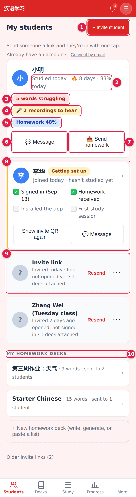

有了学生之后，**Students** 标签就是一个总览——每个学生一张卡片：

1. **+ Invite student（邀请学生）** —— 上面的面板。**Connect by email（通过邮箱联系）** 是标题下面的小链接。
2. **状态行** —— 上次学习时间、连续天数、今天的正确率。
3. **n words struggling（n 个词有困难）** —— 最近 7 天忘记或打错的词；点它打开 Insights。
4. **🎤 n recordings to hear（n 条录音待听）** —— 你还没标记过的发音录音；点它打开录音收件箱。
5. **Homework n%（作业 n%）** —— 你发给他们的所有内容完成了多少（已掌握的卡片算满分，已开始的算一半，完成的课程算满分）。
6. **Message（发消息）** —— 直接打开你和他们最近的一个对话。
7. **Send homework（布置作业）** —— 分享卡组或布置课程（第 8 节）。
8. 还没开始学习的学生显示一张 **Getting set up（正在准备）** 卡片——四个步骤 *Signed in · Homework received · Installed the app · First study session*（已登录 · 已收到作业 · 已安装应用 · 第一次学习），以及 **Show invite QR again**（再次显示邀请二维码）和 **Message**。他们的学生页面上有完整的清单（第 8 节）。
9. **待使用的邀请** —— 还没被使用的链接，显示为灰色的一行：创建时间、是否*已被打开*（有人加载了页面但没登录——通常就是第 2 节说的微信问题）、**Resend**（重发：再次显示二维码）和一个 ⋯ 菜单（**Copy link** 复制链接、**Show QR** 显示二维码、**Revoke invite** 撤销邀请）。
10. **My homework decks（我的作业卡组）** —— 你发出过的卡组，以及每个发给了几个学生；还有 **+ New homework deck**（新建作业卡组：手写、按主题生成，或粘贴一份词表）。最下面的 **Older invite links** 列出已使用和已过期的链接。

### 管理员篇：访问申请与邀请权限

只有应用的管理员账号能看到 **Admin（管理）**（More → Advanced）。里面有两项和老师相关：

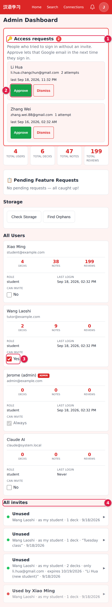

1. **Access requests（访问申请）** —— 没有邀请就尝试登录的人（第 2 节里的"请向老师要邀请链接"页面）。列出姓名、Google 邮箱和尝试次数。
2. **Approve（批准）** 让这个邮箱下次登录时直接进入（**Dismiss** 忽略该申请）。不需要再发链接——告诉对方再登录一次即可。
3. **Can invite（可以邀请）** —— 按用户设置的开关，打开后老师才会有 **+ Invite student** 按钮。管理员始终可以邀请。新建的账号在管理员打开这个开关之前不能邀请别人。
4. **All invites（全部邀请）** —— 所有人生成的每个链接及其状态，用于审核或撤销。

---

## 8. 老师篇：聊天、作业、Insights 与进度

### 学生页面

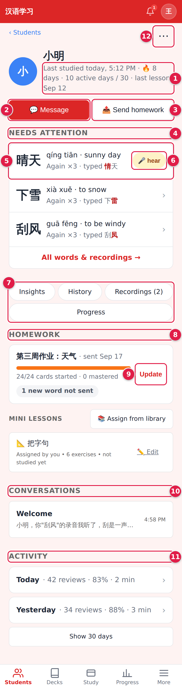

在总览上点学生的名字，打开他们的页面：

1. **状态行** —— 上次学习、连续天数、本月活跃天数，以及你上次记录的上课日期。
2. **Message（发消息）** —— 打开最近的对话（不用输入标题；要开新对话可以在聊天自己的菜单里开）。
3. **Send homework（布置作业）** —— 见下文。
4. **Needs attention（需要注意）** —— 本周最吃力的三个词……
5. ……每个词显示评分情况，打字卡片还会显示**学生实际打出的字**，错字标红（把 晴天 打成 情天）。点一行查看全部练习记录。
6. **🎤 hear（听）** —— 这个词有一条你还没听过的录音；就地播放。
7. **Insights · History · Recordings · Progress** —— 四个详情页面，见下文。
8. **Homework（作业）** —— 你发出的每个卡组，带进度条（橙色 = 已开始，绿色 = 已掌握）和"n/24 cards started · n mastered"（n 张已开始 · n 张已掌握）……
9. ……如果你的原版卡组里有学生副本还没有的新词，会出现 **Update（更新）**（见下文的*更新他们的副本*）。然后是学生的**迷你课程**，显示是谁做的、学得怎么样；**Edit（编辑）** 用课程编辑器打开你布置的那些，**Assign from library（从课程库布置）** 再加一节。
10. **Conversations（对话）** —— 和这个学生的每一个聊天串。
11. **Activity（活动）** —— 最近有复习的几天，带正确率和用时；**Show 30 days** 查看整月。
12. **⋯** —— 不常用的操作（见下图）。

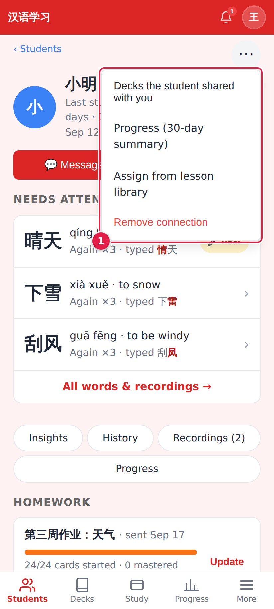

1. ⋯ 菜单：**Decks the student shared with you**（学生分享给你的卡组：学生在自己的卡组页面主动给你看的卡组）、**Progress (30-day summary)**（30 天进度总结）、**Assign from lesson library**（从课程库布置）和 **Remove connection**（解除联系）。

### 帮新学生准备好

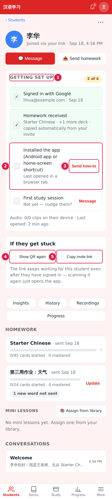

已经登录但还没开始学习的学生，页面上会显示一份清单而不是空空的进度页，这样你能分清"根本没打开链接"和"打开了但卡住了"：

1. **Getting set up（正在准备）** —— 四个步骤和 *2 of 4*（完成 2/4）的计数。
2. **Installed the app（已安装应用）** —— 他们用的是安卓 App、主屏幕快捷方式还是普通浏览器标签页，以及上次打开的时间。
3. **Send how-to（发送安装说明）** —— 一键把安装步骤（通过 Obtainium 安装安卓 App，或添加到主屏幕）发到你们的聊天里。
4. **Show QR again（再次显示二维码）** —— 创建这个账号的那个邀请，给站在你旁边、刚换了手机的学生用。
5. **Copy invite link（复制邀请链接）**，用于再发一次。

清单下面已经显示他们的 **Homework**（你的邀请复制过去的卡组）和 **Welcome（欢迎）** 对话。

### 聊天

聊天是一个简单的消息列表。每条消息上有：

1. **Reply（回复）** —— 引用这条消息回复。
2. **Play（播放）** —— 用 TTS 朗读消息。
3. **⋯** —— 其他工具（见下图）。长按消息也会打开同一个面板。
4. **Help me say it（帮我说）** —— 学生不知道该写什么时：Claude 给出三个中文回复建议。
5. **+ Card（加卡片）** —— Claude 读最近的对话，提出一张闪卡（汉字、拼音、释义），可以保存到学生的任何卡组。
6. 对话的 **⋯** —— 见下文。
7. 消息输入框。

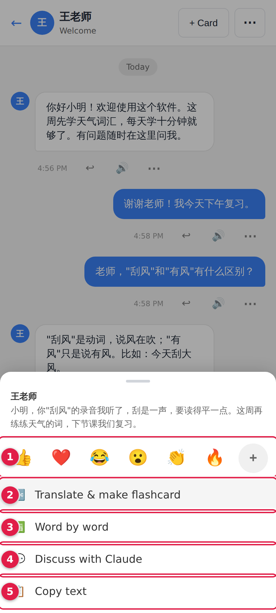

对方消息上的 ⋯ 面板：

1. **表情反应** —— 点一个表情。
2. **Translate & make flashcard（翻译并做成卡片）**（学生这边；老师那边是 **Make a card from this**，用这条消息做卡片）。
3. **Word by word（逐词）** —— 把这句话拆成词，带拼音和释义。
4. **Discuss with Claude（和 Claude 讨论）** —— 针对这条消息开一个旁支讨论。
5. **Copy text（复制文字）**。

在学生*自己*的消息上，面板会改为提供 **Check my Chinese（检查我的中文）**：Claude 批改并解释这句话，结果直接显示在消息下面。

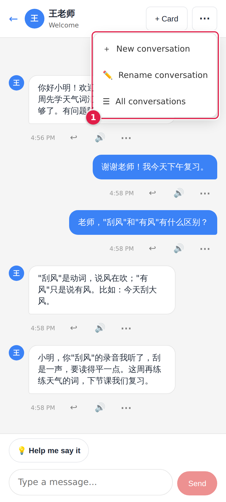

1. 顶栏的 ⋯：**New conversation**（新对话）、**Add a title** / **Rename conversation**（加标题 / 重命名）和 **All conversations**（全部对话）。

消息会出现在对方的通知铃铛里（如果配置了邮件，也会发邮件）。聊天每几秒刷新一次，适合课后异步答疑，但不能代替视频通话。

### 布置作业

1. 在自己的账号里建好卡组（手动、用 **Generate** 生成，或用总览上的 **+ New homework deck**）。一个好的作业卡组是 **8–15 个词**，配例句。如果是语法点，在课程库里写一节**迷你课程**（第 10 节）。
2. 点 **Send homework（布置作业）** —— 总览卡片上或学生页面上都有。

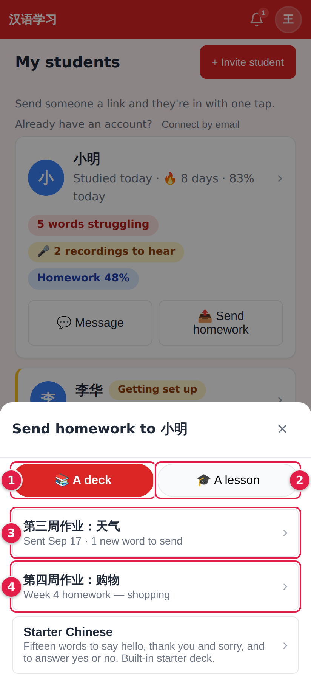

1. **A deck（一个卡组）** —— 你的卡组，每个都标明是否已经发给这个学生、什么时候发的，以及是否比他们的副本多了新词。
2. **A lesson（一节课程）** —— 你的课程库；布置后学生会得到自己的一份副本。
3. 还没发过的卡组——点它，确认 **Send（发送）**，学生就会收到一份**副本**，名字是"〈卡组名〉(from tutor)"。它立即出现在学生首页（*From you* 作业卡片里），新卡片进入学生的每日预算。这份副本属于学生——他们可以编辑，你的原版不受影响。
4. 这里也提供 **Starter Chinese**，给邀请时没拿到它的学生。

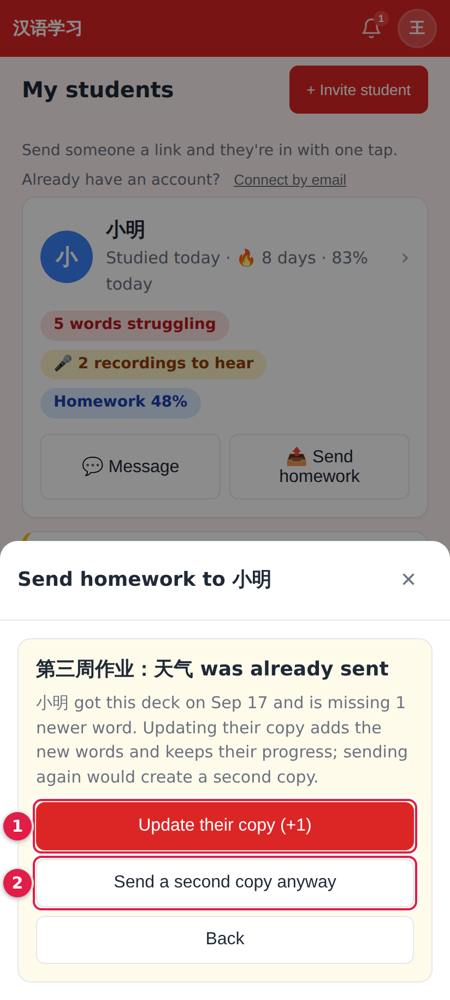

**已经发过**的卡组会提供 **Update their copy (+n)**（更新他们的副本，+n 个词）（1）：你之后加到原版里的词会添加到学生的副本，其他词的进度保留。**Send a second copy anyway**（还是再发一份）（2）则另建一个卡组。学生页面 **Homework** 下卡组旁边的 **Update** 按钮作用相同。

### Insights（课前速览）

**Insights** 是上课前只需要看的一页，默认范围是*上次课以来*：

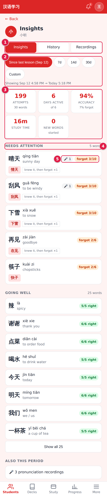

1. 老师的三个页面——**Insights**、**History（历史）**、**Recordings（录音）**——一键切换。
2. **时间范围** —— *Since last lesson（上次课以来）*（带日期）、7 天、14 天、30 天，或 **Custom（自定义）** 起止日期。*Since last lesson* 要先记录过一次课才能用（见下文）；之前显示最近 14 天。下面一行写明实际的起止时间。
3. **数字块** —— 练习次数（以及涉及多少个词）、活跃天数、正确率（以及忘记的比例）、学习时长、新开始学的词数。
4. **Needs attention（需要注意）** —— 学生忘得最多、打错最多的词，最差的排最前。红色小标签是**学生实际打出的汉字**（把 晴天 打成 情天，把 再见 打成 在见，把 筷子 打成 快子），形近字和声调问题通常就在这里暴露出来。*"knew it, then forgot"*（会了又忘）表示这张卡片曾经"毕业"后又忘了。
5. 右侧的标签显示忘记的次数，✎ 表示打错了几次；🎤 表示这个词有录音。

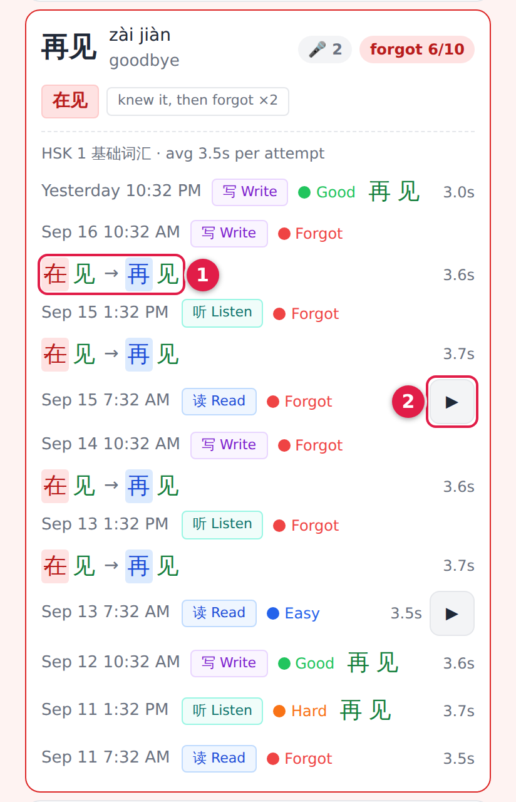

点一行可以展开每一次练习，最新的在前，带卡片类型（读 Read / 写 Write / 听 Listen）和评分：

1. 打字卡片显示**答案对比**：左边是学生打的（错字标红），右边是应该写的字（标蓝）。
2. **▶** 播放这次练习的录音（朗读卡片）。

再往下是 **Going well（掌握得好）**——每次都答对的词，或者已经排到一周以后再复习的词——以及 **Also this period（这段时间还做了）**——完成的迷你课程、读物、任务游戏，以及录了多少条音。

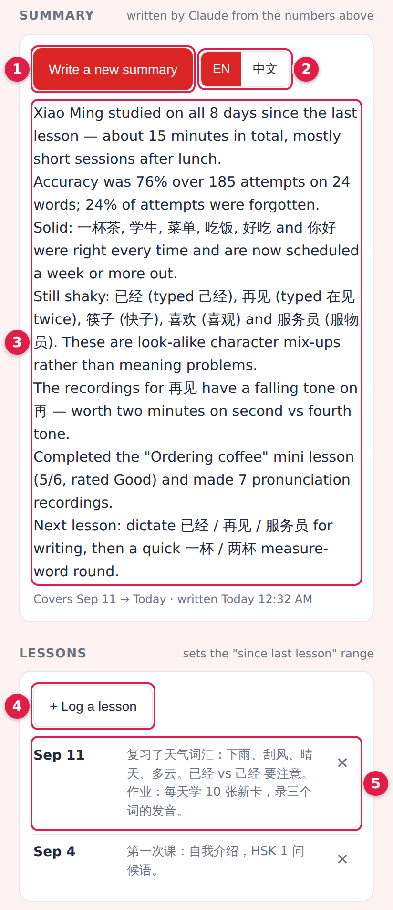

1. **Write summary（写总结）**（之后变成 **Write a new summary**）—— Claude 大约十秒钟写出 6–10 行简短的笔记：学了多少、哪些掌握了、哪些还在挣扎（点名具体的词和打错的字）、下节课该复习什么。它是根据上面的数字写的，从不直接读原始数据。
2. 在 **EN** 和 **中文** 之间切换——同一份总结两种语言各写一遍，习惯看中文的老师可以直接读。
3. 总结正文。以前的总结在下面折叠着，可以展开。
4. **+ Log a lesson（记录一次课）** —— 见下文。
5. **课程记录**：每次课及其笔记；✕ 删除一条。

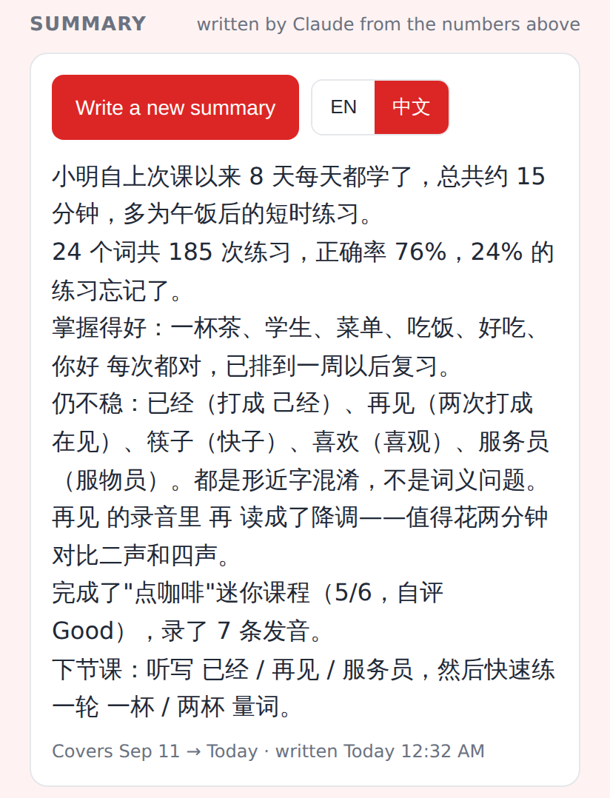

点 **中文** 之后的同一份总结。

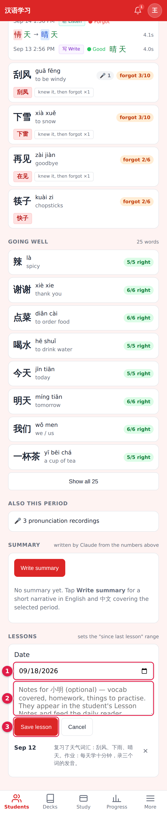

记录一次课只要十秒钟，每次都值得做：

1. **日期**（默认今天）。
2. **笔记** —— 讲过的词、作业、要练的地方。选填，但很有用：笔记会自动复制到学生的 **Lesson Notes（课堂笔记）**（前面带上你的名字和日期），这样每日读物和其他 AI 功能就能直接用上，学生不需要再自己粘贴。
3. **Save lesson（保存）**。这个日期会成为 Insights、History 和 Recordings 新的"上次课以来"起点，并显示在学生页面的状态行里。

### History（每一次练习）

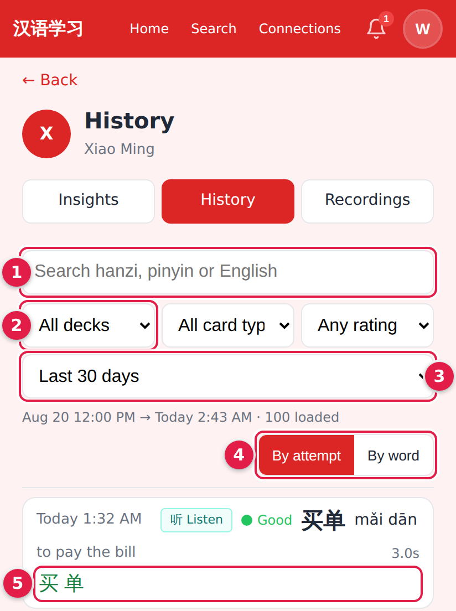

**History** 列出每一次练习，最新的在前，往下滚动会继续加载：

1. **搜索** —— 按汉字、拼音或英文。
2. **卡组**、**卡片类型**、**评分**筛选（例如只看 *Again*）。
3. **范围** —— 上次课以来、7 / 30 天、一年。
4. **By attempt / By word（按次 / 按词）** —— 切换成按词分组查看已加载的内容。
5. 每一行显示打出的答案（正确为绿色；错字用红色划掉，应该写的字用蓝色标出），有录音的还有 ▶ 按钮。

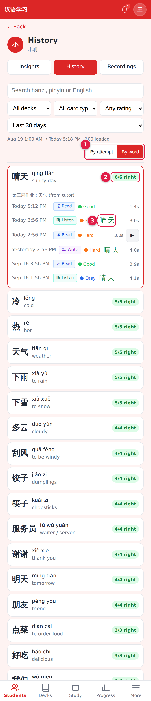

1. **By word（按词）** 把已加载的练习按词分组，最差的排最前。
2. 标签显示答对的次数。
3. 点某个词展开它的所有练习，同样带答案对比和录音的播放按钮。

### Recordings（发音录音收件箱）

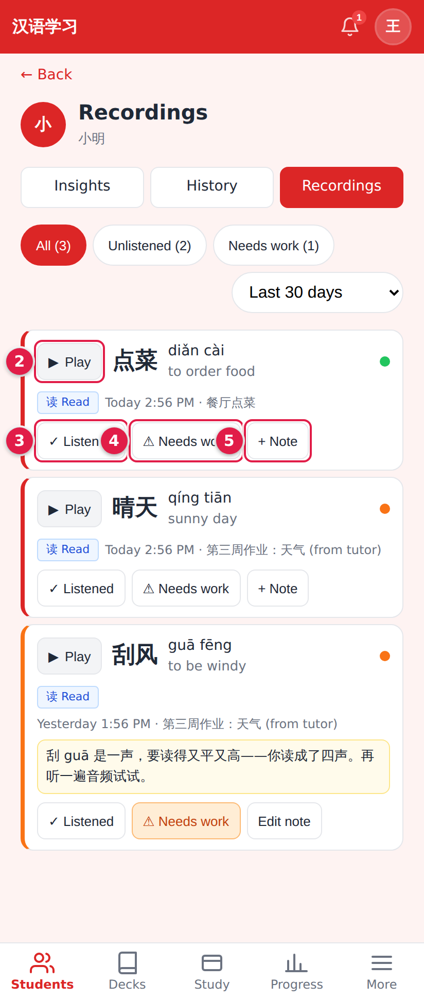

**Recordings** 列出学生的发音录音，没听过的排前面（每张卡片左侧的彩色竖条是学生给自己的评分）：

1. 筛选 **All / Unlistened / Needs work（全部 / 未听 / 需要改进）**，并选择时间范围。
2. **▶ Play** 播放录音。
3. 标记为 **Listened（已听）**。
4. 或 **Needs work（需要改进）** —— 卡片会变成橙色，下节课容易找到。
5. **+ Note（备注）** —— 一句简短的评语（"刮是一声，要读得又平又高"）。写在 *needs work* 录音上的备注**会显示给学生**一次——这张卡片下次出现时显示在背面（第 5 节），所以纠正在下节课之前就能传到学生那里。

标记和备注是你自己的（学生的其他老师有各自的）。

### 跟踪进度（经典视图）

**Progress** 显示：

1. **30-Day Summary（30 天总结）** —— 复习次数、活跃天数、正确率（非 Again 评分的比例）、总学习时长。
2. **Daily Activity（每日活动）** —— 每天一行。点某一天查看当天复习了什么。

**当日详情**列出当天复习的每张卡片，最难的排最前，带评分圆点。有 📝 图标的卡片有打字答案，有 🎤 图标的卡片有**发音录音**。点某张卡片可以看到当天对它的全部复习记录，可以**看到学生打出的原始汉字**、**播放录音**。上面的 Insights 和 History 显示的是同样的信息，只是按问题而不是按日期排列。

**Homework** 下的每个卡组都有自己的**进度页面**：完成度、按卡片类型的进度、卡组里每个词的掌握百分比。一周后仍然很低的词，就是课上需要再讲的。

### 学生看到的

在学生那边，**Tutor（老师）** 标签打开老师的页面，有 **Message（发消息）**（1）、**Conversations（对话列表）**（2）和 **Homework from your tutor（老师布置的作业）**（3）——也就是你发的卡组。学生也可以在卡组页面把*自己的*卡组分享给你（⋯ → **Share with tutor**），这样你能看到他们自己收集的词的进度。

### 课堂笔记

课后，学生可以把你发给他们的任何内容（生词表、句子、作业要求——格式不限）粘贴到 **Lesson Notes**（More → From your tutor）（1），然后 **Save（保存）**（2）。这些笔记会作为 AI 功能的上下文，例如每日读物的故事会把最近一课的词编进去。**Past notes（以前的笔记）**（3）里也会出现你在 Insights 里**记录一次课**时写的笔记，标着 *[From tutor …]*——所以只要你记录上课时写了笔记，学生就不需要再自己粘贴。

---

## 9. AI 助手

所有 AI 功能都需要联网；离线时会给出明确提示，不会卡住。

### Ask Claude（学习时提问）

在每张卡片背面都有（见第 5 节）。常见问题："刮风"和"有风"有什么区别？再给我两个例句。这个词东北人常用吗？Claude 可以修改当前卡片（例如换一个更好的例句），也可以当场创建一节迷你课程——每项修改都需要学生确认。

### Sentence Coach（句子教练）

**More → Sentence Coach。** 学生输入一句中文（1），会得到批改、点评和逐词解释，以及其他说法；输入英文则会得到翻译和多种表达。每次结果都会开启一个保存下来的对话，学生可以继续追问，教练也可以直接把词加到卡组里。深层链接：`/coach?text=…`；在安卓 App 里，在任何地方选中文字后选择 **Sentence Coach**。

### Sentence Breakdown（句子分析 / Analyze）

**More → Sentence Breakdown**（Decks 标签上的 **Analyze** 也是它）。输入一句中文（或英文）（1），它会被拆成对齐的语块——汉字、拼音、英文并排显示——并附上助词和句式的语法说明。任何语块都可以加为卡片。

### 和 Claude 练习对话

在 **Tutor（老师）** 标签里，学生还会看到 **Claude**——一个自动添加的 AI 对话伙伴。在那里可以开始一个 **Practice Conversation（练习对话）**，设定情景（"你在点菜，服务员只会说普通话"）、自己的角色和 Claude 的角色。Claude 用中文回复；聊天工具（检查我的中文、翻译、帮我说）帮助学生把对话进行下去。学习卡片 ⋯ 菜单里的 **Roleplay（角色扮演）** 可以围绕这个词开始一段角色扮演。

---

## 10. 分级读物、迷你课程、课程库与任务游戏

### 分级读物（Graded Readers）

**Readers**（More → Practice）是只用学生已学词汇写成的带插图小故事。

1. **Create New（新建）** 直接打开读物编辑器（见下文），新建一篇空白读物，供老师逐页手写。
2. **AI Generate（AI 生成）** 从选定的卡组（或今天到期的卡片）生成一篇。旁边的 ⋯ 里有 **Import JSON（导入 JSON）**——把别处导出的读物导入自己的列表。
3. 一张读物卡片：**Read（阅读）** 打开它，**Edit（编辑）** 打开编辑器，**Anki** 把它导出为 Anki 卡包（每页一张卡，外加它的词汇）。
4. **n failed generations（n 篇生成失败）** —— AI 没能写出来的故事（比如断网时的每日读物）折叠在这一行里，不会把列表弄乱。

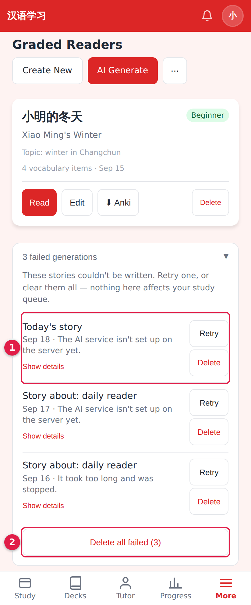

展开后：每条失败一行，附一句通俗的原因（1）、**Retry（重试）** 和 **Delete（删除）**，最下面是 **Delete all failed（删除全部失败的）**（2）。原始错误信息在 *Show details* 后面，开发者需要时可以查看。

生成时：选择**来源**（卡组 还是 今天到期的卡片）（1）、**卡组**（2）、可选的**主题**（3）和**难度**（4）。生成大约需要一分钟，完成后出现在列表里。

阅读是渐进式的：先显示插图，然后**点击依次显示**中文、拼音和翻译，每页都有音频。另外每天会自动生成一篇**每日读物**，在每次学习结束时推荐，内容围绕最新的课堂笔记。

### 读物编辑器

读物编辑器让老师（或学生）修改生成的故事，或者从头手写一篇。它和课程编辑器的结构一样：手机上用底部标签在 **Edit（编辑）**、**Preview（预览）** 和 **Claude** 之间切换；电脑上表单和 Claude 聊天并排显示。

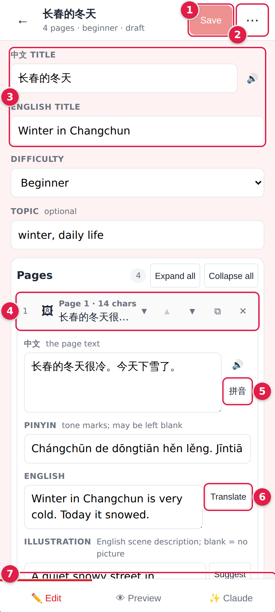

1. **Save（保存）** —— 有改动且没有问题时才可用。
2. ⋯ 菜单 —— 阅读、打印、导出、原始 JSON、删除（见下文）。
3. **标题**（中文带 🔊 按钮，英文），然后是难度和主题。
4. 每页一张**卡片**：▲▼ 调整页序，⧉ 复制，✕ 删除。点标题栏折叠或展开一页。
5. **拼音** 根据中文自动填写拼音（仍可手动修改）。
6. **Translate（翻译）** 请 Claude 翻译成英文。
7. **Edit / Preview / Claude** 标签（仅手机）。

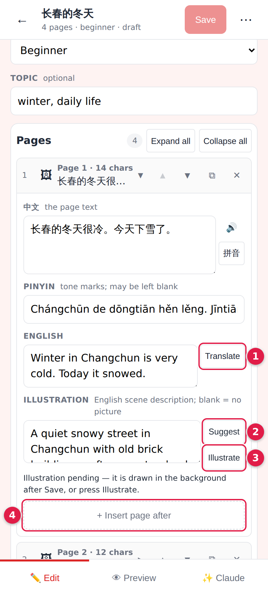

页面卡片的下半部分：

1. **Translate（翻译）** —— 同上。
2. **Suggest（建议）** —— Claude 根据页面文字起草一条插图描述。
3. **Illustrate（绘图）** —— 立刻生成插图（页面需要先保存过一次）。新的或改过的描述在 **Save** 之后也会在后台自动绘制；描述留空则没有插图。
4. **+ Insert page after（在后面插入一页）** —— 在中间加一页；底部的 **+ Add page（添加页面）** 在末尾追加。

问题（空白页、缺少翻译）会内联显示并阻止 **Save**。

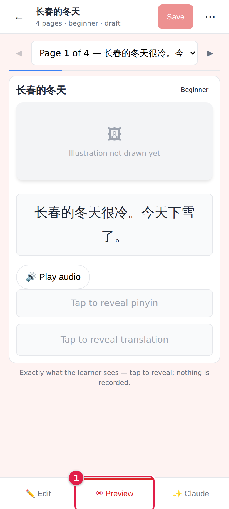

1. **Preview（预览）** 就是真实的阅读界面——点击逐步显示、翻页，不做任何记录。

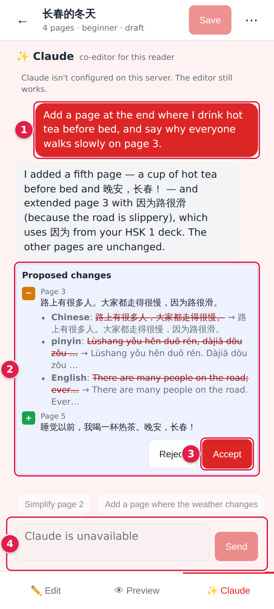

在 **Claude** 标签下，Claude 是*这篇故事*的共同编辑：

1. 用平常的话提出要求——"simplify page 2"（简化第 2 页）、"add a page where they go home"（加一页回家的情节）、"use 刮风 somewhere"（在某处用上"刮风"）。输入框上方的小按钮是一键起手句。
2. Claude 以**提案（proposal）**回复：显示它要修改（~）、新增（+）或删除（−）的页面差异，旧文字划掉，新文字在旁边。
3. **Accept（接受）** 把修改放进表单（或 **Reject（拒绝）**），然后 **Save**。Claude 会被告知自它上次回复以来你自己改了什么，所以它会在你的修改基础上继续，而不是把它们改回去。没有网络时聊天会提示，编辑器本身照常可用。
4. 消息输入框。

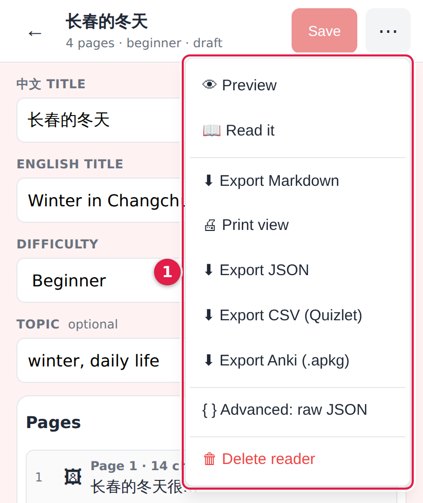

1. ⋯ 菜单：**Preview（预览）**、**Read it（阅读）**、**Export Markdown**（附词汇表）、**Print view（打印视图）**（每页一张，配图、汉字下面是拼音、下面是英文）、**Export JSON**（可重新导入）、**Export CSV (Quizlet)**、**Export Anki (.apkg)**、*Advanced: raw JSON（高级：原始 JSON）*，以及 **Delete reader（删除读物）**。

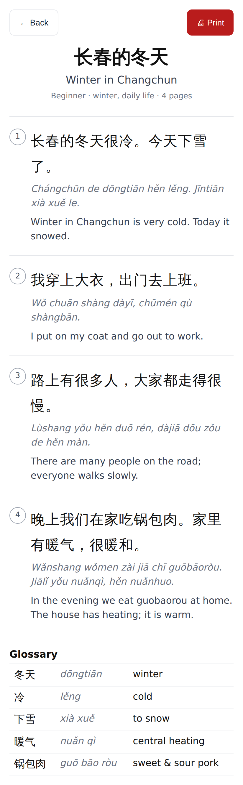

打印视图——用浏览器的 **Print（打印）** 按钮可以生成 PDF 或打印出来，给喜欢纸质阅读的学生。

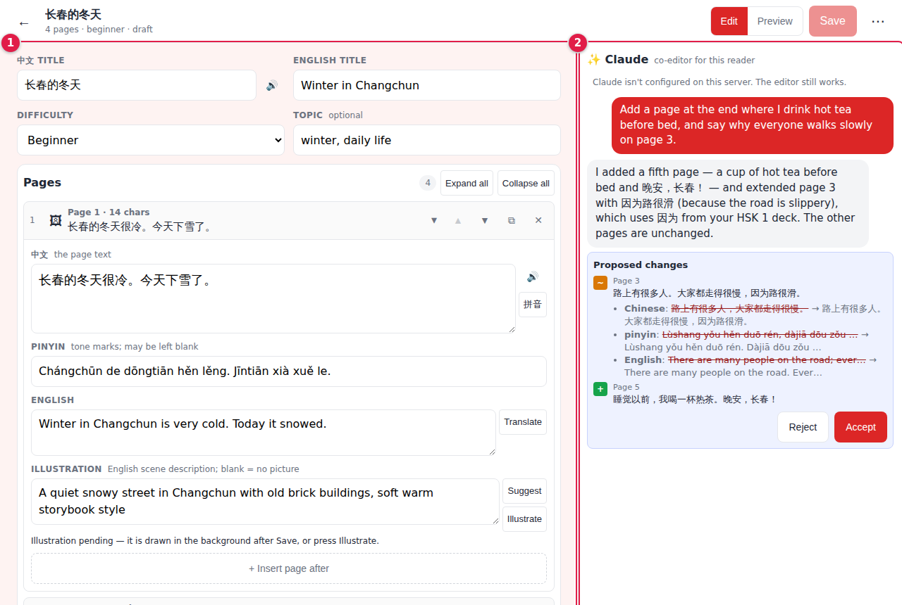

在电脑上，表单（1）和 Claude 聊天（2）并排显示，读提案的同时就能看到它落到哪些页面上。

### 迷你课程（Mini Lessons）

迷你课程是简短的课程：带例句的讲解、词序排列、选择题、翻译、连线配对、看图说话、口语，以及听力辨析（例如 有 yǒu 和 又 yòu）。学生在任何有 Claude 的地方都可以要一节——在 Ask Claude 或句子教练里说"给我做一节关于把字句的迷你课程"；老师则用 **Send homework → A lesson**（布置作业 → 课程）布置（第 8 节）。课程会穿插在学习中，并按和卡片一样的间隔重复安排复习。**Mini Lessons**（More → Practice）列出待学和已完成的课程；点某节课可以看到它的练习：

1. 状态标签——*New*（新）、*Learning*（学习中）、*Due*（到期）——以及学过几次。
2. **Edit（编辑）** 用编辑器打开这节课（见下文）。学生也可以编辑老师布置给自己的副本。

### 课程库与编辑器（Lesson Library & Editor）

**Lesson Library（课程库）**（More → Teaching）是老师保存迷你课程"母本"的地方：

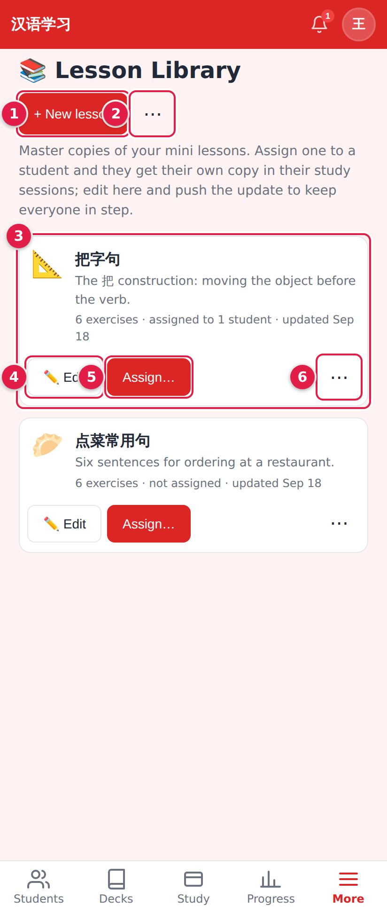

1. **+ New lesson（新建课程）** —— 让 Claude 起草，或从空白开始（见下图）。
2. 页面的 ⋯ 菜单 —— **Import JSON（导入 JSON）**，导入在别处导出的课程。
3. 一张课程卡片：图标、标题、描述、练习数量、多少学生已布置、标签。
4. **Edit（编辑）** —— 课程编辑器。
5. **Assign…（布置）** —— 布置给学生。
6. 卡片的 ⋯ 菜单 —— 复制、导出、归档。

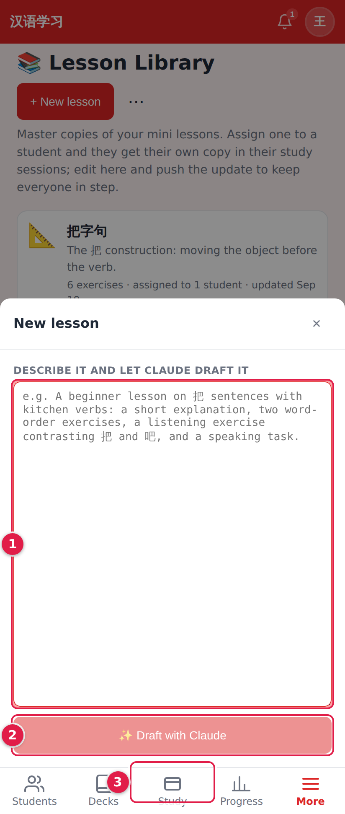

1. 用一两句话描述这节课——讲什么、想要哪些练习类型、什么水平。
2. **Draft with Claude（让 Claude 起草）** 大约一分钟写好并打开编辑器。
3. **or start blank（或从空白开始）** —— 在编辑器里新建一节空课。

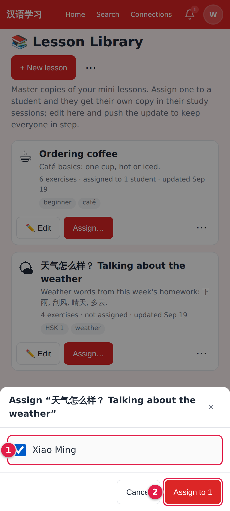

1. **Assign…（布置）** 列出你的学生供勾选；已经有这节课的学生会被勾选并置灰。
2. **Assign to n（布置给 n 人）** —— 每个学生都会得到自己的一份副本，出现在他们的学习中，并且离线可用。（学生页面上的 **Send homework → A lesson** 是给单个学生布置的同一功能。）

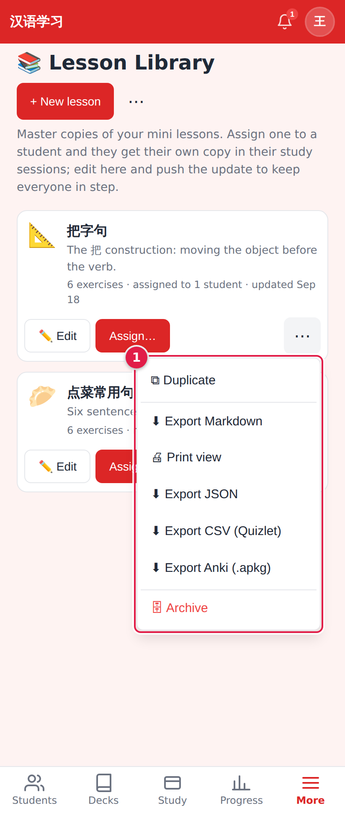

1. 卡片的 ⋯ 菜单：**Duplicate（复制）**、**Export Markdown**（附答案）、**Print view（打印视图）**、**Export JSON**、**Export CSV (Quizlet)**、**Export Anki (.apkg)** 和 **Archive（归档）**（隐藏这节课，不影响学生的副本）。

点击课程卡片可以打开它：

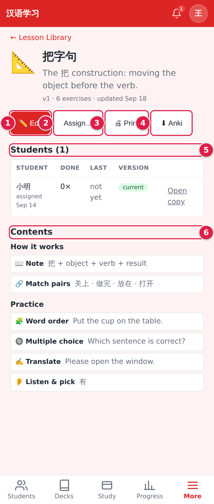

1. **Edit（编辑）** 母本。
2. **Assign…（布置）** 给更多学生。
3. **Print（打印）** 这节课。
4. **Anki** —— 导出为 Anki 卡包（词变成词汇卡，句子变成"中文→英文"卡）。
5. **Students（学生）** 表：每个学生完成了几次、最近一次的评分和成绩、他们的副本是 **current（最新）** 还是 **behind（落后）**（你之后修改了课程库里的课，或者学生改了自己的副本），以及 **Open copy（打开副本）** 查看（或编辑）他们的副本。有副本落后时会出现 **Push update（推送更新）** 按钮，用课程库的内容覆盖副本，同时保留学生的学习记录和复习计划。
6. **Contents（内容）** —— 各部分和练习一览。

#### 课程编辑器

编辑器对所有人都一样：老师编辑课程库里的课或自己布置的课；学生编辑自己的任何一节课（迷你课程页面的 `Edit`）。

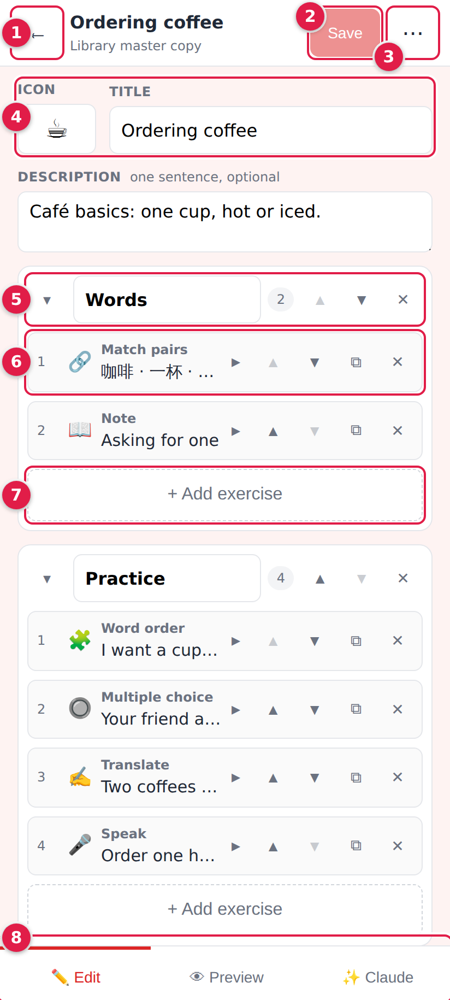

1. **← 返回**（有未保存的改动时会先询问）。
2. **Save（保存）** —— 有改动且没有问题时才可用。
3. ⋯ 菜单 —— 预览、复制、导出、原始 JSON（见下文）。
4. **图标**、**标题**和描述。
5. 一个**部分（section）**：标题、练习数量、▲▼ 调整部分顺序、✕ 删除。
6. 一行**练习**：编号、类型、一行摘要；▶ 播放它的音频，▲▼ 调整顺序，⧉ 复制，✕ 删除。点这一行展开它。
7. **+ Add exercise（添加练习）** —— 从九种类型里选一种。
8. **Edit / Preview / Claude** 标签（仅手机）。

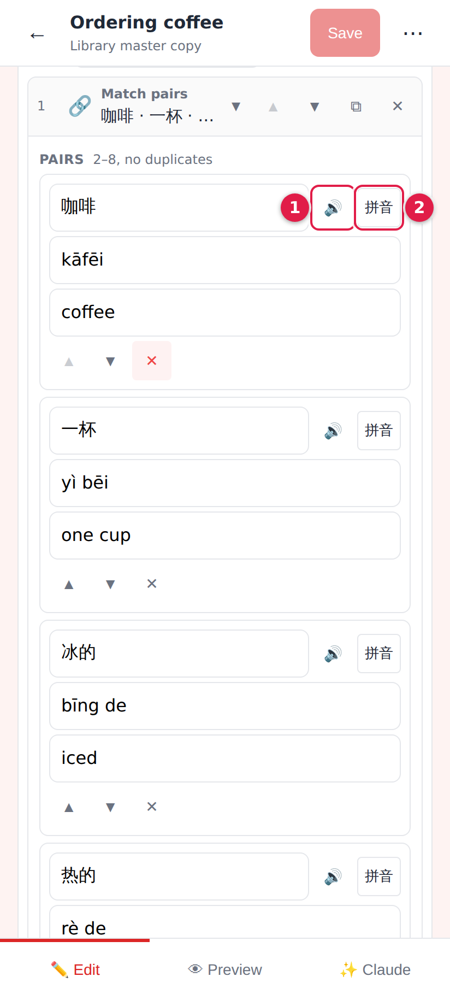

练习内部（这里是*连线配对*），每个中文输入框都有：

1. **🔊** —— 用应用的语音朗读。
2. **拼音** —— 自动填写拼音。每个练习底部的 **Auto-fill missing pinyin（补全缺失的拼音）** 可以一次补全整个练习。

有问题的地方（词序练习的方块和答案对不上、选择题只有一个选项……）会就地显示，该行带红色 **!**，并在修好之前禁止 **Save**。

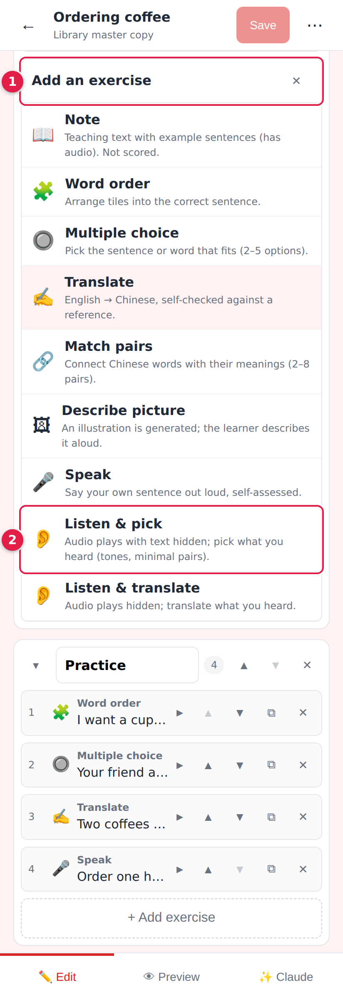

1. **Add an exercise（添加练习）** 列出九种类型，每种都有一句说明：Note（讲解）、Word order（词序）、Multiple choice（选择题）、Translate（翻译）、Match pairs（连线配对）、Describe picture（看图说话）、Speak（口语）……
2. ……**Listen & pick（听音辨词）**（音频播放时文字隐藏——专为声调和最小对立对练习设计，如 有/又）和 **Listen & translate（听音翻译）**。

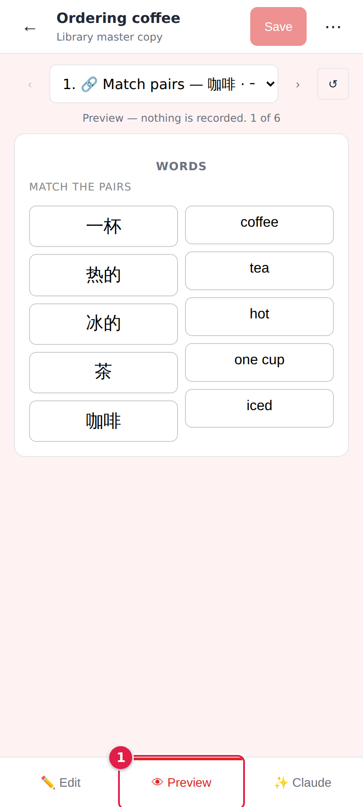

1. **Preview（预览）** 会像学生看到的那样运行真实的练习——用 ‹ › 或下拉菜单翻页——不会记录任何成绩。

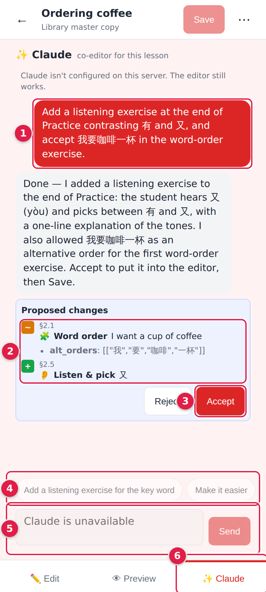

在 **Claude** 标签下（电脑上在表单旁边），Claude 是*这节课*的共同编辑：

1. 用平常的话提出修改——"给 又 加一个听力练习"、"把第二部分改简单一点"、"到处都加上拼音"。
2. Claude 以**提案**的形式回复，显示为一个差异卡片：修改（~）、新增（+）或删除（−）了哪些练习，以及不同的字段。
3. **Accept（接受）** 把修改放进表单（或 **Reject（拒绝）**）；按 **Save** 才会保存。Claude 会被告知自它上次回复以来你自己改了什么，所以它会在你的修改基础上继续，而不是把它们改回去。
4. 一键起手句。
5. 消息输入框。没有网络时聊天会提示，编辑器本身照常可用。
6. **Claude** 标签。

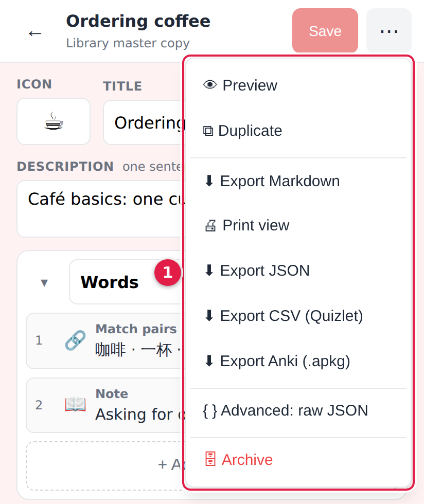

1. ⋯ 菜单：**Preview（预览）**、**Duplicate（复制）**、**Export Markdown**（附答案）、**Print view（打印视图）**、**Export JSON**（可重新导入）、**Export CSV (Quizlet)**、**Export Anki (.apkg)**、*Advanced: raw JSON（高级：原始 JSON）*（给懂技术的人），以及 **Archive（归档）** / **Delete lesson（删除课程）**。

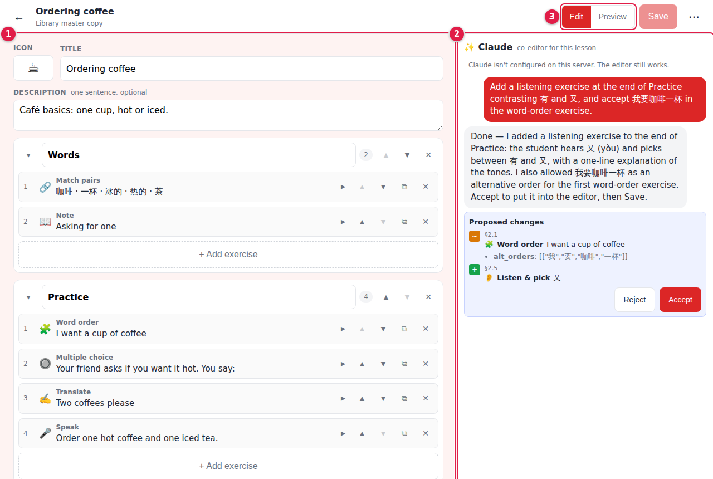

在电脑上：表单（1）和 Claude 聊天（2）并排显示，顶栏有 **Edit / Preview** 切换（3）。

**导出到 Anki。** 课程和读物也可以导出为 Anki 卡包：课程库卡片或课程编辑器的 ⋯ 菜单里有 **Export Anki (.apkg)**，每篇读物都有一个 **Anki** 按钮（在读物列表的卡片上，以及读物编辑器的菜单里）。课程里的词会变成词汇卡，句子会变成"中文→英文"卡；一篇读物每页一张卡，外加它的词汇。再次导出会更新 Anki 里同样的词条。选项和结果页面与卡组导出相同（见第 6 节）。

### 任务游戏（Quests）

任务（More → Practice → Quests）是一个小小的方格世界，里面有一个可以走动的角色。每个目标都是一条中文祈使句（拿起钥匙、打开门、把杯子放在桌子上、先……然后……），学生通过移动、拾取和使用物品来完成——理解力是通过"做"来检验的，而不是通过"答"。Claude 根据主题（"厨房做早饭"）和难度生成整个关卡。没能生成的关卡会用一句大白话说明（"Couldn't build this one — tap Retry"，这关没建成——点 Retry 重试）。适合作为学习结束后的奖励。

---

## 11. 进度与统计

学生看自己的视角和老师看学生的视角是一样的：**Progress（进度）** 标签有 30 天总结（1）和每日列表（2），每一天可以打开当天复习的卡片，每张卡片可以看到复习记录、打字答案和录音。

首页的**连续天数卡片**、作业卡片上的进度描述和每个卡组的进度条一眼就能回答"我学得好不好"；卡组页面的进度块显示每种能力的掌握情况。

---

## 12. 设置、备份与离线使用

**More → Settings**（或点头像，再点你的名字）：

1. **Personal Bio（个人简介）** —— 关于学生的一两句话，用于个性化生成例句和故事（可以写爱好、职业、家庭、所在城市）。
2. **Audio for your words（词汇音频）** —— 一行文字说明这部手机上已有多少段音频。每次同步后音频会自动下载；只有还缺东西时才会出现 **Download（下载）** 按钮。
3. **Backup（备份）** —— 下载完整的 JSON 备份。
4. **Start on（启动时打开）** —— 应用打开时停在哪个标签：**Automatic**（自动：有学生且今天没有到期卡片的老师打开 Students，否则打开 Study）、**Study**、**Decks** 或 **Students**。
5. **Sign out（退出登录）**。
6. **Advanced（高级）**（默认折叠）—— 音频质量、播放质量、例句覆盖页面（多少词已有例句，以及在后台批量生成的按钮）、Feature Requests（功能建议）、Duplicate Finder（重复查找）、Full Sync（完整同步）、Update App（更新应用）和调试工具。

### 离线使用

数据同步过一次之后，学习功能完全离线可用：选卡、评分、音频和统计都在手机上运行。每次同步后音频会在后台自动下载，所以只要学生时不时在 Wi-Fi 下打开一次应用，坐火车时就什么都有了。恢复联网后复习记录在后台上传；同一账号的其他设备在下次同步时会收到。学习界面的离线小标签显示 *Auto · online*（自动 · 在线）/ *Auto · offline*（自动 · 离线），也可以手动强制离线（见第 5 节）。需要 AI 的功能（生成、Ask Claude、句子教练、编辑器里的 Claude 标签）会明确提示"needs internet"（需要联网），不会卡死。

### 发送反馈

每个页面上悬浮的 **💬** 按钮打开反馈表单，可以附上截图（可以在上面标注）以及用于报告 bug 的控制台日志。老师们请多多使用——反馈直接发给开发者。

---

## 13. 让 Claude 当你的助教（MCP 连接）

这个应用带有一个 **MCP 服务器**——一个连接器，让 Claude（claude.ai 或 Claude 桌面应用）能看到并操作你的账号：你的学生、他们学了什么、哪里学得吃力、他们的录音、你的作业卡组、你的分级读物和课程库。连接之后，一节课的"管理工作"在聊天里就能完成：*"小明从上次课以来哪些词学得吃力？给他写一篇相关的短读物并发给他。"*

### 连接方法

1. 在 **claude.ai** 打开 *Settings → Connectors → Add custom connector*，粘贴
   `https://chinese-learning-mcp.jeromeswannack.workers.dev/mcp`。Claude 桌面应用里把同一个地址添加为远程 MCP 服务器即可。
2. 用你在应用里使用的**同一个 Google 账号**登录。Claude 只能看到你在应用里能看到的东西——自己的学生、卡组、读物和课程。
3. 新开一个对话，让它列出你的学生。第一次使用时，Claude 可能会逐个工具请求授权。

### 可以让它做什么

- **学生** —— "列出我的学生。" · "这周谁还没学习？" · "李华的天气卡组学得怎么样？"
- **学生哪里学得吃力** —— "小明从上次课以来哪些词学得吃力？"（按难度排序，附他打错的字）· "把他做 点菜 的记录给我看看。" · "用中文写一份最近两周的小结给他家长。"
- **录音** —— "把小明这周的录音放给我听。" · "把他 点菜 的录音标为 needs work：第二声，不是第四声。"（这条备注会显示在他那张卡片的背面）
- **课程记录和消息** —— "记录今天的课：讲了把字句，作业是餐厅卡组。" · "给小明发条消息提醒他周四上课。" · "看看他在聊天里写了什么。"
- **作业** —— "做一个 10 个词的点菜卡组，带例句，发给小明。" · "把 词汇 加进上周的卡组并更新他的副本。" · "把我课程库里的天气课程布置给小明和李华。"
- **读物和课程** —— "用小明做错的词写一篇五页、初级难度、逛夜市的读物，然后打开给我审阅。" · "做一个关于 了 的迷你课程，带一个连词成句和一个听力练习。"
- **新学生** —— "为一个新学生创建邀请链接，附上 Starter Chinese 卡组和一段欢迎语。"

### 审阅窗口

凡是发给学生之前值得看一眼的内容，Claude 都可以在聊天里打开一个**交互窗口**：

- **学生总览** —— 和应用里 Students 标签一样的卡片（状态、吃力的词、待听录音、作业完成度），并有记录课程、发消息、标记录音的按钮。
- **读物审阅** —— 逐页查看生成或手写的读物：原地修改中文、拼音、英文，调整页面顺序，保存，然后 **Send to student**（发给学生）。
- **课程审阅** —— 迷你课程的每个练习都可以编辑；保存到课程库，**Assign**（布置）给学生，**Push update**（推送更新）到他们已有的副本。
- **卡组审阅** —— 词表可以原地编辑；**Send to student** 或更新他们的副本。

每个窗口都有 **Ask Claude to revise**（让 Claude 修改）按钮：写下你想改的地方（"第 3 页写简单点""再加三个关于饮料的词"），Claude 会替你改——它也能看到你自己改过的内容，所以可以来回打磨。

### 需要知道的

- Claude 做的每件事都是真实生效的：发出去的卡组或读物会在学生下次同步时出现在他的应用里；课程记录会设定 Insights 里"自上次课以来"的范围；录音备注会显示在学生的卡片上。
- Claude 看不到其他老师的学生，也看不到学生和别人的私聊。
- 名字要说清楚：如果两个学生都叫小明，请说明是哪一位，或者给出邮箱。

---

## 14. 老师每周工作流程建议

1. **有空就打开 Students（学生）标签。** 小标签会告诉你谁需要你：*n words struggling*（打开 Insights）、*🎤 n recordings to hear*（打开录音收件箱，标记 *Listened* 或 *Needs work* 并写一句简短备注——备注会在学生下次看到这张卡片时显示给他们）、*Homework n%*。出现 **Getting set up** 卡片说明新学生卡住了——点 **Send how-to** 或 **Message**。
2. **每次课后**，打开该学生的页面 → **Insights**，用 **Log a lesson** 记录一次课并写几行笔记（新词、作业）。笔记会自动进入学生的 Lesson Notes，并设定"上次课以来"的范围。
3. 在自己账号里**建本周的作业** —— 8–15 个词，拼音带声调符号，在 Sentence Clue 里写一个短例句。总览上的 **+ New homework deck** 可以按主题或粘贴的词表生成，再手动修改。如果本周有语法点，再从课程库里加一节**迷你课程**。
4. 在总览卡片上 **Send homework**：发卡组（如果给上周的卡组加了词，就用 **Update their copy**）和课程。它会立刻出现在学生的 *From you* 作业卡片上；愿意的话在聊天里确认一下。
5. **上课前**打开学生页面：**Needs attention** 列出最差的三个词和打错的字，**Insights → Write summary** 生成英文或中文的总结。卡组的进度页面会显示哪些词掌握度仍在 0–30%。
6. 鼓励学生在课间使用 **Ask Claude** 和 **Sentence Coach**，并把保存的对话带到课堂上讨论。
7. 如果学生觉得负担太重，在卡组设置里调低 **New cards per day**，而不是少分享卡组——真正重要的是复习队列。

---

## 15. 未来功能设想（尚未实现）

**本节里的所有内容目前都还没有做出来。** 这些是在编写本指南时整理的、面向老师使用场景的改进建议。老师和学生可以通过应用内的反馈按钮投票或补充。

自本指南第一版以来，这个清单里有几项*已经做出来了*：录音收件箱、能传给学生的录音备注、通过课程库由老师编写迷你课程并"推送更新"、原地更新已分享的卡组，以及一眼看出哪个学生需要关注的学生总览。剩下的列在下面。

| 设想 | 为什么有用 |
|------|------------|
| **中文界面** | 目前界面只有英文。提供简体中文翻译（在设置里切换）可以让中国大陆的老师完全不用英文也能使用。 |
| **带截止日期的作业** | 共享卡组或课程可以附带截止日期和目标（"周五前看完所有卡片"）；学生在首页看到，老师看到谁完成了的清单。 |
| **班级 / 小组** | 一次把卡组、读物或迷你课程分享给整个班，并查看班级进度表，而不用逐个打开学生。 |
| **把读物分享给学生** | 读物目前是按账号存的；老师写的读物现在只能导出 JSON，再由学生导入。 |
| **卡组模板 / 资源库** | 现成的 HSK 1–6 和主题卡组（以及老师发布的公共卡组），老师可以复制后修改——就像课程库，但用于词汇。 |
| **老师设定学习参数** | 让老师为自己分享的卡组设定每日新卡片上限和目标记忆率。 |
| **每周摘要邮件** | 每周一自动给老师发一份总结：活跃天数、正确率、最薄弱的词、待听的录音——基本上就是把 Insights 的总结送到邮箱。 |
| **发音评分** | 把学生录音和参考音频比对（声调曲线 / 拼音识别）给出分数，这样声调练习不必依赖老师逐条听。 |
| **声调与最小对立对练习** | 用学生自己的词构建专门的辨音练习（mā/má/mǎ/mà、买/卖、有/又）——迷你课程里的听力题已经初步做到了这一点。 |
| **手写与笔顺** | 在屏幕上描红，带笔顺动画，作为可选的第四种卡片类型。 |
| **学习总结发到聊天** | 在 All Done 页面加一个"发给老师"按钮，把本次总结（以及问过 Claude 的问题）发到聊天里。 |
| **繁体字切换** | 为需要两种字体的学生同时显示繁体。 |
| **在线上课模式** | 老师和学生同时打开同一个卡组；老师在自己屏幕上翻卡、评分，学生同步看到——适合网课。 |
| **从照片或 PDF 导入** | 拍一页课本或上传一份练习卷，让 Claude 把词汇提取成卡组。 |
| **目标与温和提醒** | "每天 20 分钟"的目标，快要错过当天时推送提醒，老师也能看到。 |
