# 汉语学习 (Chinese Learning) —— 老师与学生使用指南

> English version / 英文版本：[TUTOR_GUIDE.md](./TUTOR_GUIDE.md)

本指南介绍如何用"汉语学习"这个应用来教学和学习汉语词汇。主要面向想要布置作业、跟踪学生进度的**辅导老师**，以及用手机学习的**学生**。

应用网址：**https://chinese-learning-2x9.pages.dev** ，任何浏览器都能打开。学生一般用手机；老师录入词汇时用电脑会更方便。

> **说明：** 应用界面目前只有英文。本指南里所有按钮、菜单名称都保留英文原文，并在后面用括号加上中文解释，方便对照屏幕操作。

本指南的截图都是在手机尺寸的屏幕上截取的，图中红色数字圆圈在每张图下面的文字里逐一说明。

---

## 目录

1. [这个应用能做什么](#1-这个应用能做什么)
2. [开始使用](#2-开始使用)
3. [首页](#3-首页)
4. [核心概念：词条、卡片、卡组与间隔重复](#4-核心概念)
5. [学习（学生的每日流程）](#5-学习)
6. [管理词汇](#6-管理词汇)
7. [老师篇：与学生建立联系](#7-老师篇与学生建立联系)
8. [老师篇：聊天、作业卡组与进度](#8-老师篇聊天作业卡组与进度)
9. [AI 助手：Ask Claude、句子教练、句子分析](#9-ai-助手)
10. [分级读物、迷你课程与任务游戏](#10-分级读物迷你课程与任务游戏)
11. [进度与统计](#11-进度与统计)
12. [设置、备份与离线使用](#12-设置备份与离线使用)
13. [老师每周工作流程建议](#13-老师每周工作流程建议)
14. [未来功能设想（尚未实现）](#14-未来功能设想尚未实现)

---

## 1. 这个应用能做什么

- **间隔重复闪卡。** 每个词都从三个方向考查（看汉字→说出来；看英文→打出汉字；听音频→打出汉字）。调度算法（FSRS）决定每张卡片什么时候再次出现，让学生把时间花在快要忘记的词上。
- **自动生成地道的普通话音频**，每个词、每个句子都有。
- **老师 ↔ 学生连接。** 老师可以和学生聊天、发送一组作业词汇，并且能看到学生每天具体复习了什么——包括学生打出的答案和录下的发音。
- **AI 助手**（由 Claude 驱动）：生成卡组、讲解句子、批改学生自己写的句子、写分级阅读小故事、生成小课程和小游戏。
- **支持离线。** 学习完全在手机上进行，复习记录之后自动同步。

---

## 2. 开始使用

### 登录

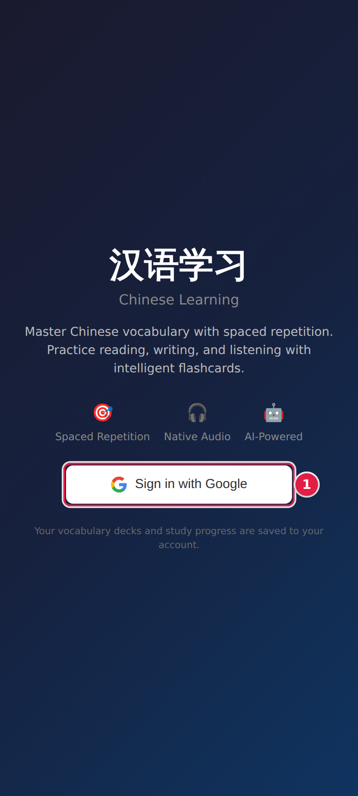

1. 打开 https://chinese-learning-2x9.pages.dev ，点击 **Sign in with Google**（用 Google 账号登录）（①）。老师和学生的登录方式完全一样，没有单独的"老师账号"；身份是在建立联系时按每段关系设定的（见第 7 节）。

### 安装到手机（建议学生这样做）

这是一个"渐进式网页应用"（PWA），可以像普通 App 一样安装到桌面：

- **安卓（Chrome 浏览器）：** 打开网站，点右上角 ⋮ 菜单 → **添加到主屏幕** / **安装应用**。
- **iPhone（Safari）：** 点"分享"按钮 → **添加到主屏幕**。

安装后会全屏打开、没有网络也能用、并且记住登录状态。

另外还有一个安卓原生外壳（APK），增加了桌面小组件、在任何 App 里选中文字后调用"Sentence Coach（句子教练）"、以及作业提醒通知。获取方式见 [native/README.md](../native/README.md)。

### 新学生的推荐设置

1. 在手机上登录并安装应用（见上）。
2. 进入 **Connections**（联系人），接受老师的邀请（或者主动邀请老师）。
3. 连上 Wi-Fi 时，打开 **Settings → Offline Audio → Download All Audio**（设置 → 离线音频 → 下载全部音频）。
4. 每天点首页的 **Study All**（全部学习）。

---

## 3. 首页

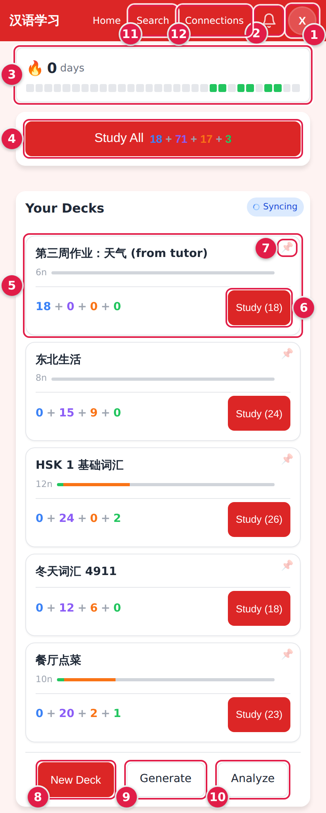

1. **个人菜单** —— 姓名、设置以及所有附加工具（见下文）。
2. **通知** —— 聊天消息、联系请求、收到的共享卡组。
3. **连续学习天数（streak）** —— 连续学习的天数，以及最近一个月的热力图。
4. **Study All（全部学习）** —— 开始一次学习，包含所有卡组里今天到期的全部卡片。彩色数字是各队列的卡片数量：**蓝色** 新卡片，**紫色** 次级新卡片，**橙色** 学习中的卡片，**绿色** 复习卡片（第 4 节详细解释）。
5. **卡组卡片** —— 点名称进入卡组。细进度条表示这个卡组已学过/掌握的比例。
6. **Study (n)** —— 只学习这一个卡组。
7. **置顶（图钉）** —— 把某个卡组固定在列表最上面。
8. **New Deck（新建卡组）** —— 建一个空卡组。
9. **Generate（AI 生成）** —— 用一句描述让 Claude 生成一个卡组。
10. **Analyze（句子分析）** —— 句子拆解工具。
11. **Search（搜索）** —— 在所有卡组里找一个词。
12. **Connections（联系人）** —— 老师和学生。

### 个人菜单

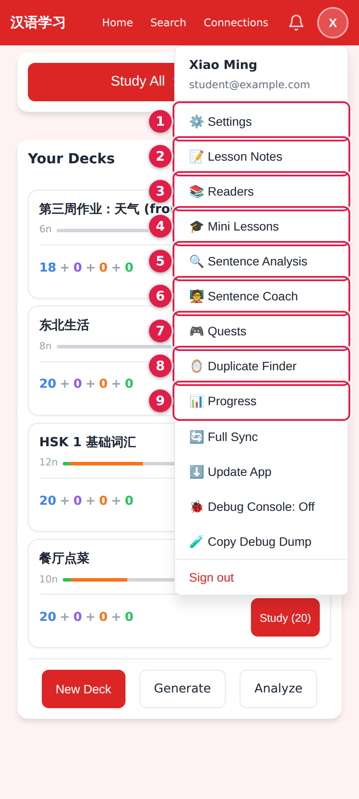

1. **Settings（设置）** —— 个人简介、离线音频、备份、功能建议。
2. **Lesson Notes（课堂笔记）** —— 粘贴老师课后发的内容，作为 AI 功能的上下文。
3. **Readers（分级读物）** —— 用学生已学词汇生成的小故事。
4. **Mini Lessons（迷你课程）** —— 由 AI 编写、穿插在学习中的小课程。
5. **Sentence Analysis（句子分析）** —— 把句子拆成词，汉字、拼音、英文对齐显示。
6. **Sentence Coach（句子教练）** —— 检查并批改学生自己写的句子。
7. **Quests（任务游戏）** —— 按中文指令操作的小地图游戏。
8. **Duplicate Finder（重复查找）** —— 找出重复添加的词。
9. **Progress（进度）** —— 30 天统计和每日记录。

再往下是维护类选项（Full Sync 完整同步、Update App 更新应用、调试工具）和 Sign out（退出登录）。

---

## 4. 核心概念

### 词条与卡片

一个**词条（note）** 就是一个词汇项：汉字、拼音（**必须用声调符号**，如 nǐ hǎo，不要用 ni3 hao3）、英文释义、可选的备注/趣味知识、可选的例句，以及自动生成的音频。

每个词条自动生成 **三张卡片**，分别对应一种能力：

| 卡片类型 | 学生看到 | 学生要做的 |
|----------|----------|------------|
| Hanzi → Meaning（汉字→意思） | 汉字 | 大声读出来（可以录音），然后翻开看拼音和释义，自我评分 |
| Meaning → Hanzi（意思→汉字） | 英文释义 | 打出汉字；应用逐字比对答案 |
| Audio → Hanzi（音频→汉字） | 听到读音 | 打出汉字 |

**卡组（deck）** 是一组词条（例如"第三周作业：天气"）。可以按卡组学习，也可以 Study All 一起学。

### 间隔重复与四个评分

每张卡片之后，学生给自己评分：

| 评分 | 含义 | 结果 |
|------|------|------|
| **Again（重来）** 红色 | 忘了 | 约 1 分钟后再出现，记一次遗忘 |
| **Hard（困难）** 橙色 | 勉强想起来 | 间隔变短 |
| **Good（良好）** 绿色 | 记得 | 正常间隔 |
| **Easy（简单）** 蓝色 | 太容易 | 间隔大幅加长；新卡片直接跳过学习阶段 |

按钮上会显示评分后的下次间隔（1m、10m、2d……），选择一目了然。算法是 FSRS，一种现代调度算法，在同样记忆保持率下比经典 Anki 算法少 20–30% 的复习量。

### 队列与每日上限

每张卡片处于四个队列之一，应用里到处出现的彩色数字就是各队列的数量：

- **蓝色 —— New（新卡片）**：从未学过。每个卡组每天有上限（默认 **20**），避免大卡组把学生压垮。
- **紫色 —— 次级新卡片**：学生*已经开始学*的词的其他新卡片（例如已经见过汉字的词，它的打字卡）。有单独的每日预算（默认 **10**），保证三种能力都在推进。
- **橙色 —— Learning（学习中）**：刚引入，以分钟为单位反复练习。
- **绿色 —— Review（复习）**：已"毕业"、今天到期的卡片。

两个上限都在 **Deck Settings**（卡组设置，见第 6 节）里按卡组设定。老师可以根据学生情况调整——对进度慢的学生，10 + 5 是不错的选择。

---

## 5. 学习

点 **Study All** 或某个卡组的 **Study** 按钮。一次学习会把今天到期的所有卡片一口气学完：先出计时已到的学习中卡片，然后是新卡片和复习卡片的混合。

### "汉字→意思"卡片的正面

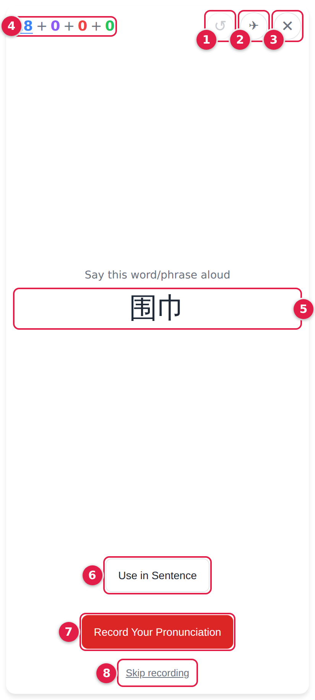

1. **撤销**上一次评分。
2. **离线开关** —— 强制使用设备本地音频（坐地铁、火车时有用）。
3. **结束学习**。
4. 本次学习的**队列数量**（蓝 + 紫 + 橙 + 绿）。带下划线的数字表示当前卡片来自哪个队列。
5. 要读出来的词。
6. **Use in Sentence（放进句子里）** —— 显示一个生成的例句，帮助回忆。
7. **Record Your Pronunciation（录下你的发音）** —— 录下学生读这个词的声音。录音会随复习记录保存，**老师可以听**（见第 8 节）。
8. **Skip recording（跳过录音）** —— 直接看答案。

### 卡片背面

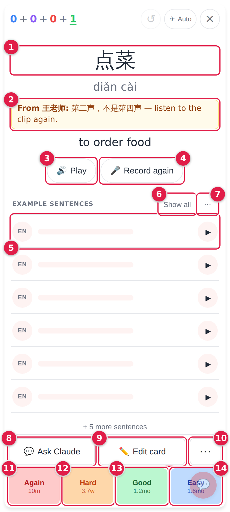

1. **Record Again（重新录音）** —— 第一次读得不好可以重录。
2. **Generate Fun Fact（生成趣味知识）** —— Claude 写一条记忆技巧或文化小知识并保存到词条。
3. **Generate sentences（生成例句）** —— 为这个词生成一组分级例句（从易到难，每句都有音频）。例句默认隐藏：点一下显示汉字，再点显示拼音，再点显示英文，所以也可以当听力练习。每个句子都有"这句是怎么回事？"的拆解说明，还有 **+** 按钮，可以把整句或句中任何一个词加为新卡片。
4. **Play Audio（播放音频）** —— 重放这个词的读音。
5. **Ask Claude（问 Claude）** —— 关于这个词随便问（用法、语法、近义词）。Claude 还可以**修改当前卡片**、**创建一个迷你课程**。问答会保存在词条的历史记录里。
6. **重新生成音频**（换一个声音）。
7. **编辑卡片**（铅笔图标）—— 改错别字、添加可接受的其他答案、添加例句提示。
8–11. **Again / Hard / Good / Easy**（重来 / 困难 / 良好 / 简单）。

### 打字卡片（"意思→汉字"和"音频→汉字"）

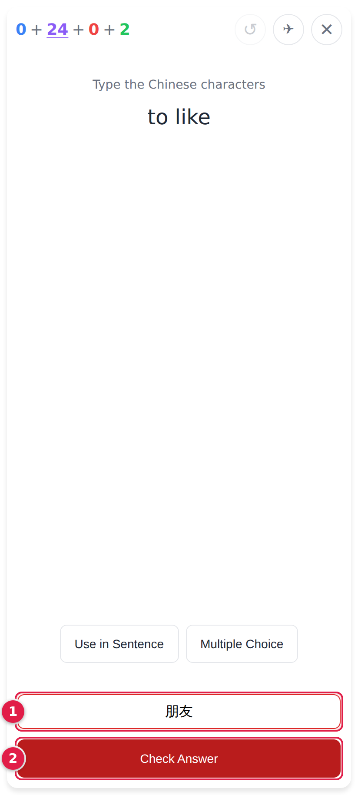

1. 打出汉字（任何输入法都行，手机拼音输入法很方便）。
2. **Check Answer（检查答案）**。卡住的时候还有 **Multiple Choice（选择题）** 按钮，以及 **Use in Sentence** 给提示。

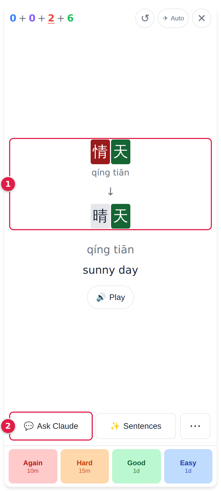

打出的答案会逐字比对——写错的字用红色显示在正确答案上方，学生能清楚看到自己混淆了哪个字。打出的答案会保存，老师可以查看。

如果一个词有几种都算正确的写法，编辑卡片时在 **Acceptable alternatives（可接受的其他答案）** 里加上（见第 6 节），它们也会被判为正确。

### 卡片之间

- 大约每 8 张卡片，学习中可能插入一节 **迷你课程**（如果有待学的），学习结束时会推荐**今天的读物**故事（见第 10 节）。
- 给一张卡片评 **Again** 时，应用会悄悄为它准备例句，一分钟后卡片再出现时例句已经就绪。

### 学习结束

所有卡片学完后，**All Done!（全部完成）** 页面显示本次总结（复习卡片数、用时、评分分布）和今天的总量——还有撒花动画。**Study More（再学一些）** 按钮可以为学有余力的学生追加 10 张新卡片。

每次复习都先保存在本地，断网也不会丢。

---

## 6. 管理词汇

### 卡组页面

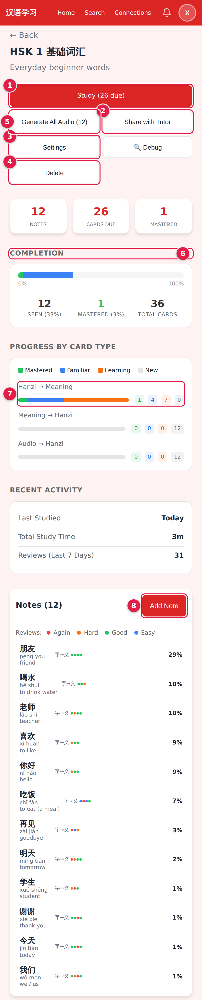

1. **Study** —— 学习这个卡组（显示到期卡片数）。
2. **Share with Tutor（分享给老师）** —— 让已连接的老师看到这个卡组的进度（见第 8 节）。
3. **Settings（设置）** —— 名称、描述、每日上限和调度参数。
4. **Delete（删除）** 这个卡组。
5. **Generate All Audio（生成全部音频）** —— 有词条缺音频时才出现。
6. **Completion（完成度）** —— 卡组已见过和已掌握的比例。
7. **Progress by card type（按卡片类型的进度）** —— 三种能力各自的已掌握 / 熟悉 / 学习中 / 新卡片数量。
8. **Add Note（添加词条）** —— 手动添加一个词。
9. **词条列表**，每个词后面有最近几次评分（彩色圆点）和掌握百分比。点某一行可以编辑卡片。

### 添加一个词

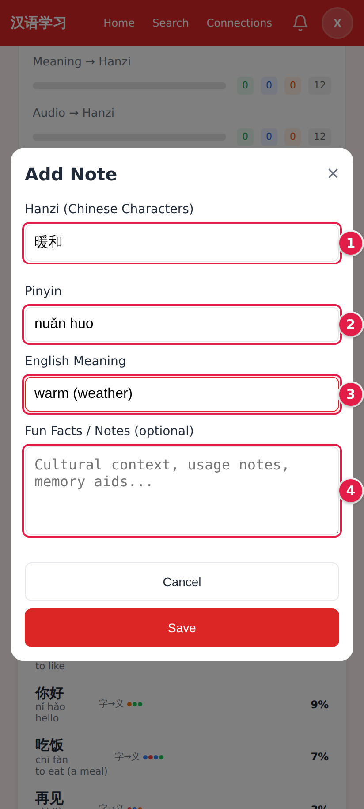

1. **Hanzi（汉字）** —— 简体字。
2. **Pinyin（拼音）** —— 带声调符号（nuǎn huo）。请不要用数字声调。
3. **English Meaning（英文释义）** —— 尽量简短；有需要可以在括号里注明词性。
4. **Fun Facts / Notes（趣味知识/备注）** —— 记忆技巧、用法说明、方言说明（例如"东北话：……"）。选填。

保存几秒钟后自动生成音频，例句也会在后台排队生成。

### 编辑卡片

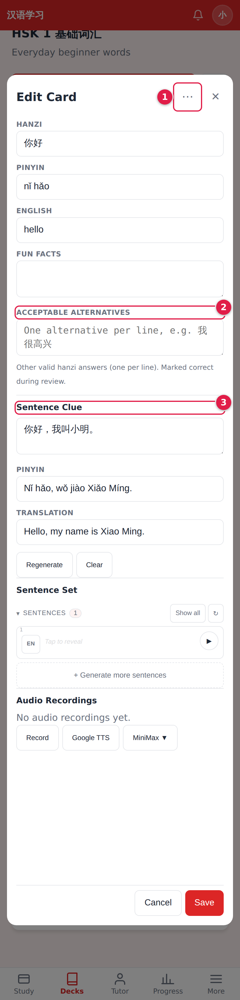

点词条列表里的某一行。除了基本字段还可以设置：

- **Acceptable alternatives（可接受的其他答案）** —— 打字卡片的其他正确答案，一行一个。
- **Sentence Clue（例句提示）** —— 显示在卡片上作为提示的例句（含拼音和翻译；点 **Generate** 自动填写）。它有自己的音频。
- **Sentence Set（例句组）** —— 生成的分级例句（可重新生成、删除）。

### 卡组设置

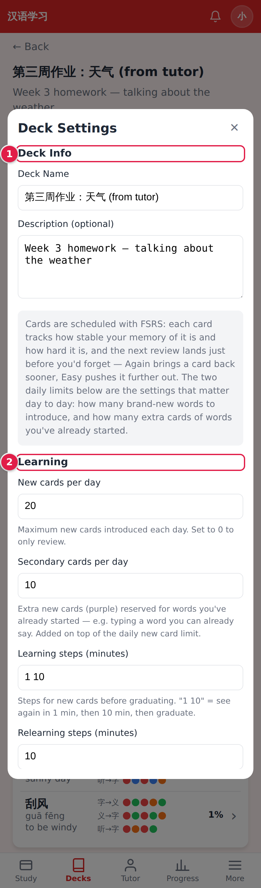

1. **Deck Info（卡组信息）** —— 名称和描述。
2. **Learning（学习）** —— **New cards per day（每天新卡片数）**（蓝色预算）和 **Secondary cards per day（每天次级新卡片数）**（紫色预算）。再往下是高级调度参数（目标记忆保持率、间隔倍数、最大间隔），默认值适合大多数学生。

### 用 AI 生成卡组

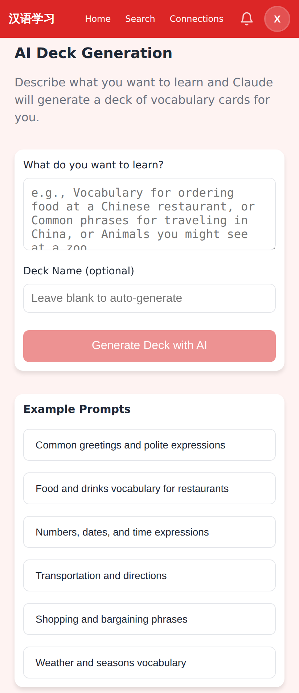

描述想学什么（"在长春坐公交车的词汇"、"HSK 2 日常生活动词"），Claude 会生成 8–12 个词，带拼音、释义、趣味知识和音频。生成后请检查一遍，删掉不需要的词。

### 搜索、查重与移动词条

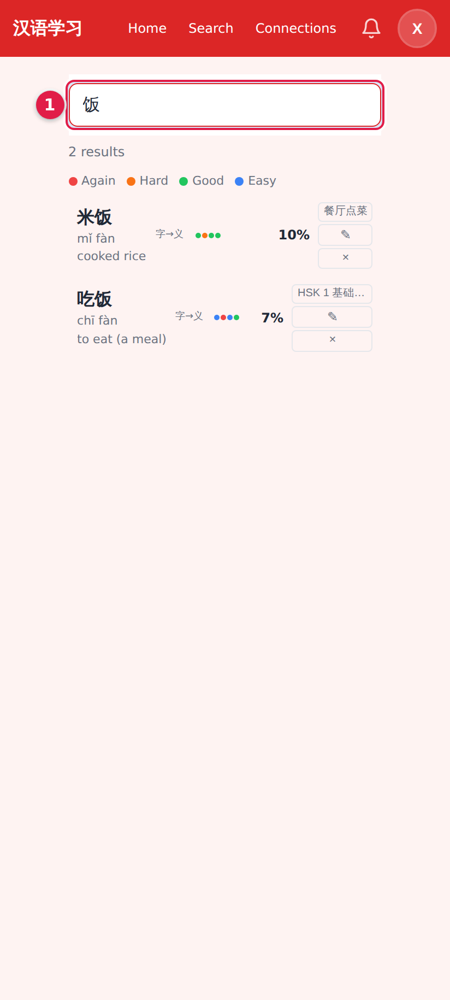

顶部的 **Search（搜索）** 可以按汉字、拼音或英文在所有卡组里找一个词，并显示它最近的评分；在结果里可以跳到所在卡组、编辑或删除。

**Duplicate Finder（重复查找）**（个人菜单）扫描重复添加的汉字，并建议保留哪一个。

### 导出与导入

- **Settings → Export Data → Download Backup**（设置 → 导出数据 → 下载备份）把所有内容（卡组、词条、复习记录）保存为一个 JSON 文件。
- 卡组可以从 JSON 导入——格式见 [IMPORT_EXPORT_FORMAT.md](./IMPORT_EXPORT_FORMAT.md)。

---

## 7. 老师篇：与学生建立联系

所有和老师相关的功能都在顶栏的 **Connections（联系人）** 里。

### 邀请学生

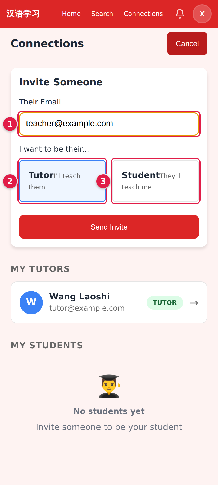

点 **+ Invite（邀请）** 并填写：

1. 学生的**邮箱** —— 必须是他们用来登录 Google 的那个。
2. **Tutor** —— "I'll teach them"（我教他们）——邀请学生时选这个。
3. **Student** —— "They'll teach me"（他们教我）——学生邀请老师时选这个。

如果对方还没注册，会收到一封邮件，第一次登录时联系自动生效。否则对方会在自己的 Connections 页面看到 **Pending Request（待处理请求）**，点 **Accept（接受）** 即可。

同一个人可以既是某些人的老师，又是另一些人的学生。

### 联系人页面

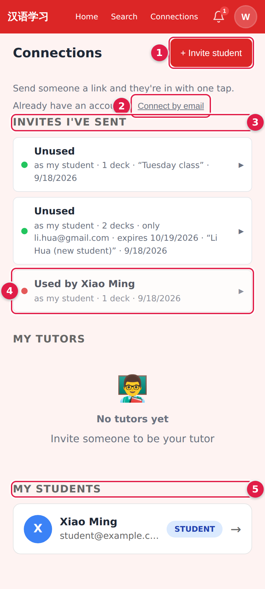

1. **My Students（我的学生）** —— 你教的所有人。点某一行进入。

（学生看到的是镜像——**My Tutors（我的老师）**——另外还有 **Claude**，一个自动添加的 AI 对话伙伴。）

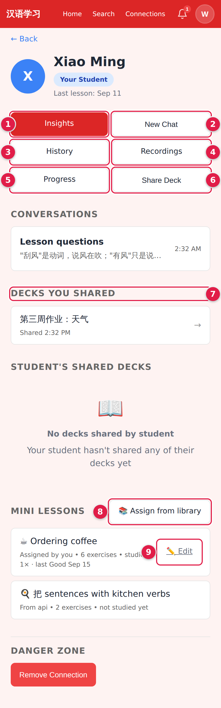

打开某个学生后可以看到：

1. **New Chat（新聊天）** —— 开一个对话。
2. **Share Deck（分享卡组）** —— 把你的一个卡组复制给学生（布置作业）。
3. **View Progress（查看进度）** —— 学生的统计数据和每日记录。
4. **Decks You Shared（你分享的卡组）** —— 每个都有自己的进度页面。

再往下：**Student's Shared Decks（学生分享的卡组）**（学生主动给你看的卡组）以及 **Remove Connection（解除联系）** 按钮。

---

## 8. 老师篇：聊天、作业卡组与进度

### 聊天

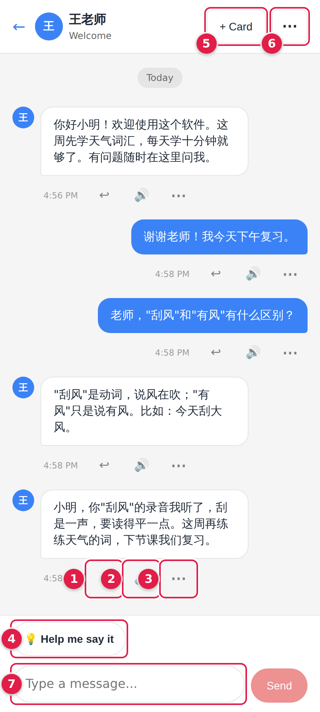

聊天是一个简单的消息列表，每条消息旁边都带学习工具：

1. **+ Card（加卡片）** —— Claude 读最近的对话，提出一张闪卡（汉字、拼音、释义），可以保存到学生的任何卡组。
2. **Check my Chinese（检查我的中文）（✓?）** —— 在学生自己的消息上：Claude 批改并解释这句话。
3. **Play audio（播放）** —— 用 TTS 朗读消息。
4. **Translate & make flashcard（翻译并做成卡片）（abc）** —— 翻译消息，并把其中的词做成卡片。
5. **Discuss with Claude（和 Claude 讨论）（💬）** —— 针对这条消息开一个旁支讨论。
6. 消息输入框。7. **Send（发送）**。每条消息还可以**回复**和加表情**反应**；左下角的 **?** 是"我不知道该说什么"，会给出回复建议。

消息会出现在对方的通知铃铛里（如果配置了邮件，也会发邮件）。聊天每几秒刷新一次，适合课后异步答疑，但不能代替视频通话。

### 分享作业卡组

1. 在自己的账号里建好卡组（手动、用 **Generate** 生成、或导入）。一个好的作业卡组是 **8–15 个词**，配例句。
2. 在 **Connections** 里打开该学生 → **Share Deck** → 选卡组。

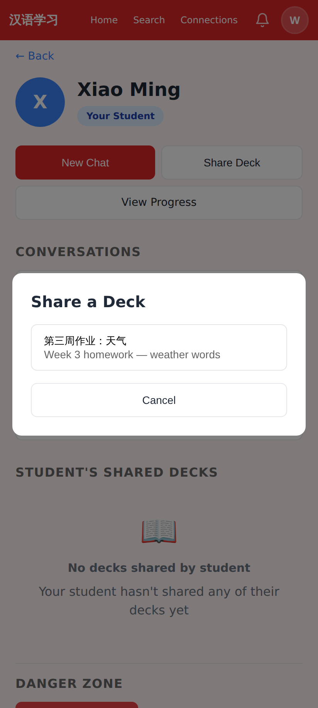

学生会收到一份**副本**，名字是"〈卡组名〉(from tutor)"。它立即出现在学生首页，新卡片进入学生的每日预算。这份副本属于学生——他们可以编辑，你的原版不受影响。如果你之后修改了原版，需要重新分享（会生成一份新副本——改进方案见最后的设想部分）。

### 跟踪进度

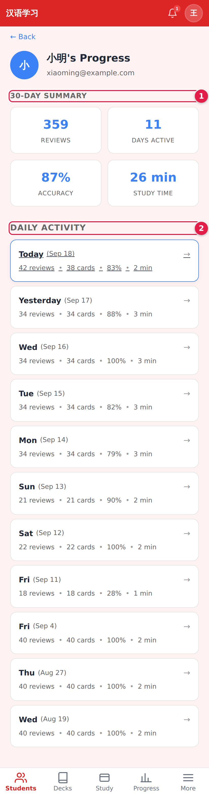

**View Progress** 显示：

1. **30-Day Summary（30 天总结）** —— 复习次数、活跃天数、正确率（非 Again 评分的比例）、总学习时长。
2. **Daily Activity（每日活动）** —— 每天一行。点某一天查看当天复习了什么。

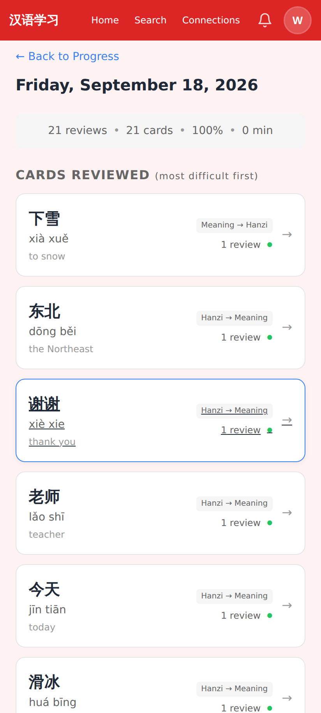

**当日详情**列出当天复习的每张卡片，最难的排最前，带评分圆点。有 📝 图标的卡片有打字答案，有 🎤 图标的卡片有**发音录音**。点某张卡片可以看到当天对它的全部复习记录，可以**看到学生打出的原始汉字**、**播放录音**。这是课前发现声调问题和汉字混淆最有用的页面。

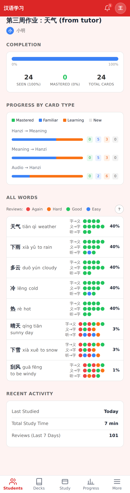

每个分享出去的卡组都有自己的**进度页面**：完成度、按卡片类型的进度、卡组里每个词的掌握百分比。一周后仍然很低的词，就是课上需要再讲的。

### 学生看到的

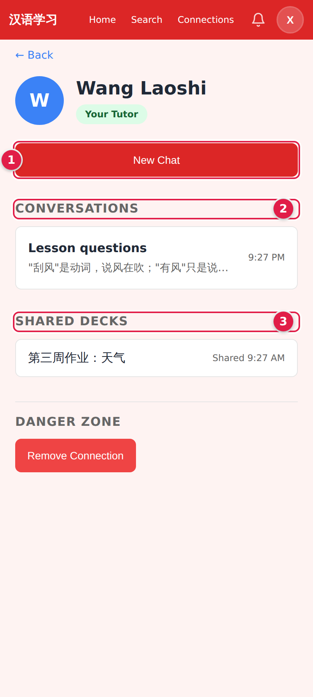

在学生那边，联系页面有 **New Chat**（1）、**Conversations（对话列表）**（2）和收到的 **Shared Decks（共享卡组）**（3）。学生也可以在卡组页面把*自己的*卡组分享给你（**Share with Tutor**），这样你能看到他们自己收集的词的进度。

### 课堂笔记

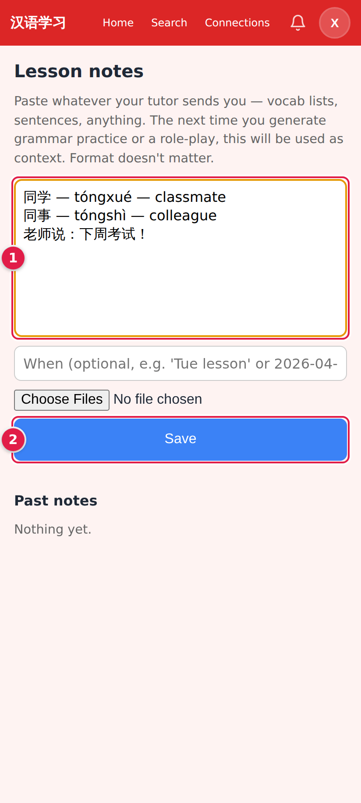

课后，学生可以把你发给他们的任何内容（生词表、句子、作业要求——格式不限）粘贴到 **Lesson Notes**（1），然后 **Save（保存）**（2）。这些笔记会作为 AI 功能的上下文，例如每日读物的故事会把最近一课的词编进去。建议老师每次课后给学生发一份简短的清单，让他们贴到这里。

---

## 9. AI 助手

所有 AI 功能都需要联网；离线时会给出明确提示，不会卡住。

### Ask Claude（学习时提问）

在每张卡片背面都有（见第 5 节）。常见问题："刮风"和"有风"有什么区别？再给我两个例句。这个词东北人常用吗？Claude 可以修改当前卡片（例如换一个更好的例句），也可以当场创建一节迷你课程——每项修改都需要学生确认。

### Sentence Coach（句子教练）

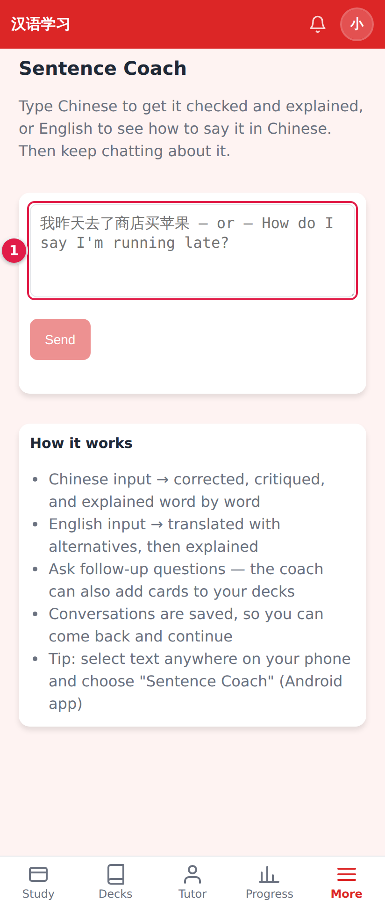

学生输入一句中文（1），会得到批改、点评和逐词解释，以及其他说法；输入英文则会得到翻译和多种表达。每次结果都会开启一个保存下来的对话，学生可以继续追问，教练也可以直接把词加到卡组里。深层链接：`/coach?text=…`；在安卓 App 里，在任何地方选中文字后选择 **Sentence Coach**。

### Sentence Breakdown（句子分析 / Analyze）

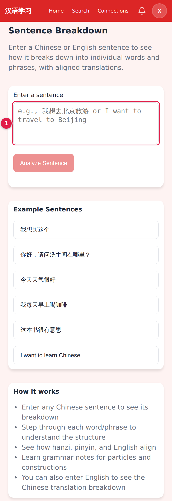

输入一句中文（或英文）（1），它会被拆成对齐的语块——汉字、拼音、英文并排显示——并附上助词和句式的语法说明。任何语块都可以加为卡片。

### 和 Claude 练习对话

在 **Connections → Claude** 下，学生可以开始一个 **Practice Conversation（练习对话）**，设定情景（"你在点菜，服务员只会说普通话"）、自己的角色和 Claude 的角色。Claude 用中文回复；聊天工具（检查我的中文、翻译、"我可以说什么？"）帮助学生把对话进行下去。学习卡片上的 🎭 按钮可以围绕这个词开始一段角色扮演。

---

## 10. 分级读物、迷你课程与任务游戏

### 分级读物（Graded Readers）

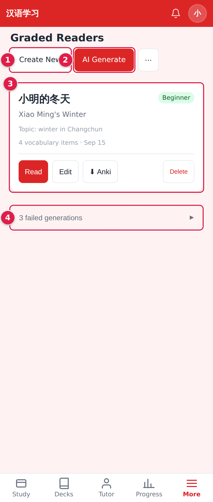

**Readers**（个人菜单）是只用学生已学词汇写成的带插图小故事。**AI Generate**（1）从选定的卡组（或今天到期的卡片）生成一篇；**Create New（新建）** 让老师逐页手写，有自动注拼音和自动翻译按钮，可选配插图。点某篇读物（2）开始阅读。

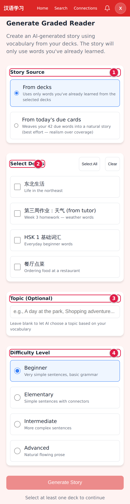

生成时：选择**来源**（卡组 还是 今天到期的卡片）（1）、**卡组**（2）、可选的**主题**（3）和**难度**（4）。生成大约需要一分钟，完成后出现在列表里。

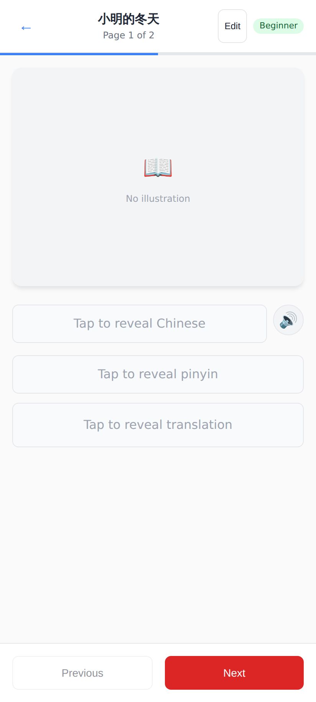

阅读是渐进式的：先显示插图，然后**点击依次显示**中文、拼音和翻译，每页都有音频。另外每天会自动生成一篇**每日读物**，在每次学习结束时推荐，内容围绕最新的课堂笔记。

### 迷你课程（Mini Lessons）

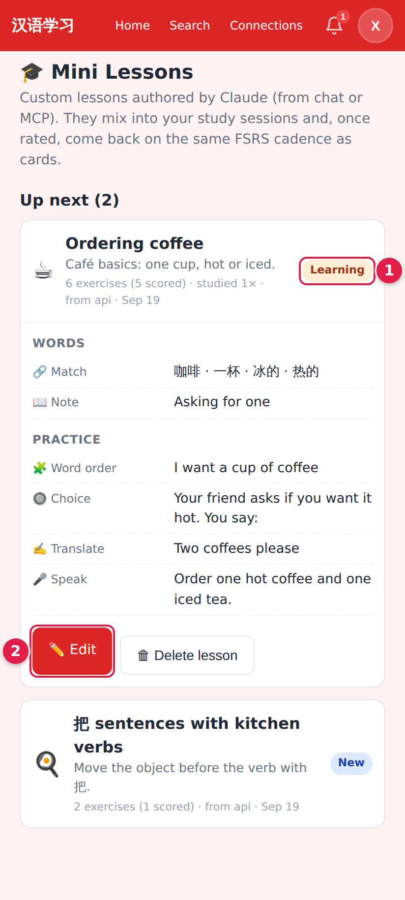

迷你课程是由 AI 编写的简短课程：带例句的讲解、词序排列、选择题、翻译、连线配对、看图说话、口语，以及听力辨析（例如 有 yǒu 和 又 yòu）。在任何有 Claude 的地方都可以要一节——在 Ask Claude 或句子教练里说"给我做一节关于把字句的迷你课程"。课程会穿插在学习中，并按和卡片一样的间隔重复安排复习。这个页面列出待学和已完成的课程。

### 任务游戏（Quests）

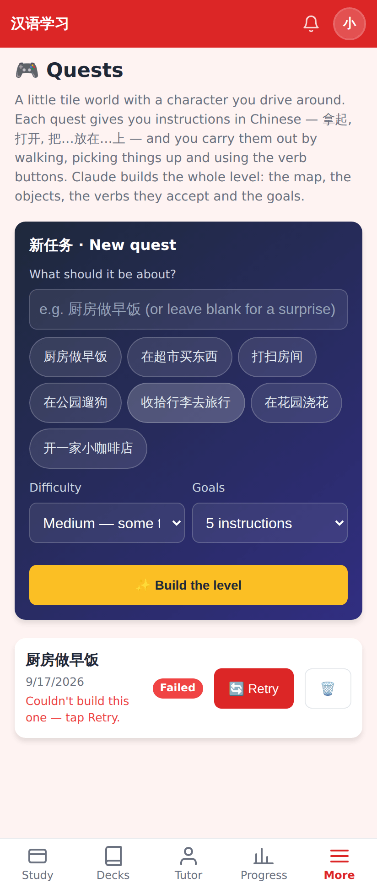

任务是一个小小的方格世界，里面有一个可以走动的角色。每个目标都是一条中文祈使句（拿起钥匙、打开门、把杯子放在桌子上、先……然后……），学生通过移动、拾取和使用物品来完成——理解力是通过"做"来检验的，而不是通过"答"。Claude 根据主题（"厨房做早饭"）和难度生成整个关卡。适合作为学习结束后的奖励。

---

## 11. 进度与统计

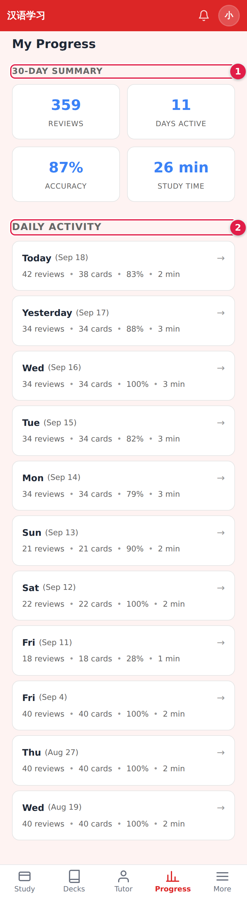

学生看自己的视角和老师看学生的视角是一样的：**My Progress（我的进度）**（个人菜单）有 30 天总结（1）和每日列表（2），每一天可以打开当天复习的卡片，每张卡片可以看到复习记录、打字答案和录音。

首页的**连续天数卡片**和每个卡组的进度条一眼就能回答"我学得好不好"；卡组页面的 **Completion** 和 **Progress by card type** 显示每种能力的掌握情况。

---

## 12. 设置、备份与离线使用

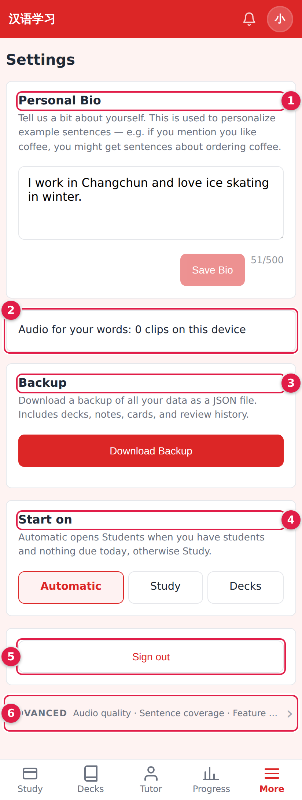

1. **Personal Bio（个人简介）** —— 关于学生的一两句话，用于个性化生成例句和故事（可以写爱好、职业、家庭、所在城市）。
2. **Offline Audio（离线音频）** —— 设备上已存储多少音频，以及 **Download All Audio** 一键下载全部以便离线学习。还有音频质量工具。
3. **Example Sentences（例句）** —— 例句覆盖页面：多少词已有例句，以及在后台批量生成的按钮。
4. **Export Data（导出数据）** —— 下载完整的 JSON 备份。
5. **Feature Requests（功能建议）** —— 用户提交过的反馈列表。

### 离线使用

数据同步过一次之后，学习功能完全离线可用：选卡、评分、音频（如已下载）和统计都在手机上运行。恢复联网后复习记录在后台上传；同一账号的其他设备在下次同步时会收到。需要 AI 的功能（生成、Ask Claude、句子教练）会明确提示"需要联网"，不会卡死。

### 发送反馈

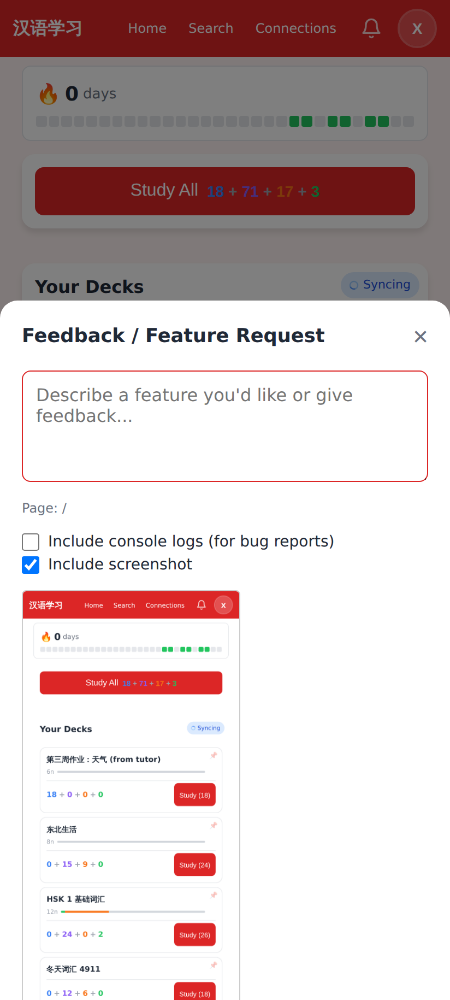

每个页面上悬浮的 **💬** 按钮打开反馈表单，可以附上截图（可以在上面标注）以及用于报告 bug 的控制台日志。老师们请多多使用——反馈直接发给开发者。

---

## 13. 老师每周工作流程建议

1. **每次课后**，把新词（任何格式）发给学生，让他们粘贴到 **Lesson Notes**。
2. 在自己账号里**建一个本周作业卡组** —— 8–15 个词，拼音带声调符号，在 Sentence Clue 里写一个短例句。**Generate** 几秒钟就能根据描述起草，再手动修改。
3. 在 Connections 里**分享**给学生，在聊天里确认收到。
4. **周中**打开 **View Progress**：看活跃天数，然后打开某一天，听几段 🎤 录音、看看 📝 打字答案。记下声调错误和汉字混淆，下次课上讲。
5. **上课前**打开分享卡组的进度页面：掌握度仍在 0–30% 的词就是需要一起练的。
6. 鼓励学生在课间使用 **Ask Claude** 和 **Sentence Coach**，并把保存的对话带到课堂上讨论。
7. 如果学生觉得负担太重，在卡组设置里调低 **New cards per day**，而不是少分享卡组——真正重要的是复习队列。

---

## 14. 未来功能设想（尚未实现）

**本节里的所有内容目前都还没有做出来。** 这些是在编写本指南时整理的、面向老师使用场景的改进建议。老师和学生可以通过应用内的反馈按钮投票或补充。

| 设想 | 为什么有用 |
|------|------------|
| **中文界面** | 目前界面只有英文。提供简体中文翻译（在设置里切换）可以让中国大陆的老师完全不用英文也能使用。 |
| **带截止日期的作业** | 共享卡组可以附带截止日期和目标（"周五前看完所有卡片"）；学生在首页看到，老师看到谁完成了的清单。 |
| **班级 / 小组** | 一次把卡组、读物或迷你课程分享给整个班，并查看班级进度表，而不用逐个打开学生。 |
| **老师编写迷你课程** | 让老师创建迷你课程（或让 Claude 起草）并推送给学生，而不只是由学生自己申请。 |
| **录音收件箱** | 一个页面列出学生最新的发音录音，可标记"已听 / 需改进"，并快速用文字或语音回复学生。 |
| **老师对复习记录留言** | 针对某一次复习留言（"是二声不是四声"），学生下次看到这张卡片时能看到。 |
| **原地更新已分享的卡组** | 老师修改原版卡组后，提供"推送更新"，学生的副本获得新词和修正而不丢失进度。 |
| **卡组模板 / 资源库** | 现成的 HSK 1–6 和主题卡组（以及老师发布的公共卡组），老师可以复制后修改。 |
| **老师设定学习参数** | 让老师为自己分享的卡组设定每日新卡片上限和目标记忆率。 |
| **每周摘要邮件** | 每周一自动给老师发一份总结：活跃天数、正确率、最薄弱的词、待听的录音。 |
| **发音评分** | 把学生录音和参考音频比对（声调曲线 / 拼音识别）给出分数，这样声调练习不必依赖老师逐条听。 |
| **声调与最小对立对练习** | 用学生自己的词构建专门的辨音练习（mā/má/mǎ/mà、买/卖、有/又）——迷你课程里的听力题已经初步做到了这一点。 |
| **手写与笔顺** | 在屏幕上描红，带笔顺动画，作为可选的第四种卡片类型。 |
| **学习总结发到聊天** | 在 All Done 页面加一个"发给老师"按钮，把本次总结（以及问过 Claude 的问题）发到聊天里。 |
| **繁体字切换** | 为需要两种字体的学生同时显示繁体。 |
| **在线上课模式** | 老师和学生同时打开同一个卡组；老师在自己屏幕上翻卡、评分，学生同步看到——适合网课。 |
| **从照片或 PDF 导入** | 拍一页课本或上传一份练习卷，让 Claude 把词汇提取成卡组。 |
| **目标与温和提醒** | "每天 20 分钟"的目标，快要错过当天时推送提醒，老师也能看到。 |
