# Admin account tools + tutor-first app

Phone viewport (412×915 @2×), local worker with seeded data.

## Before

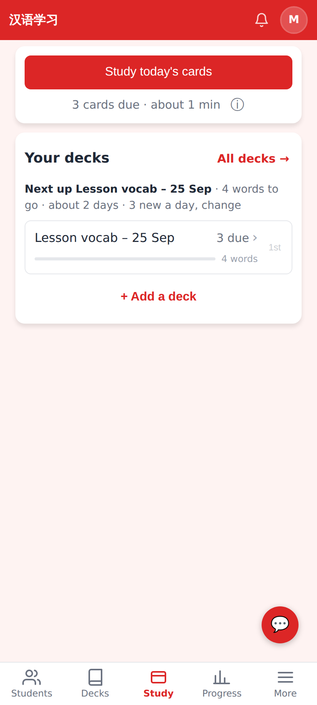
Before: a tutor account got the learner shell — streak, "Study today's cards", Study tab.

## Admin

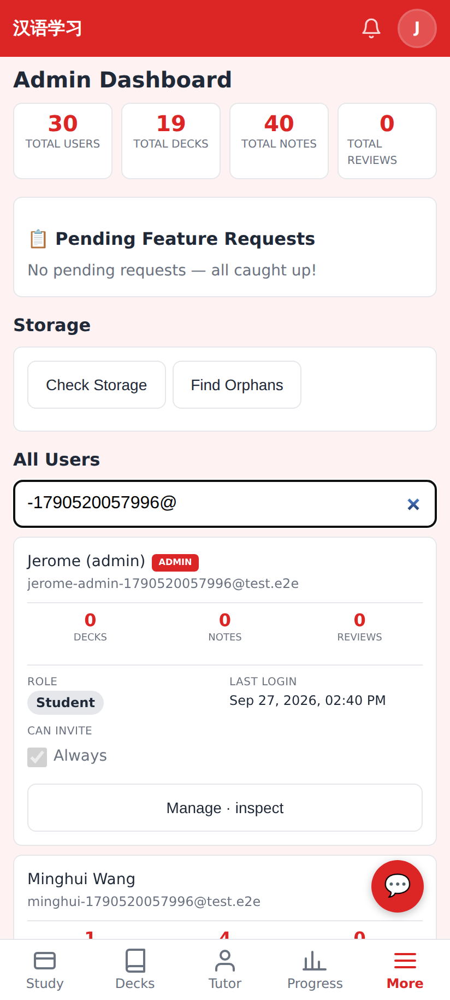
Admin → All Users: find by email/name, role badge, **Manage · inspect** per account.

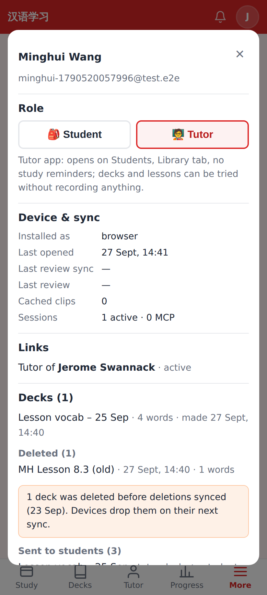
The account sheet: Student / Tutor role switch, device & sync state, links.

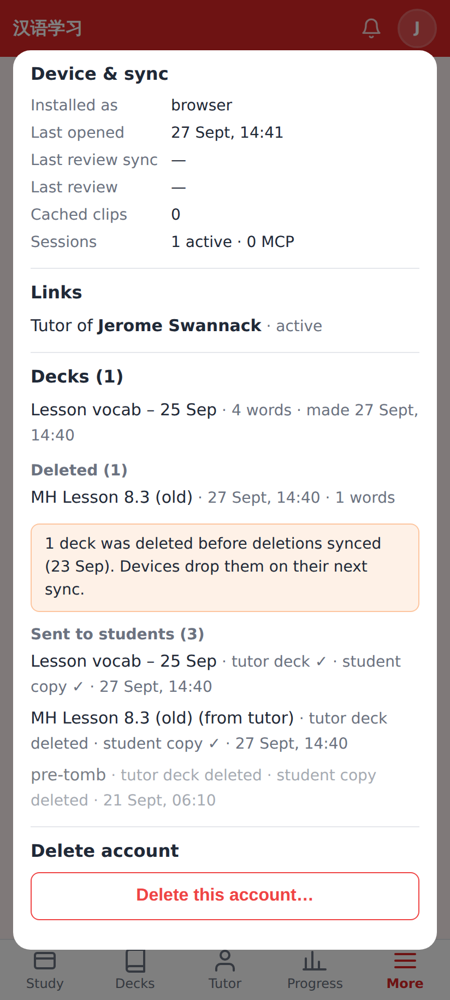
Decks including deleted ones (tombstones, named from a surviving copy), shares sent, and the warning for decks deleted before tombstones existed.

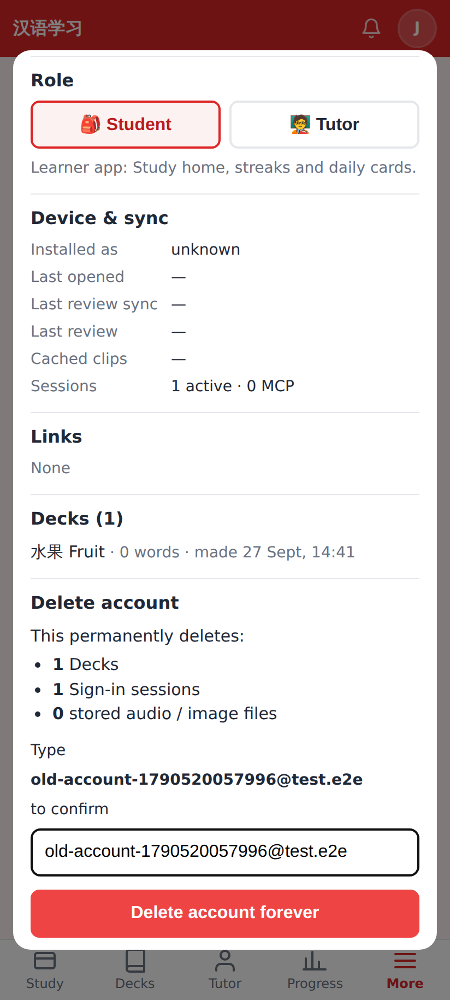
Delete account: what goes, what stays, typed-email confirmation.

## Tutor account (users.role = tutor)

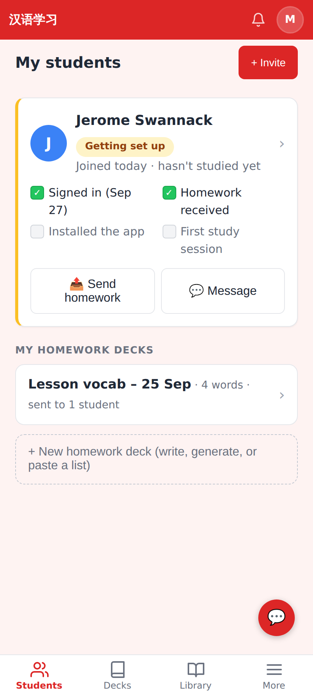
Opens on Students; tabs are Students · Decks · Library · More.

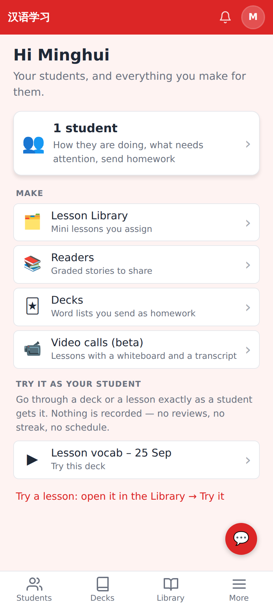
`/` is a teaching home: students, things to make, "Try it as your student". No streak or due cards.

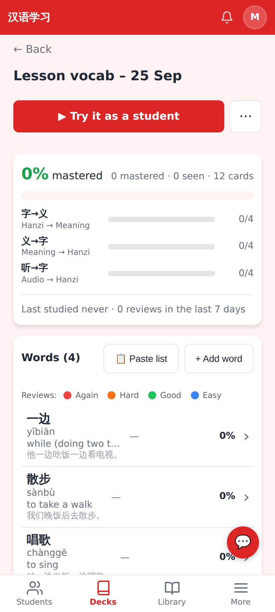
A tutor's deck page offers "Try it as a student" instead of Study.

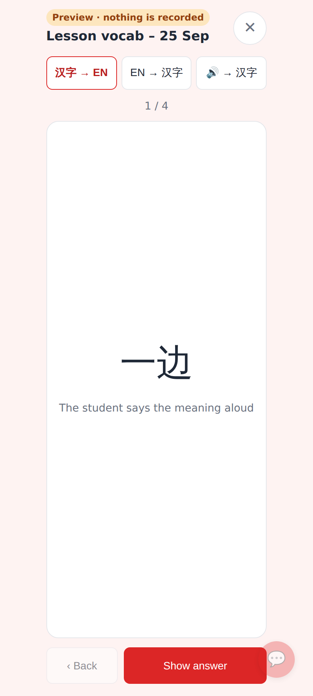
Deck preview — any of the three card types, nothing recorded.

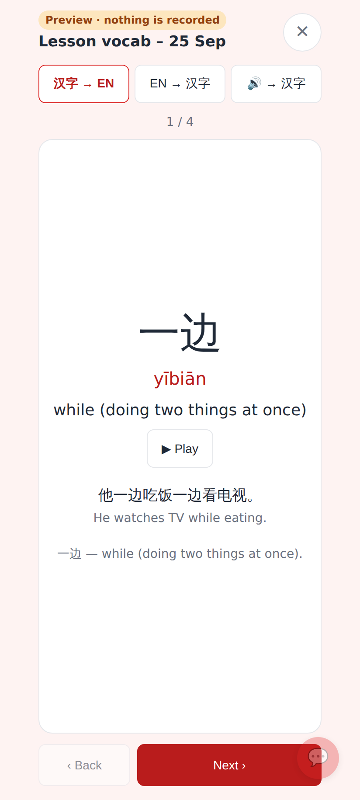
The back: pinyin, meaning, audio, the card's sentence and notes.

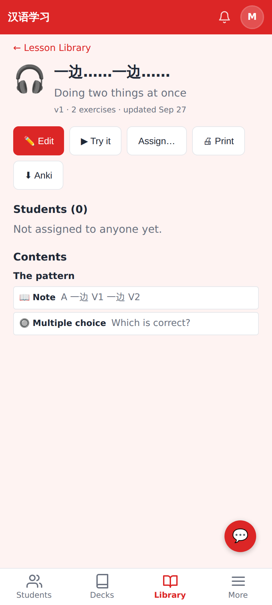
Library lesson page gains **▶ Try it**.

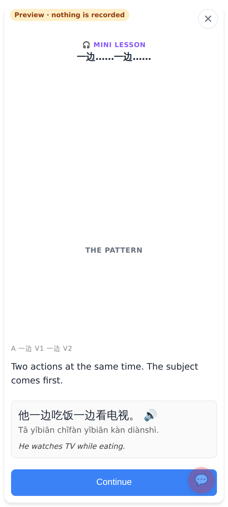
The real lesson player in preview mode: no counts, no rating, no completion saved.

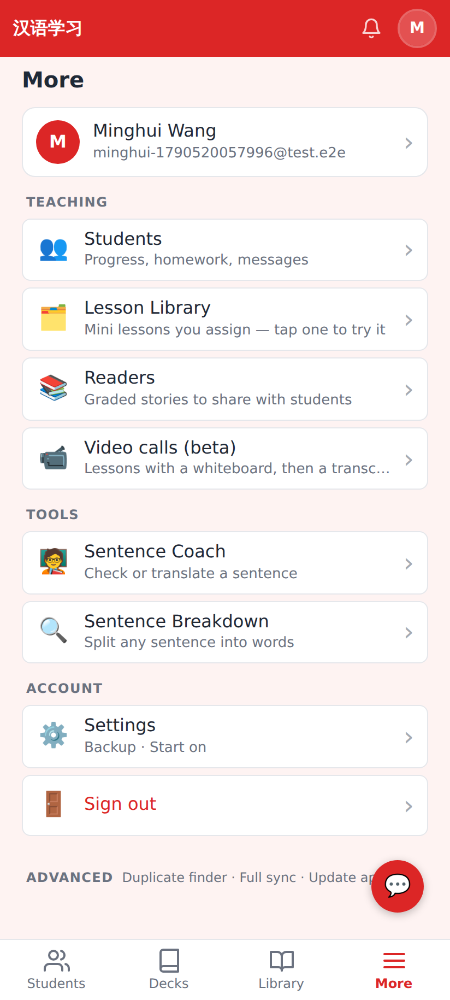
More, tutor edition: Teaching and Tools, no "From your tutor" / learner practice.
