# Anki export — PR screenshots

Captured on the dev server with Playwright at the phone viewport (412×915, 2×) with seeded data
(no TTS keys in the container, so the deck's word audio is absent; sentence-clue, lesson and
reader clips were injected into the IndexedDB audio cache to exercise the media path — 4 of 6,
9 of 10 and 2 of 3 clips respectively, so each result shows a "missing" count).

## Deck

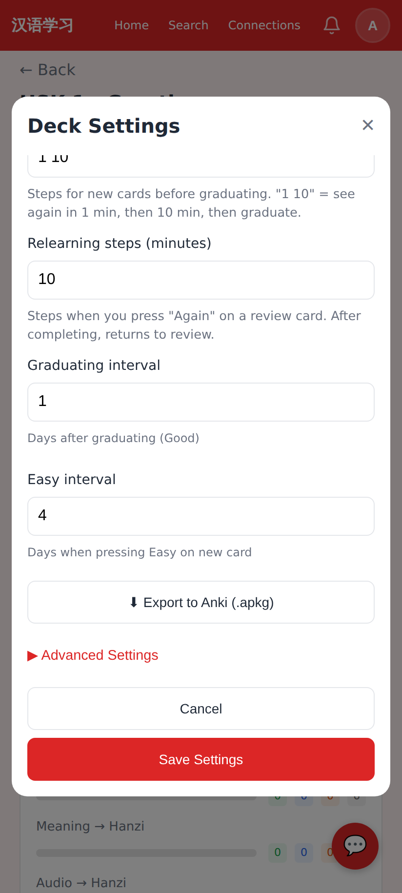

Deck → Settings: the export lives at the bottom of the settings sheet, above Advanced Settings.

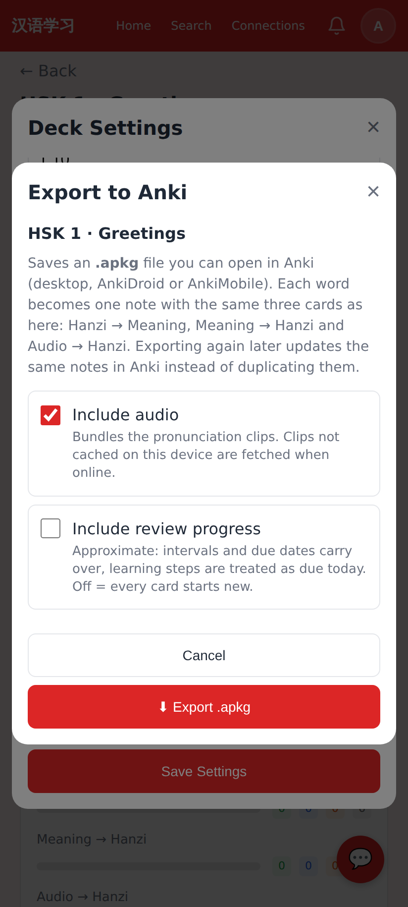

Export options: include audio (on by default) and include review progress (off by default, with the one-line caveat).

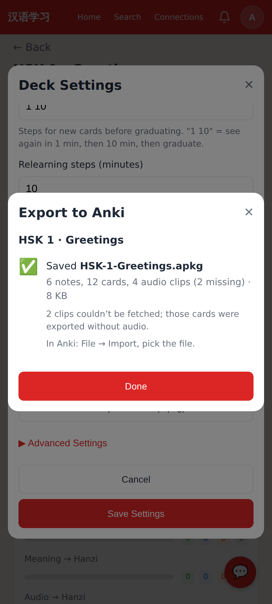

Result: `HSK-1-Greetings.apkg` — 6 notes, 12 cards (no word audio, so no Audio → Hanzi cards), 4 sentence clips, 2 missing.

## Lesson library / editor

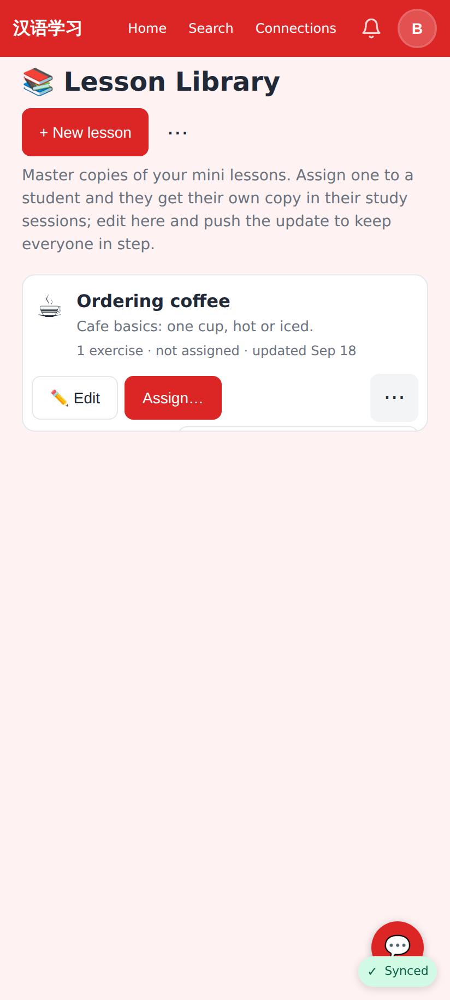

Before: the library card's ⋯ dropdown was clipped by the card's `overflow: hidden` (pre-existing; the menu was unreachable on a phone).

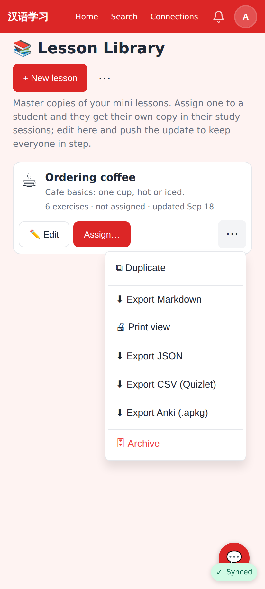

After: the dropdown shows fully, with **Export Anki (.apkg)** after the CSV entry.

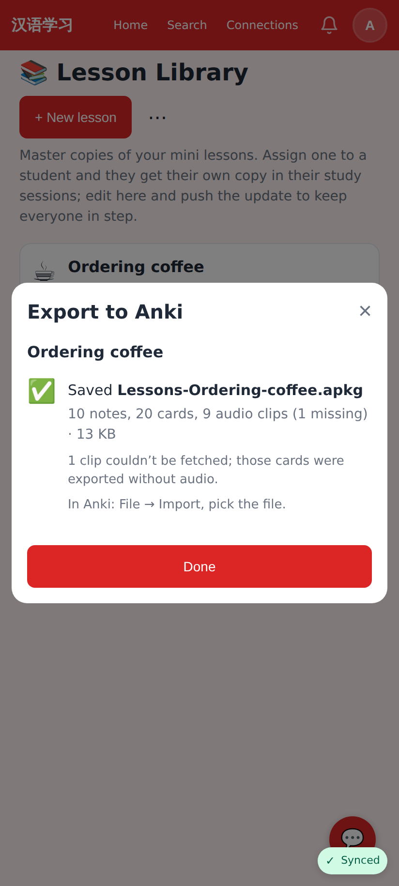

Lesson result: 10 notes (6 words + 4 sentences), 20 cards, 9 of 10 clips bundled.

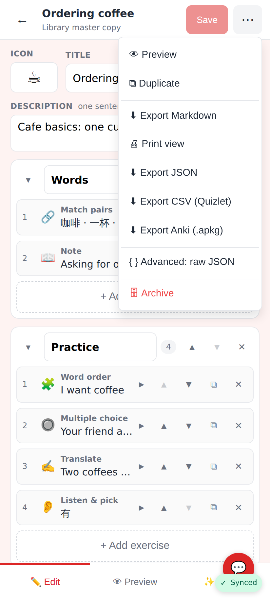

Lesson editor ⋯ menu: **Export Anki (.apkg)** next to Markdown / Print / JSON / CSV.

## Readers

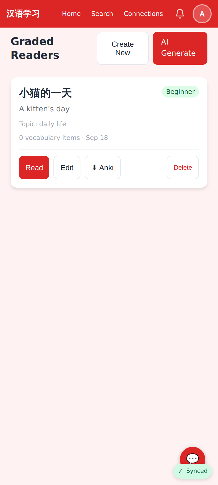

Reader card: an **Anki** button next to Read / Edit.

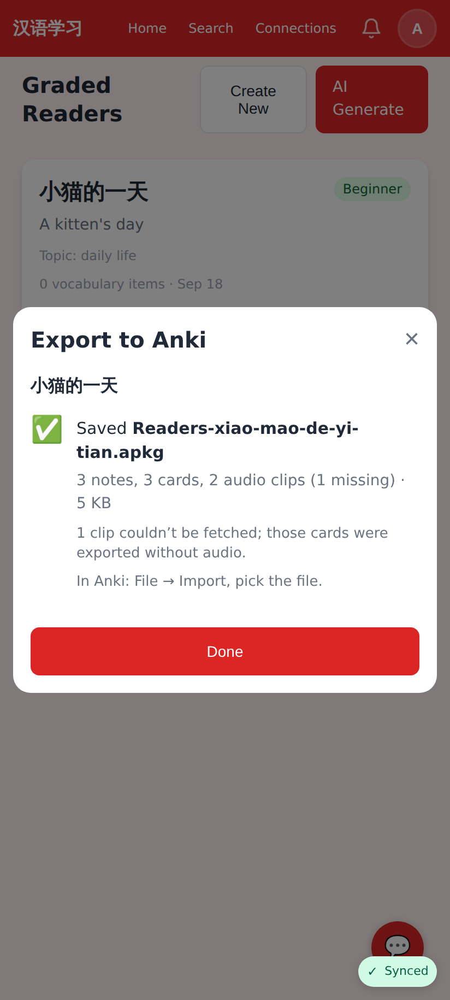

Reader result: `Readers-xiao-mao-de-yi-tian.apkg` (Chinese titles are transliterated for the file name) — 3 pages → 3 Sentence notes, 2 of 3 narration clips.

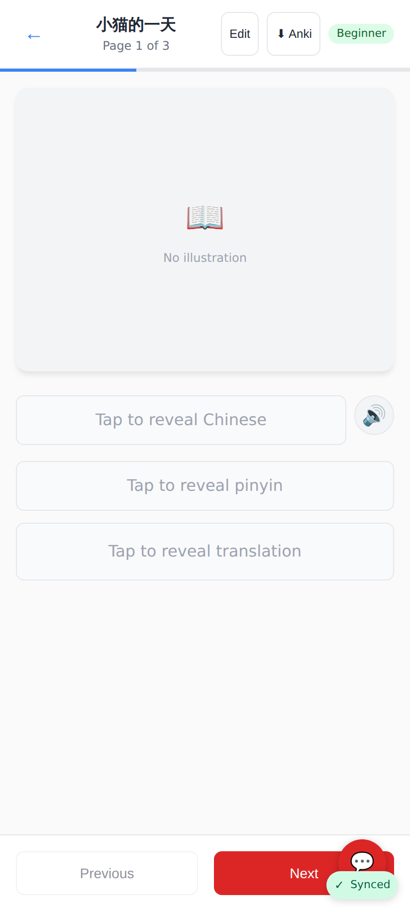

Reader page header: the same button beside Edit.

## The generated files, re-opened

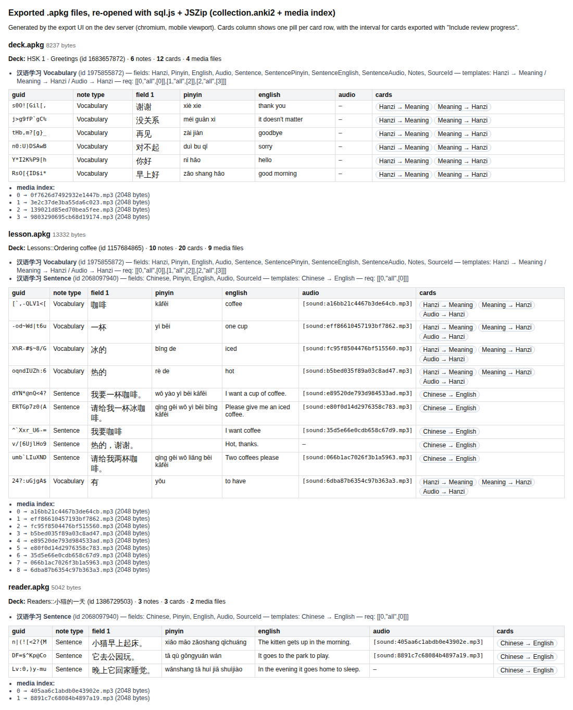

Anki itself can't run here, so the three downloaded `.apkg` files were re-opened with the same libraries: `collection.anki2` models (fields, templates, `req`), every note with its GUID / fields / `[sound:…]` reference, one pill per card row, and the `media` index with file sizes.
