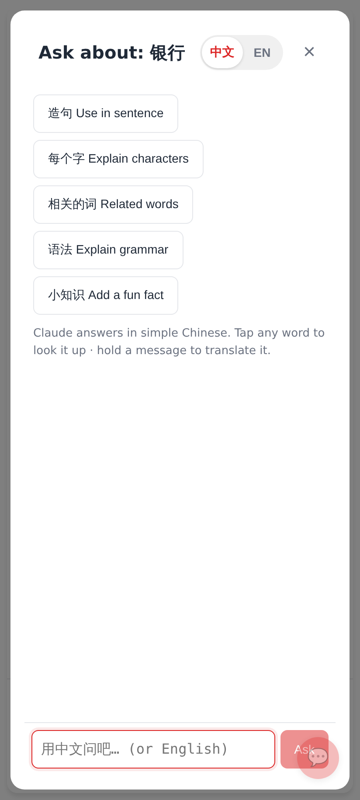
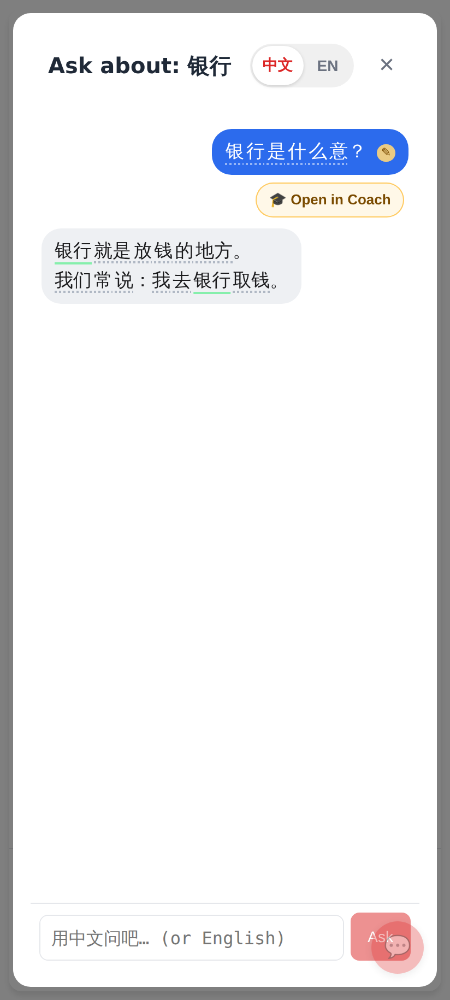
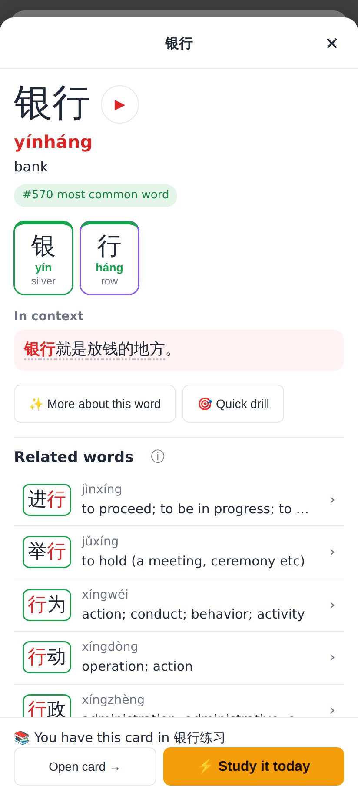
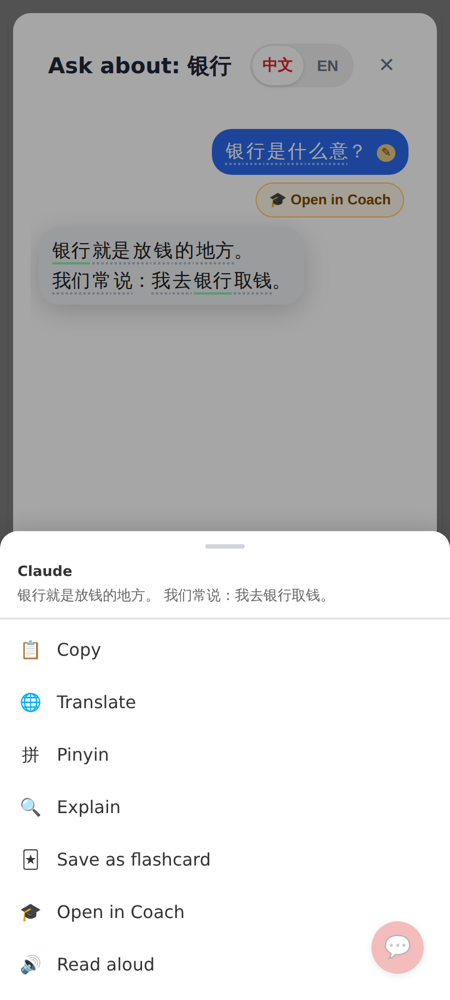
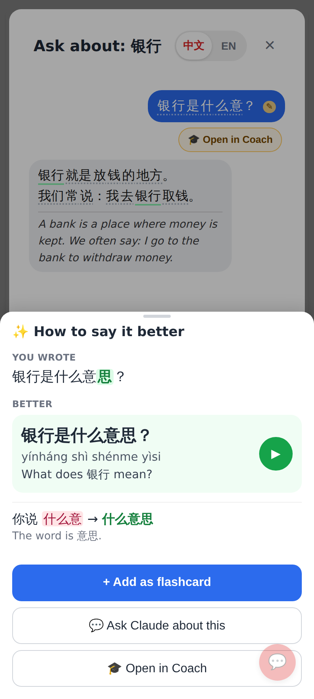
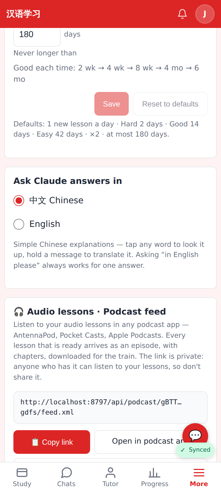
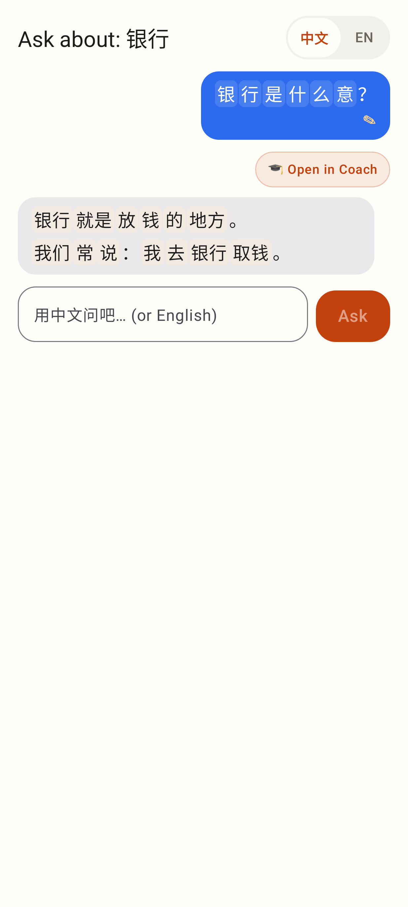
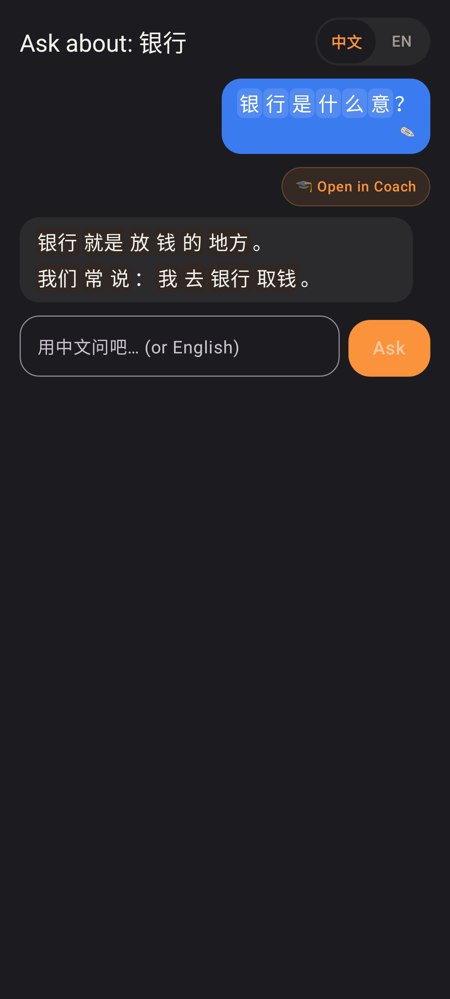
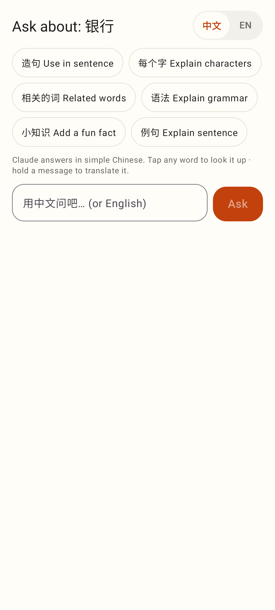
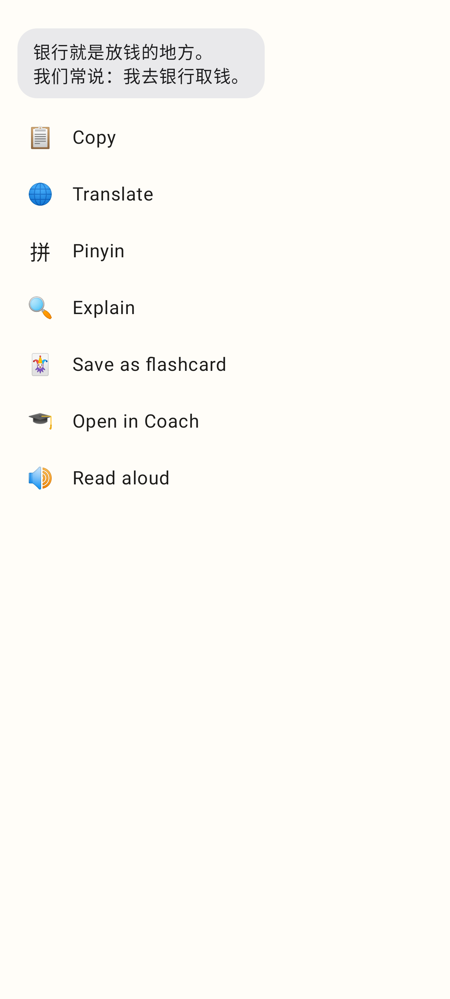

# Ask Claude, immersion — screenshots

Web (412×915 @2×, Claude stubbed at the network edge by `e2e/tests/ask-claude-immersion.spec.ts`):

Ask Claude opens in 中文: bilingual quick chips that send Chinese questions, the hint line, the 中文 / EN switch.

Claude's reply is a grey chat bubble of word chips; my question has the ✎ mark and the "Open in Coach" chip (the chat's auto-check).

Tapping 银行 opens the language explorer's Word view.

A long press opens the chat's message menu — only Copy, Translate, Pinyin, Explain, Save as flashcard, Open in Coach, Read aloud.

The translation under the reply, and "How to say it better" on my own question.

Settings → "Ask Claude answers in": 中文 (default) / English.

Lab app (Roborazzi, phone):

The same conversation: chips, ✎, Open in Coach.

Dark theme.

Start: quick chips in Chinese, hint, 中文 / EN.

The long-press menu on Claude's reply.
