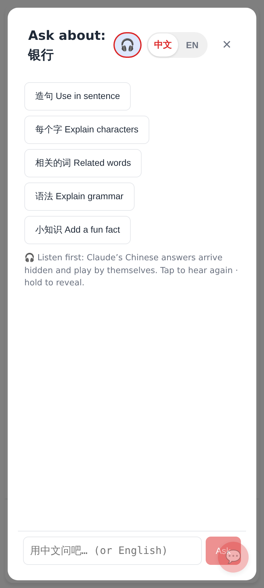
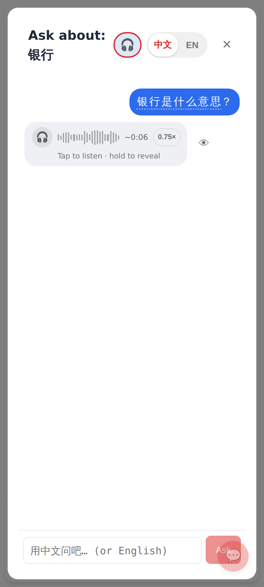
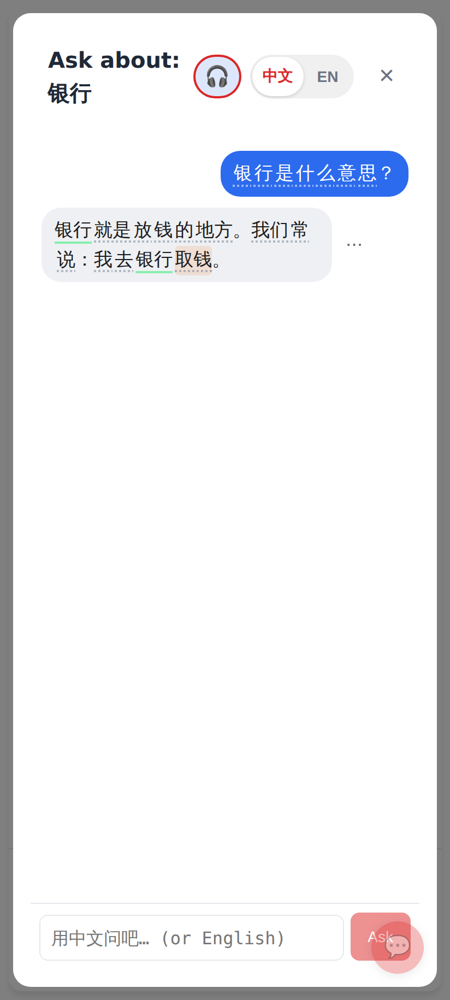
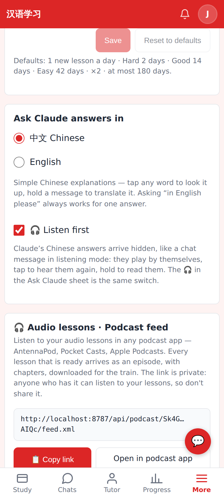
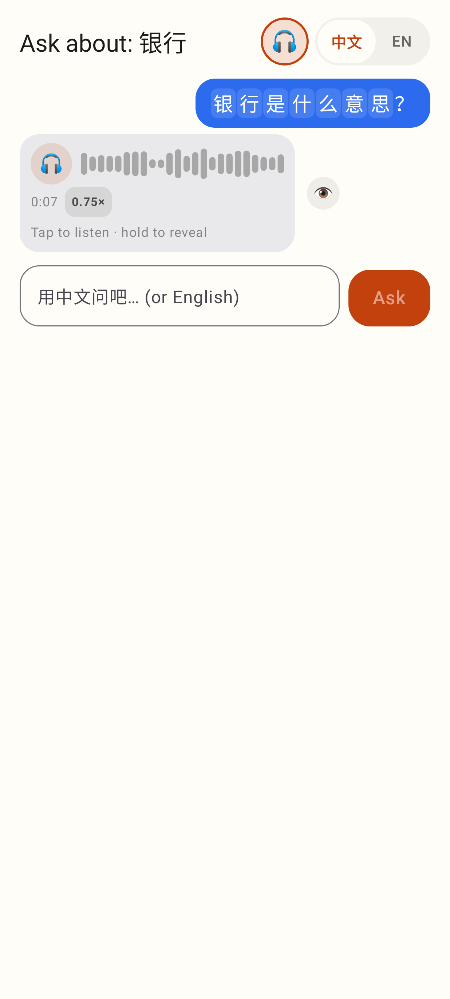
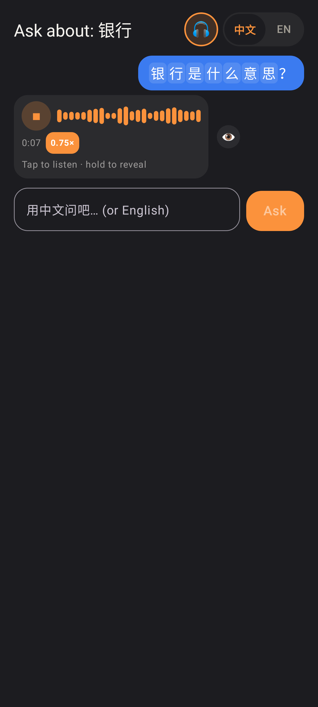
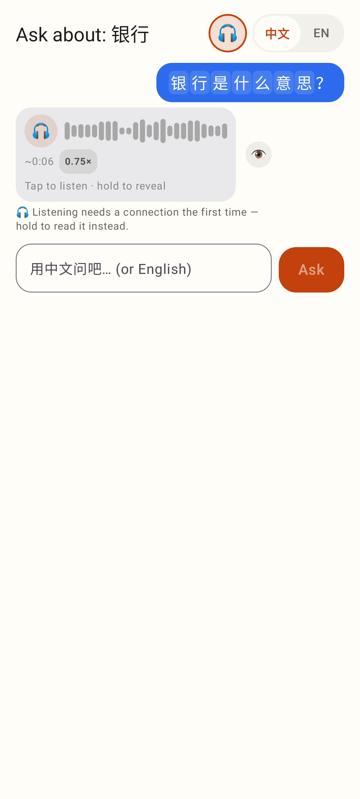
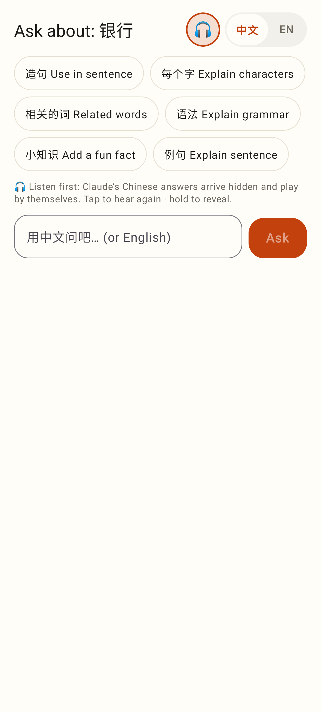
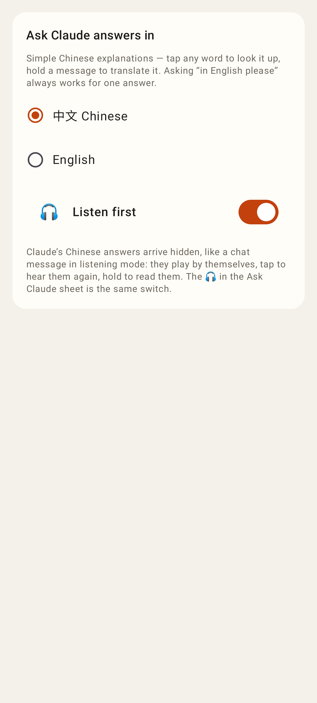

# Ask Claude — 🎧 Listen first

Phone viewport (412×915). The web app is light-only, so the web shots are light; the Lab app is shown light and dark.

## Web

The 🎧 sits beside 中文 | EN; when it is on, the hint says what happens.

My question shows. Claude's Chinese answer is the chat's hidden bubble, and it has already played once by itself. Tap plays it again, hold reveals it, and 👁 also reveals it.

Once revealed (long press), the answer shows the usual word chips, and its menu opens as normal.

Settings → "Ask Claude answers in" → 🎧 Listen first. It is the same switch, saved on the account.

## Lab app

The answer is hidden (the chat's `ListeningContent`), with the 0.75× chip and 👁.

The answer playing in slow mode, dark theme.

Offline with no clip on the phone: the line under the bubble says it needs a connection, and holding still reveals the text.

An empty sheet with Listen first on.

Settings: the same switch.
