# Audio lessons — the "Story" format (Listen & repeat a story)

Web at 412×915 @2× (E2E_TEST_MODE: fake translation "Line N of the story.", silent fake voices); Lab via Roborazzi.

## Web — the format picker, before / after

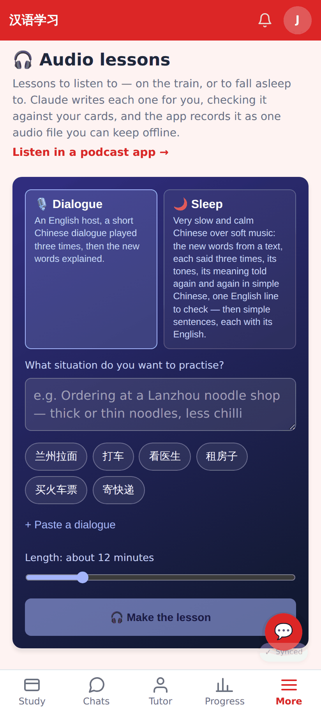
Before: two formats, each card with its long blurb.

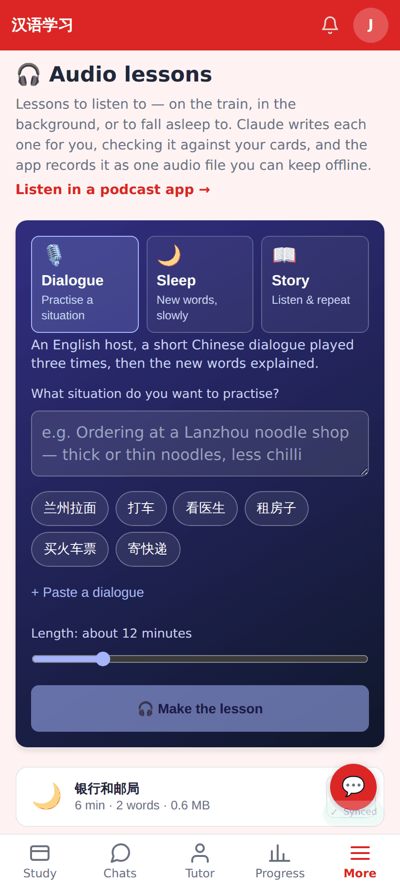
After: three choices (icon, name, a few words); the chosen one's description under them.

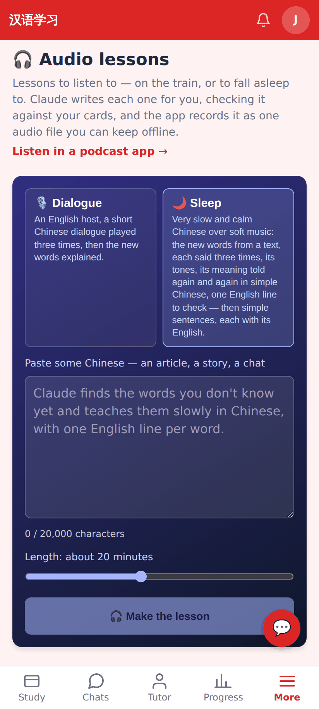
Before: the sleep form.

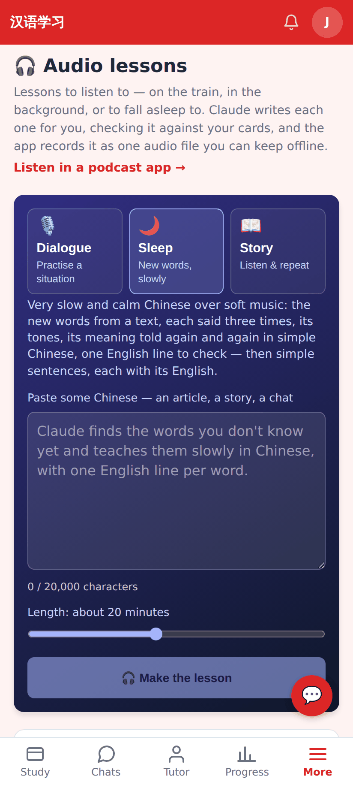
After: the sleep form, unchanged below the picker.

## Web — Story

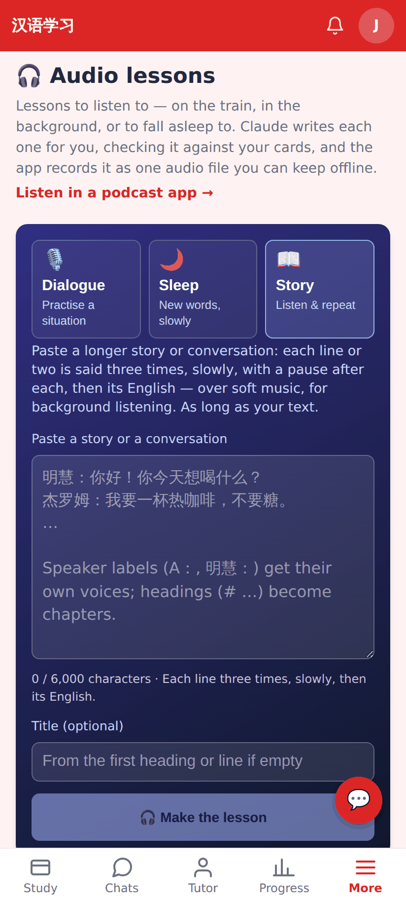
Story: paste box (speaker labels and headings explained in the placeholder), optional title, no length slider.

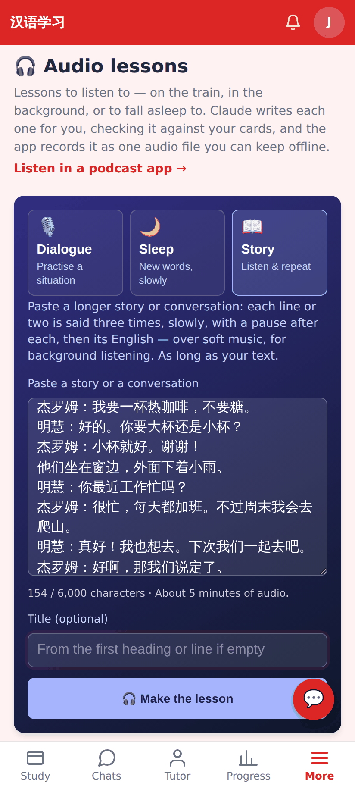
The length follows the text: "154 / 6,000 characters · About 5 minutes of audio."

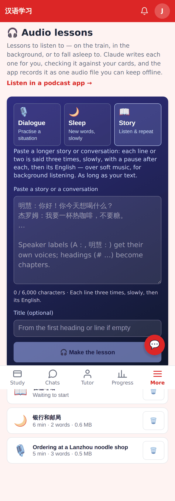
Queued like the other formats; the list shows "Translating — N of M lines…" while Claude translates.

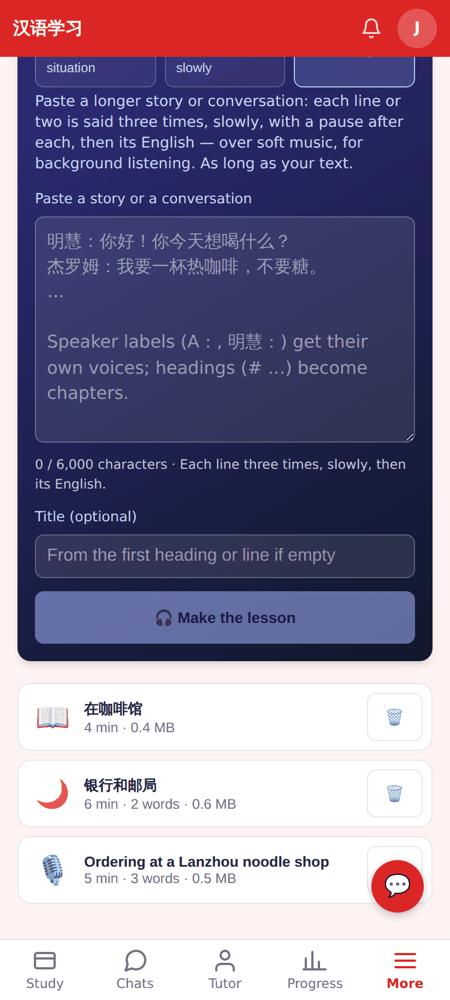
The ready story in the list with its 📖 icon.

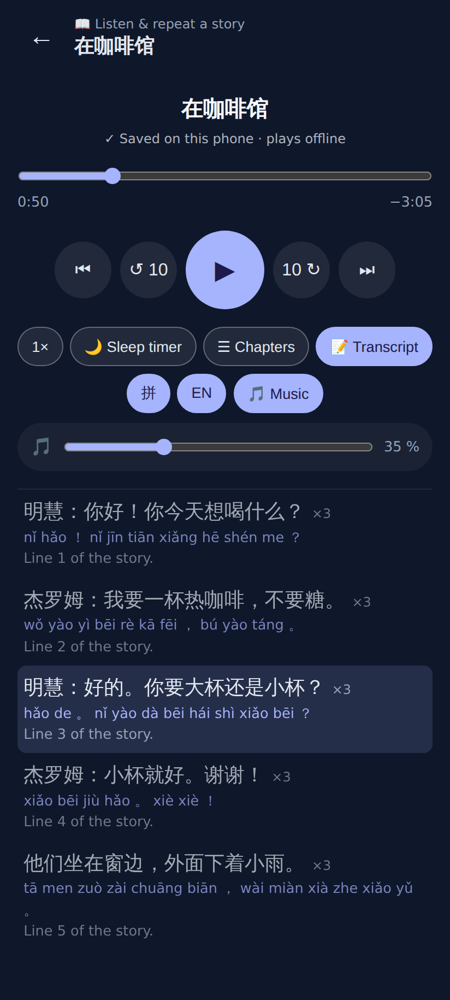
The player: "📖 Listen & repeat a story", one transcript row per chunk ×3 with the speaker, pinyin and English; tap a row to seek; music on by default.

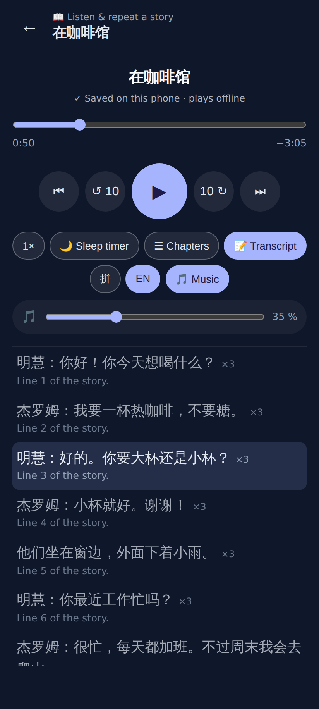
拼 / EN toggles hide the pinyin / English (remembered on the device).

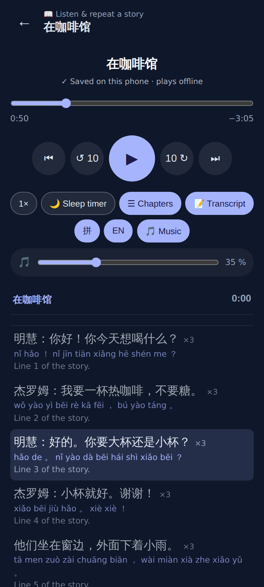
The `# 在咖啡馆` heading is the chapter.

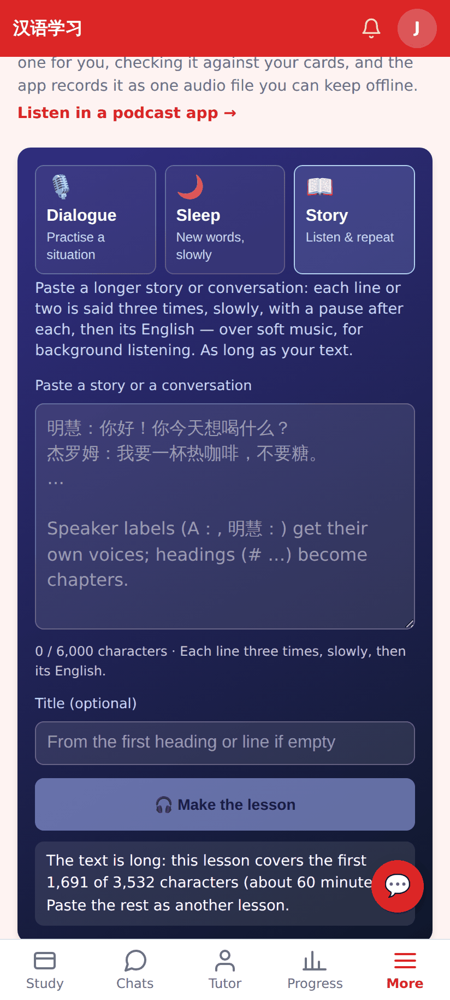
A long text: the first ~60 minutes are made and the app says so.

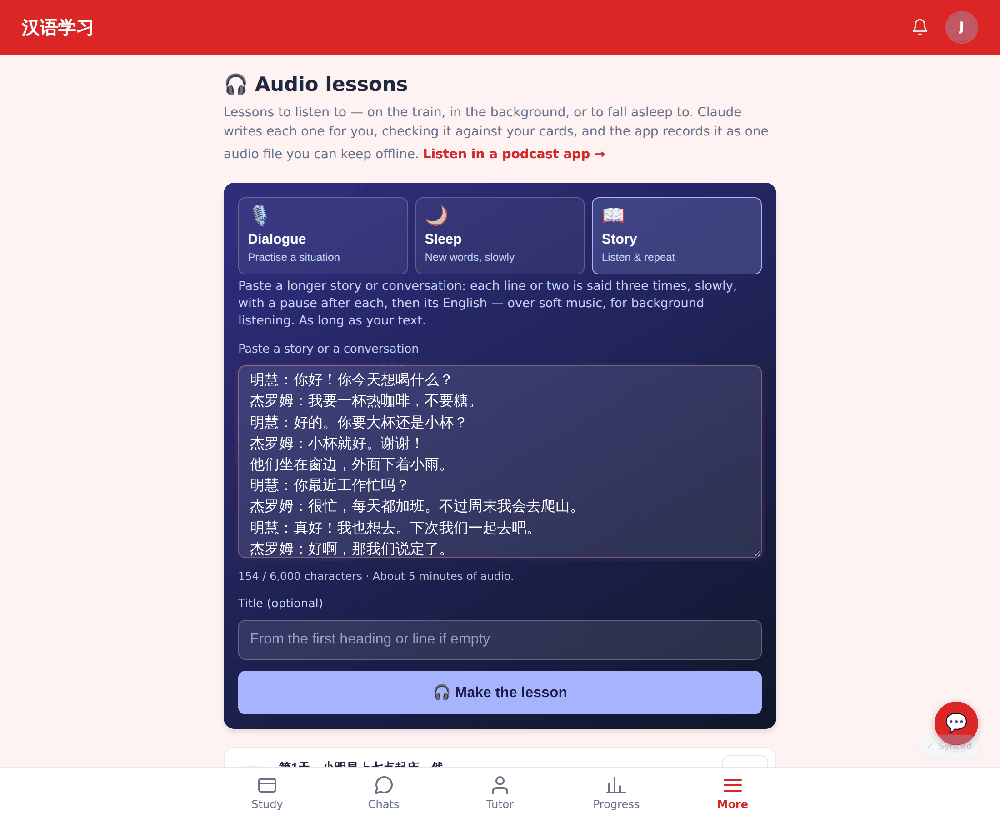
The form at desktop width.

## Lab app

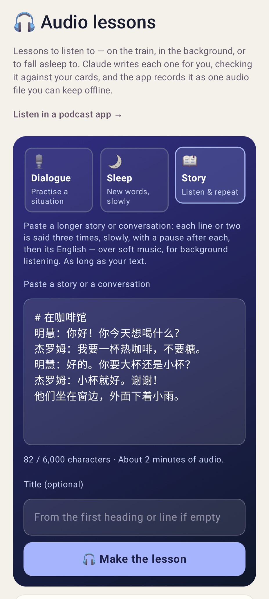
The Lab create screen offers Story with the same paste box, estimate and title; no length slider.

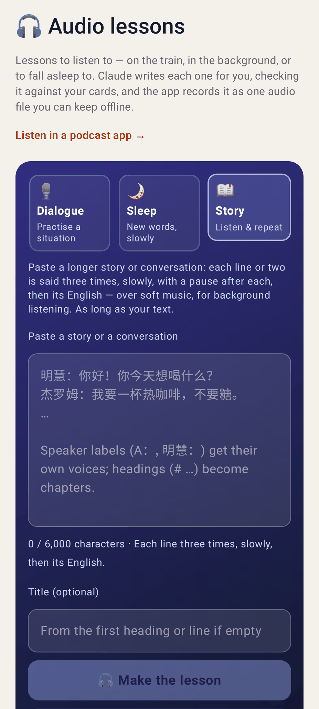
The server's notice after starting a long story.

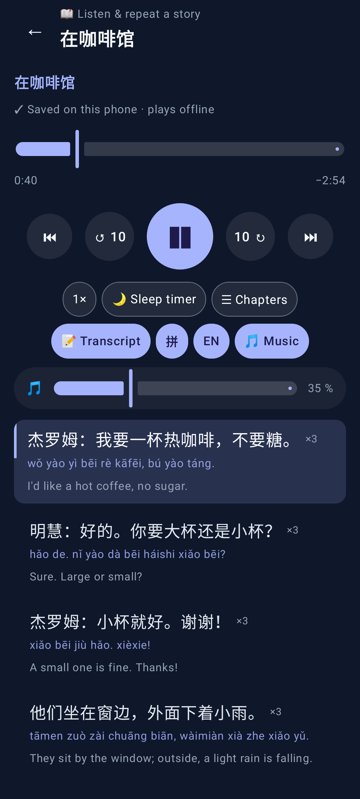
The Lab player: header, ×3 rows with pinyin and English, 拼 / EN chips, music on.

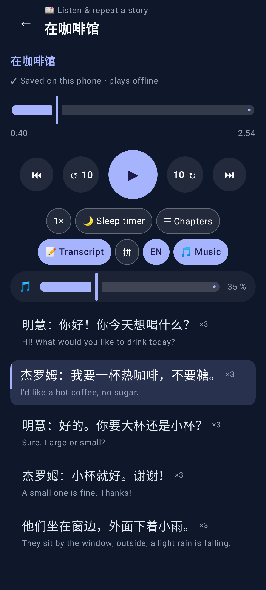
Pinyin hidden.
