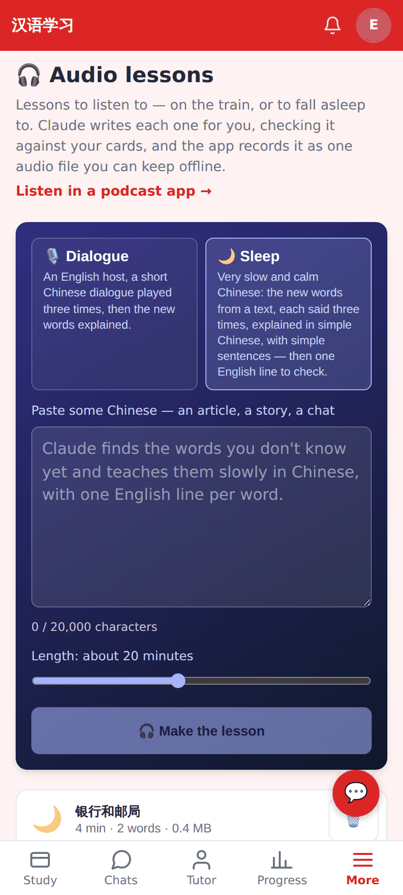
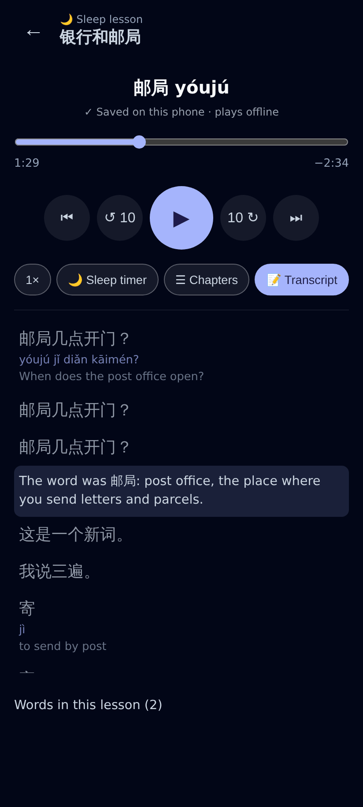
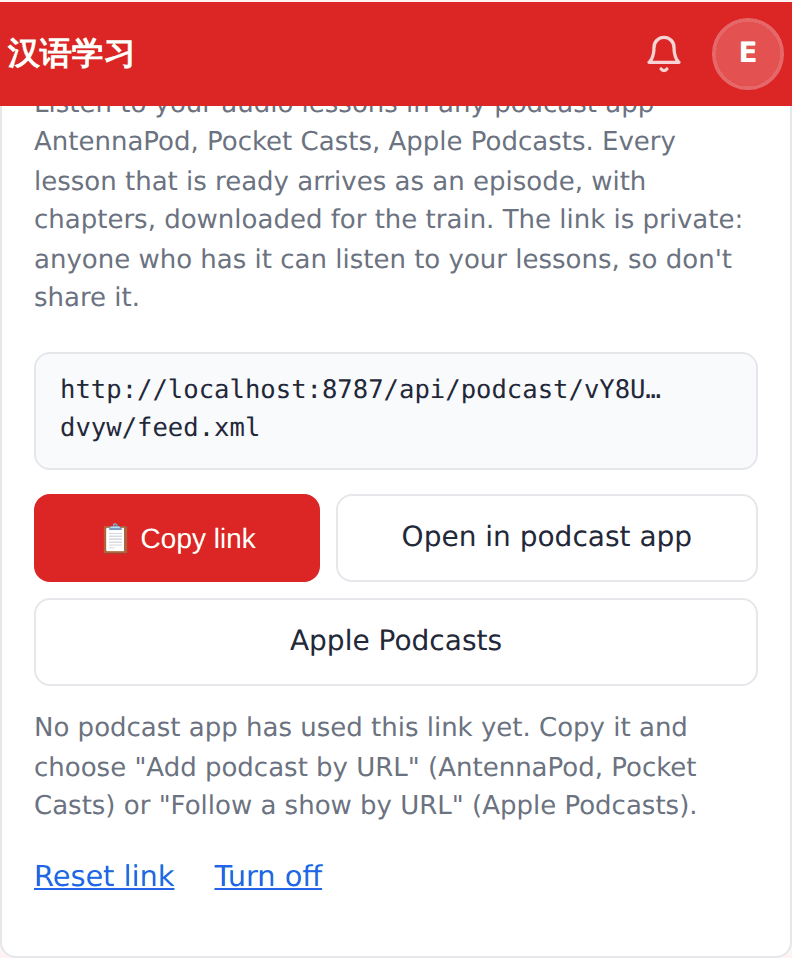
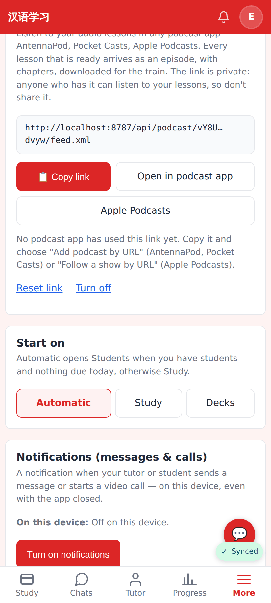
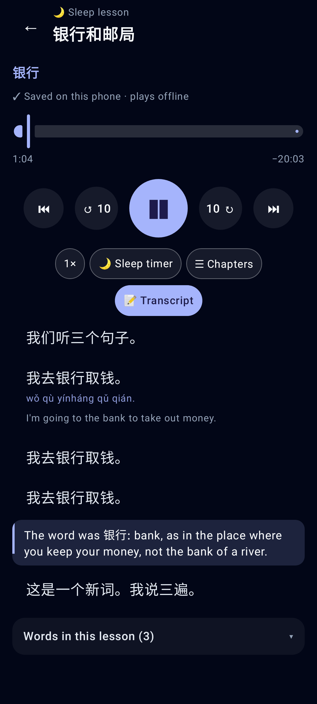
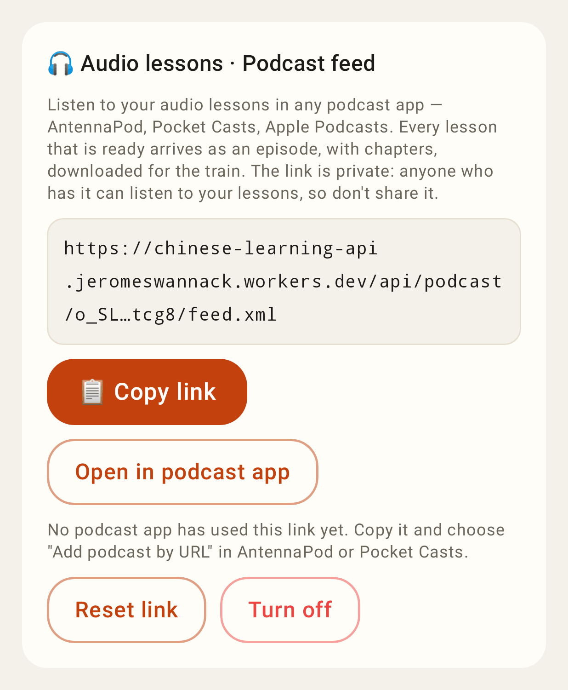
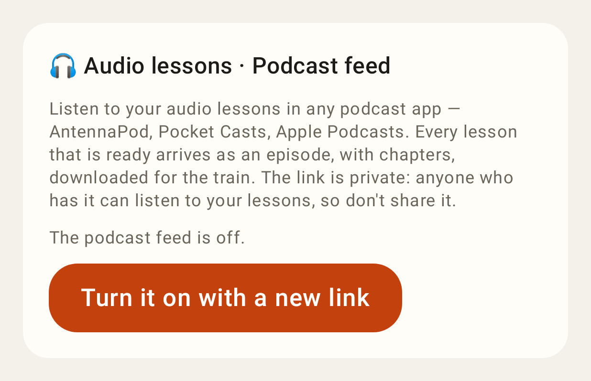

# Audio lessons: meanings + English recap, private podcast feed

Web (412 × 915, 2×, E2E_TEST_MODE with the fake model + voices):

The Audio lessons page: "Listen in a podcast app →" under the intro; the Sleep blurb now mentions the meaning and the one English line.

A sleep lesson's transcript: after the three example sentences ×3, one English line — "The word was 邮局: post office, …".

Settings → 🎧 Audio lessons · Podcast feed: the link masked, Copy link, Open in podcast app, Apple Podcasts, Reset link, Turn off.

The same section in the Settings page (opened from `/settings#podcast-feed`).

Lab app (Roborazzi):

The Lab player's transcript: the recap is one row.

Lab Settings / Audio lessons sheet: the podcast feed section.

After Turn off.
