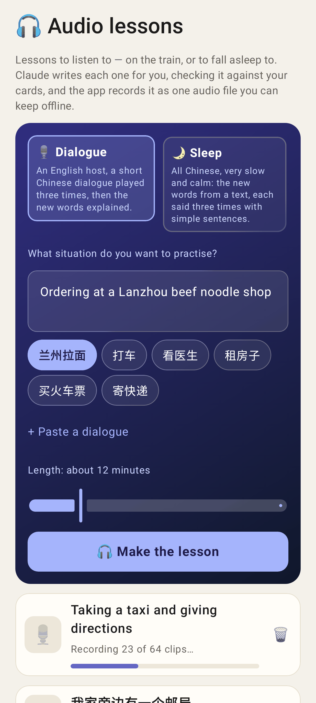
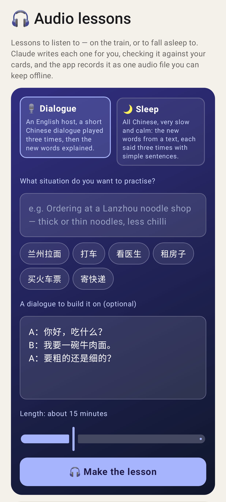
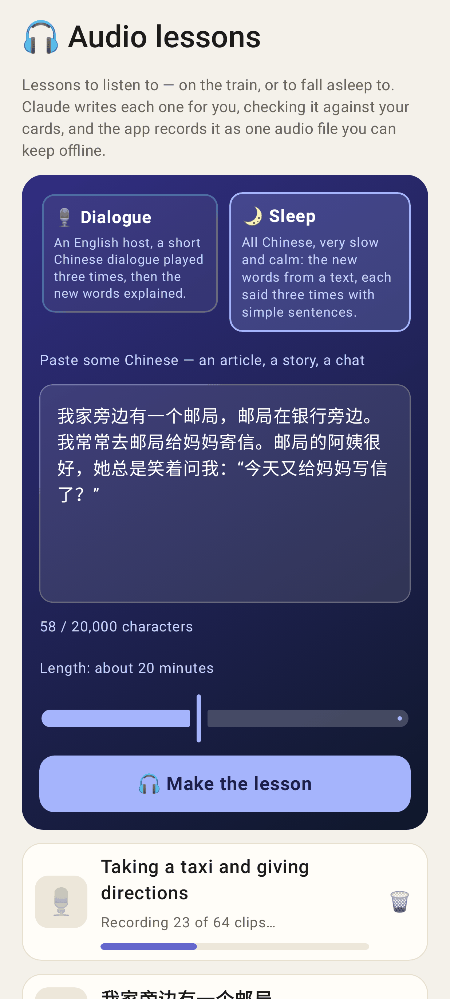
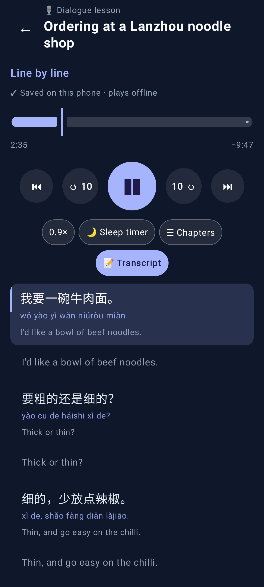
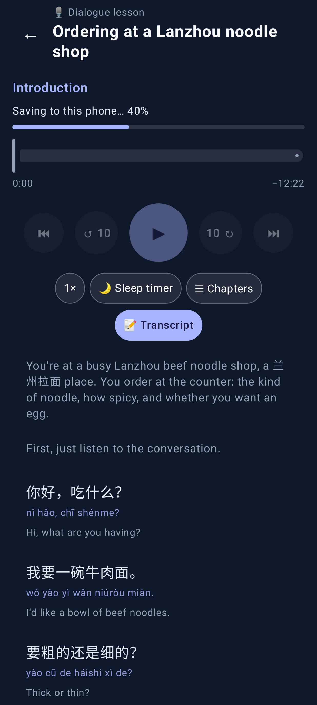
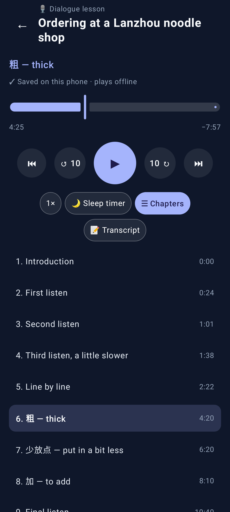
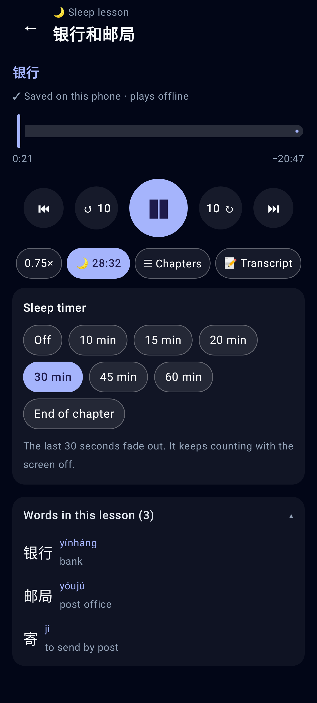
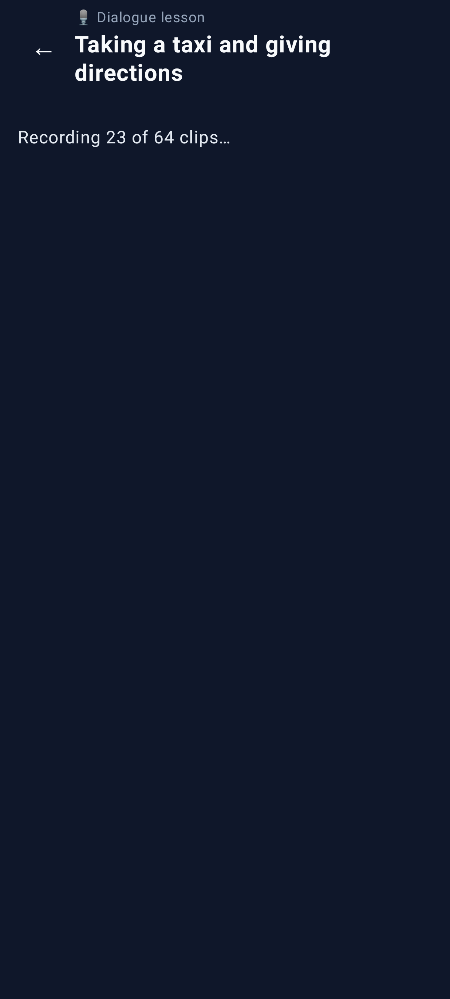
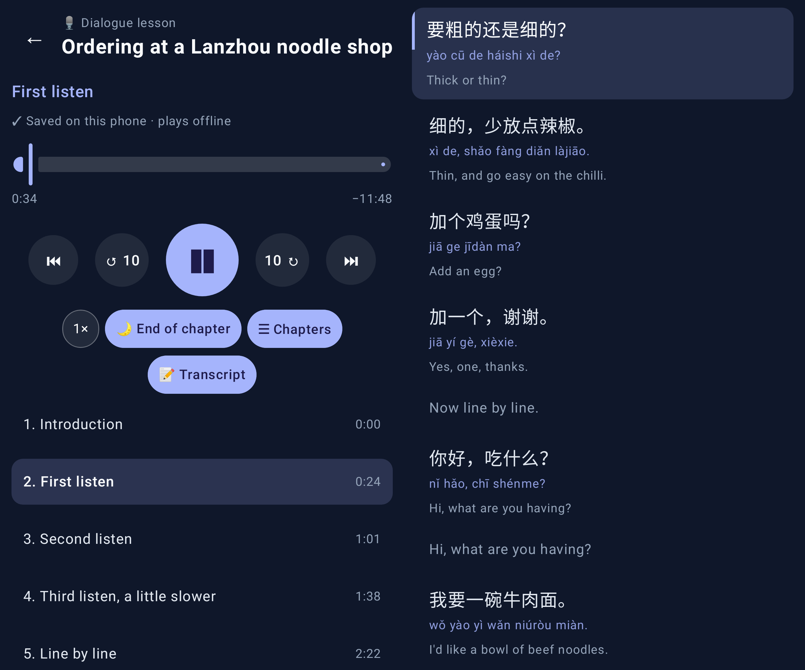

# Audio lessons in the Lab app

Roborazzi renders (`AudioLessonScreenshots`), phone 412dp unless noted.

The list with the new-lesson card (Dialogue chosen, a situation chip picked). One lesson is being recorded, with a progress bar.

"+ Paste a dialogue" opened, 15 minutes.

The Sleep format with pasted Chinese, the character count and the 20-minute default.

The dialogue player while playing at 0.9×. The controls stay at the top and the transcript follows the current line underneath.

The first time a lesson opens, it says "Saving to this phone… 40%".

☰ Chapters is open with the current chapter highlighted. A tap seeks to that chapter.

A sleep lesson (transcript off by default) with the 30-minute sleep timer counting down, the timer sheet open, and the words list.

A lesson opened from a link before it is ready.

Unfolded (841dp): the controls and chapters on the left, the transcript beside them, with the timer set to the end of the chapter.
