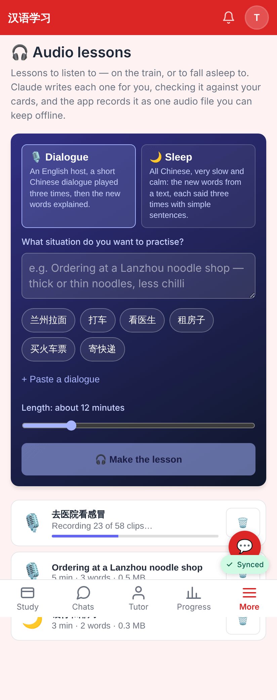
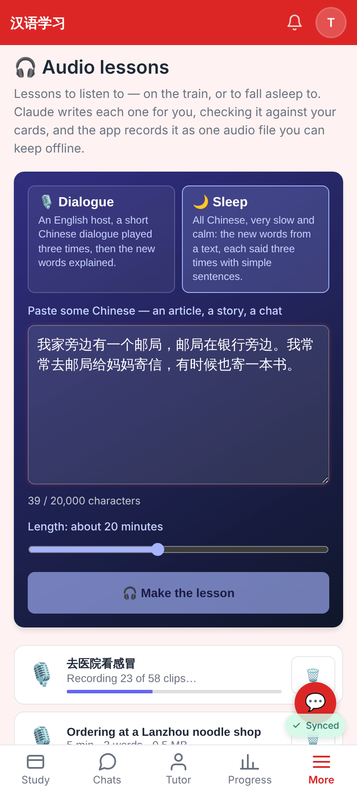
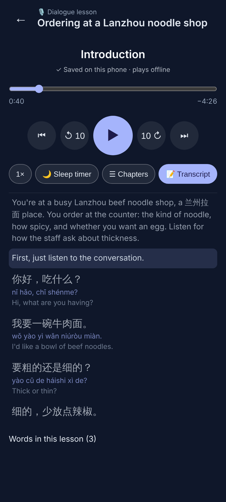
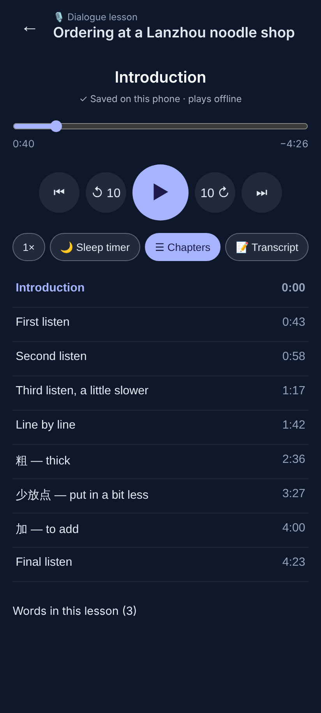
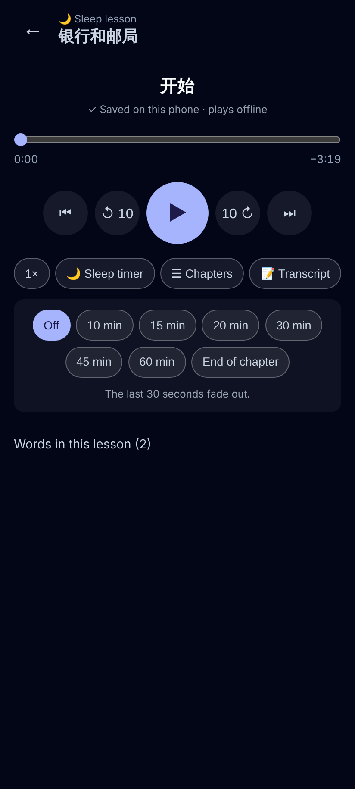
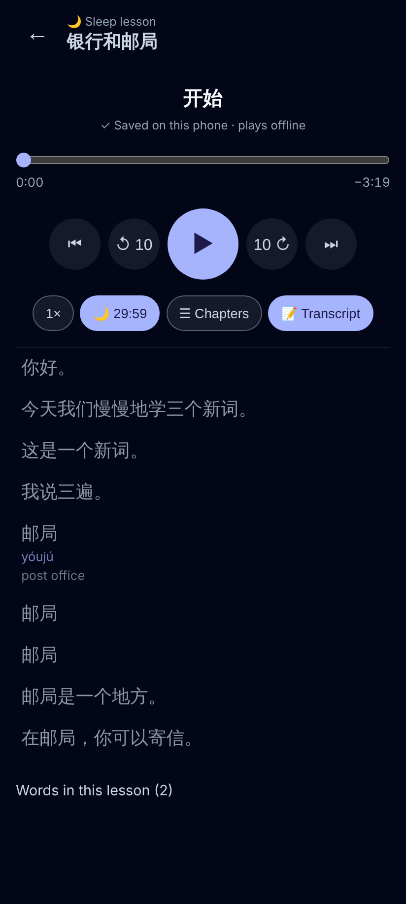
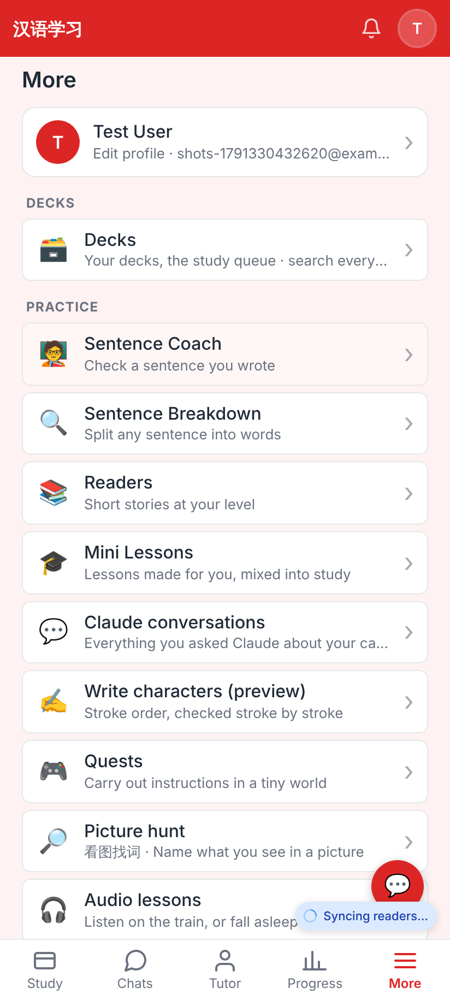

# Audio lessons — screenshots (412×915 @2x)

Made locally with E2E_TEST_MODE (fake model = the sample plans, fake voices = silent clips, so the times are short).

More → 🎧 Audio lessons: pick Dialogue or Sleep, describe the situation (or tap a chip), length slider; the list shows a lesson being recorded ("Recording 23 of 58 clips…") and ready ones.

Sleep: paste any Chinese text — Claude picks the words you don't know yet.

The player (full screen, dark): chapter, saved-offline note, scrubber, ⏮ ↺10 ▶ 10↻ ⏭, speed, sleep timer, chapters, transcript (on by default for dialogue; tap a line to jump).

Chapters: three listens, line by line, one chapter per word / structure, final listen.

Sleep lesson: transcript hidden by default; sleep timer (10–60 min or end of chapter, the last 30 s fade out).

The all-Chinese transcript when you want it.

The entry under More → Practice.
