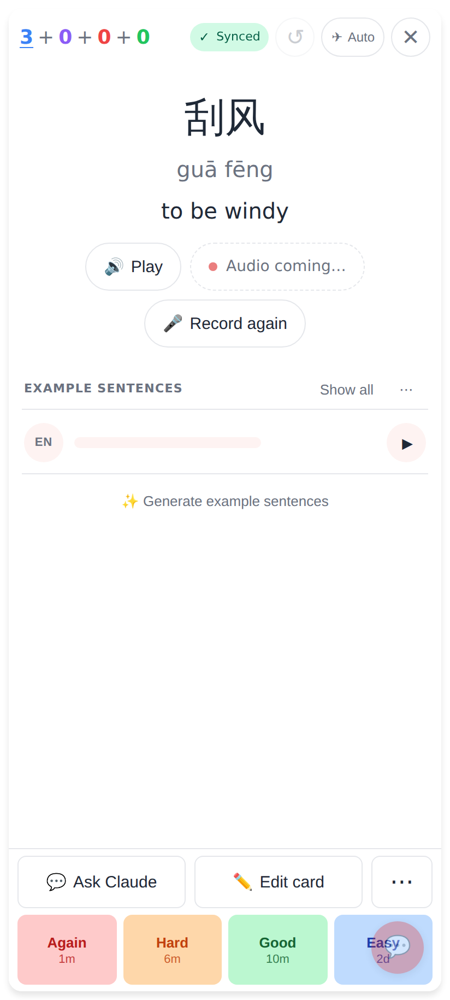
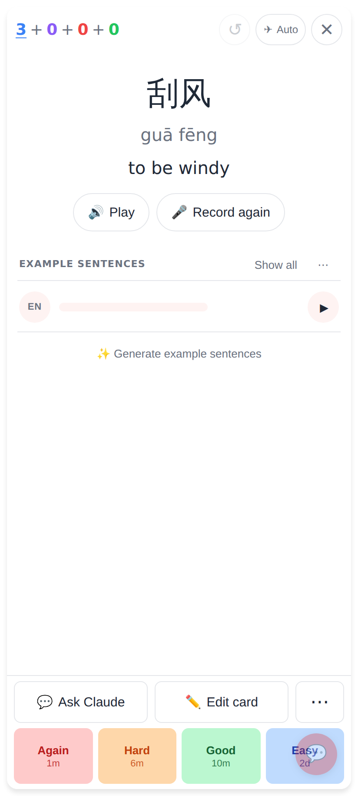
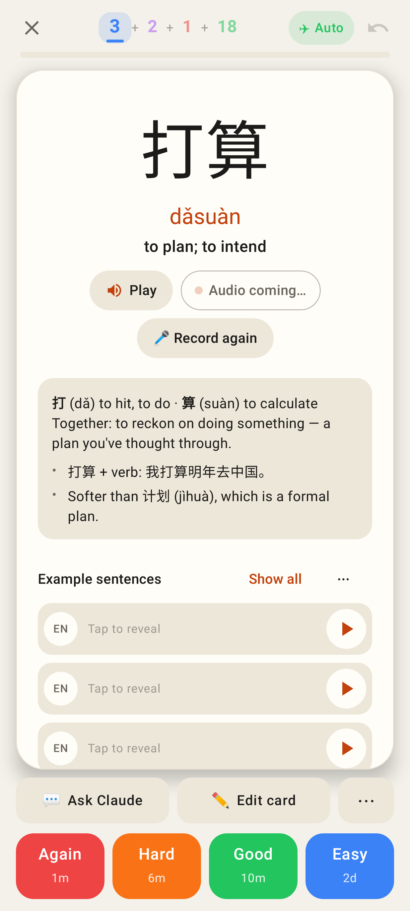
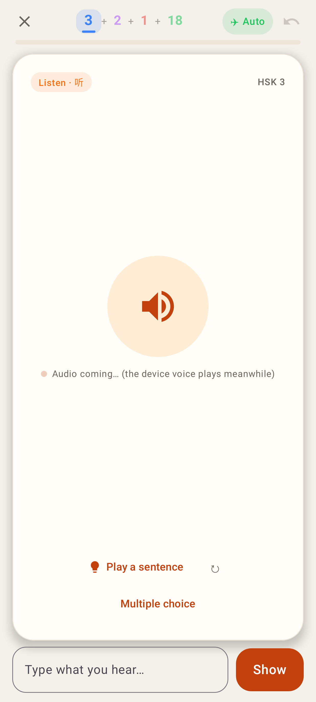

# Audio pipeline — web study card

Phone viewport 412×915 @2x. The local worker has no MiniMax key, so the
ensure-audio answers are stubbed (first `queued`, then the clip) — the same
flow as `e2e/tests/audio-coming.spec.ts`.

**Audio coming…** — the card's clip is missing and MiniMax is busy: the server queued it
(interactive priority). The card no longer reads the word in the device's robotic voice on
reveal; it waits, checks back every 20 s, and plays the real clip when it lands. A tap on
Play still uses the device voice meanwhile.

**Clip arrived** — the pill goes; the note in IndexedDB now carries the new clip key, so it
is cached for offline like any other clip.

## Lab app (Roborazzi)

**Lab — back of the card**: the same quiet "Audio coming…" pill beside Play.

**Lab — front of a listening card**: "Audio coming… (the device voice plays meanwhile)".
