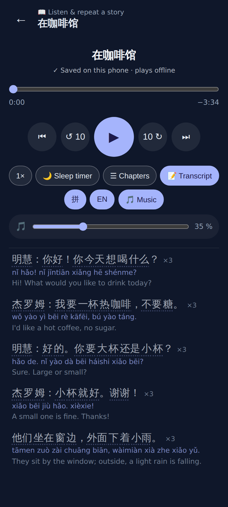
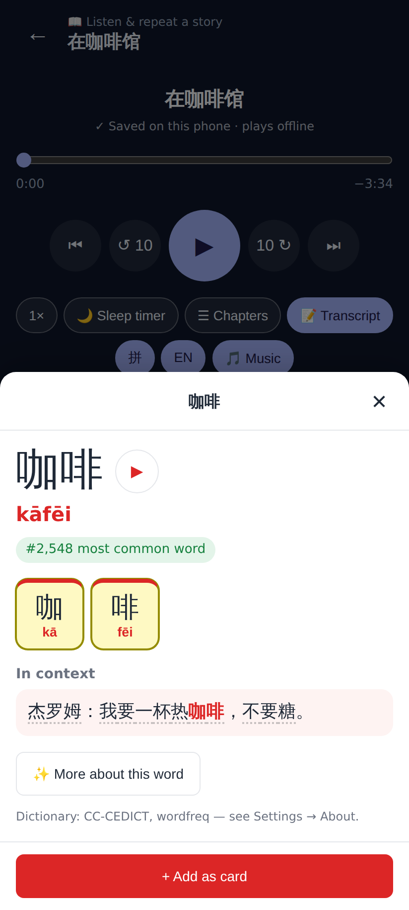
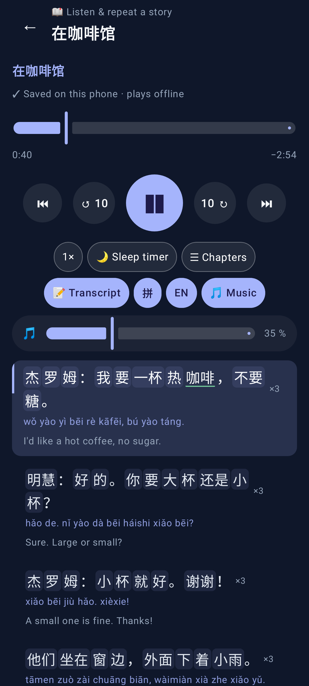
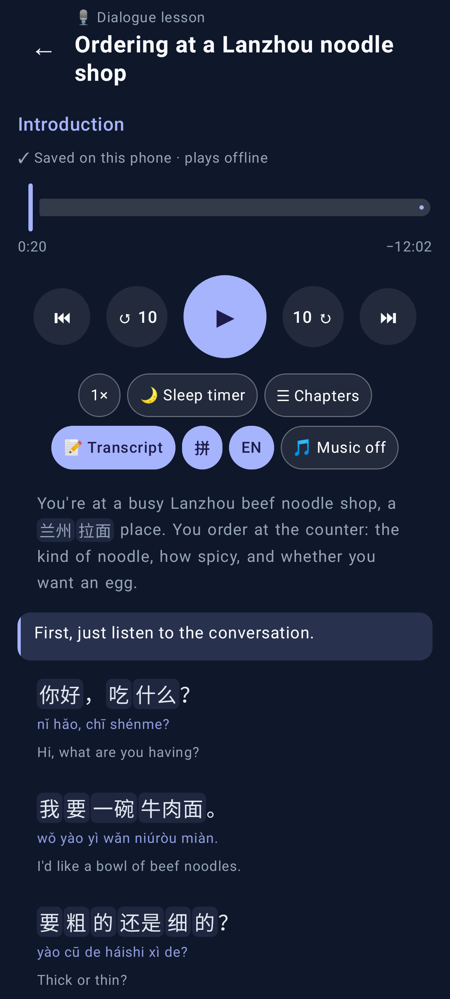
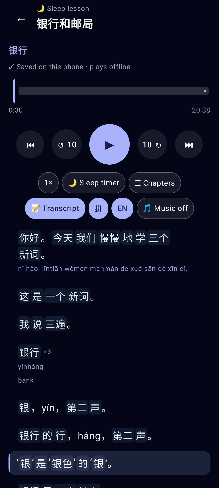

# Audio-lesson transcript: word chips (web + Lab)

Phone viewport (412×915, 2× web / xxhdpi Lab). The player is always dark, so the app's light and dark themes give the
same picture: the Lab story shot is the light theme, the sleep shot the dark theme.

## Web

A story lesson: every row's Chinese is word chips (dotted underline) from the device segmenter; pinyin, English and ×3 as before.

Tapping 咖啡 opens the language explorer's Word view with the row as "In context"; the audio did not seek.

## Lab app

Story: word chips via `ChineseWords` + `DeviceWords`; 咖啡 / 什么 (in a deck) get the green underline.

Dialogue: the English host rows chip only the Chinese inside them.

Sleep (dark theme): punctuation (and a space) now wraps with its word in `ChineseWords` — no "。" alone at the start of a line, English rows keep normal word spacing.
