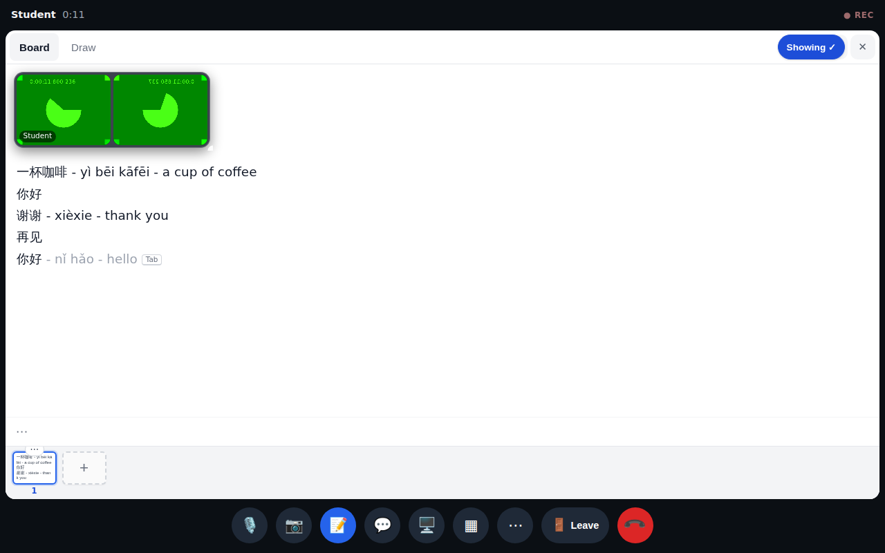
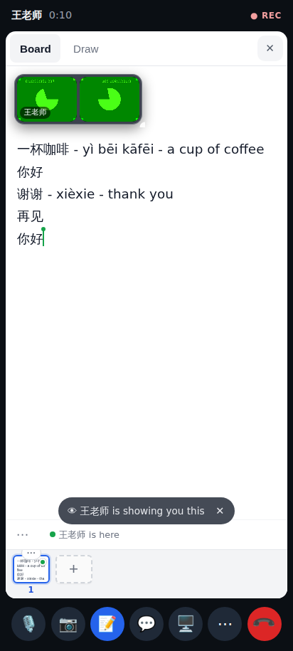

# Board tab-complete after a macOS-style IME commit

Tutor account on a desktop (1280×800, the board shown to the student), student on a phone.

After a commit in the "compositionend first, then the input event" order, the grey ` - nǐ hǎo - hello` suggestion appears again (before the fix: never again for the rest of the call).

The committed 你好 reaches the other person at once (before the fix it waited for the next composition or the 1.5 s idle catch-up).
