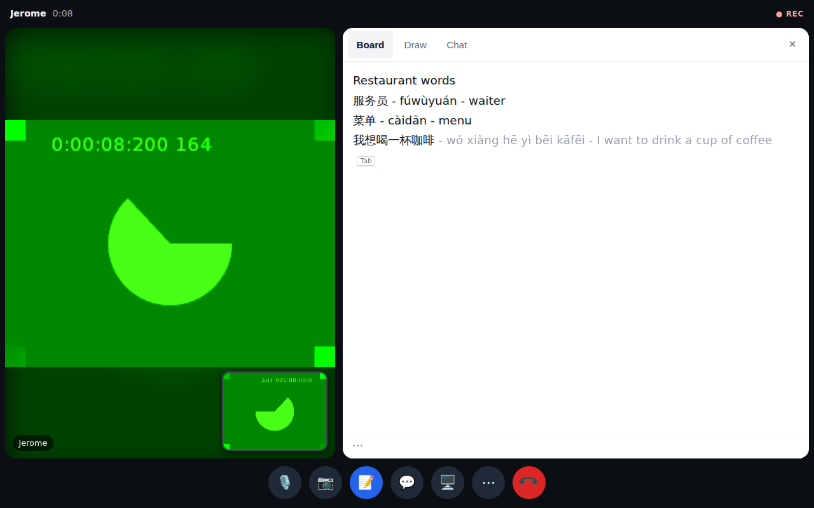
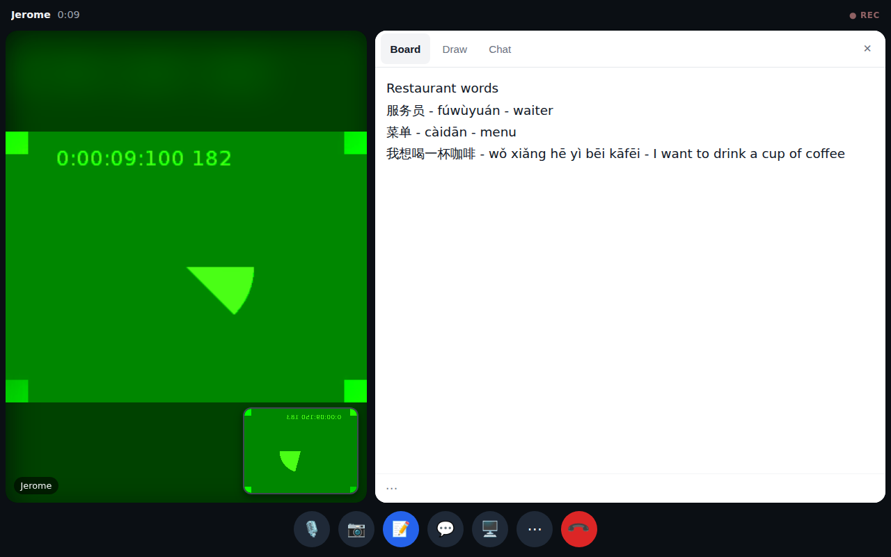
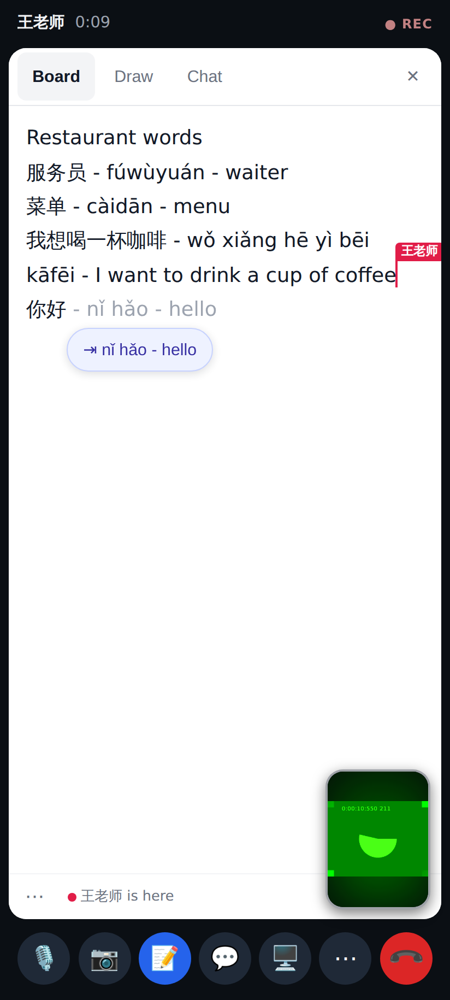
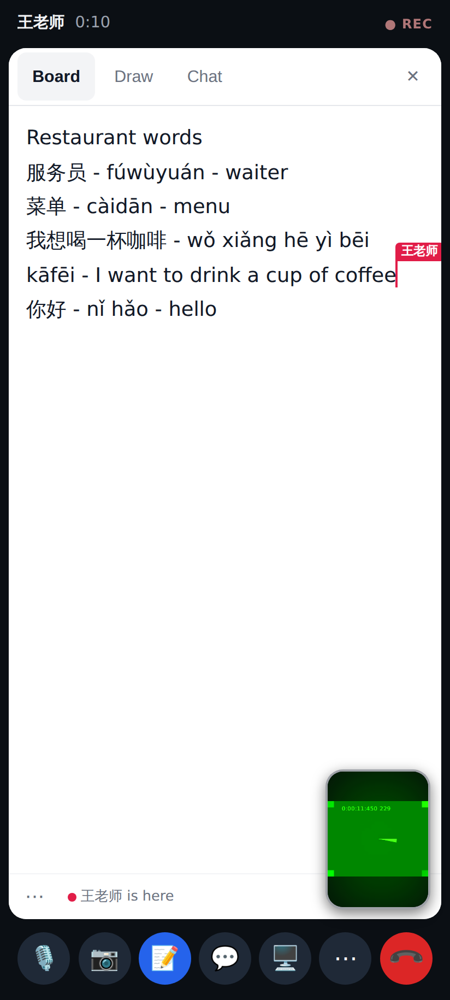
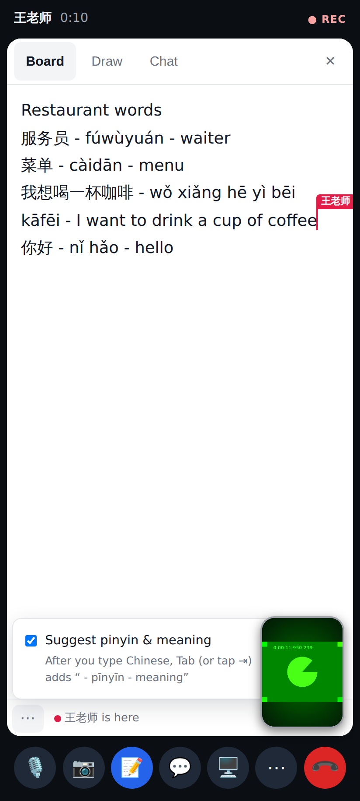
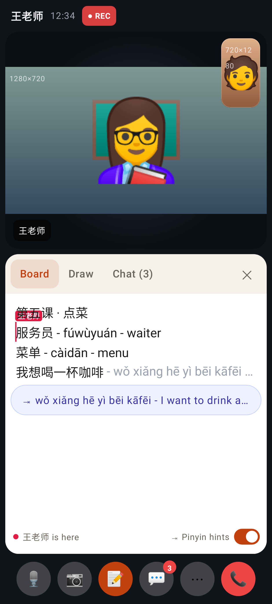
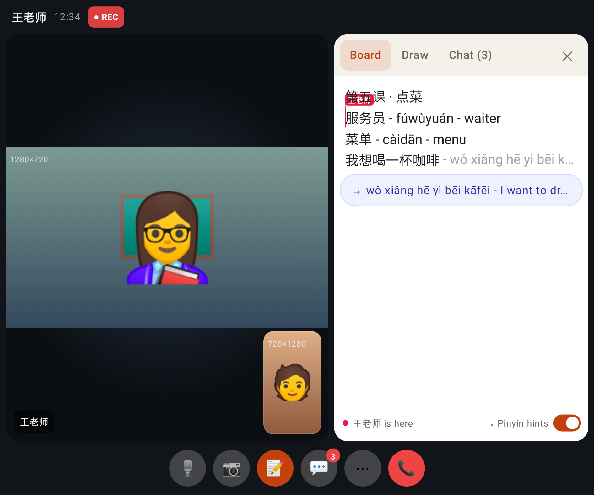
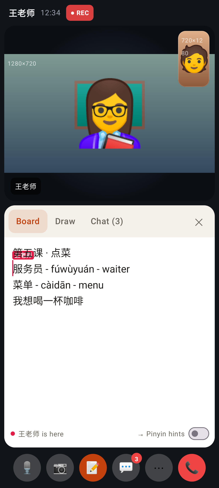

# Video call board: tab-complete pinyin + meaning

Web (tutor on desktop, student on a phone at 412×915) and the Lab app (Roborazzi).

Desktop: after typing 我想喝一杯咖啡 and pausing, the grey ` - pīnyīn - meaning` appears after the caret with a small Tab hint.

Tab typed it in — it is ordinary board text, the student sees it too.

Phone (touch, no Tab key): the ghost plus a "⇥ nǐ hǎo - hello" chip under the caret; a tap accepts. The tutor's caret (red flag) now lines up on phones too.

After tapping the chip.

The board's ⋯ (bottom left, clear of the self-view): "Suggest pinyin & meaning", on by default, remembered per user.

Lab app, folded: grey offer after the caret, the "⇥ …" chip under it, and the "⇥ Pinyin hints" switch in the board footer.

Lab app, unfolded.

Lab app with Pinyin hints switched off.
