# In-call activities: who may act, roles, words you needed

Phone (412×915, 2×) — student Jerome started Describe & guess; tutor 王老师 guesses.

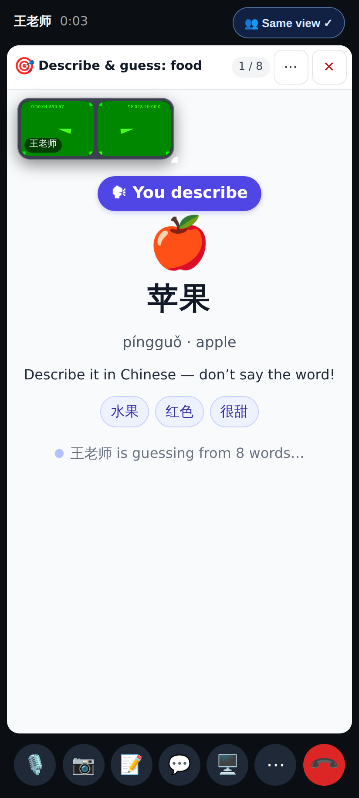
The describer sees the word and the hints — never the answer choices.

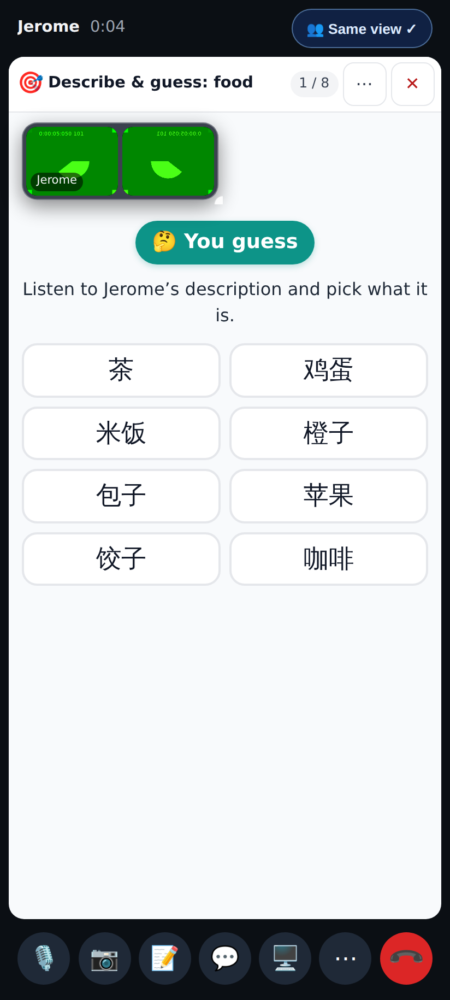
The guesser picks from eight (other foods + same-category distractors).

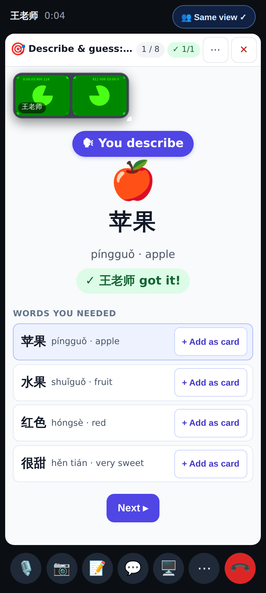
The verdict names the person who picked; "Words you needed" with + Add as card; the describer presses Next.

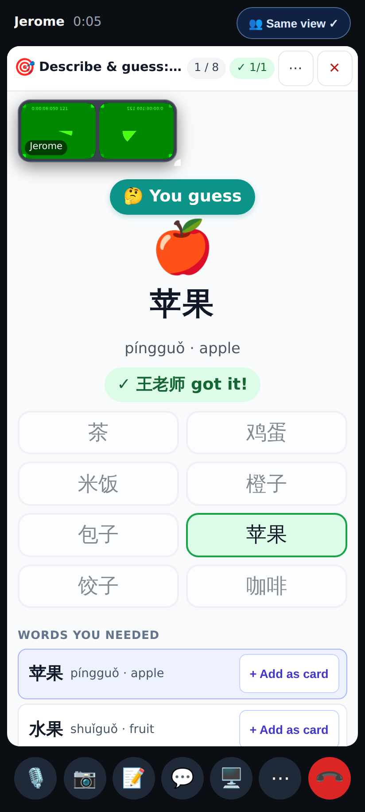
The guesser's side at the reveal.

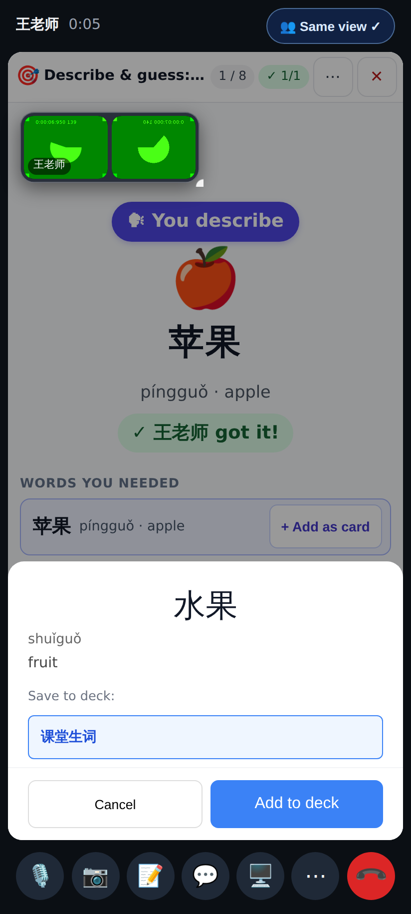
+ Add as card opens the usual add sheet (top deck preselected).

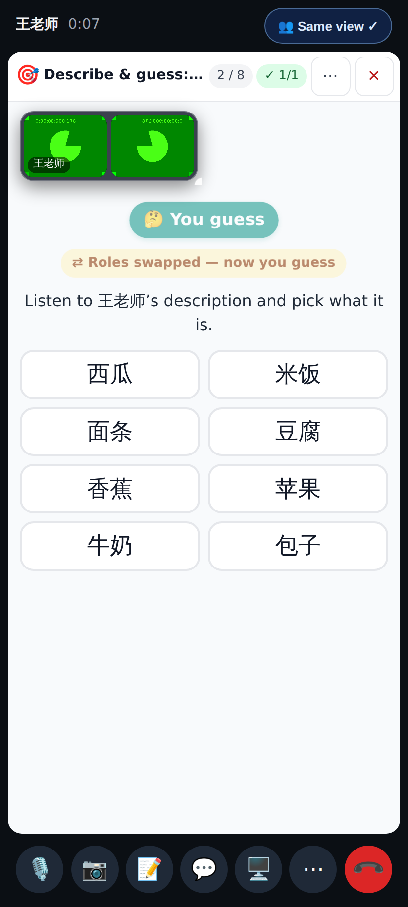
Big role badge, plus "Roles swapped — now you guess".

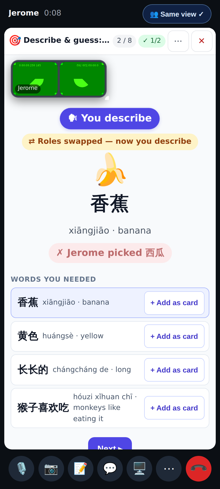
After the swap the student's pick is attributed to him.

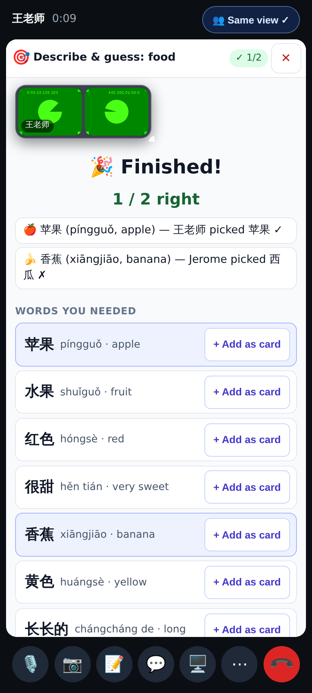
The summary lists who picked what and the words from every round played.

Wide (1280×800, 2×):

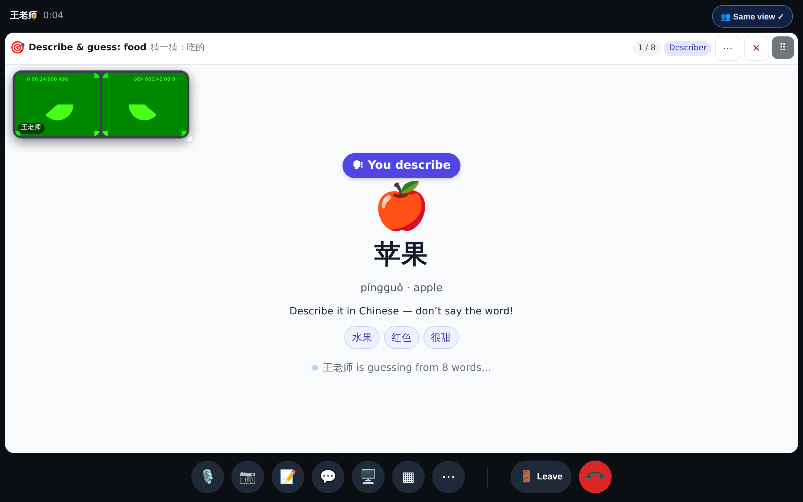
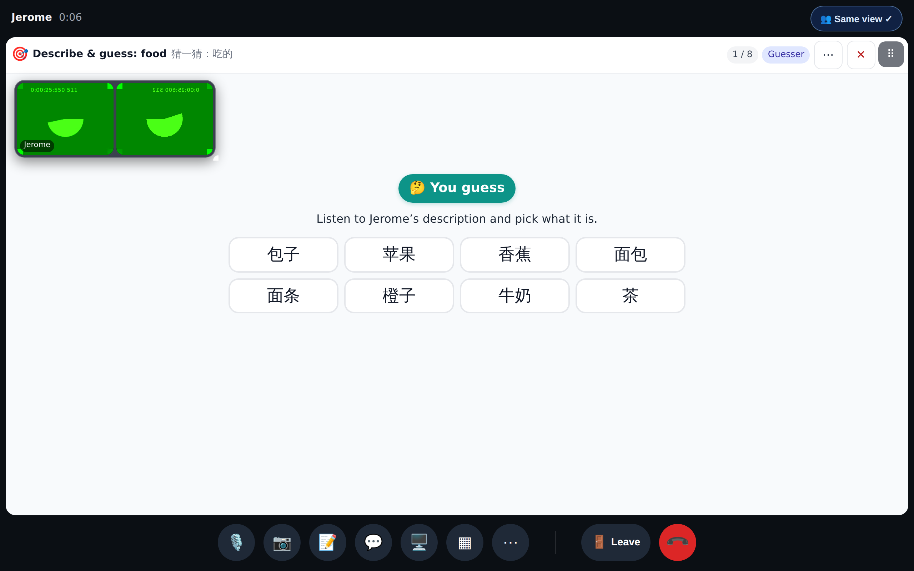
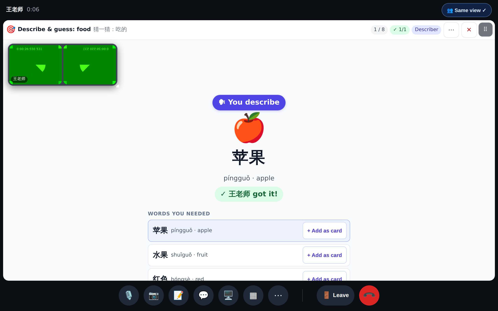
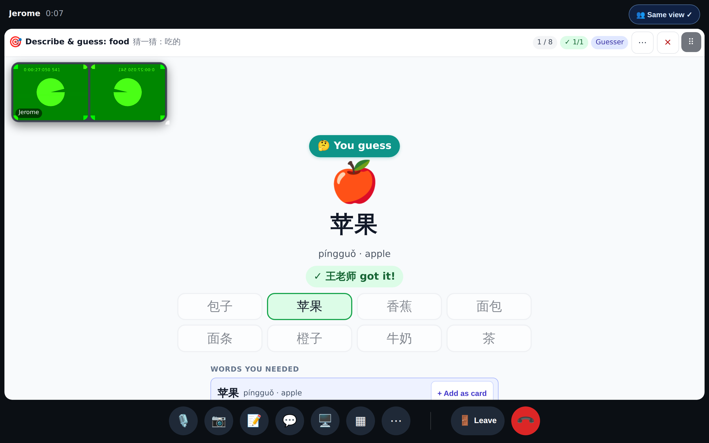
