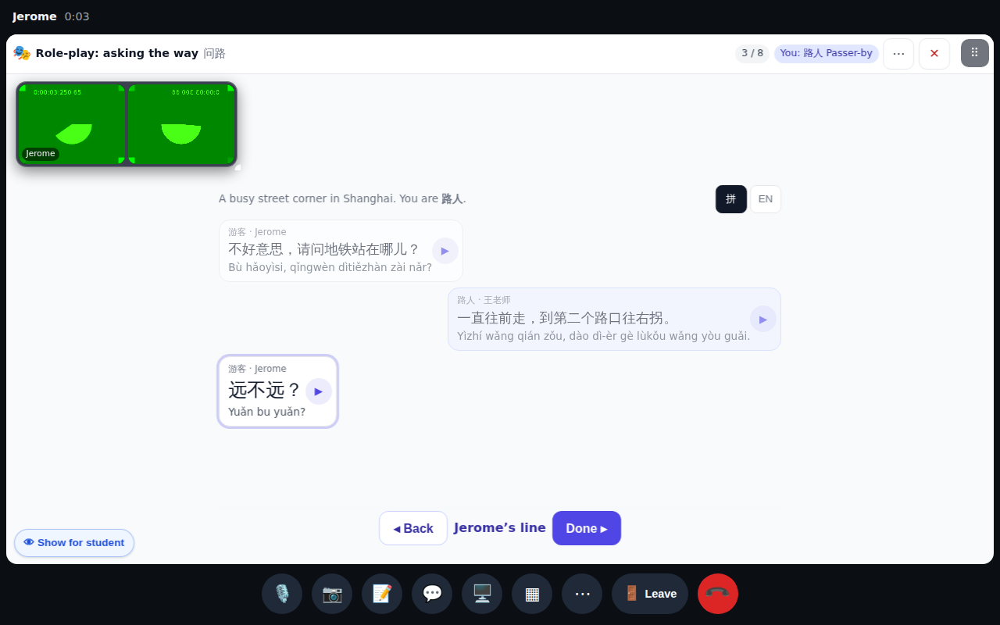
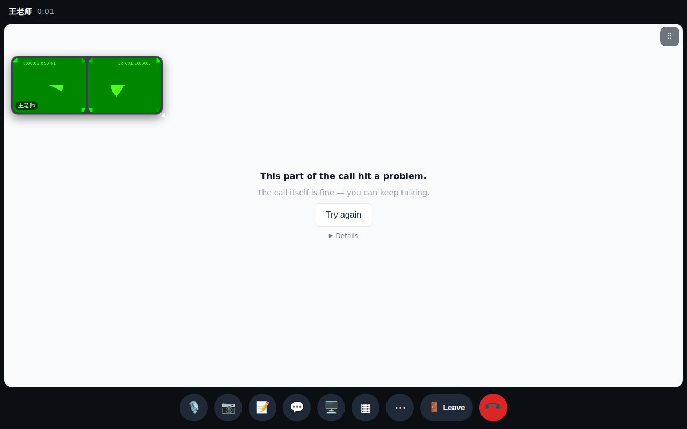

# Call crash fix — "Couldn't open the call — n is not a function"

Desktop 1280×800, tutor + student call, scroll methods returning a Promise (as in current Chrome).

The role-play advances line by line (each new line scrolls into view) — this used to crash the whole call.

If one tile ever fails again (forced here), only that tile shows "This part of the call hit a problem · Try again"; cameras, controls and the call carry on.
