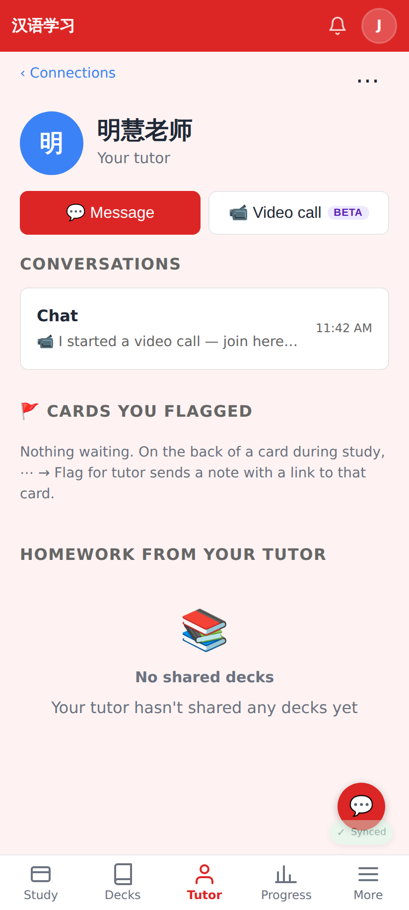
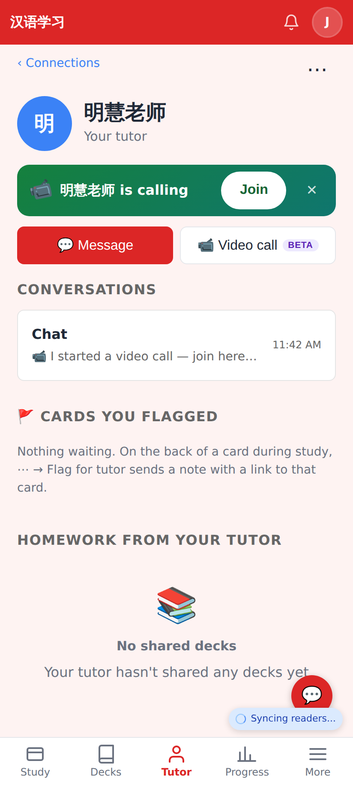
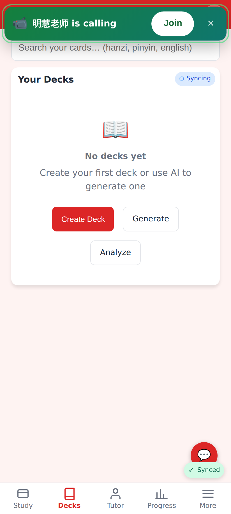

# Call presence — screenshots (phone, 412×915 @2×)

Local worker + app; the tutor (明慧老师) created a call, the student (Jerome) looks at her page.

The call row is `live` but nobody is connected to it: no "is calling" banner (before: shown for up to 4 h).

She has joined: "明慧老师 is calling — Join", now with ✕ to hide it (inline banners were not hideable before).

The same call as the bar across other pages.

She left the call page (Leave / closed the tab → `leave` + beacon): the banner is gone on the next look, while the call itself ends 3 min later.
