# Calls: Show for student clear of the tools · ☰ Contents for materials

Web app, tutor on a PC (1280×800 @2×) and phones (412×915 @2×); Lab app (Roborazzi).

## Show for student no longer covers the tile's tools

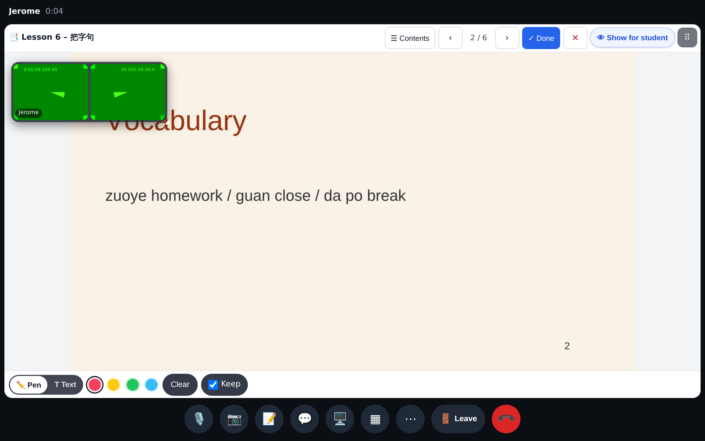
The tutor's "👁 Show for student" is now in the tile's top-right control row (before ⠿); the Pen / Text bar at the bottom is free.

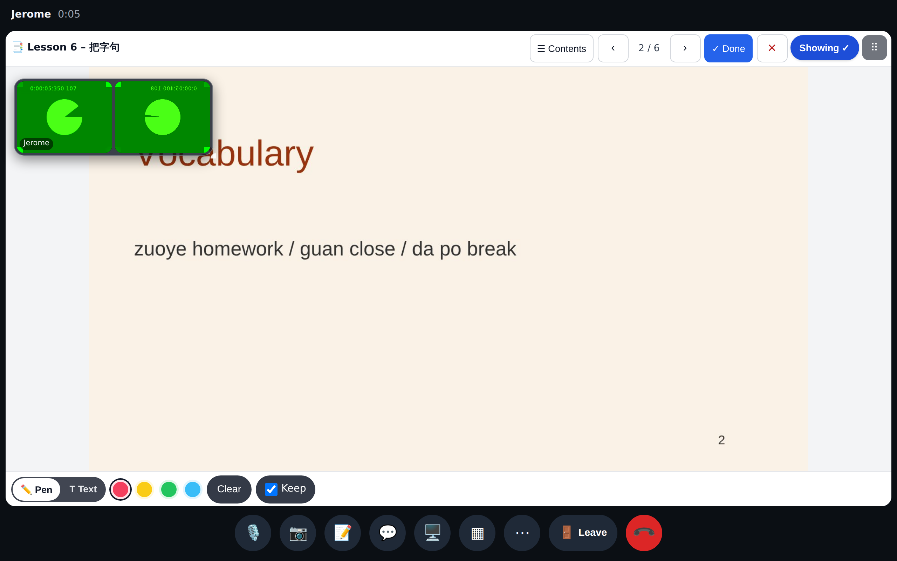
After the press: "Showing ✓" in the same place.

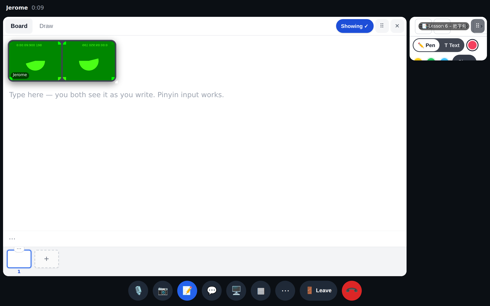
The board: "Showing ✓" sits in the control row next to ⠿ ✕ (it used to overlap them).

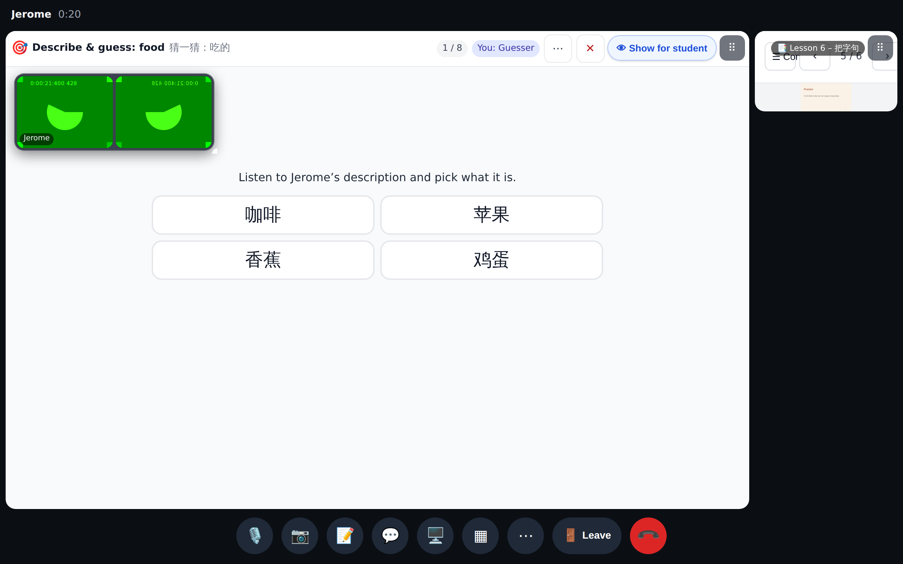
An activity: in the header row instead of the bottom-right corner over the answers.

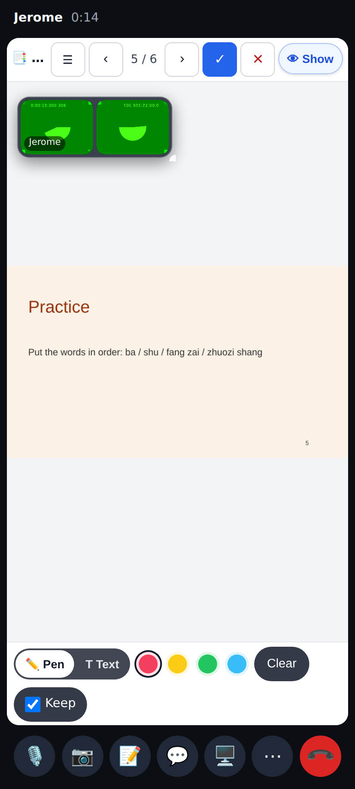
Phone: "👁 Show" (short label) at the end of the material bar; the drawing tools stay clear.

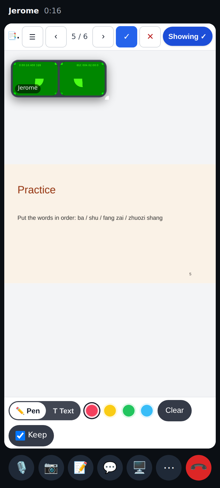
Phone, after the press.

## ☰ Contents

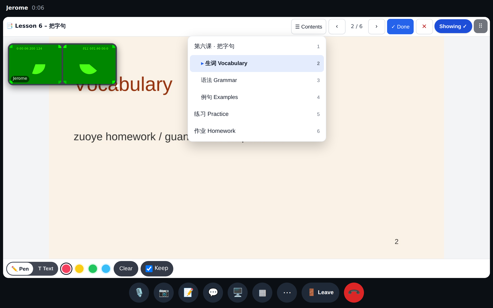
In the call: ☰ Contents opens the PDF's outline (two levels), the section on show marked; a tap turns the page for both people.

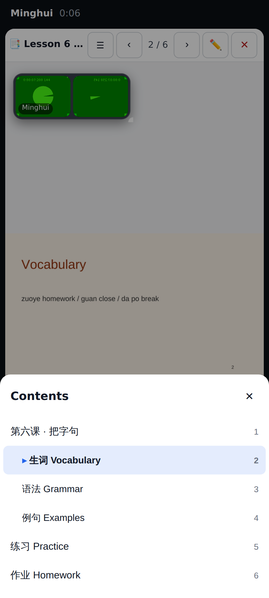
The student's phone: the same list as a bottom sheet.

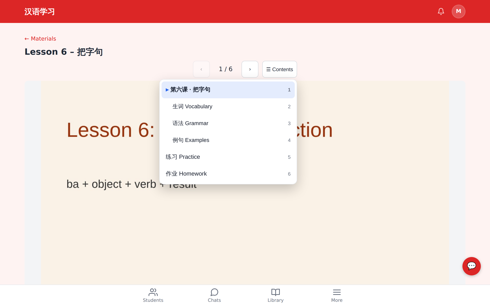
The /materials/:id viewer has it too.

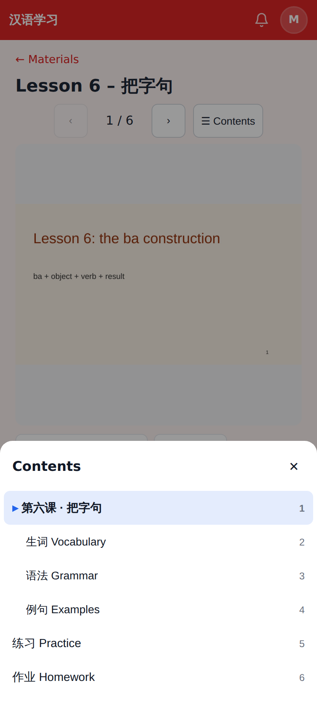
The viewer on a phone.

## Lab app

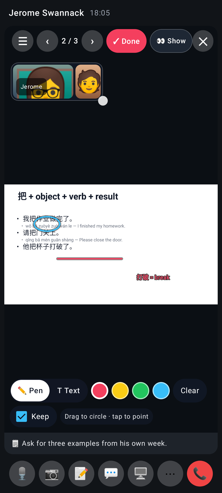
Lab: "👀 Show" in the material bar, not over the page.

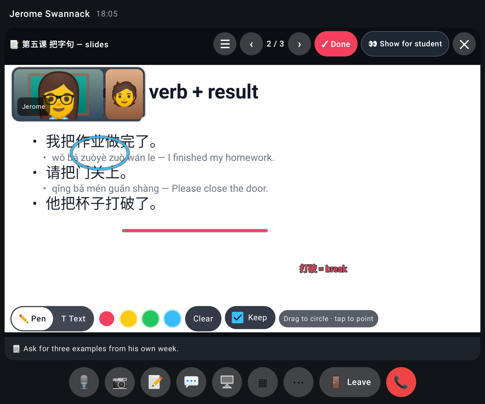
Lab, unfolded: full label in the bar.

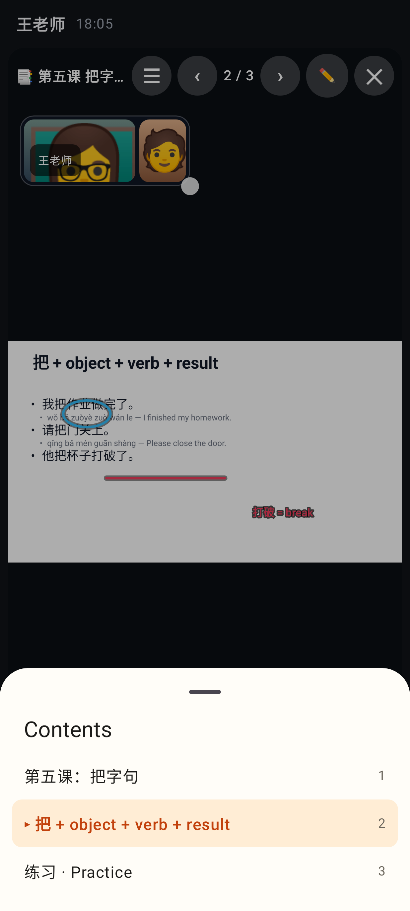
Lab: ☰ Contents in the call (slide titles of a PowerPoint).

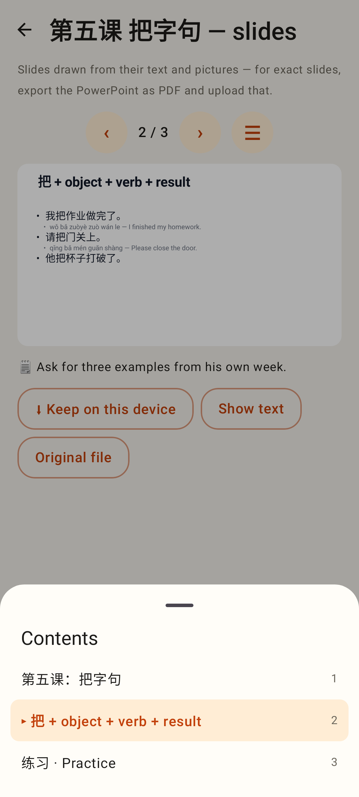
Lab viewer: Contents.

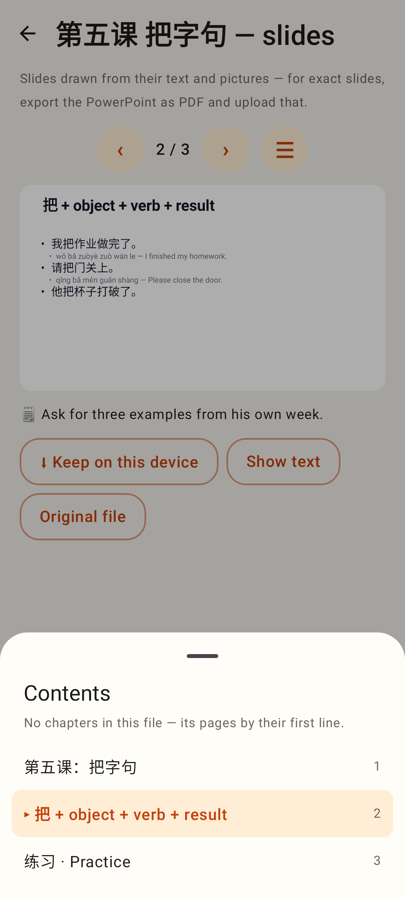
Lab viewer, nothing stored (an older upload): the pages by their first line.
