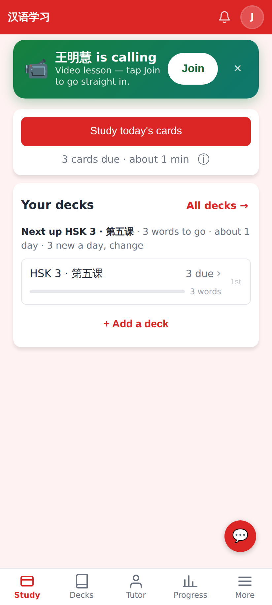
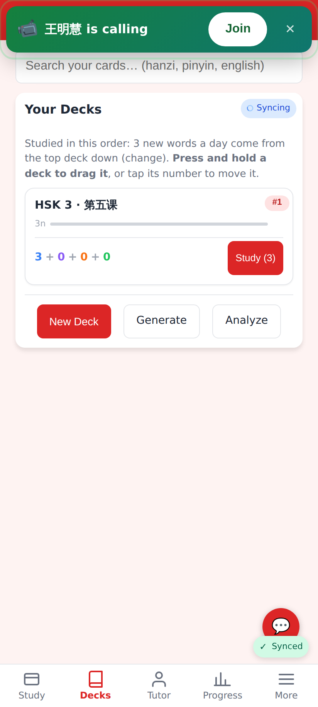
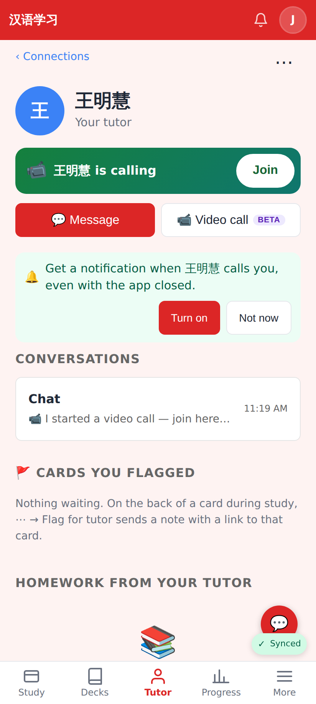
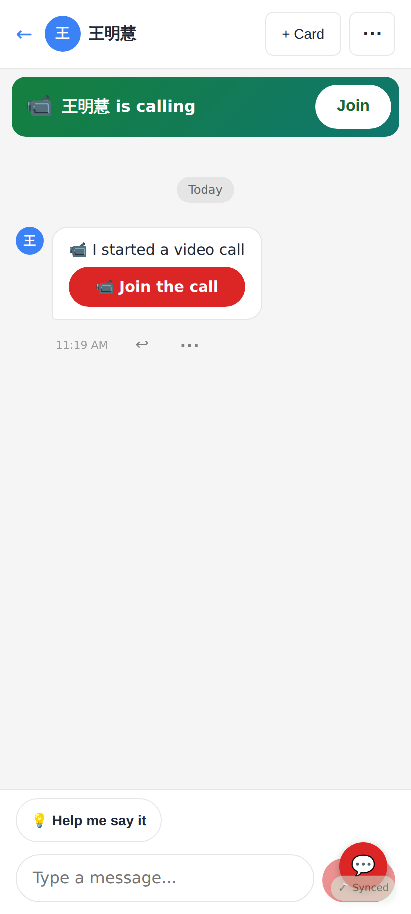
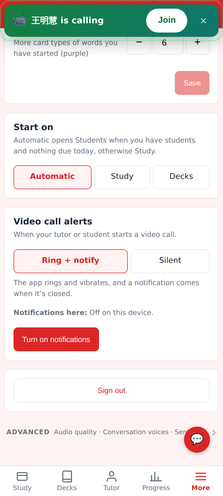
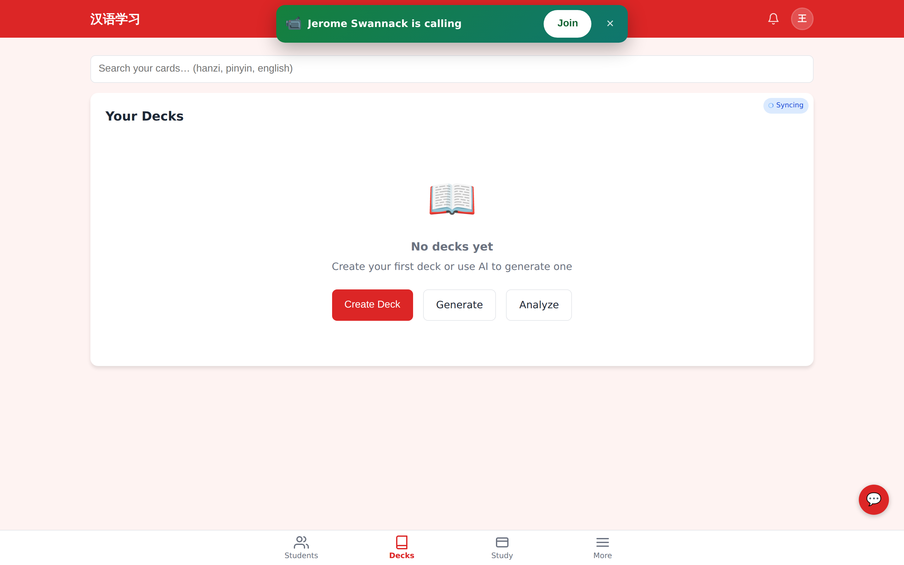
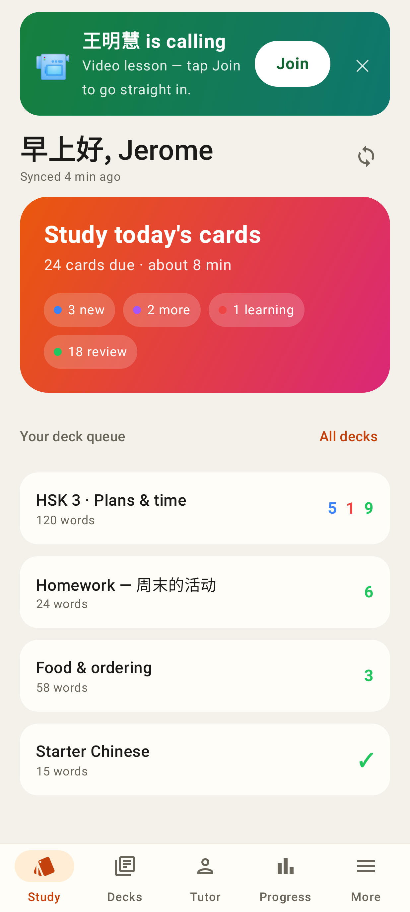
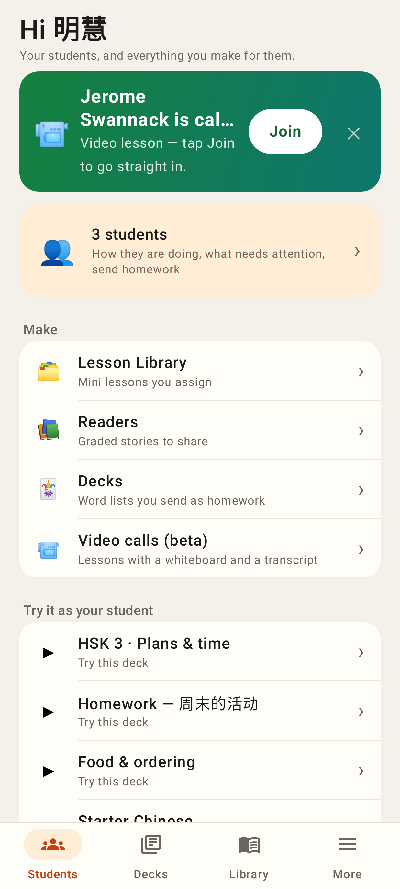
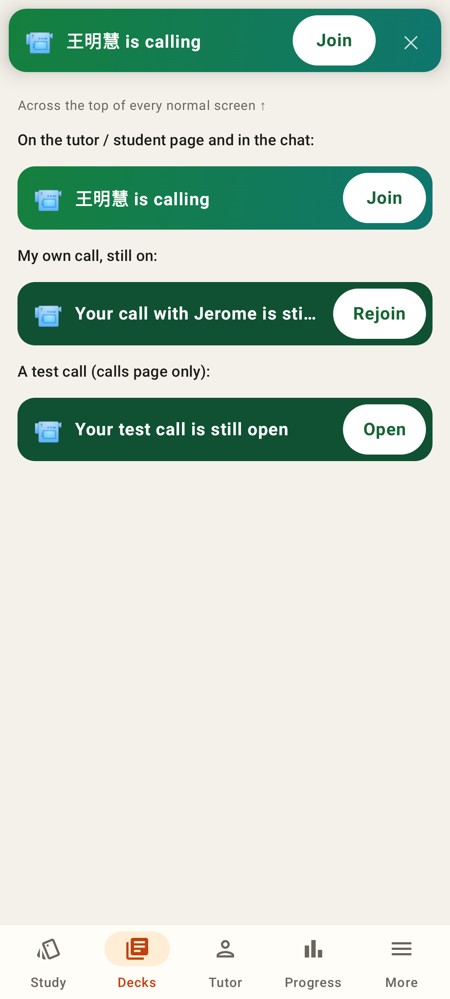
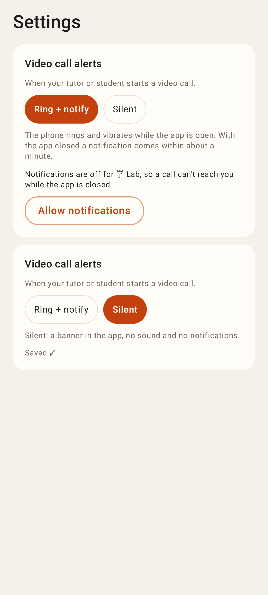

# Finding the call

The tutor (王明慧) started a call through the real API. Web shots are from the running app at 412×915 (2×), with one desktop shot at 1440×900.

Home: the first thing on the page is a big "王明慧 is calling — Join" card.

Any other normal page (here Decks): a bar slides in across the top with Join and ✕.

The tutor page shows the call inline, plus a one-time "🔔 Get a notification when 王明慧 calls you" nudge that asks for notification permission from a tap.

The chat shows the banner under its header.

Settings → Video call alerts: Ring + notify / Silent, and whether this device gets notifications (Turn on / Send a test / Turn off here).

The tutor's desktop when her student calls: the same bar at the top.

## Lab app (Roborazzi)

Home card.

The tutor account's home.

The top bar and the inline banner (incoming, rejoin, test call).

Settings → Video call alerts (ring with notifications off, and silent).
