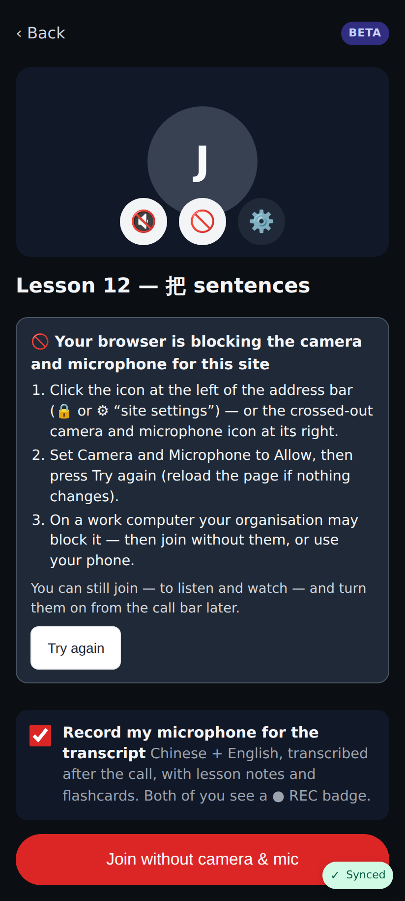
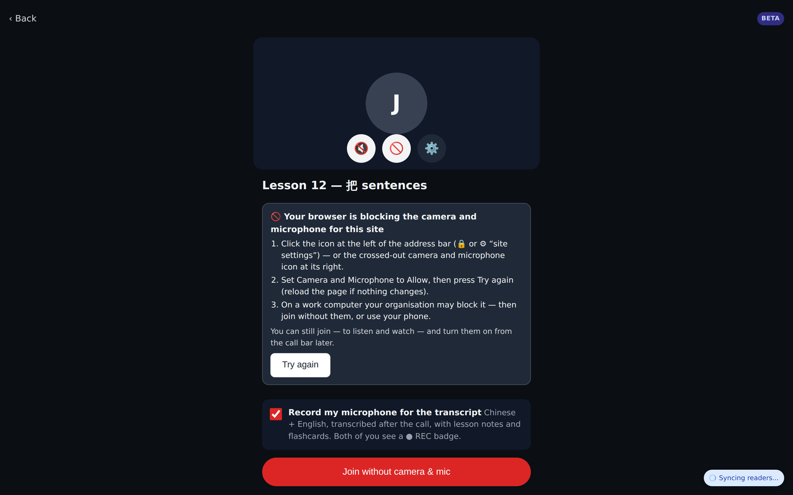
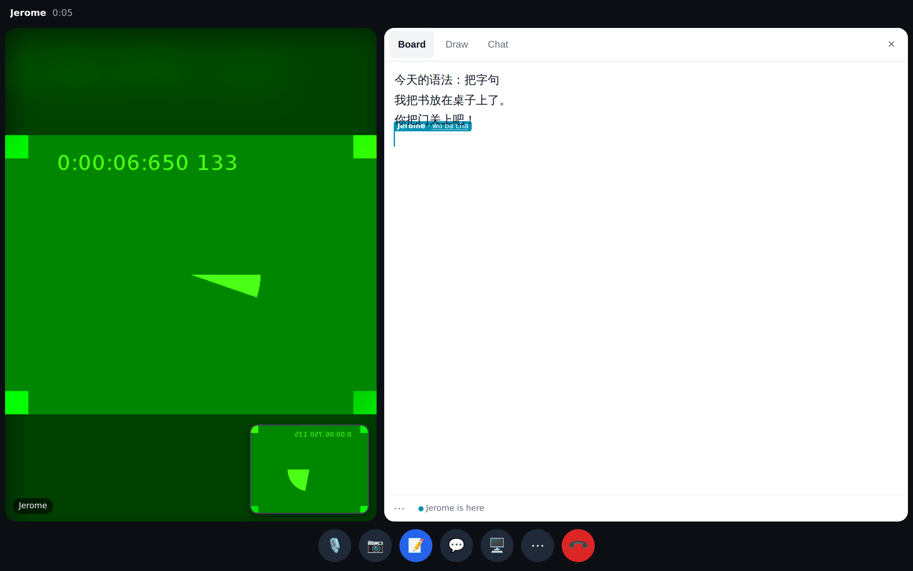
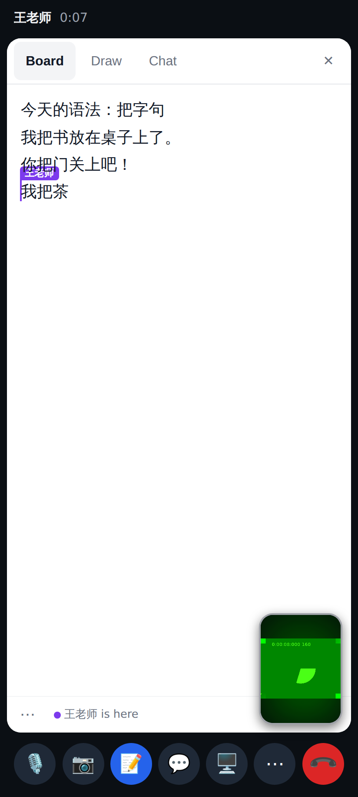
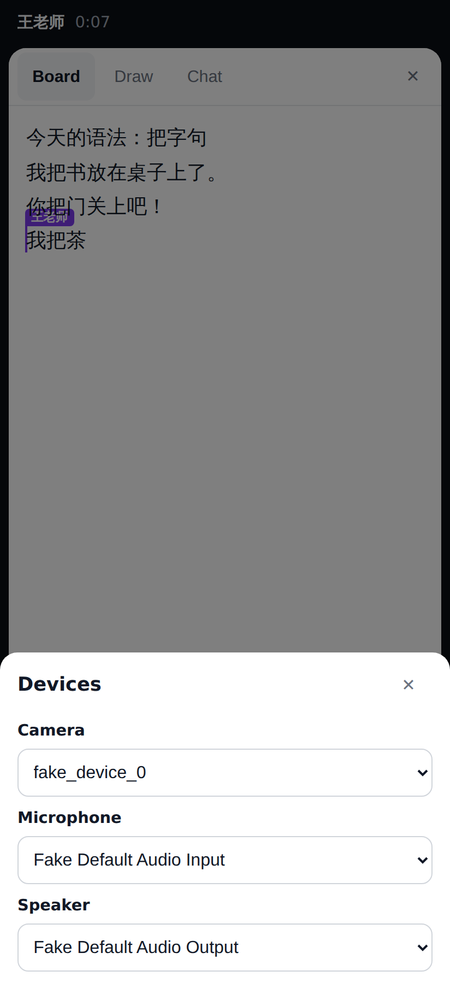
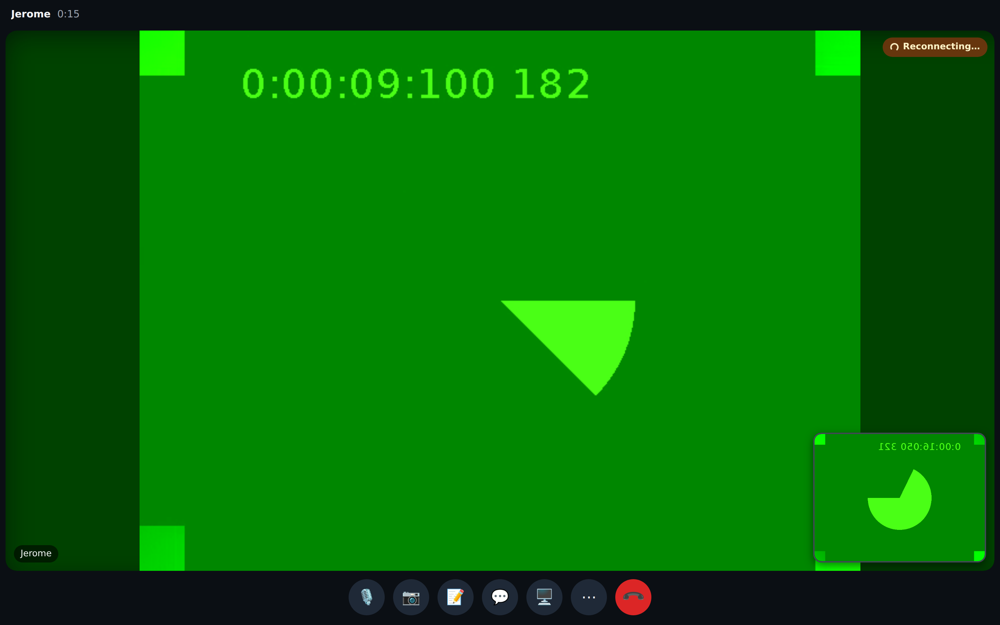
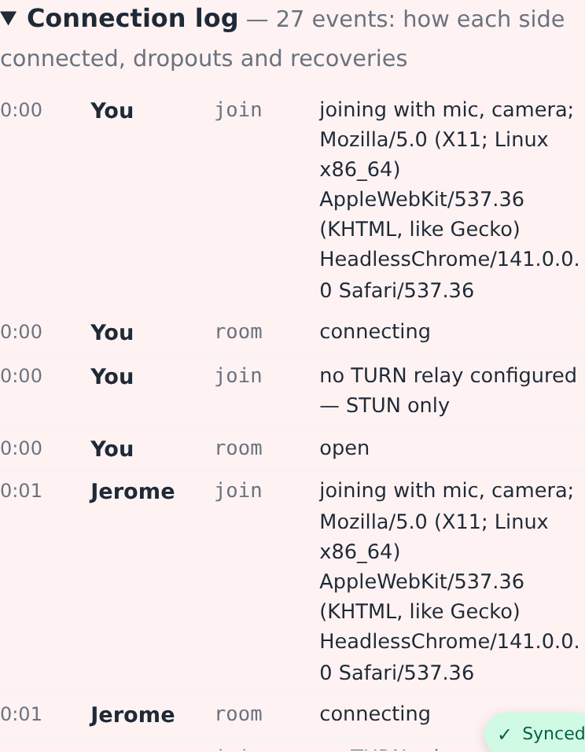

# Video calls round 2 — PR A (quick fixes)

## Web

Camera + mic blocked: why, the exact Chrome steps, Try again — and Join still works ("Join without camera & mic").

The same at 1440×900 (the tutor's desktop).

Browser in dark mode: the board stays light paper with dark ink. Jerome is mid-pinyin — "wo ba cha" shows in his caret flag before he commits.

The phone side after committing 我把茶.

⋯ → Camera, mic & speaker (remembered on the device).

The student's connection dies: the tutor keeps the last frame with a small "Reconnecting…" badge instead of a blank tile.

Review page → Connection log: joins, socket status, TURN offered or not, ICE/pc states, restarts, route used.

## Lab app

Screenshots from Roborazzi in [lab/](lab/).
