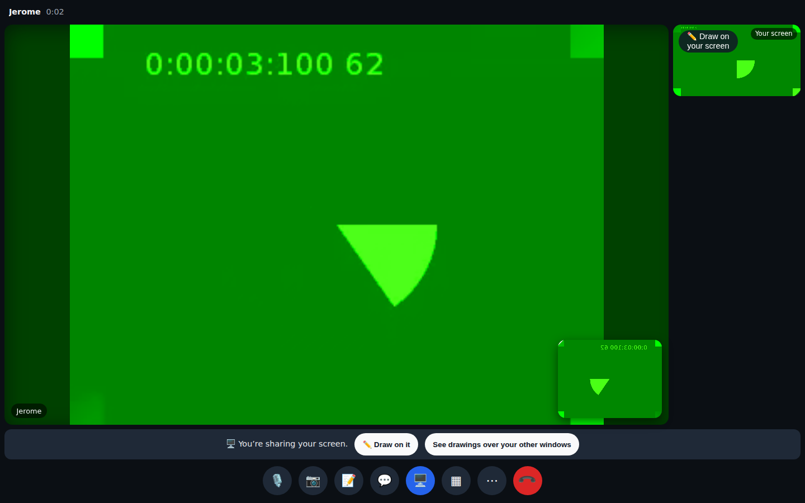
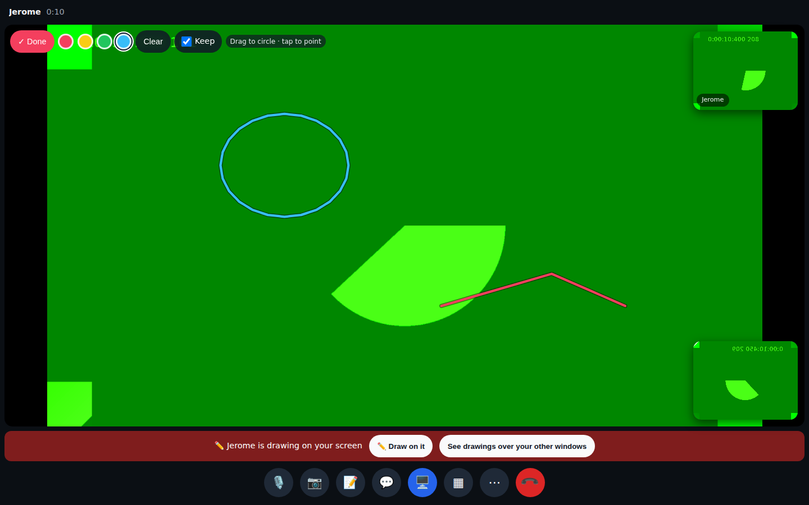
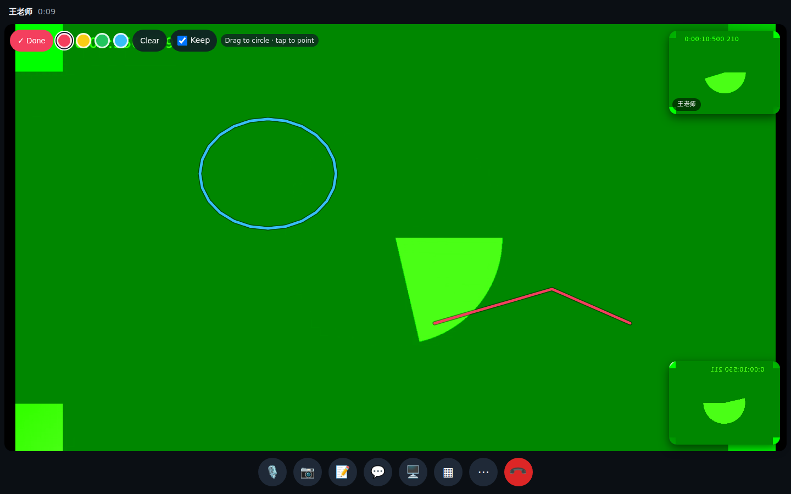
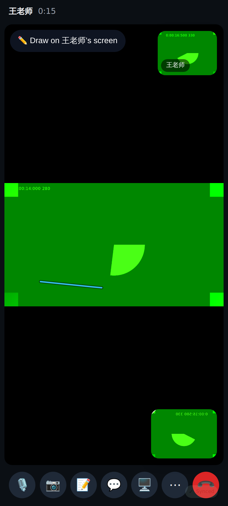

# Video calls round 2 — PR C (the sharer draws on their own screen)

Sharing: the share bar now offers ✏️ Draw on it (plus the mini window for other apps).

The tutor's own screen on the stage with the pen on: their blue circle and Jerome's red line, Keep on.

Jerome's view of the same screen: both people's strokes.

On the phone: a new stroke from the tutor arrives on the shared screen (strokes aren't stored, so a rejoin shows only new ones).

## Lab app

See [lab/README.md](lab/README.md) — the sharer drawing on their own screen (folded / unfolded), the share bar with Draw on it, the viewer with both colours and Keep on.
