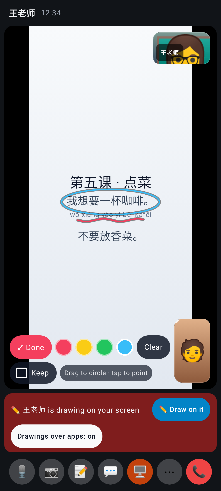
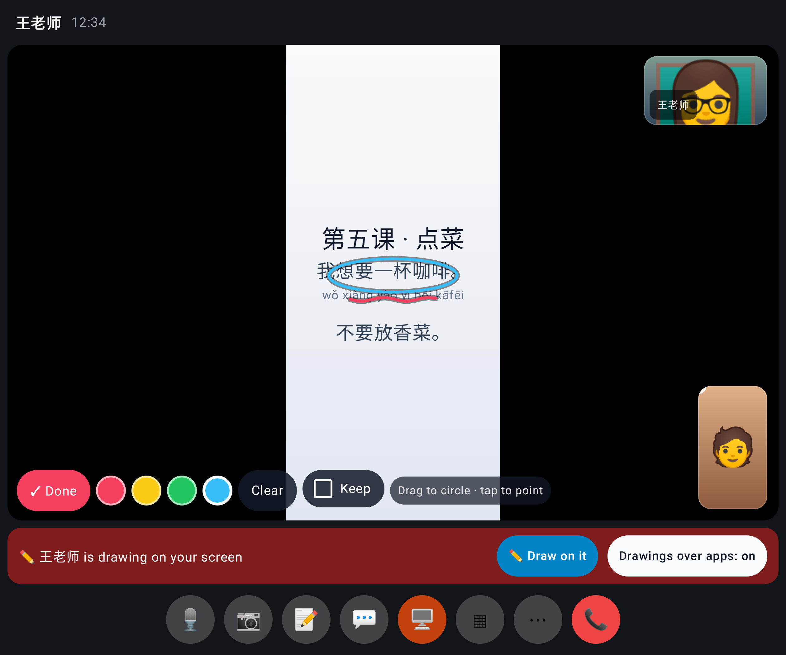
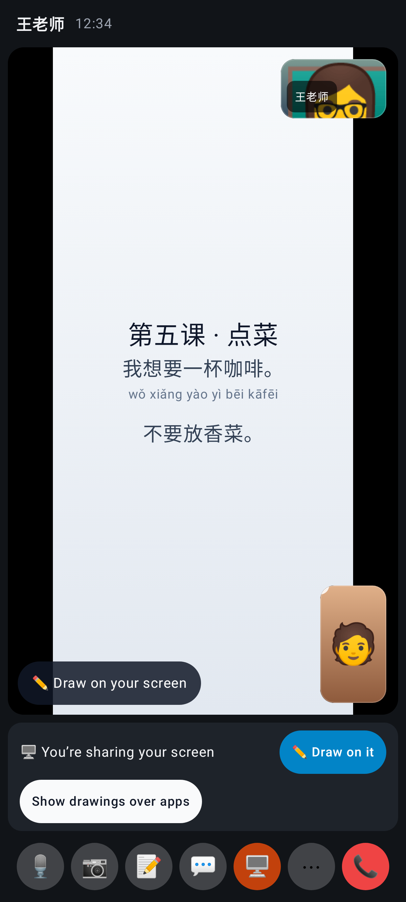
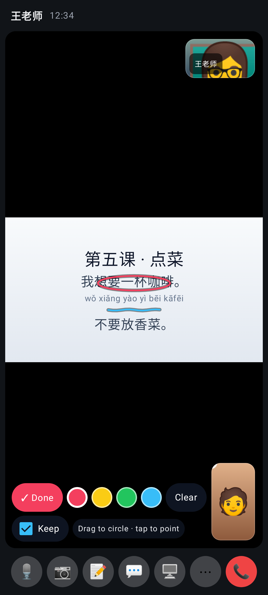
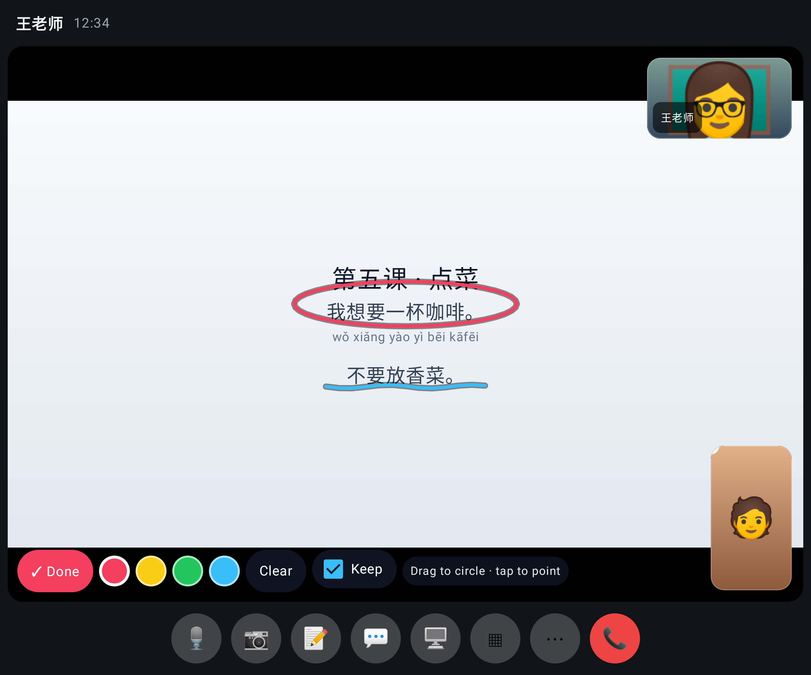

# Video calls round 2 C — Lab app (native)

The sharer's own screen on the stage, drawing on (blue pen by default), the tutor's red underline too, Keep off (folded, 412 dp).

The same unfolded (840 dp): tools in one row, share bar with "✏️ Draw on it".

Sharing, not drawing yet: "✏️ Draw on your screen" on the tile and "✏️ Draw on it" on the share bar.

The viewer on the tutor's screen: their own red circle and the sharer's blue line, Keep on (nothing fades).

The same unfolded.
