# Video calls round 3 — board pages across lessons

Web: two browsers in one call (Chromium fake camera), a tutor (王老师, desktop 1440×900) and a student (Jerome, phone 412×915 @2x).

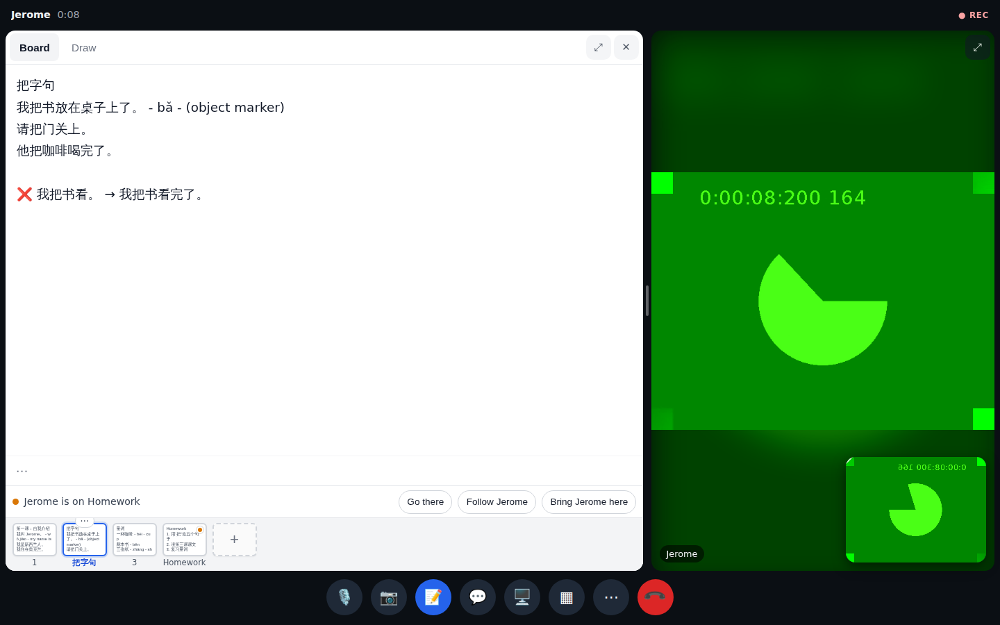
The tutor's board: four pages in the strip (the current one highlighted, Jerome's dot on "Homework"), and the bar "Jerome is on Homework · Go there · Follow Jerome · Bring Jerome here".

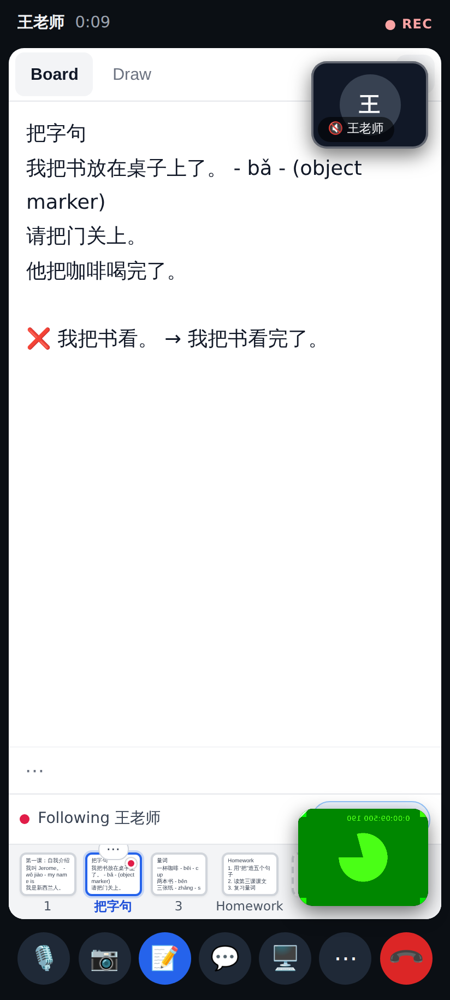
The student follows 王老师 — their view jumps with hers ("Following 王老师 · Stop following"). (The floating cameras over the board are round 2's layout; PR 2 moves them into the faces pair.)

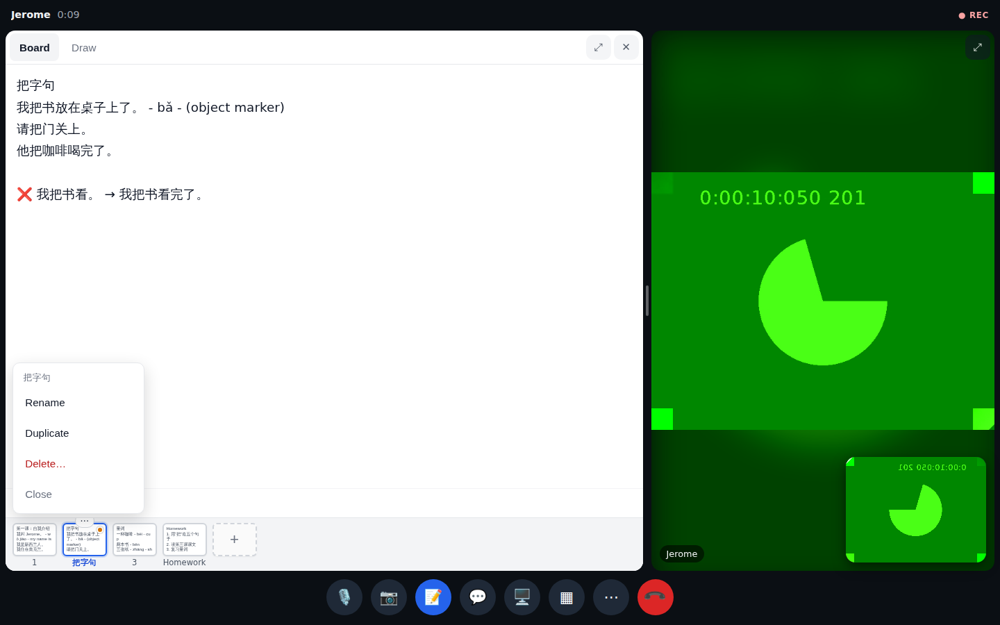
⋯ on the current page: Rename, Duplicate, Delete….

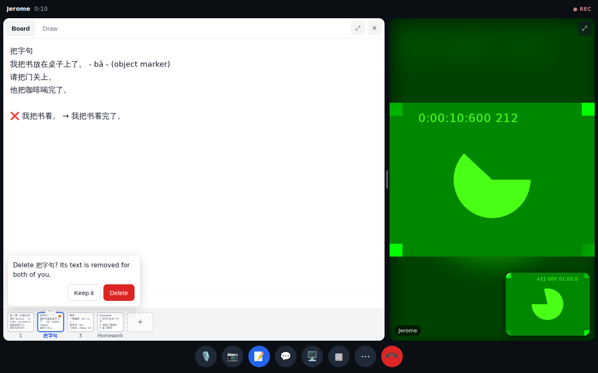
"Delete page N? Its text is removed for both of you."

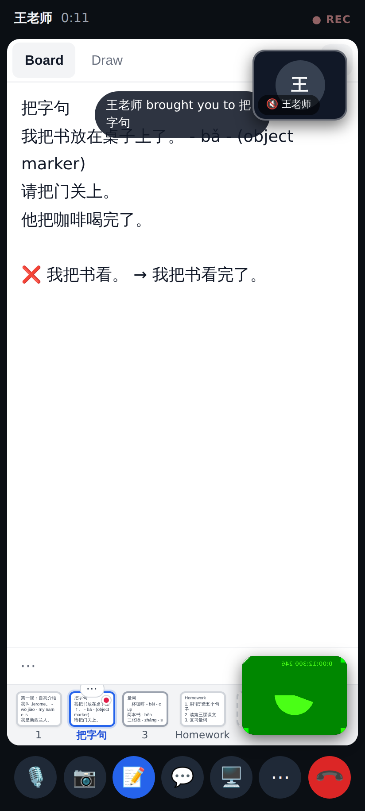
The tutor pressed "Bring Jerome here": the student lands on her page with "王老师 brought you to 把字句".

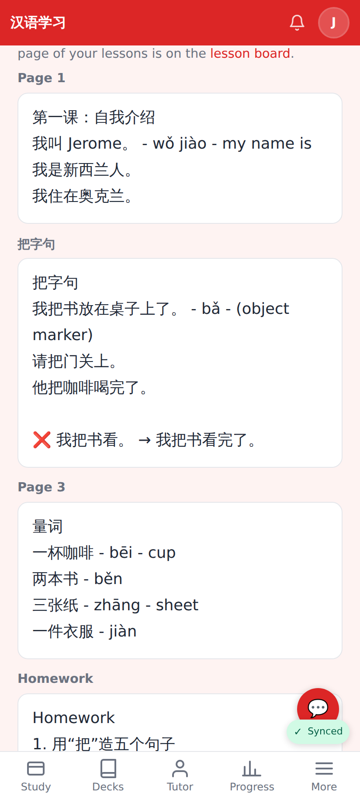
After the call, the review page shows the pages written in that call, each with its number / title.

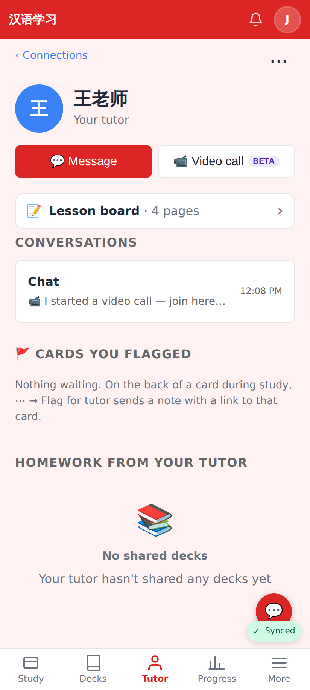
"📝 Lesson board · 4 pages" on the tutor / student page.

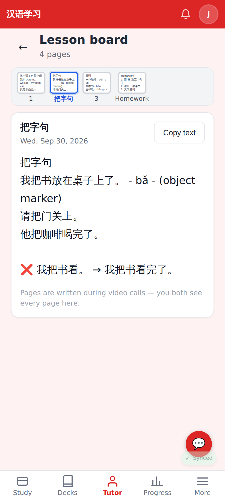
The Lesson board (`/connections/:relId/board`): every page, read-only, offline.

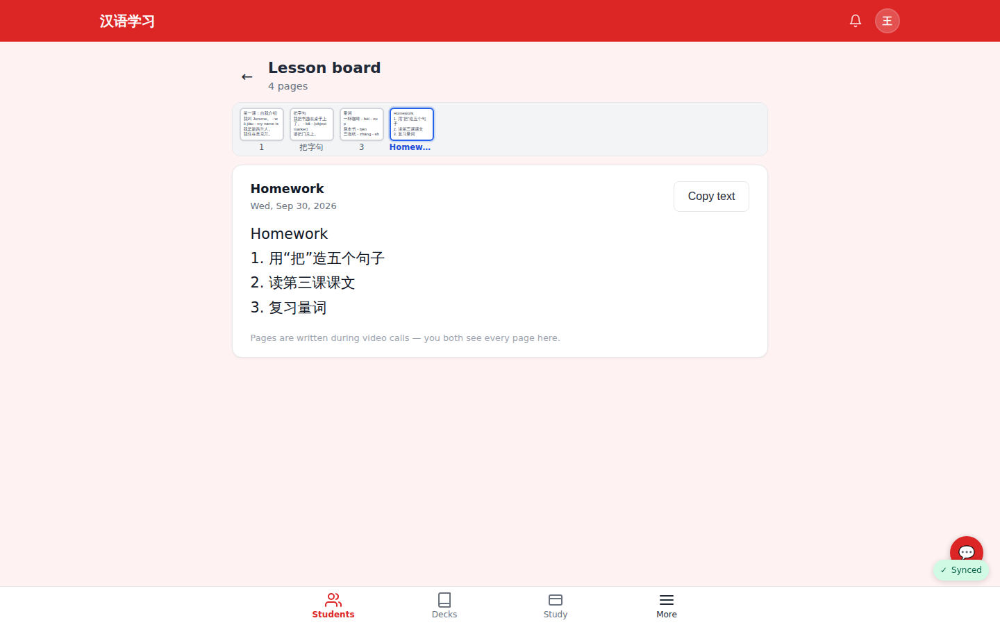
The same on desktop.

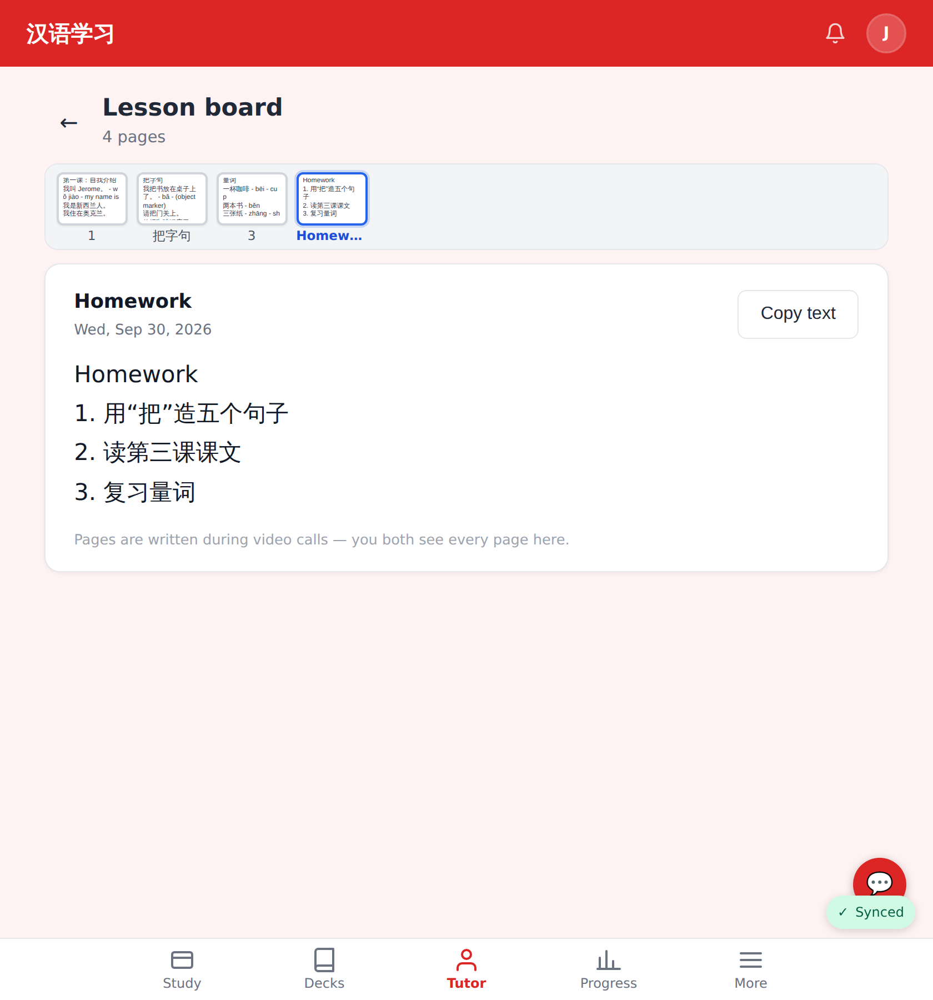
Pixel Fold unfolded (840 px).

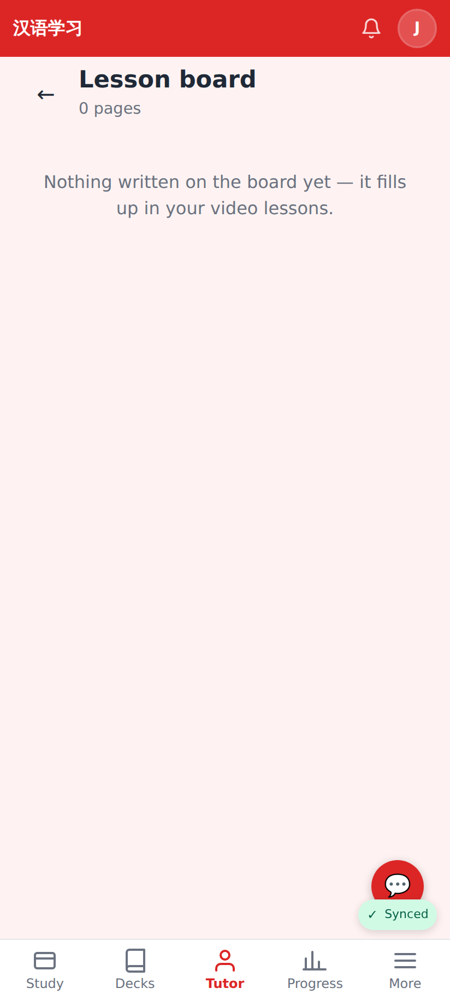
Nothing written yet.
