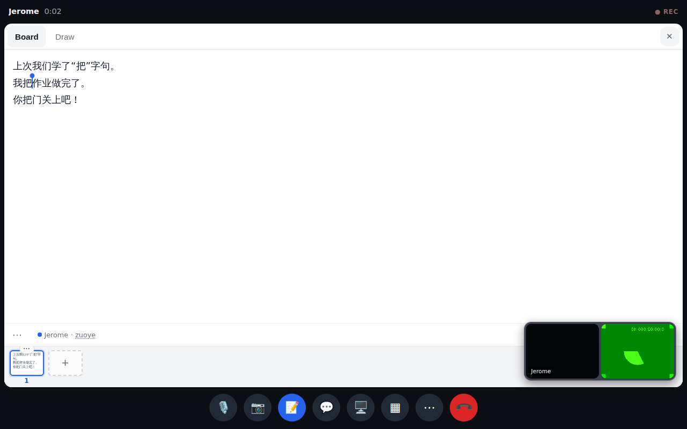
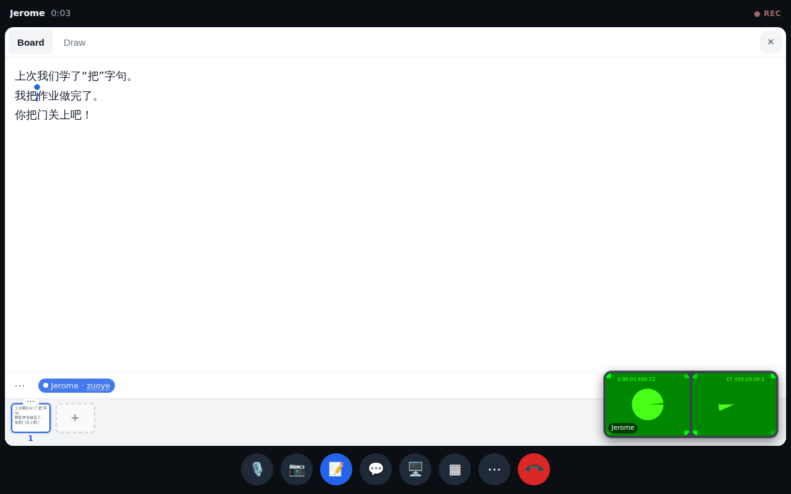
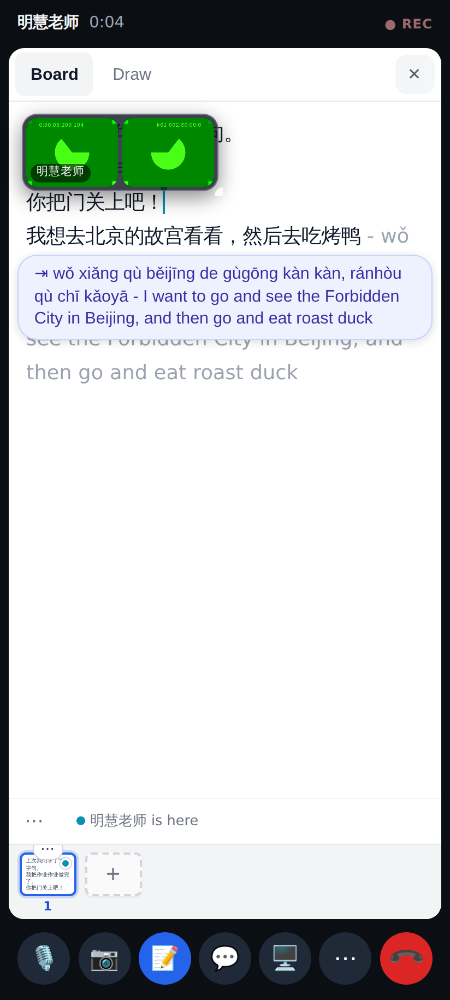
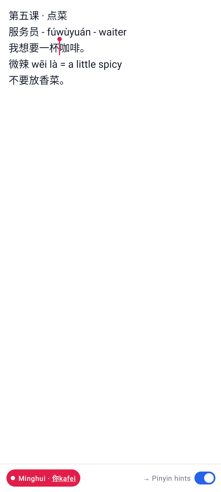
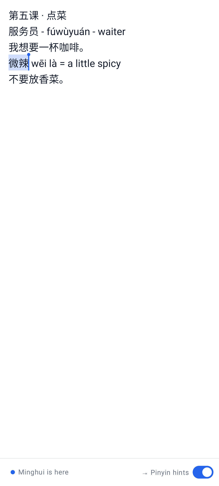
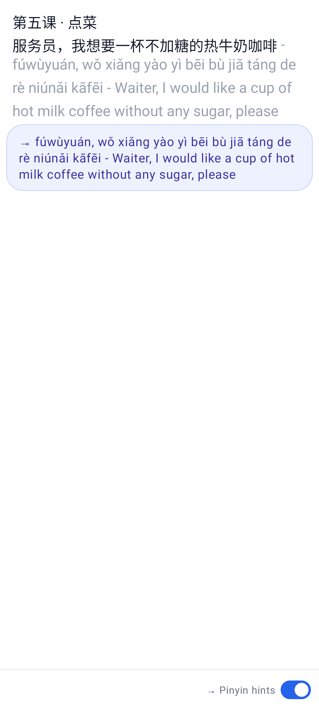
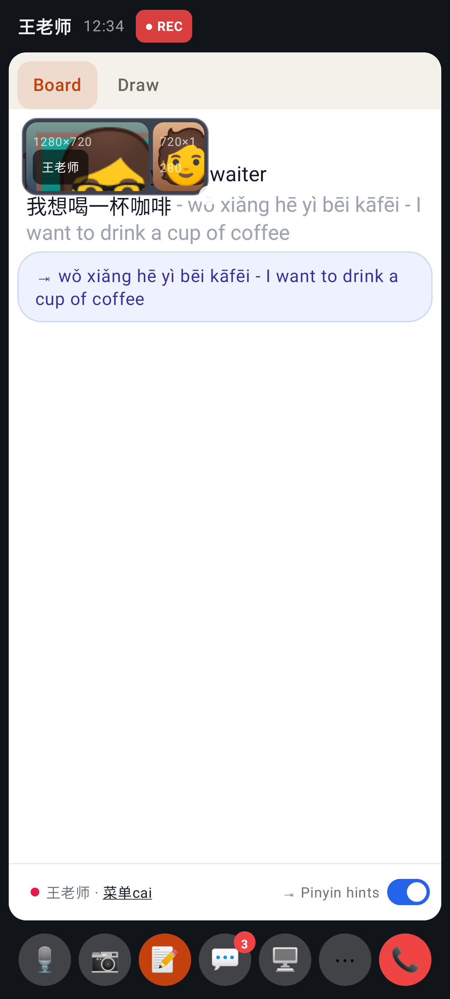
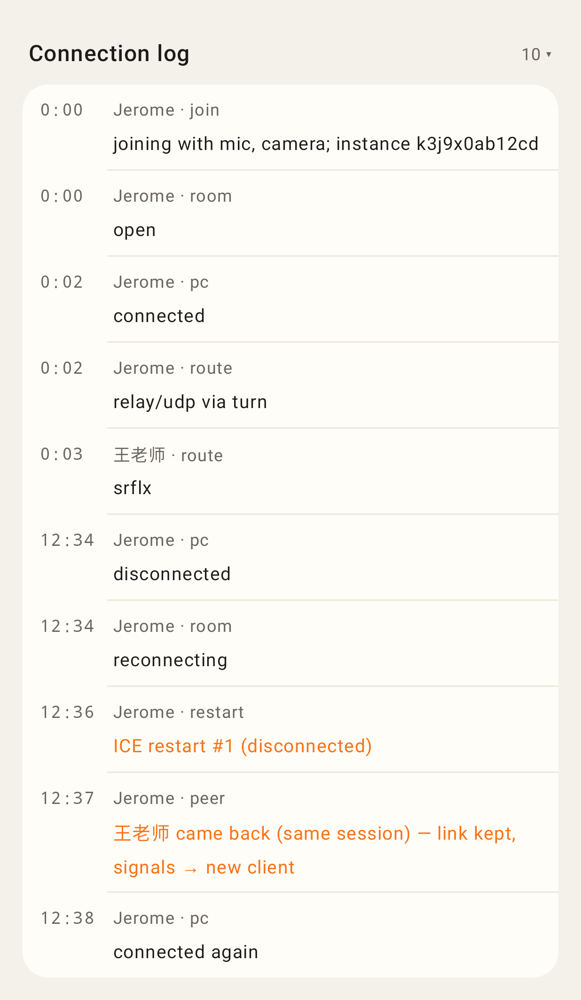

# Calls round 4 — PR 1 (bug fixes)

Desktop: Jerome's caret on Minghui's board is a thin line with a small dot — nothing covers the line above. While he composes pinyin, "Jerome · zuoye" shows in the strip under the board.

Hovering near the dot lights his name up in the strip (in his colour) — still nothing over the text.

Phone: tab-complete for a whole sentence now carries its complete translation, and the chip wraps instead of cutting it off.

## Lab app

Lab: the other person's caret is a line + dot; tapping it lights "Minghui · 你kafei" up in the people row.

Lab: their selection, with the caret dot — nothing over the text.

Lab: a sentence's whole gloss wraps in the ghost and the chip.

Lab: the board while the other person composes.

Lab review: the room's own lines (who left / ended the call) in bold.
