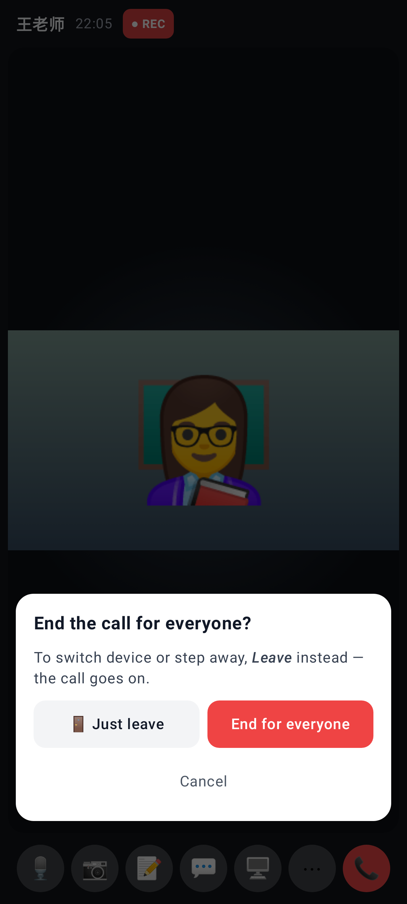
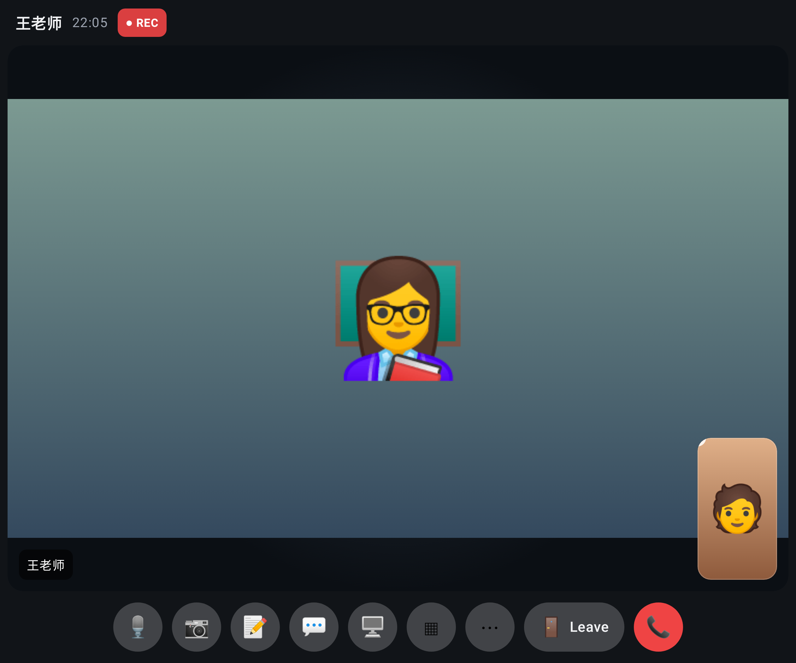
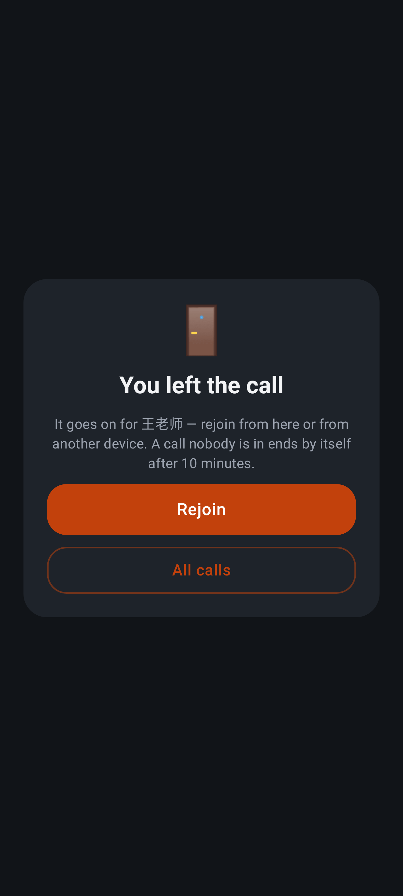
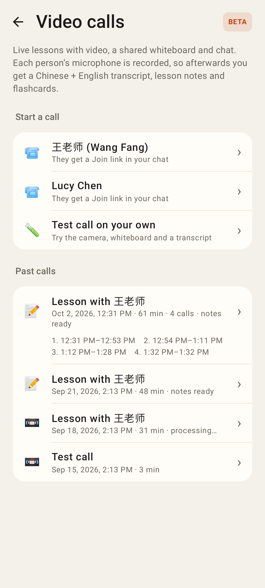
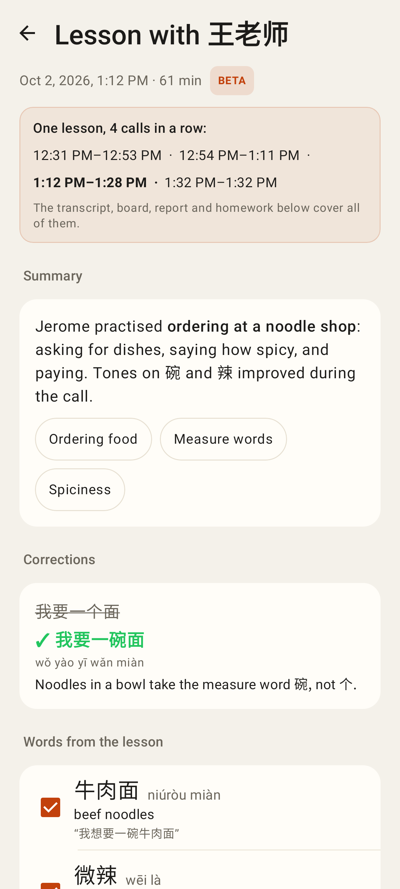

# Calls round 4 — PR 2 (ending and lessons)

Desktop: **🚪 Leave** (the call goes on) sits next to the red End; End asks first and offers "Just leave".

Phone: the bar is full, so Leave is in ⋯ and in End's confirm ("Just leave").

After leaving: the call goes on for the other person; Rejoin comes straight back (devices restored).

Past calls: three calls within 20 minutes are ONE lesson, its calls listed underneath.

The review page covers the whole lesson (transcript, board, report, homework once).

## Lab app (android-lab)

Lab, phone: End asks first — 🚪 Just leave / End for everyone / Cancel.

Lab, unfolded: 🚪 Leave sits next to the red End (on a phone it is in ⋯ and in End's confirm).

Lab: "You left the call" — it goes on for the other person; Rejoin comes straight back.

Lab: four calls within 20 minutes are ONE lesson in Past calls, its calls listed underneath.

Lab: the review page's lesson box (current call bold) — everything below covers the whole lesson.
