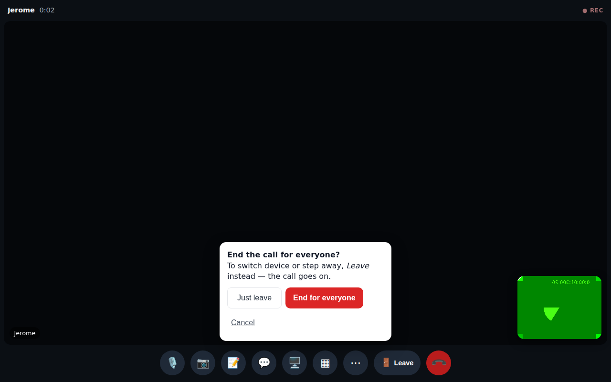
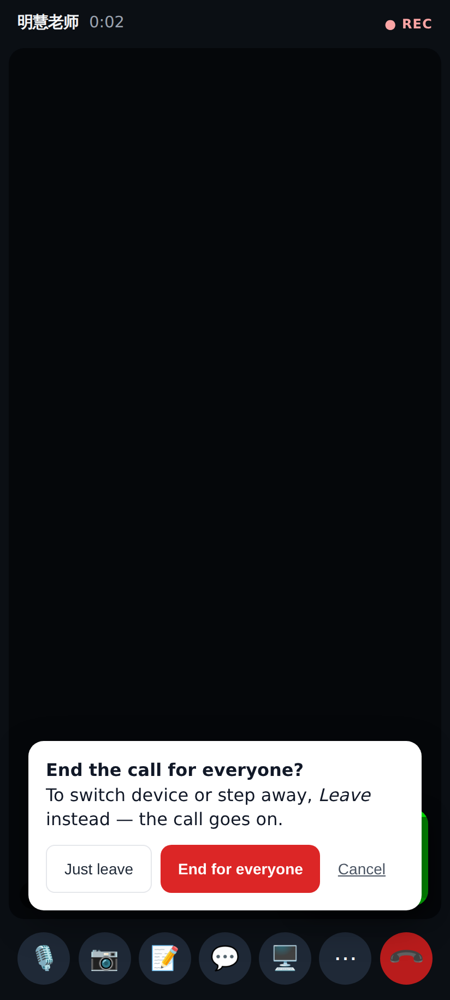
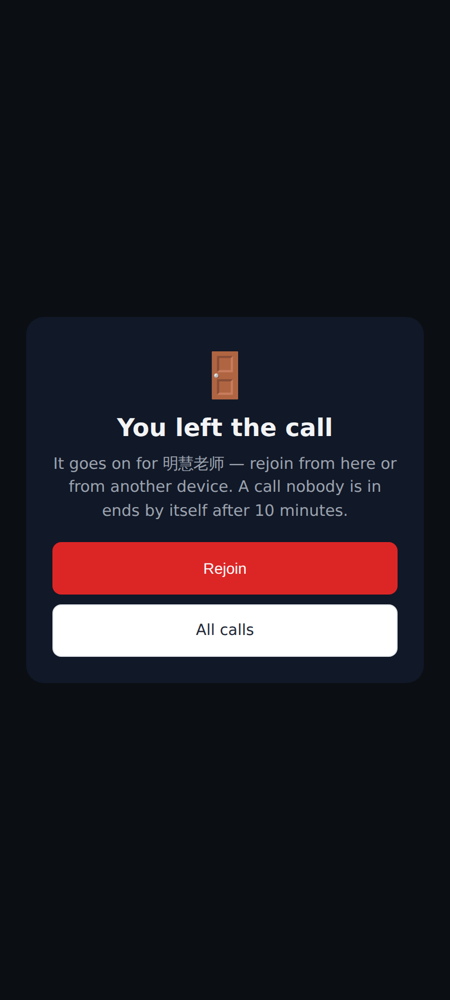
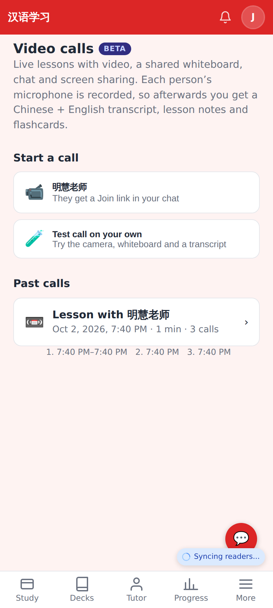
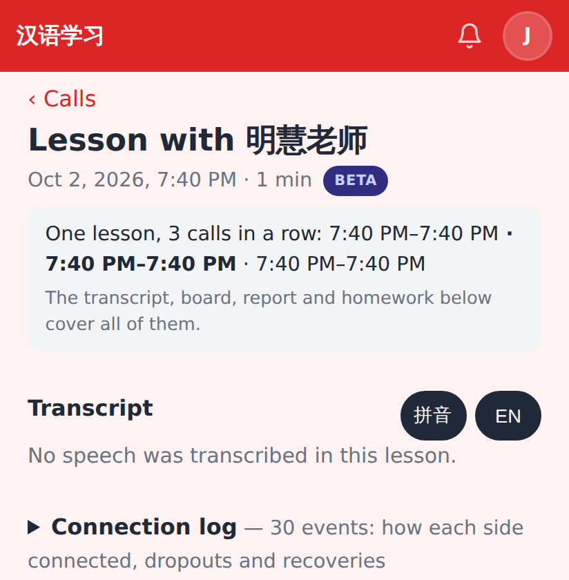

# Calls round 4 — PR 2 (ending and lessons)

Desktop: **🚪 Leave** (the call goes on) sits next to the red End; End asks first and offers "Just leave".

Phone: the bar is full, so Leave is in ⋯ and in End's confirm ("Just leave").

After leaving: the call goes on for the other person; Rejoin comes straight back (devices restored).

Past calls: three calls within 20 minutes are ONE lesson, its calls listed underneath.

The review page covers the whole lesson (transcript, board, report, homework once).
