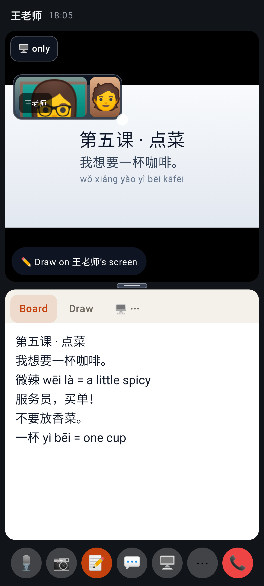
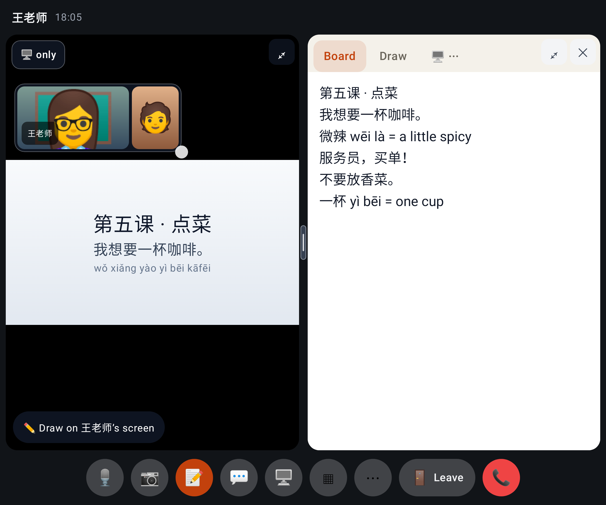
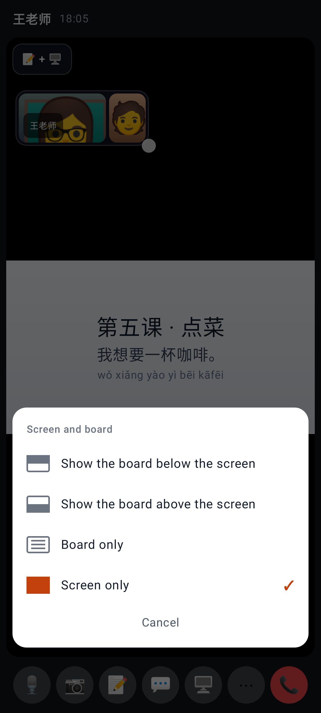
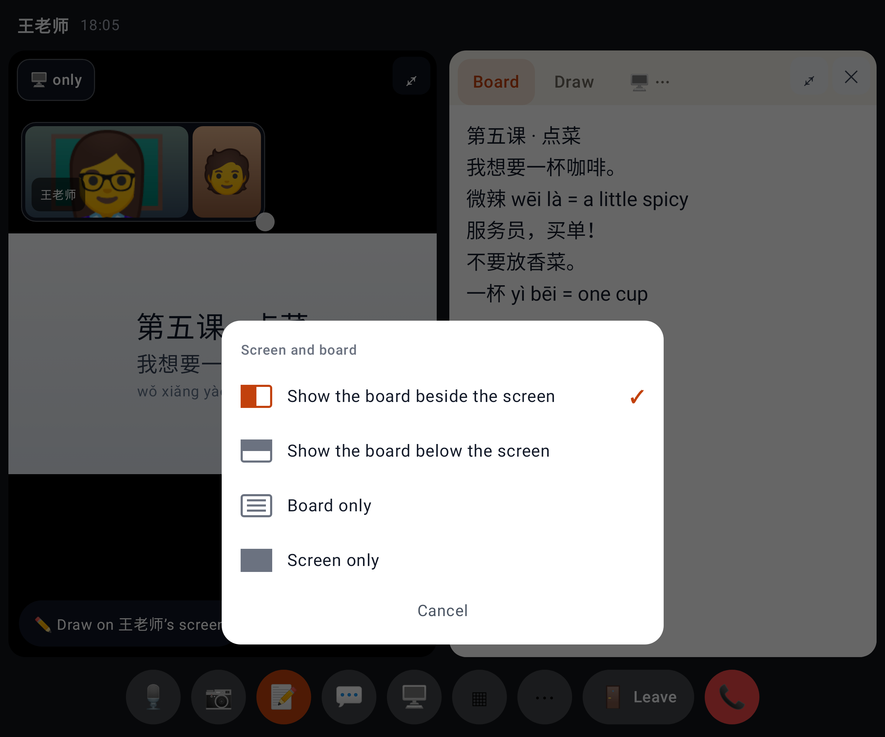
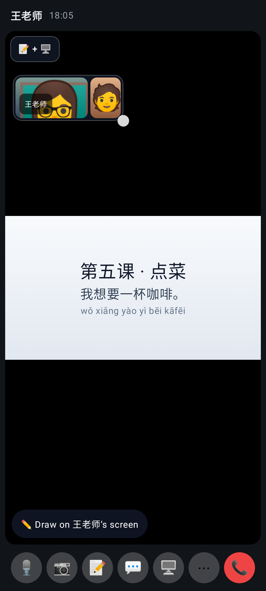
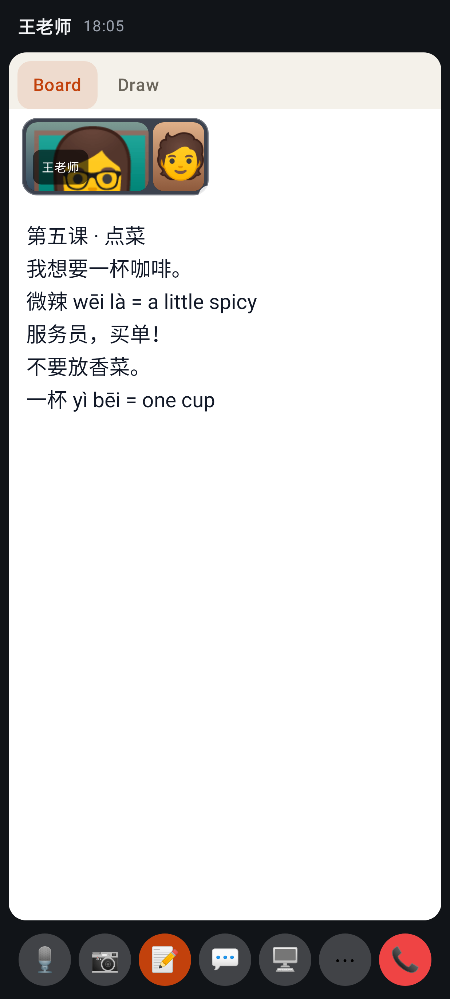
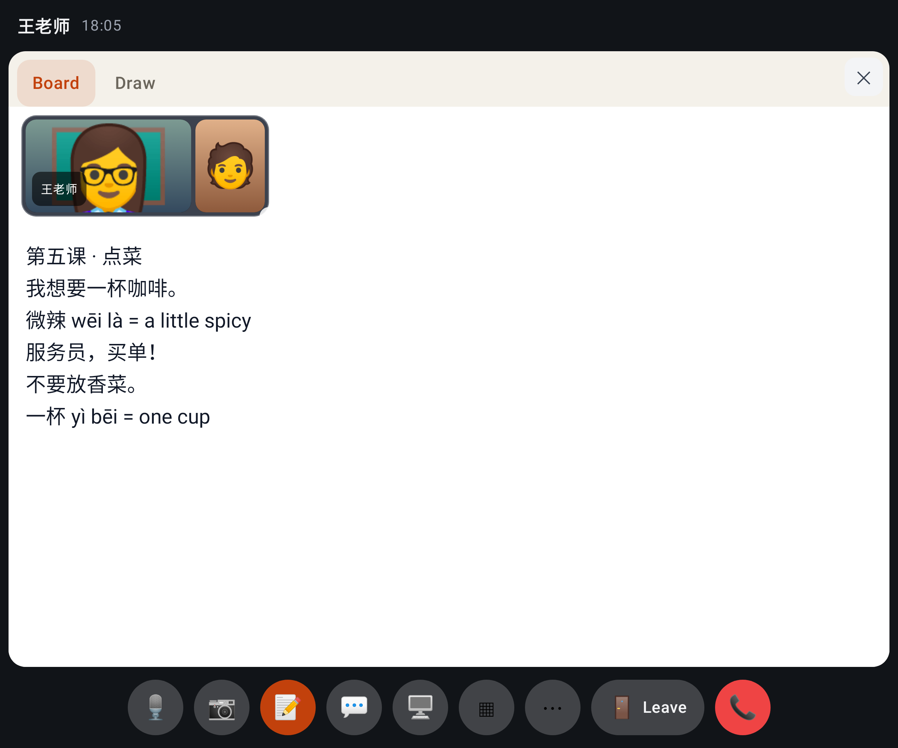

# Calls round 4 — PR 3 (layout by drag and drop)

The board leaves room at its top for the faces box, so it no longer covers the first lines.

Dragging the board from the rail: the zone under the pointer lights up (here the whole stage).

Near the right edge: "Board · Right half".

Dropped: the shared screen and the board side by side (divider resizes), the faces floating over them.

Keyboard / no-drag fallback: the ⠿ grip opens "Move Screen to …".

Bottom half: the two stack.

## Lab app (Android)

Folded (portrait): their shared screen on top, the board below, the faces floating over the screen; the divider has a ≥ 44 dp grip.

Unfolded: the screen and the board side by side; "🖥️ only" on the screen goes back to the screen alone.

Long-press the shared screen (or the board, or its "🖥️ ⋯" tab): show the board below / above the screen, board only, screen only.

Unfolded the menu offers beside / below; the current arrangement is ticked.

Their screen alone with the board open: the "📝 + 🖥️" chip splits them in one tap (a light haptic).

The text board starts below the faces box in its top corner (`textInsetTop`), so the first lines are never covered.

The same on the unfolded screen.
