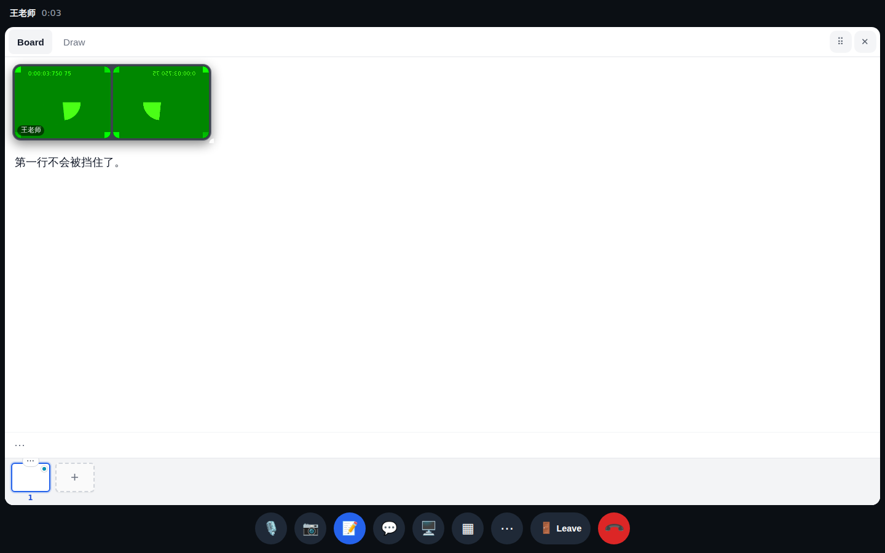
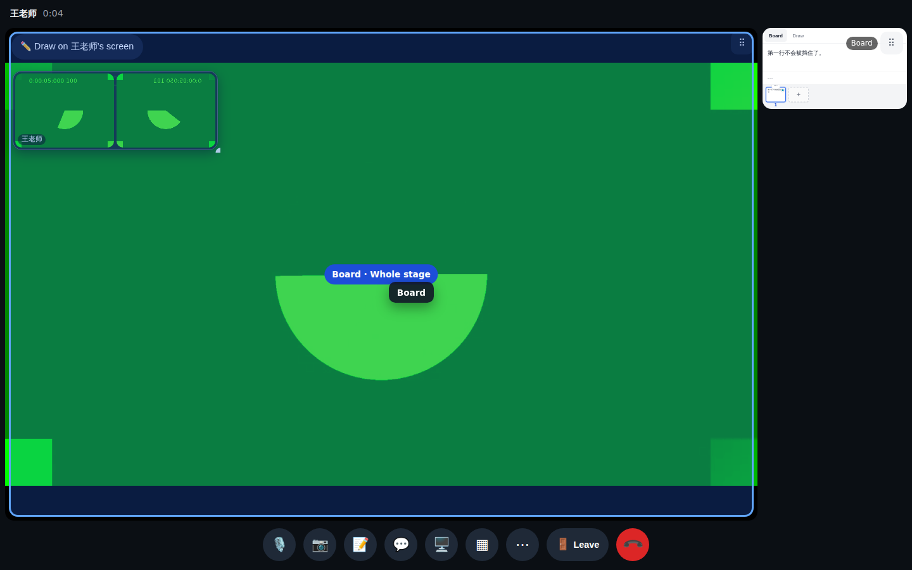
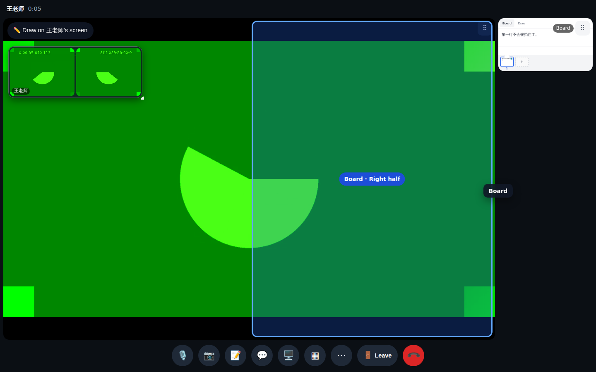
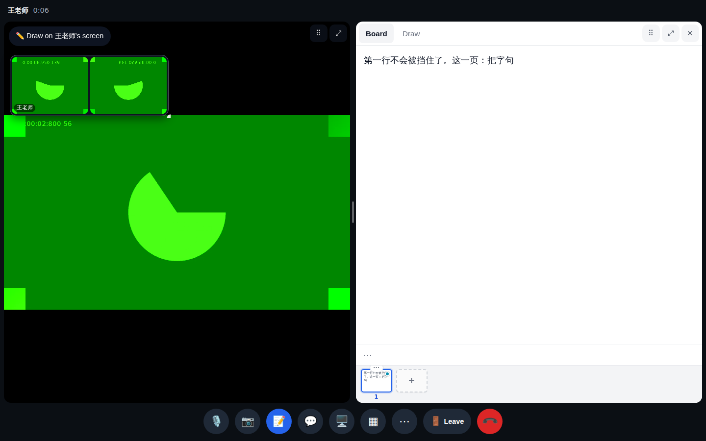
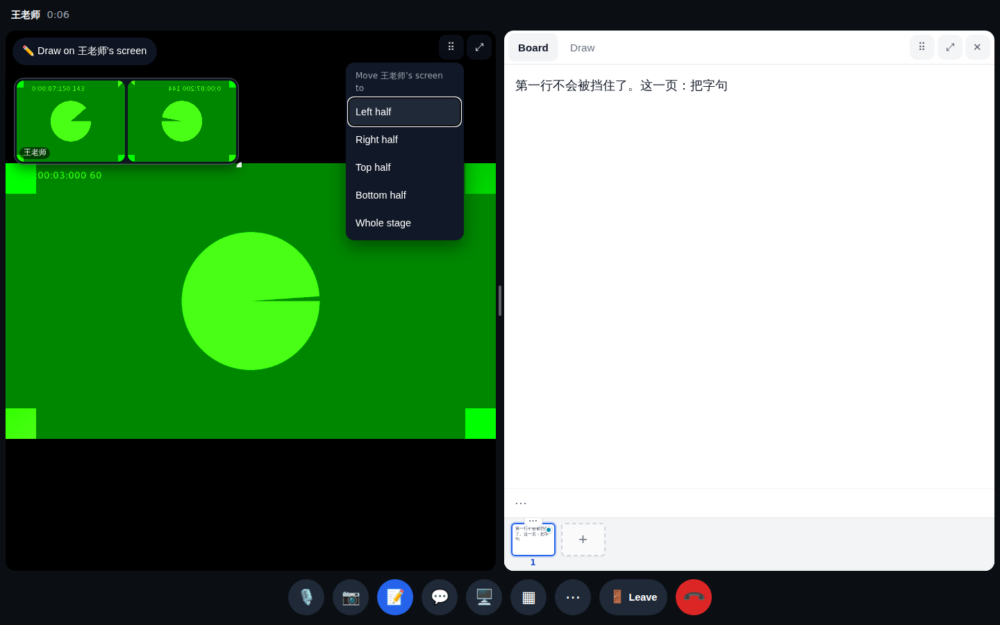
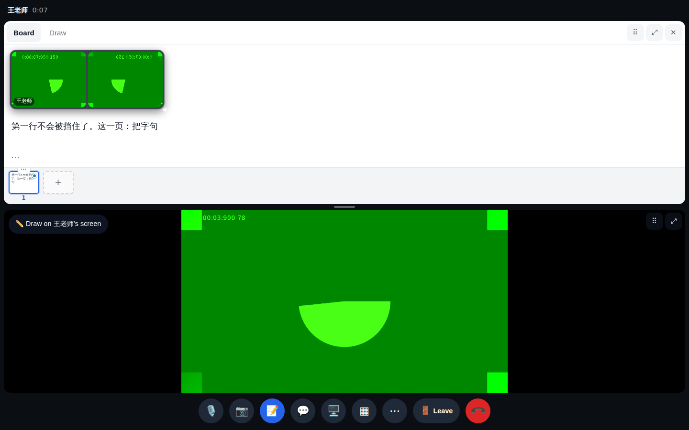

# Calls round 4 — PR 3 (layout by drag and drop)

The board leaves room at its top for the faces box, so it no longer covers the first lines.

Dragging the board from the rail: the zone under the pointer lights up (here the whole stage).

Near the right edge: "Board · Right half".

Dropped: the shared screen and the board side by side (divider resizes), the faces floating over them.

Keyboard / no-drag fallback: the ⠿ grip opens "Move Screen to …".

Bottom half: the two stack.
