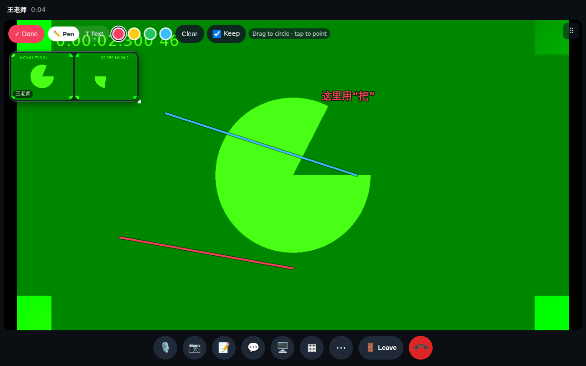
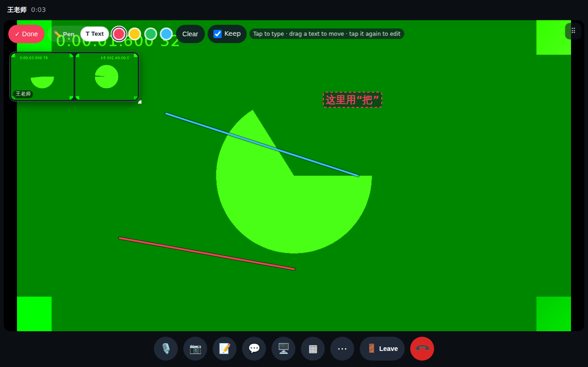
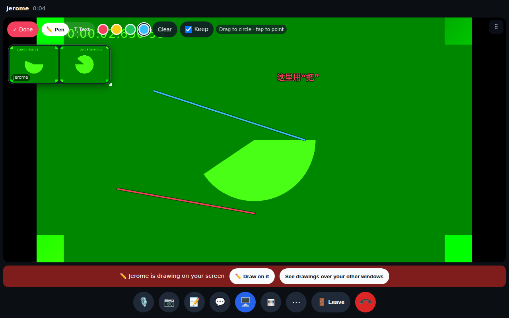
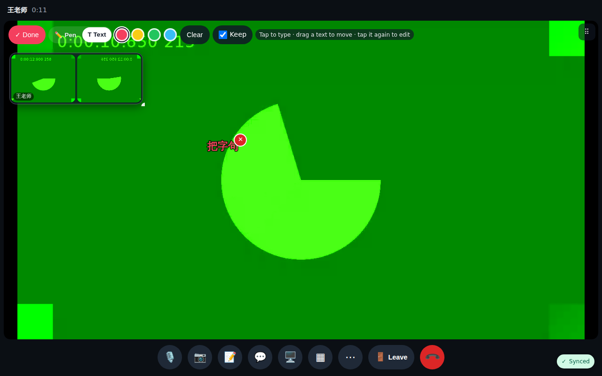
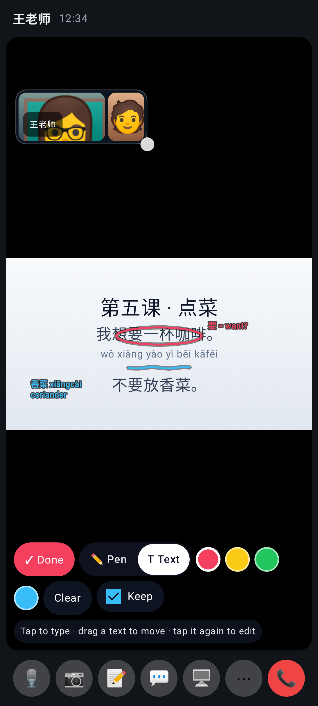
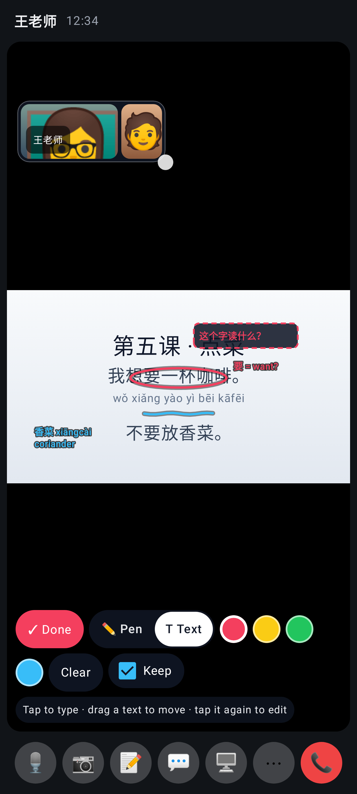
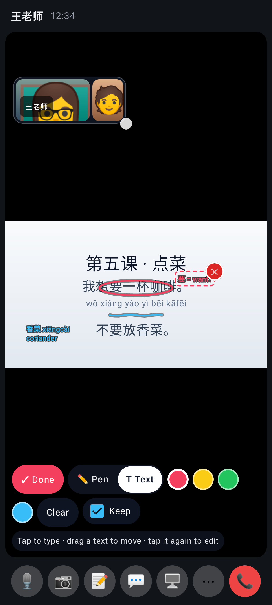
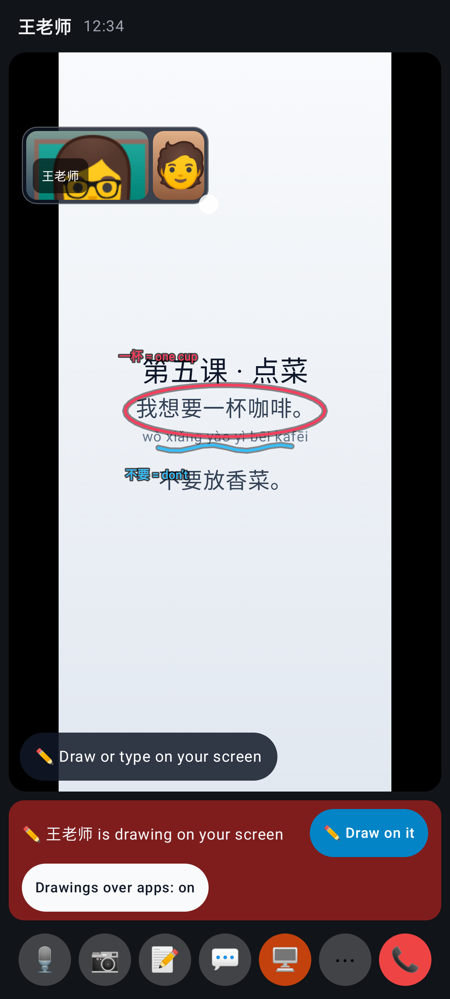
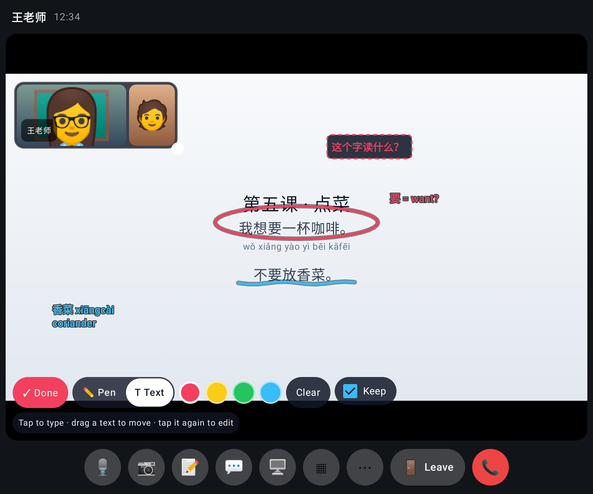

# Calls round 4 — PR 4 (typing on a shared screen)

The drawing tools on a shared screen: ✏️ Pen / T Text, colours, Clear, and **Keep — now on by default** (nothing fades unexpectedly).

The viewer taps the picture and types (any IME): a text box in their colour.

The sharer sees the text with both people's drawings, at the same spot of the picture.

Tap a text to select it (✕ deletes it for both); drag to move; tap again to edit.

## Lab app (native Android)

Lab: the drawing tools with ✏️ Pen / T Text and Keep on by default, texts from both people on the shared screen.

Lab: tap the picture and type (a real text field, so Gboard pinyin works); Done / Enter finishes.

Lab: a selected text with its dashed frame and ✕ (deletes it for both); drag to move, tap again to edit.

Lab: the sharer's own screen with the tutor's text and circle beside their own note and underline.

Lab, unfolded: typing on the shared screen on the stage.
