# Calls round 4 — PR 5: lesson materials

Phone shots at 412×915 (2×); the drawing shot is desktop (1280×800).

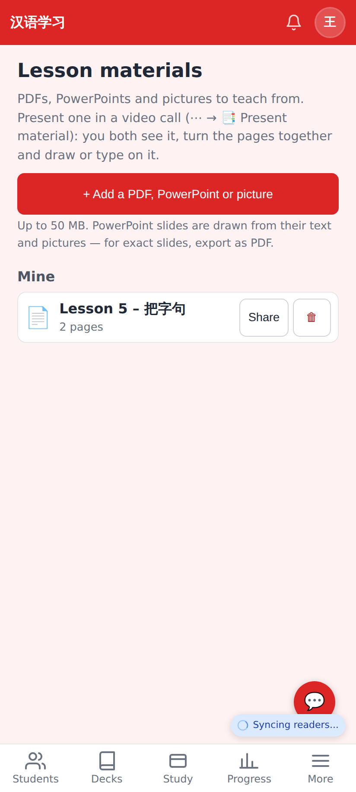
**01** — More → Lesson materials: upload a PDF, PowerPoint or picture; share it with a student, rename, delete.

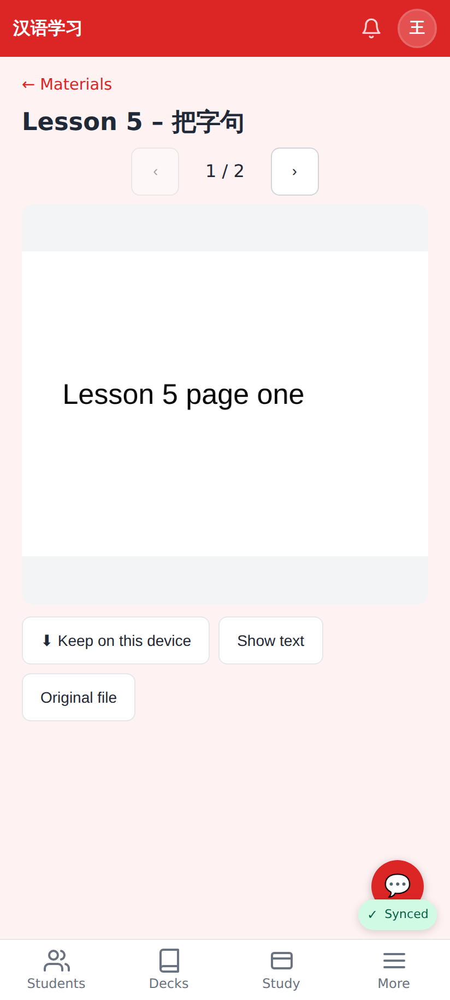
**02** — A material page by page (cached on the device once seen), Keep on this device, Show text, Original file.

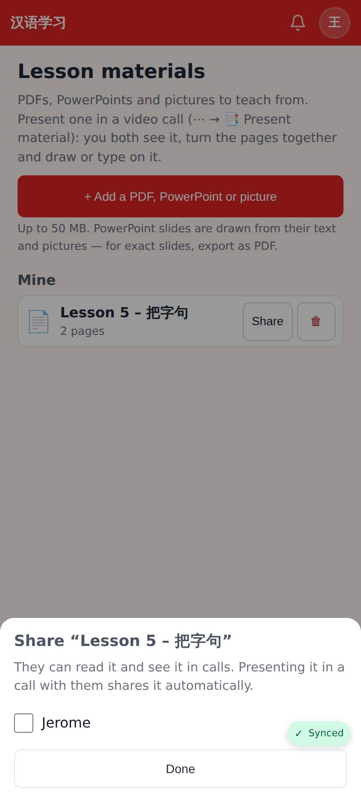
**03** — Share with a student (presenting it in a call with them shares it automatically).

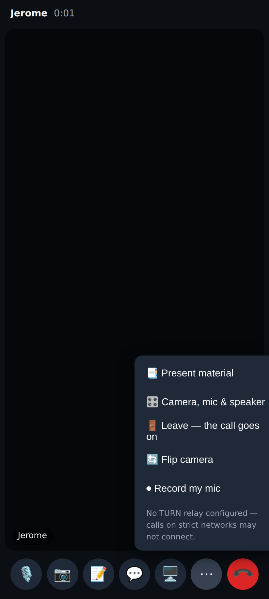
**04** — In a call: ⋯ → 📑 Present material.

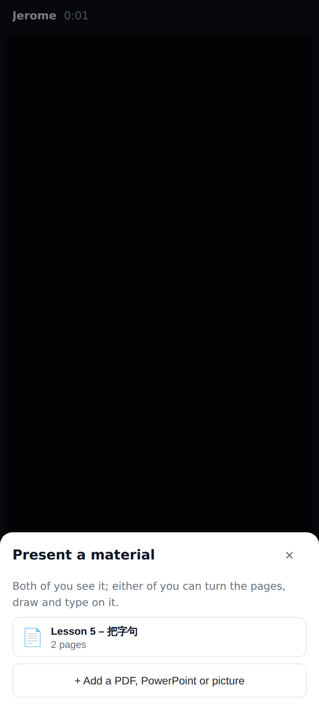
**05** — Pick one of your materials (or add one right there).

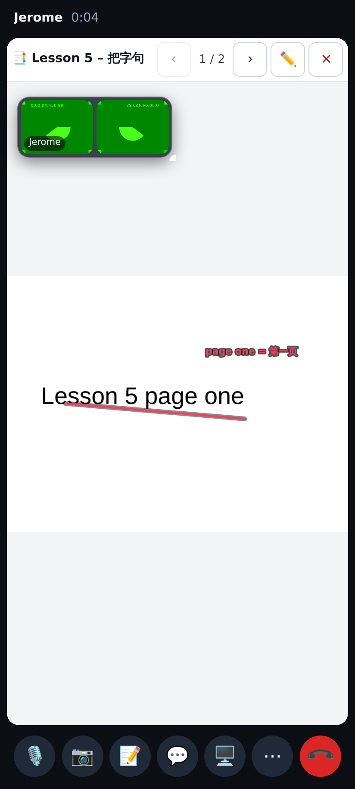
**06** — The material on the stage for the other person (phone): page 1 / 2, ‹ ›, ✏️, ✕ — with the student's text and stroke on it.

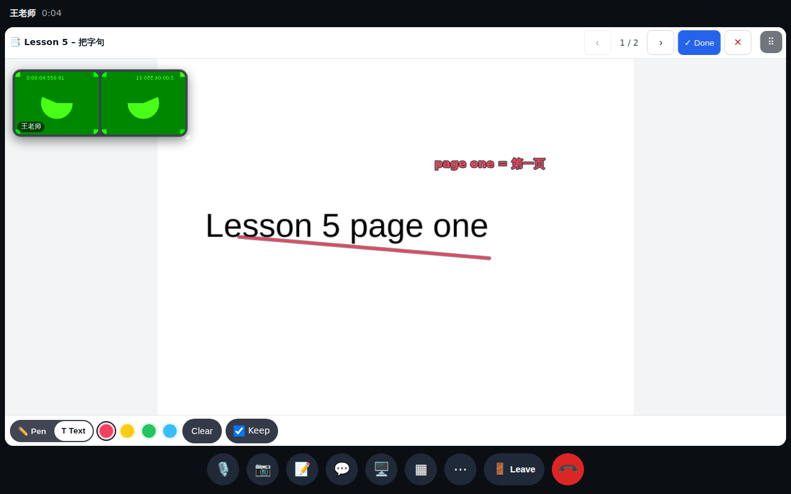
**07** — Drawing and typing on a page (desktop): Pen / Text, colours, Clear, Keep — saved per page per lesson.

## Lab app (native Android)

Phone shots at 412×915 dp; unfolded at 841×701 dp (Pixel Fold inner screen).

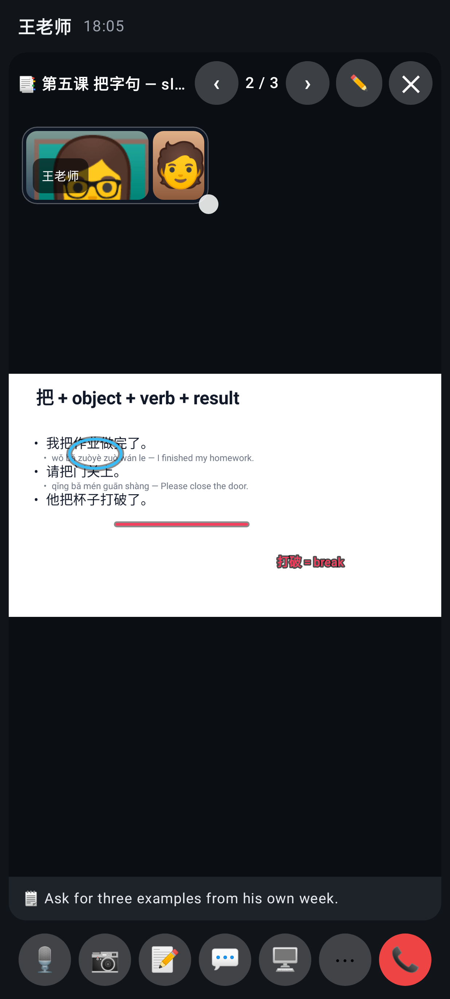
**lab-08** — The material tile on a phone: 📑 title, ‹ 2 / 3 ›, ✏️, ✕; the faces float below the bar; the tutor's circle, my underline and text; speaker notes at the bottom.

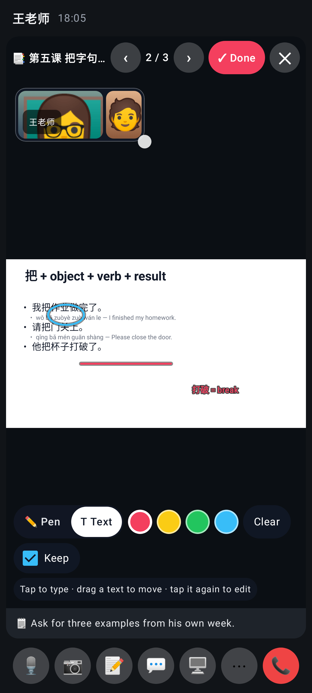
**lab-09** — ✓ Done: Pen / Text, colours, Clear, Keep at the bottom of the tile.

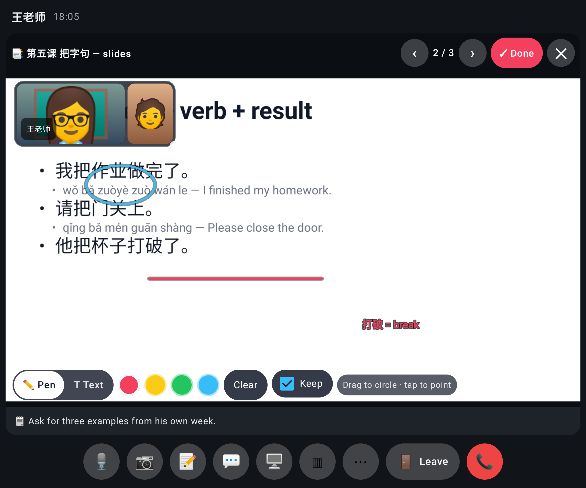
**lab-10** — The same, unfolded.

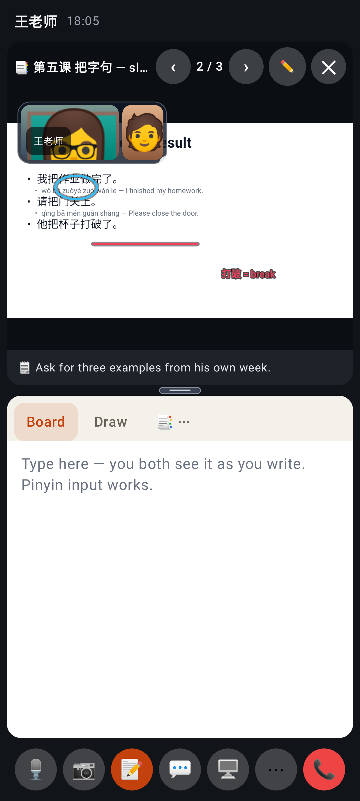
**lab-11** — Long-press → "Show the board below the material": the material and the board stacked on a phone.

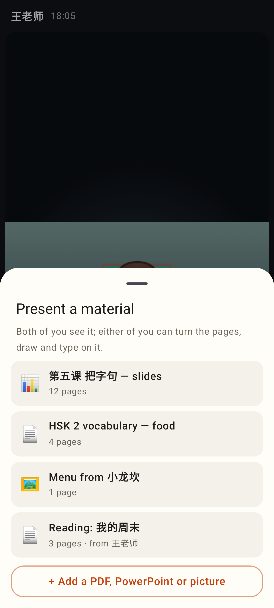
**lab-12** — ⋯ → 📑 Present material: ready materials (mine and shared) or + Add a PDF, PowerPoint or picture.

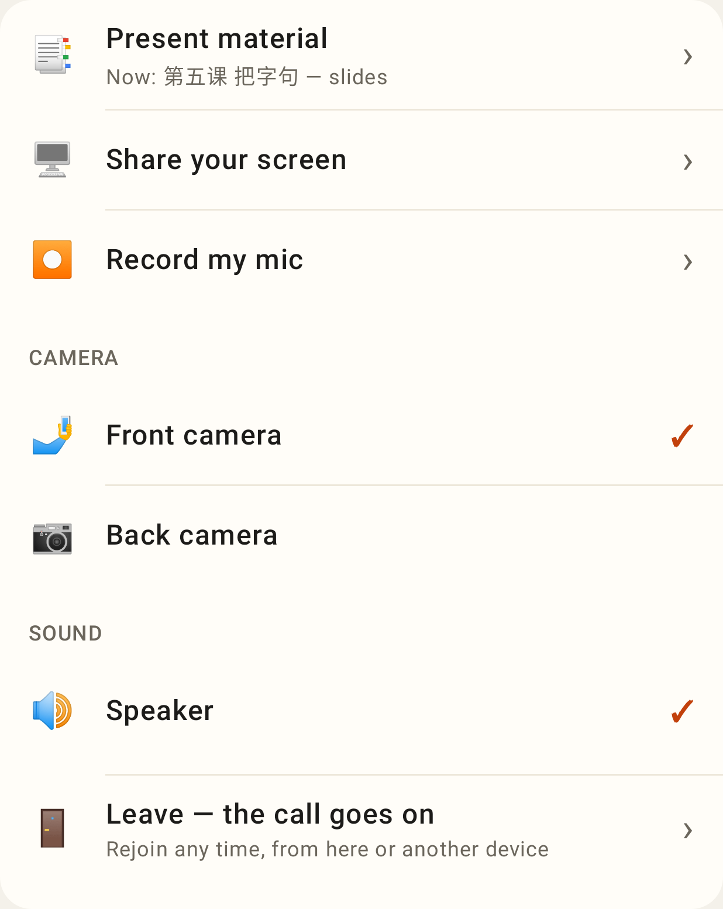
**lab-13** — The ⋯ sheet with 📑 Present material first.

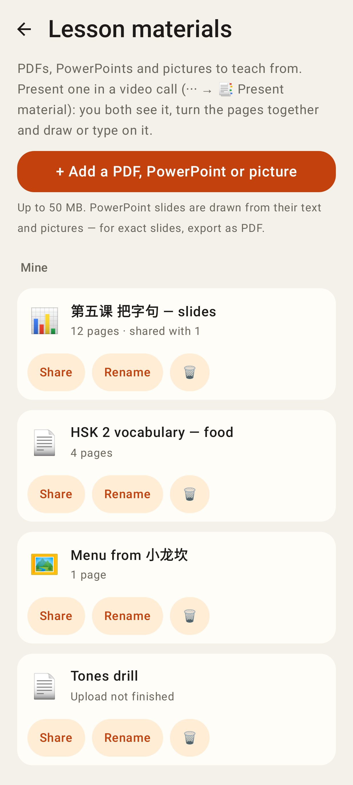
**lab-14** — More → Lesson materials: upload, Share, Rename, 🗑.

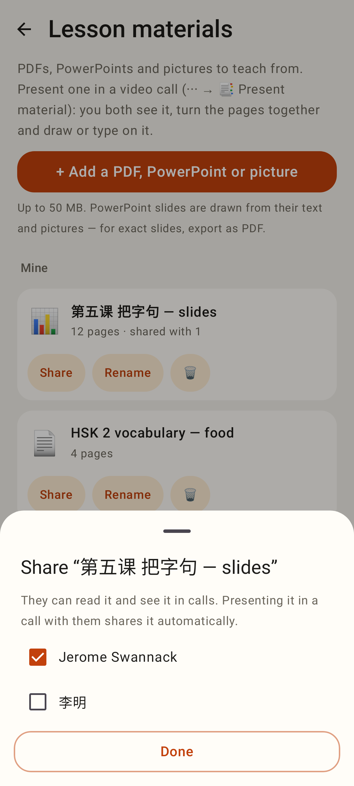
**lab-15** — Share with a student.

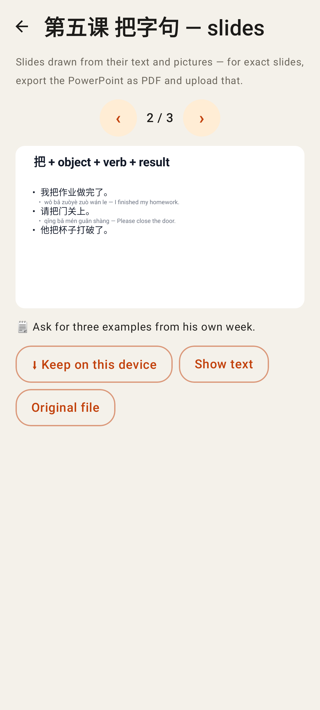
**lab-16** — A material page by page (cached on the phone), Keep on this device, Show text, Original file.

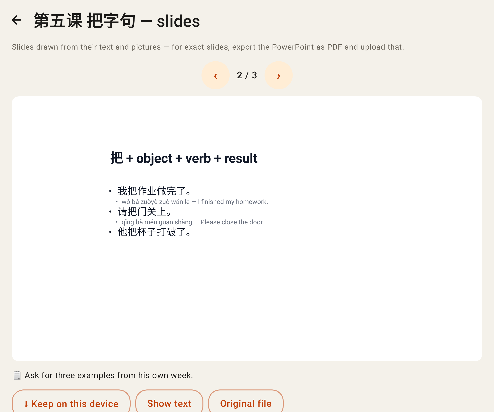
**lab-17** — The viewer unfolded.
