# Calls round 5 — the tutor leads, camera on at join

Phone viewport (412×915, 2×). Web shots from two real browsers in one call (tutor = Minghui, student = Jerome);
Lab shots are Roborazzi renders of the Compose call screen.

## Web

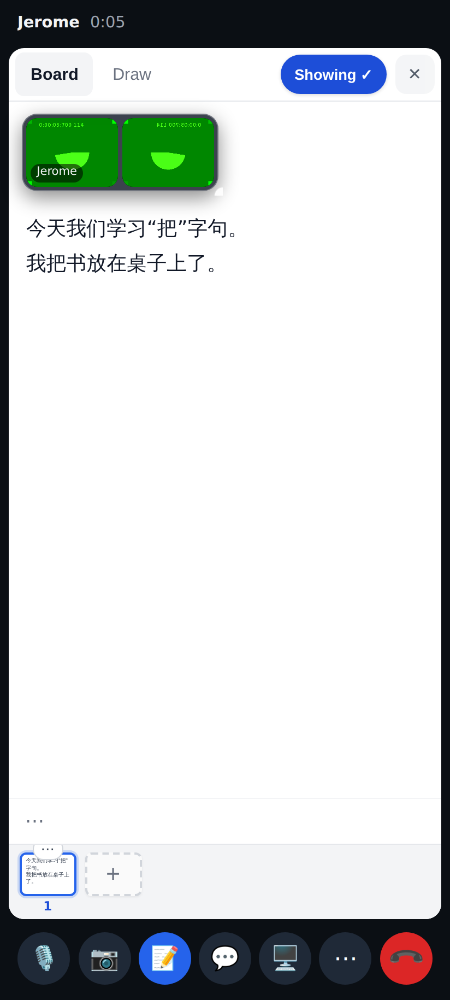
Tutor: opening the board shows it to the student — the corner button reads **Showing ✓**.

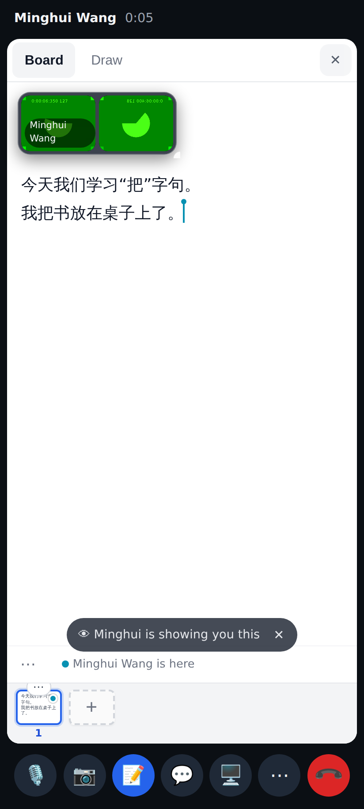
Student: the board came onto their stage with the quiet banner (✕ hides it; their own layout wins after this).

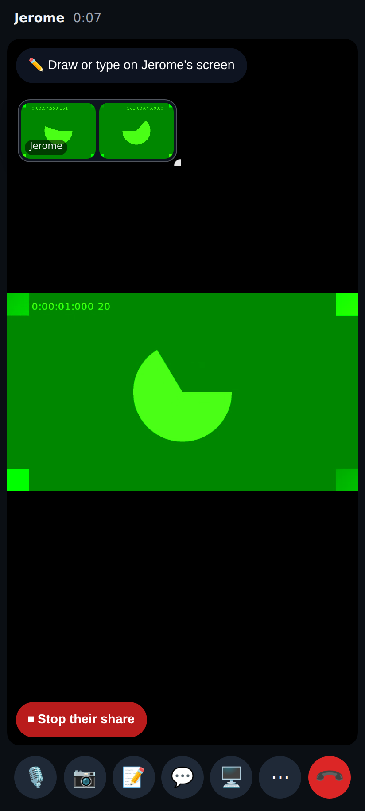
Tutor: the student is sharing — **⏹ Stop their share** on the student's screen tile (tutor only).

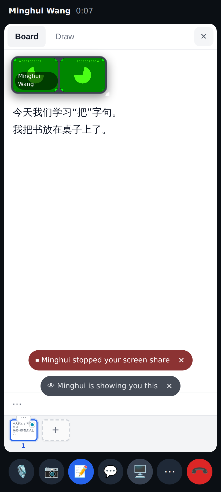
Student: the capture stopped and the note says why.

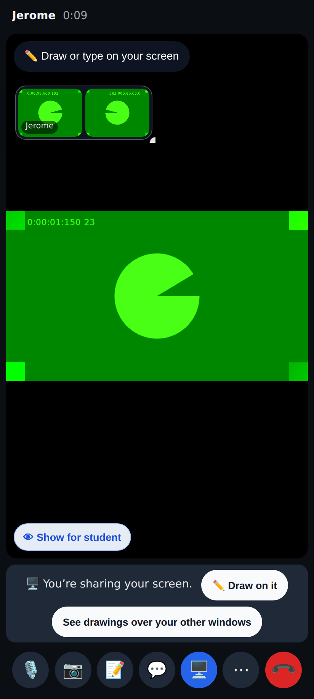
Tutor: sharing her own screen — the **👁 Show for student** corner button.

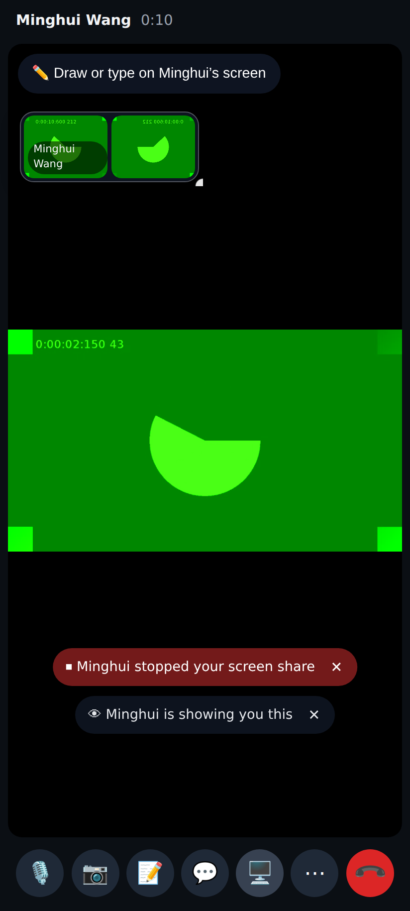
Student after she pressed it: her screen on the stage with the banner.

## Lab app

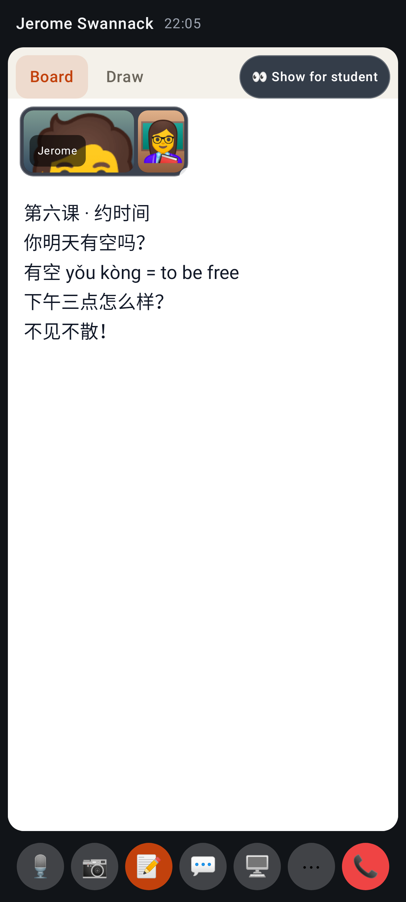
Lab, tutor on the board: the **Show for student** pill in the Board / Draw tab row.

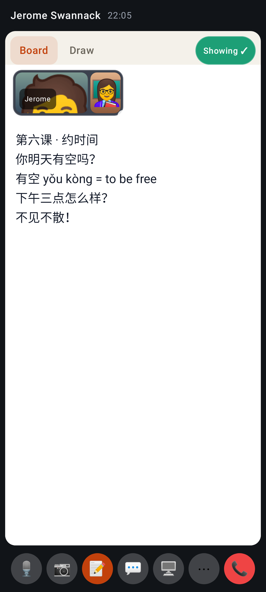
Lab, the same pill once shown.

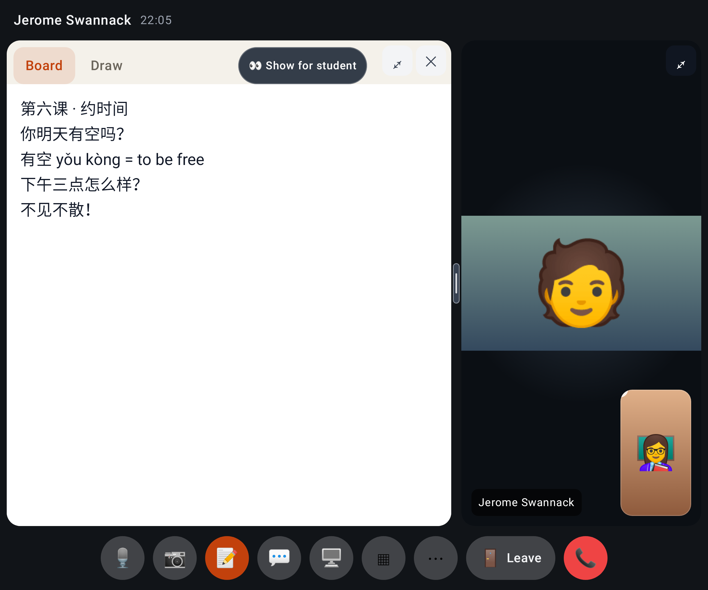
Lab unfolded: the pill sits left of the tile's ⤢ / ✕.

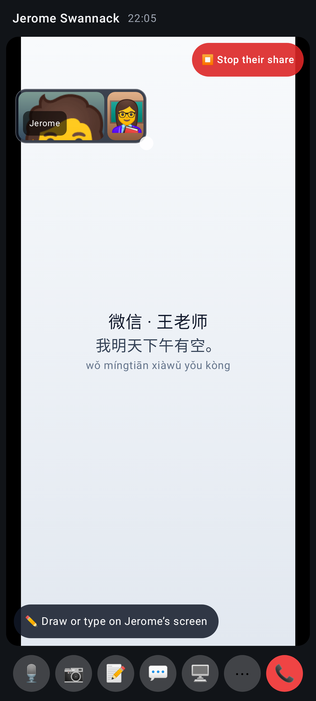
Lab, tutor viewing the student's share: **⏹ Stop their share**.

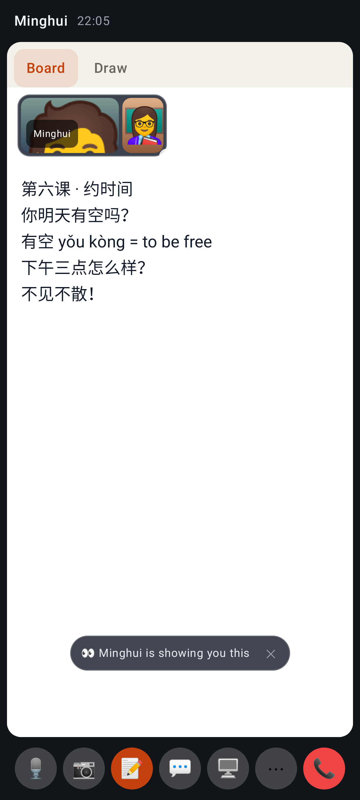
Lab, student: "Minghui is showing you this".

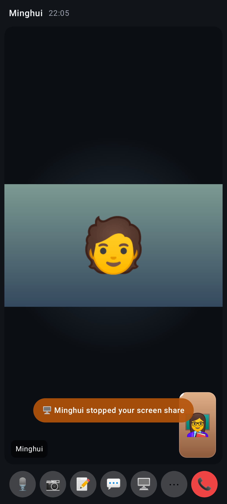
Lab, student: "Minghui stopped your screen share".
