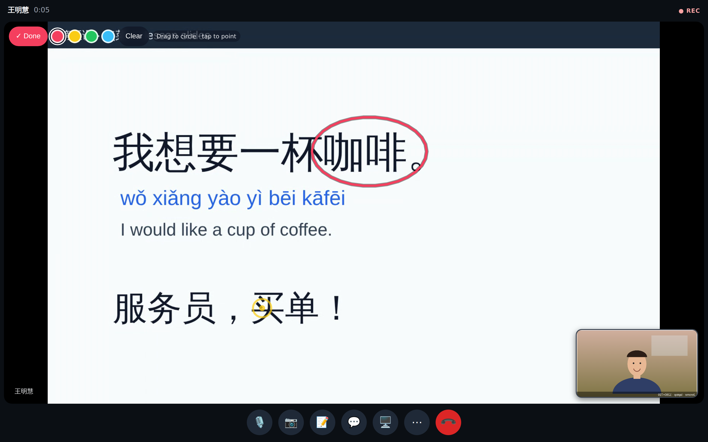
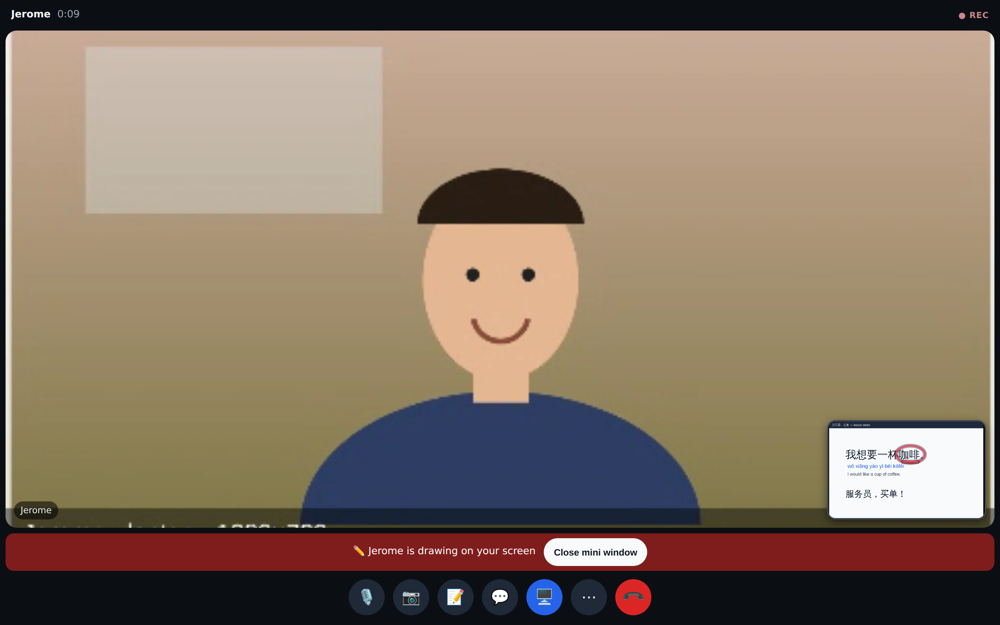
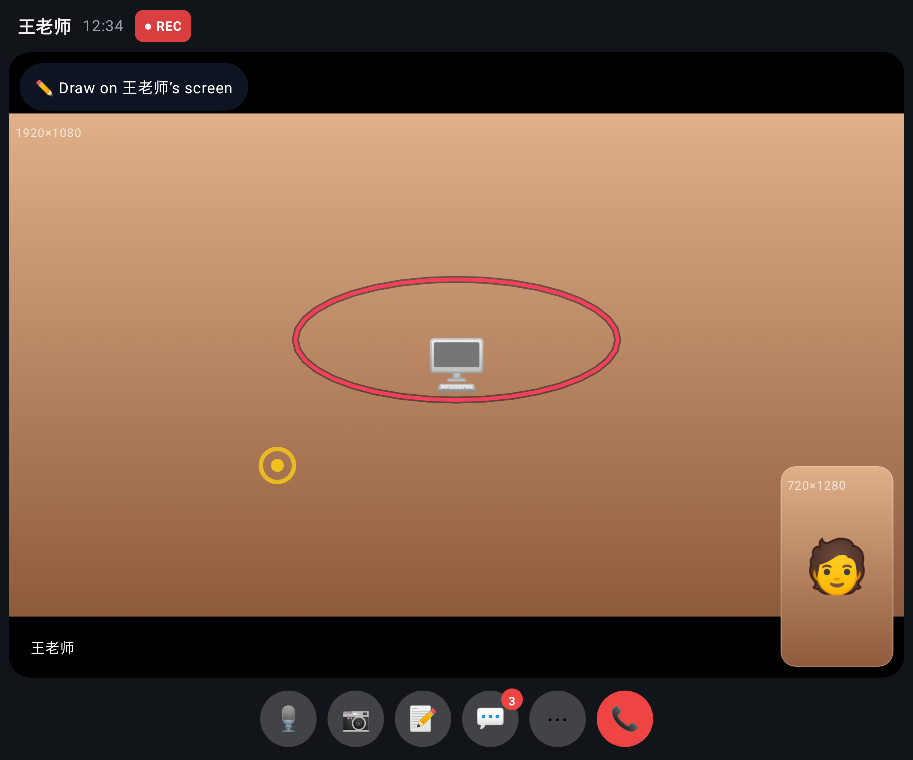
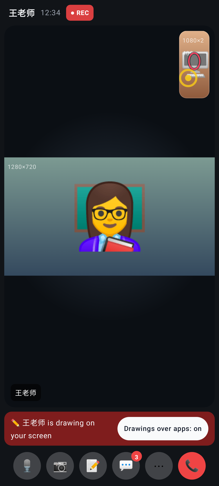

# Drawing on a shared screen

A real call through the local worker, both people on 1440×900 desktops. Minghui shares her "screen", which is a canvas of lesson slides because headless Chromium has no screen picker. Jerome circles a word and taps a point on it.

Jerome's view: he pressed **✏️ Draw on 王明慧's screen**, circled 咖啡 and tapped 买单 (the yellow ping). He can pick a colour or press Clear.

Minghui's view: the share bar says "Jerome is drawing on your screen", and the circle and ping appear on her preview of the share (bottom right).

**See drawings over your other windows** opens a Document Picture-in-Picture window (Chrome / Edge desktop). It shows her shared screen with the drawings and stays on top while she works in her slides.

The call with the mini window open.

A browser can't draw on the real screen. Without Document PiP (Firefox, Safari, phones), the drawings show only in the call's preview.

## Lab app (Roborazzi)

Unfolded: drawing on the tutor's shared screen (a circle and a ping).

The phone sharing its screen: the tutor's drawings on the preview, and **Drawings over apps: on**. On Android the drawings are also painted over every app, using the "Display over other apps" permission.
