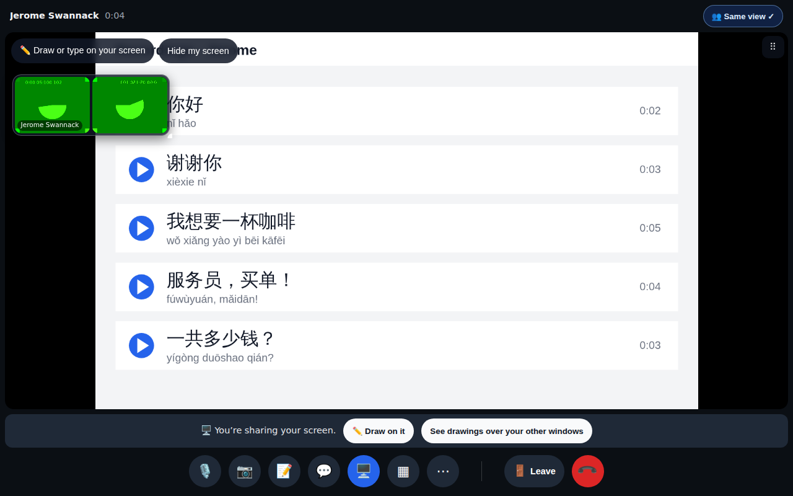
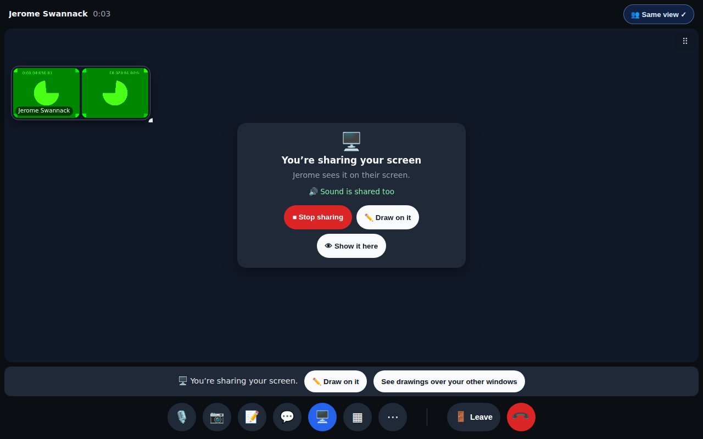
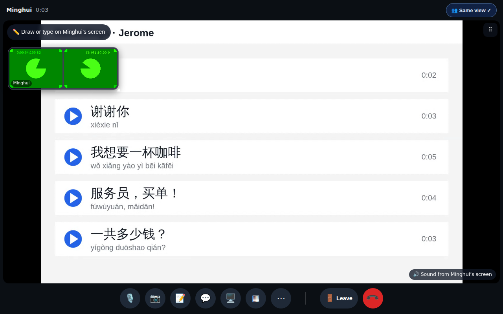
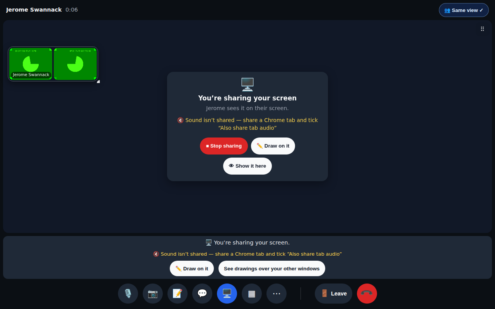
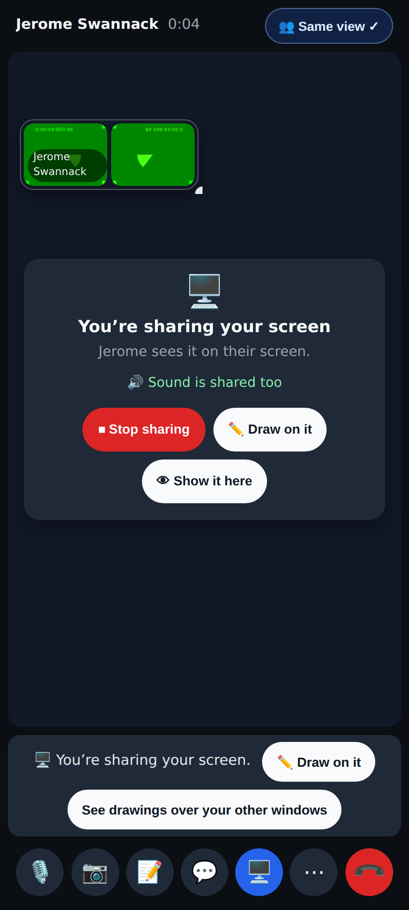
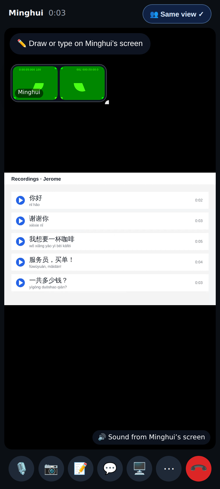
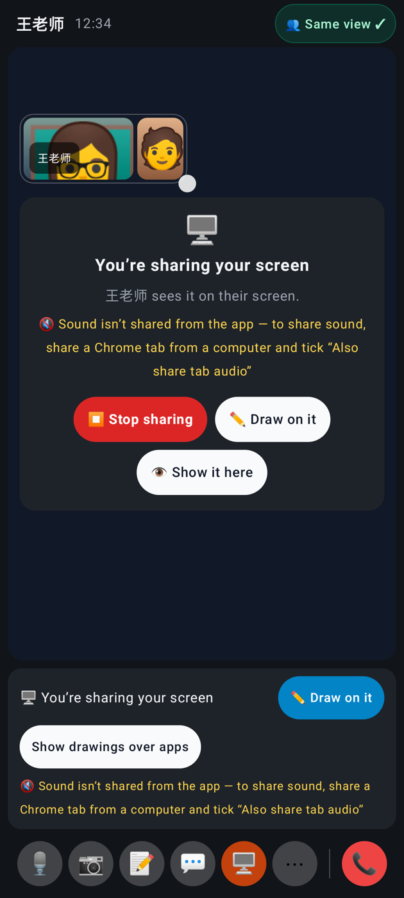
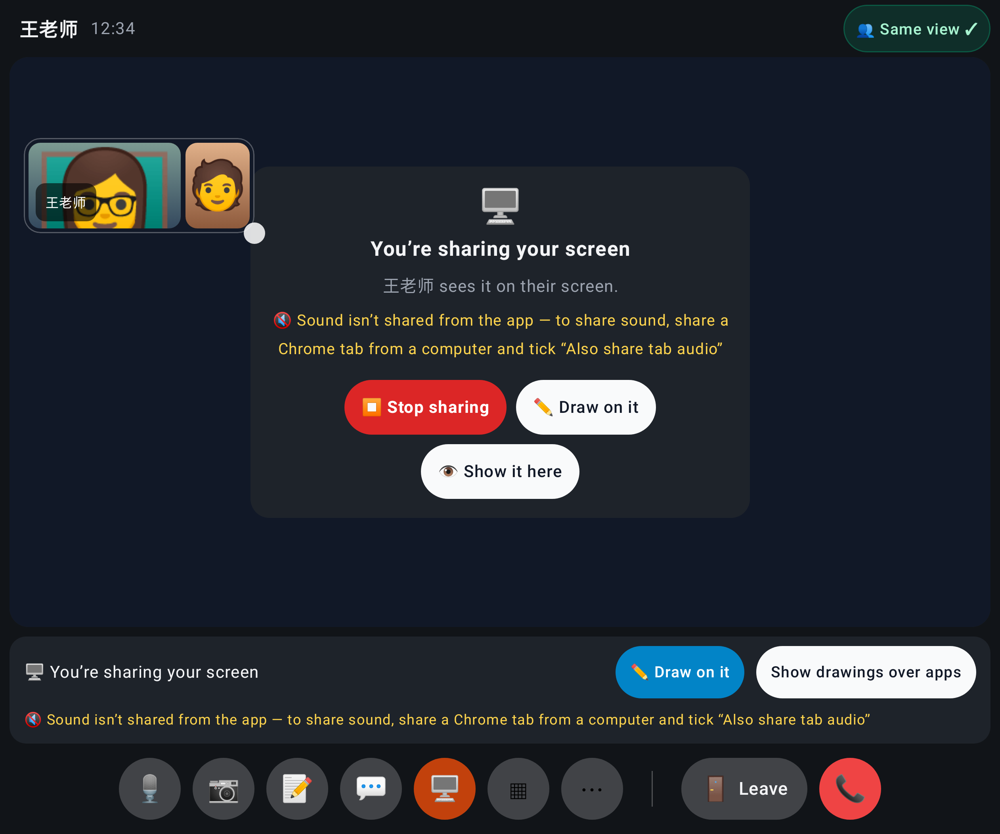
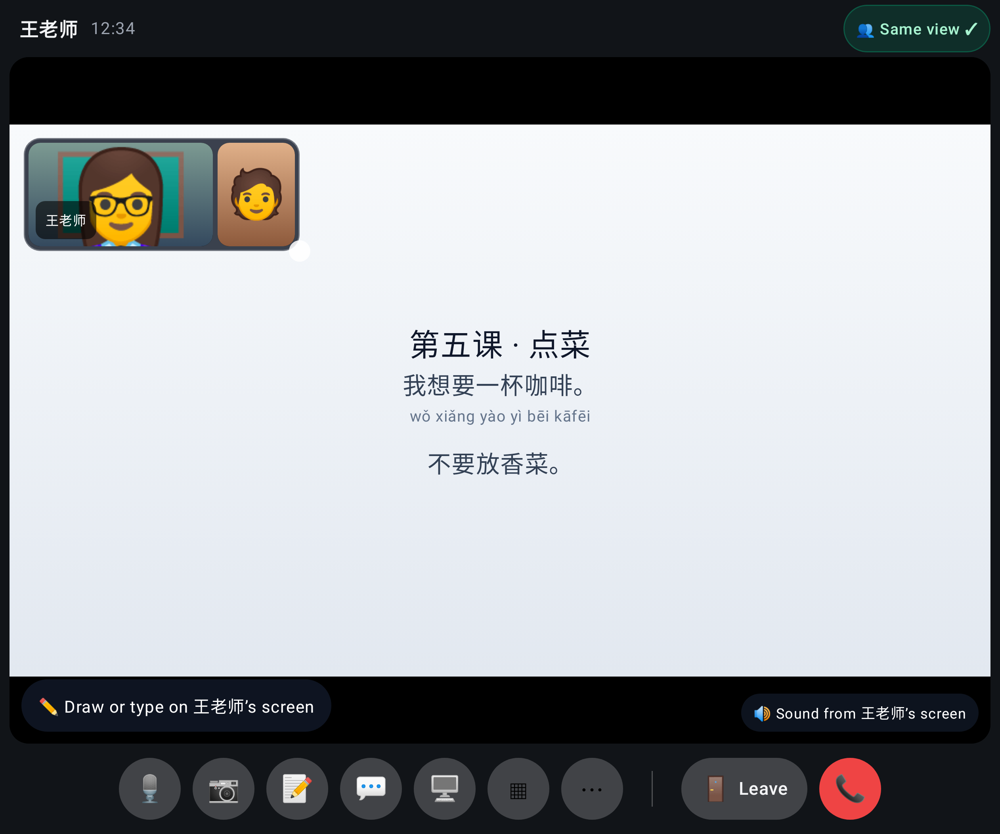

# Calls: screen share sound + no mirror for the sharer

Web (desktop 1280×800, phone 412×915 @2×) and the Lab app (Roborazzi).

Before — the sharer's stage was a mirror of her own screen (still there behind 👁 Show it here).

After — the sharer (Minghui) sees "You're sharing your screen · Jerome sees it on their screen · 🔊 Sound is shared too" with Stop sharing / Draw on it / Show it here.

The viewer (Jerome) has the share on his stage, unchanged, plus "🔊 Sound from Minghui's screen" — the tab's sound plays on its own audio element.

A share without sound (a window / macOS screen / Safari / Firefox): "Sound isn't shared — share a Chrome tab and tick 'Also share tab audio'" on the card and the share bar.

Phone (folded Pixel): the sharer's card.

Phone: the viewer with the sound badge.

Lab app, folded: the sharer's card; the app can't send sound, so it says how to share sound.

Lab app, unfolded: the same card.

Lab app as the viewer of a browser tab shared with sound: "🔊 Sound from 王老师's screen".
