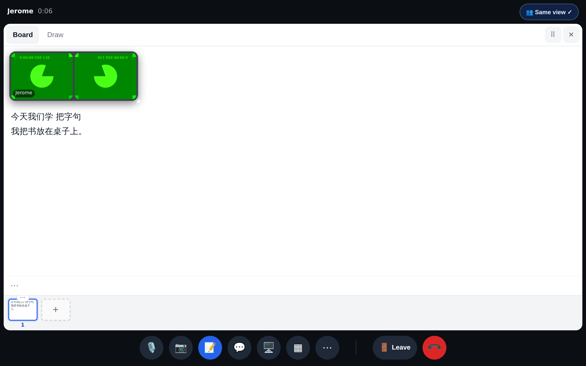
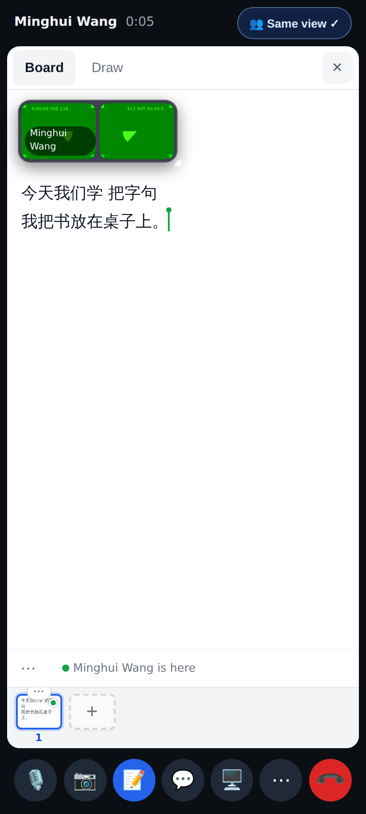
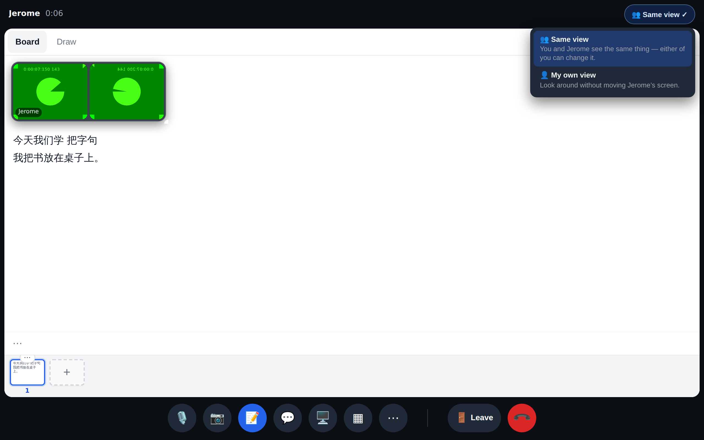
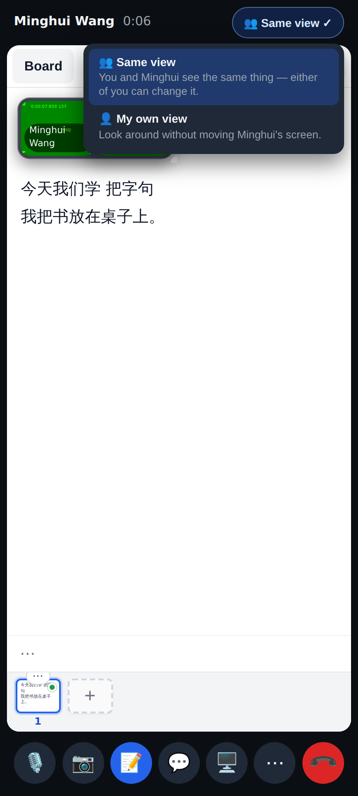
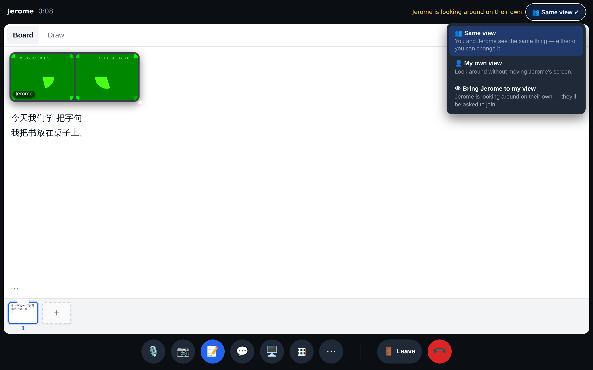
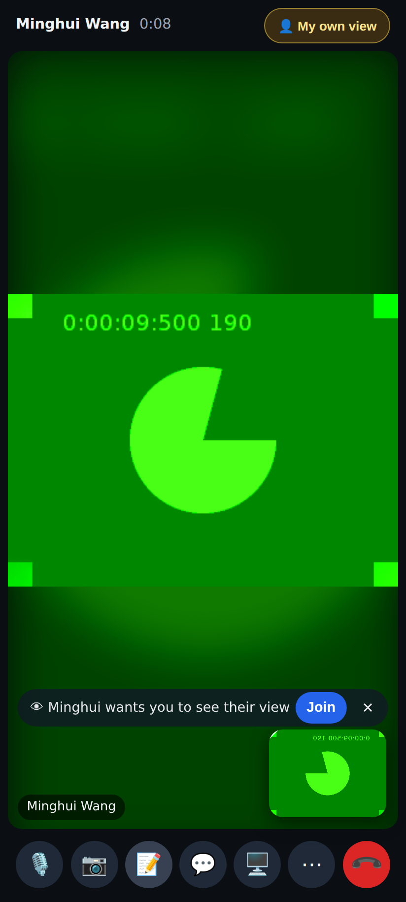
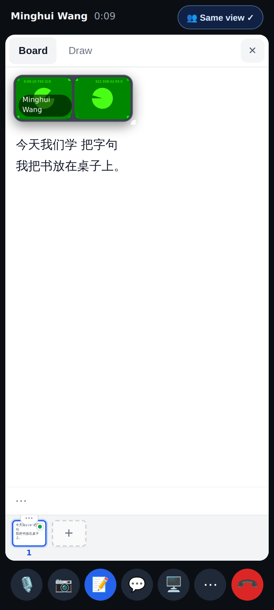
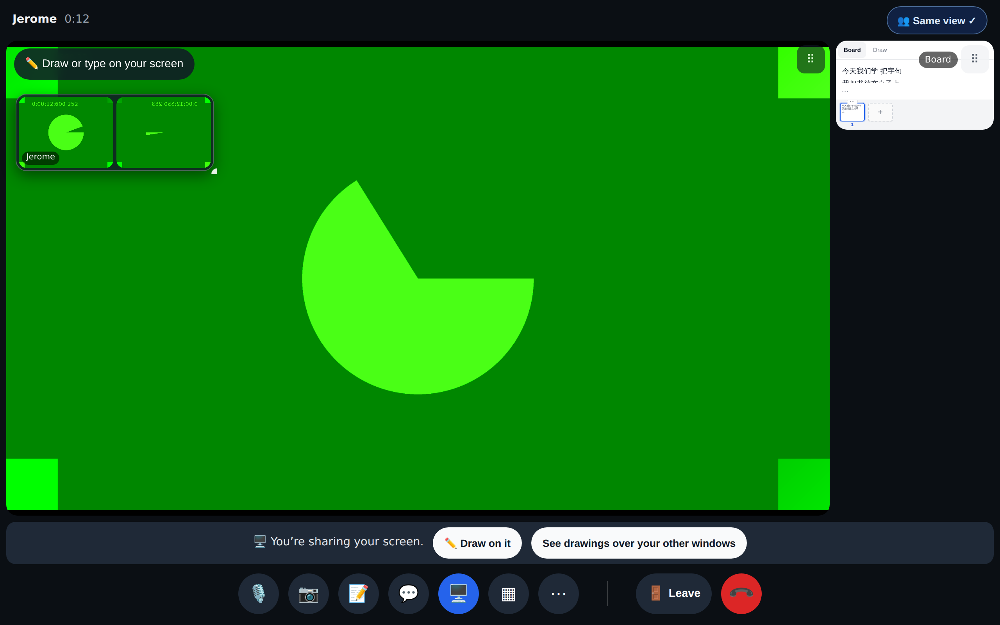
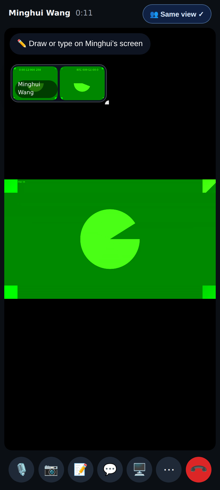

# Calls: Same view (round 6)

Tutor on a desktop (1280×800), student on a phone (412×915), both @2×. Seeded with a real two-person call.

The tutor opens the board — the 👥 Same view ✓ chip in the top bar.

…and the student's phone shows the same board and page (no "showing you this" pill any more).

The chip's menu: Same view / My own view.

The same menu on the phone.

The student went to My own view: the tutor sees "Jerome is looking around on their own" and Bring Jerome to my view.

On My own view a Bring is an invitation, never forced: "Minghui wants you to see their view · Join".

After Join: back on Same view, on the tutor's view.

A screen share goes on both stages — the sharer sees their own share too.

The student's phone switches to the share by itself.

Leave and End sit apart from the buttons used all the time (divider); Leave is also the last item in ⋯.
