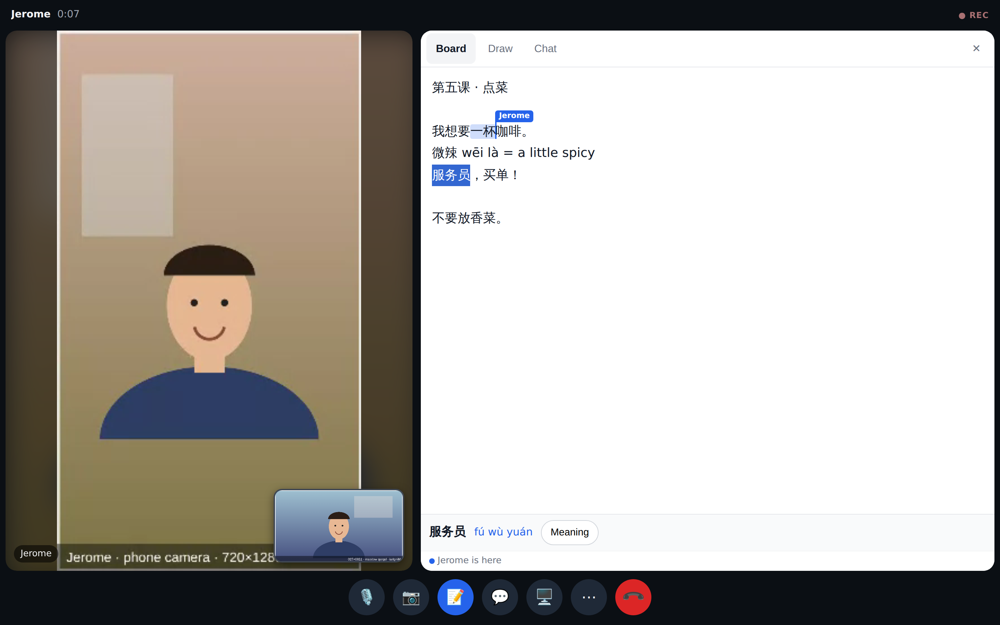
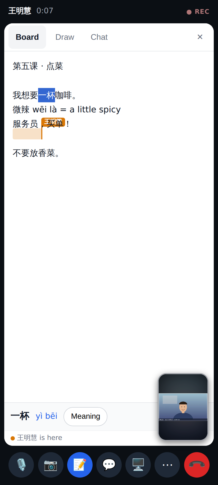
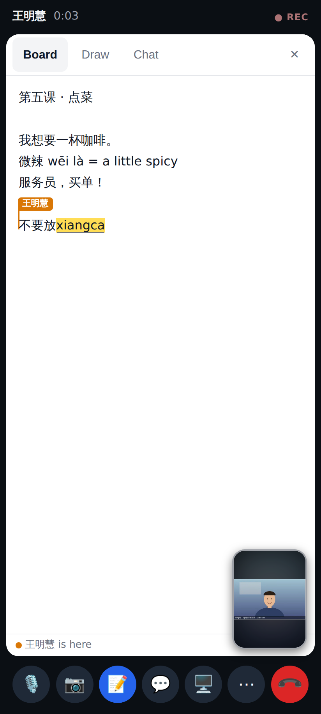
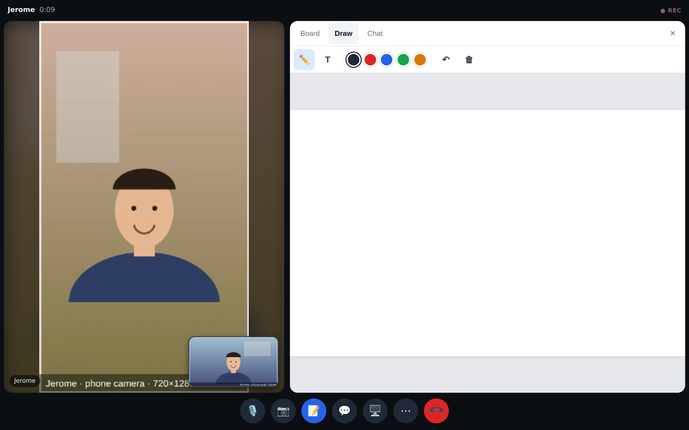
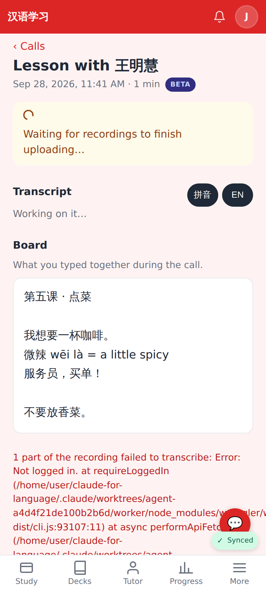
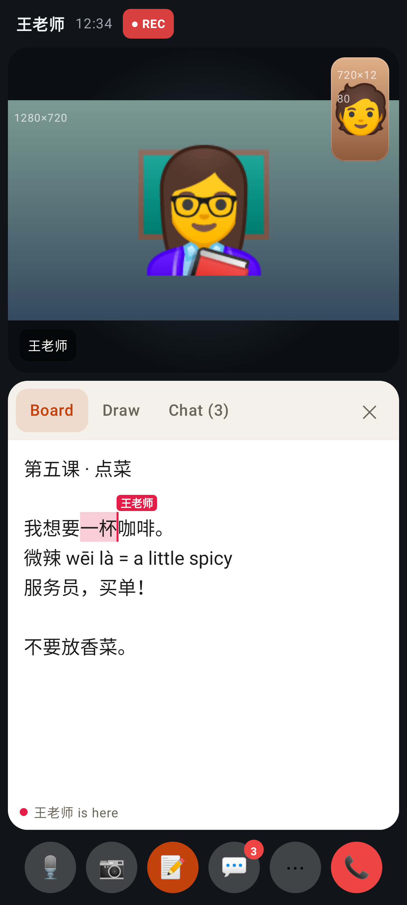
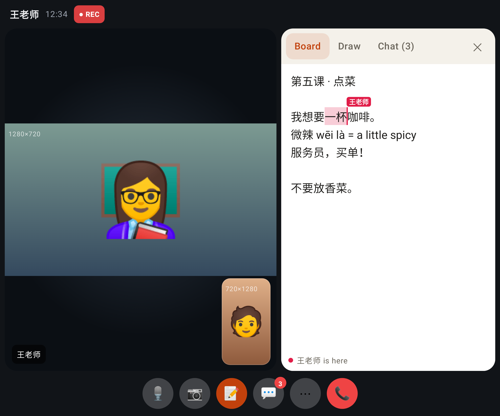

# Board: a shared text first, drawing second

A real call through the local worker: Minghui on a desktop (1440×900), Jerome on his phone (412×915). Both typed on the board, and Jerome used a pinyin IME driven through Chrome DevTools.

Minghui's view. Jerome has selected 一杯, so his blue selection and "Jerome" caret flag show on her board. She selected 服务员, and the helper shows its pinyin (fú wù yuán) with a Meaning button.

Jerome's view on the phone: the same text, with Minghui's caret in her colour.

Jerome mid-composition ("xiangca" underlined). Nothing has been sent yet, and Minghui's edits wait until he picks 香菜.

Drawing is still there as the second tab.

After the call, the review page shows the board's text under "Board".

## Lab app (Roborazzi)

The text board on the phone, with the tutor's selection and named caret.

Unfolded: the stage and the board side by side.
