# Video calls: feeds fit wide windows

Real two-browser calls (WebRTC through the local worker) with drawn "cameras" of known shapes:
a laptop webcam (1280×720) and a phone camera (720×1280). Desktop = 1440×900, phone = 412×915, both 2×.

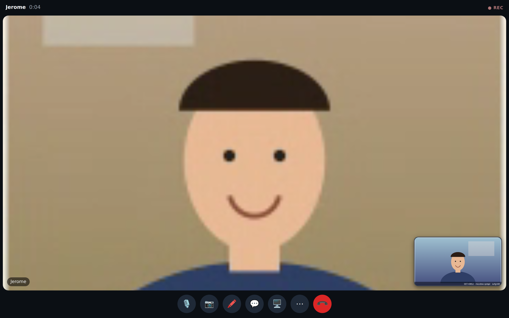
Before — Minghui's desktop window with Jerome's portrait phone feed: cropped to a band across the face (the bug).

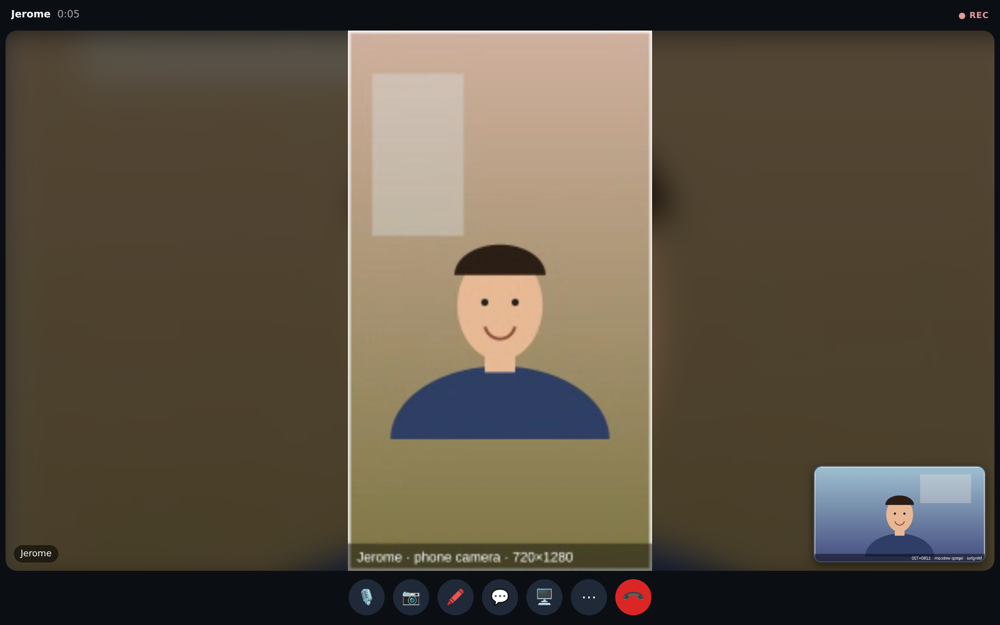
After — the whole picture, centred on a soft blurred copy of itself; self-view small, bottom-right, landscape like her webcam.

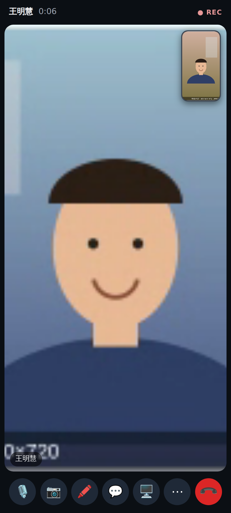
Before — Jerome's phone with Minghui's landscape webcam: only the middle third was visible.

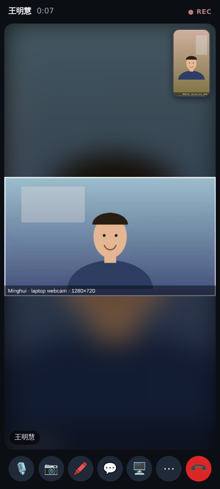
After — the whole webcam picture with a blurred letterbox; his own portrait self-view top-right.

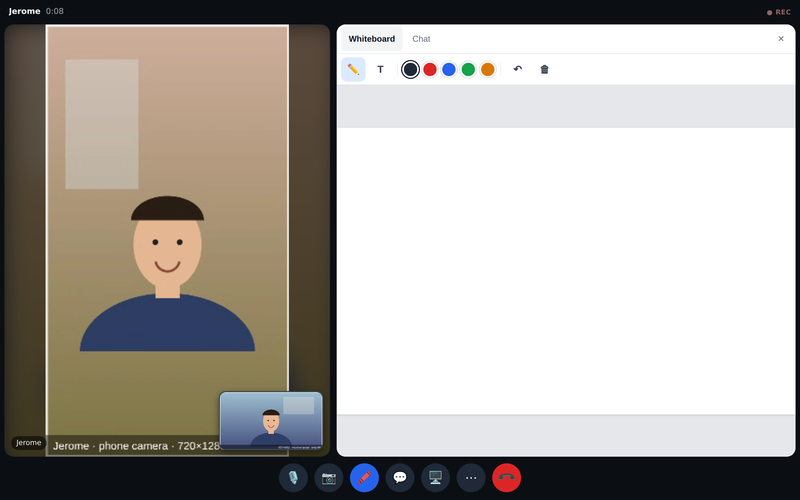
Wide window with the whiteboard open: the stage beside the panel, the feed still whole.

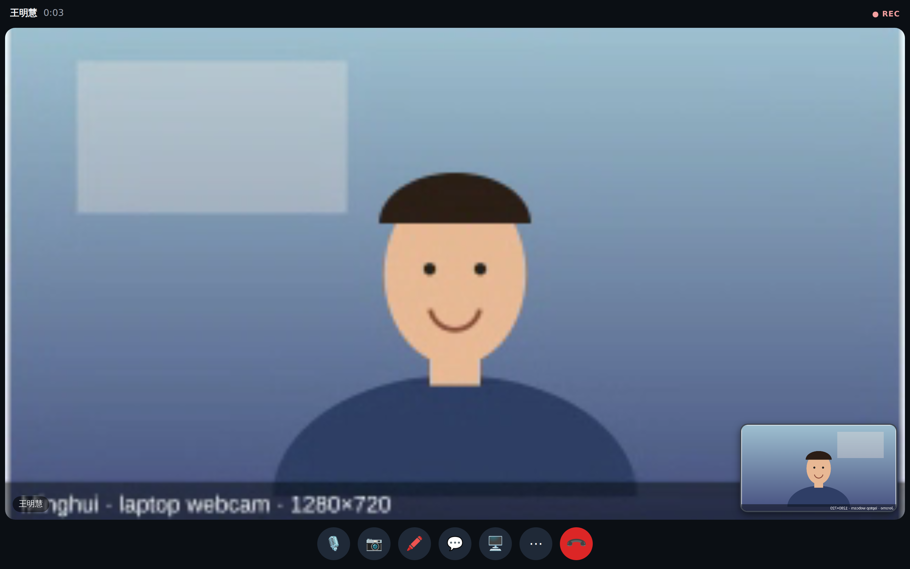
Laptop ↔ laptop: the shapes are within 15 %, so the feed fills the stage (cover).

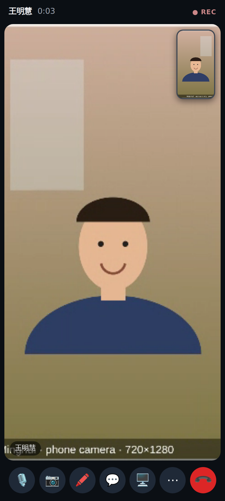
Phone ↔ phone: portrait in portrait fills the stage (cover).

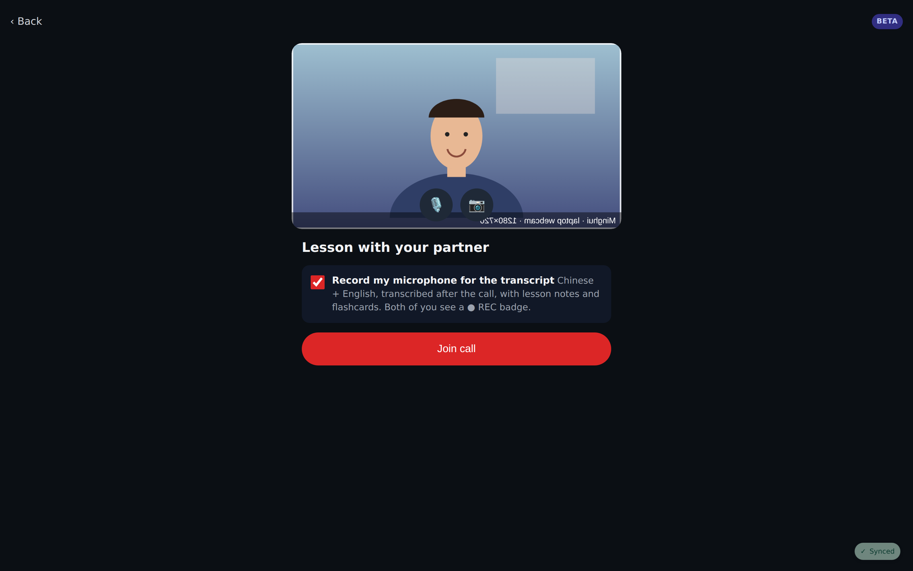
Pre-join preview takes the webcam's landscape shape instead of a fixed 3:4 crop.

## Lab app (Roborazzi)

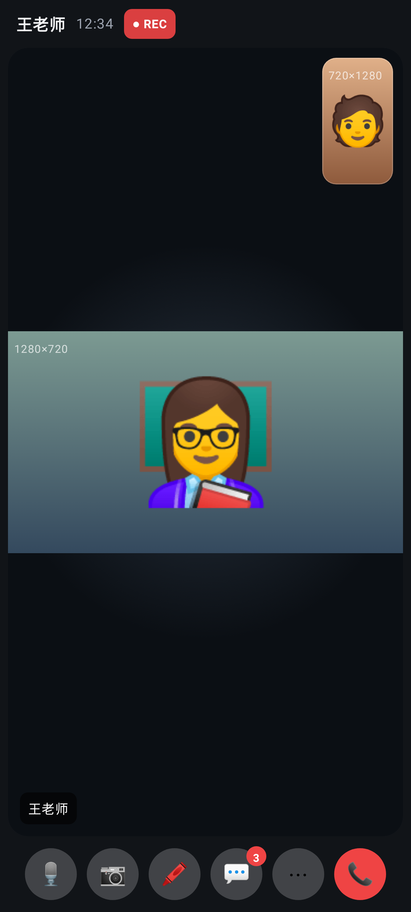
Phone with a landscape remote: whole picture on a dark letterbox; self-view shaped like the phone camera.

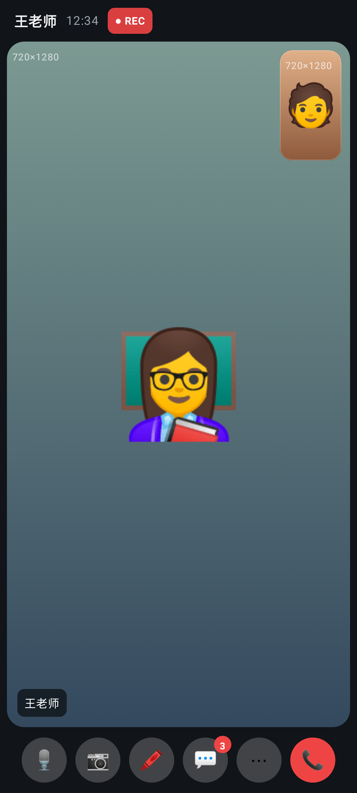
Phone with a portrait remote: fills the stage.

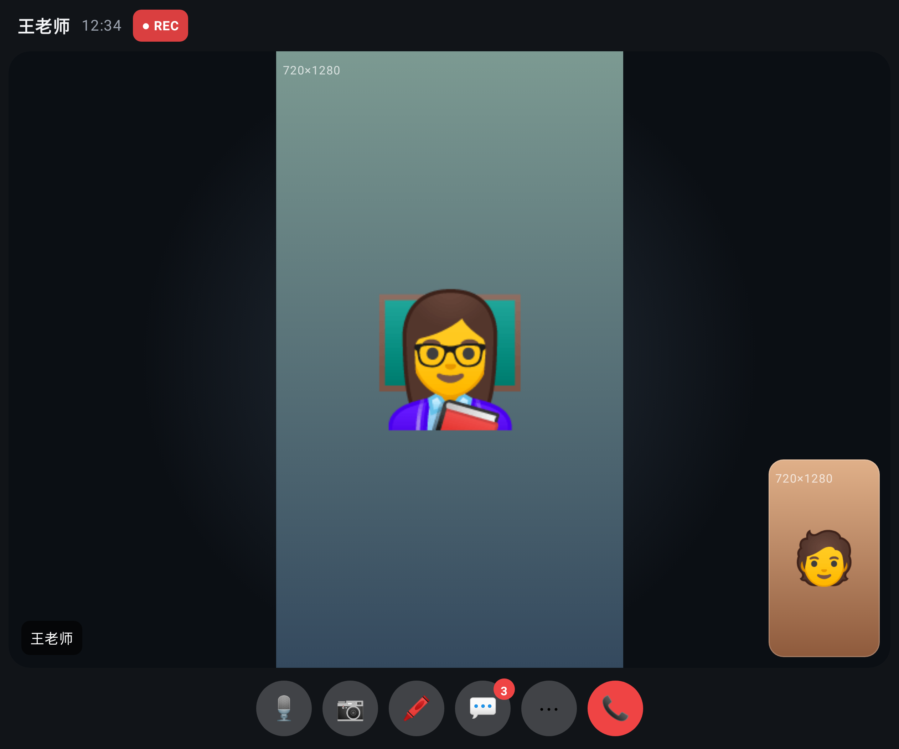
Unfolded with a portrait remote: shown whole, self-view bottom-right.

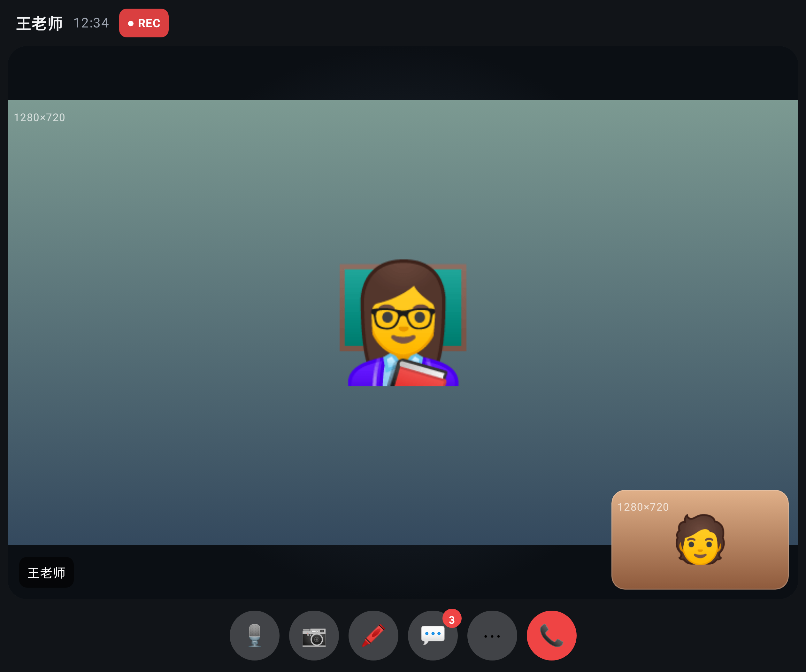
Unfolded with a landscape remote and a landscape self camera.

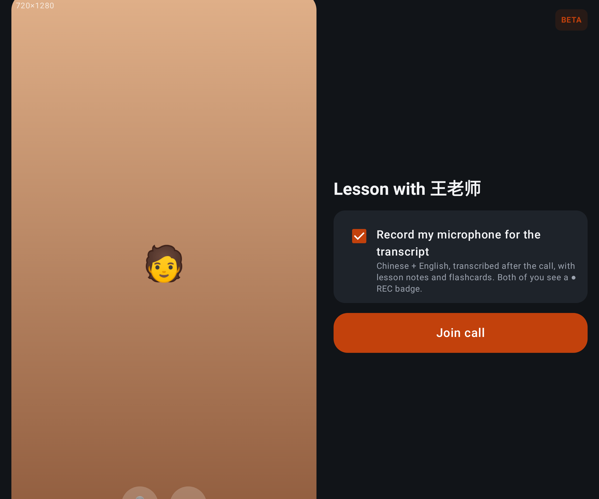
Pre-join preview in the camera's shape.
