# Flag a card for the tutor · Claude conversations · card page

Phone viewport 412×915 @2×. Seeded locally: student "Jerome", tutor "Tutor Li", deck 银行 smoke.

## Student

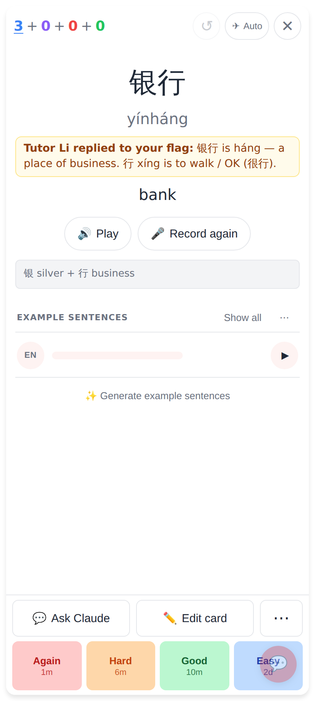
Card back — "Tutor Li replied to your flag: …" under the pinyin, the next time the card came up (once).

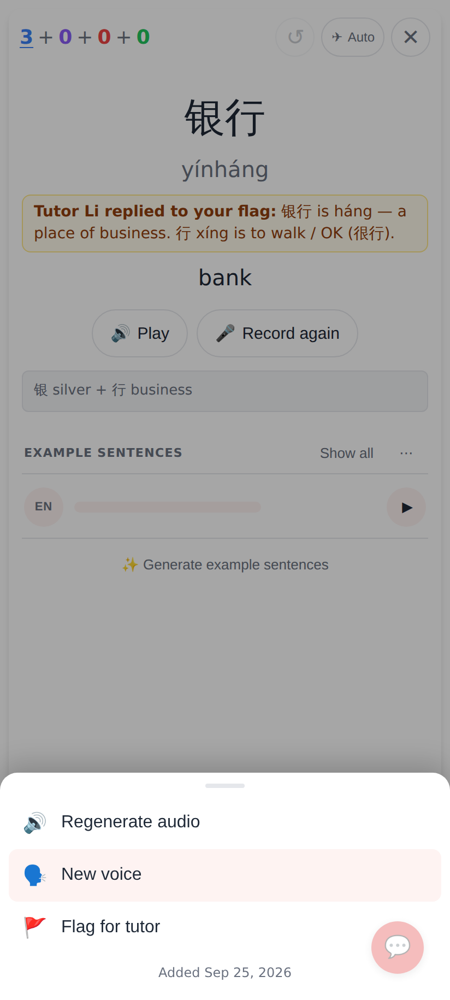
The ⋯ sheet on the card back gains **🚩 Flag for tutor** (only when the account has a human tutor).

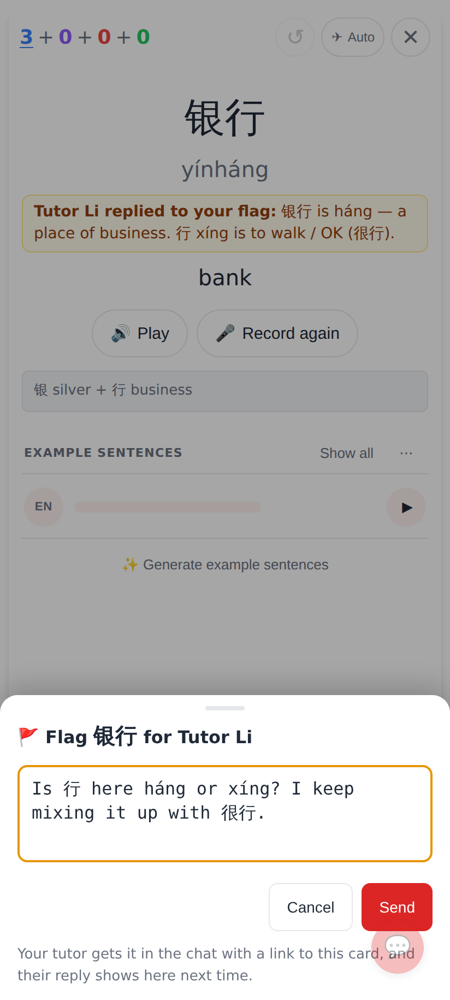
The flag sheet: one note, Send. Works offline (queued, posted by the next sync).

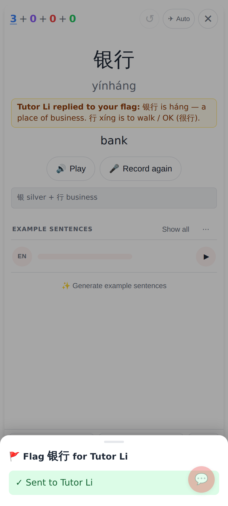
Confirmation, then the sheet closes on its own.

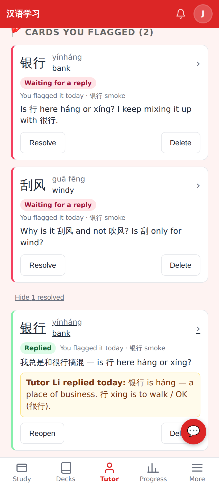
The student's tutor page: **Cards you flagged** — open ones first, resolved ones behind a toggle, with the tutor's reply.

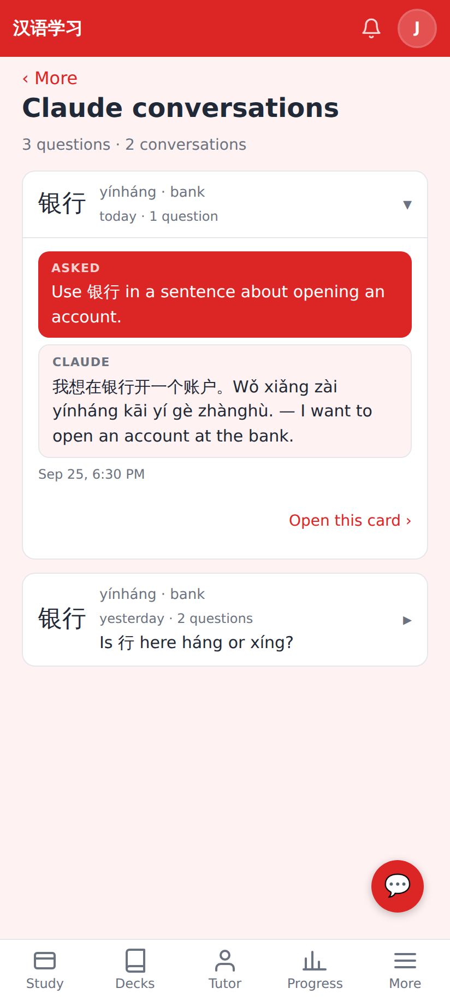
**More → Claude conversations**: every Ask-Claude question, grouped into conversations per card; tap to read.

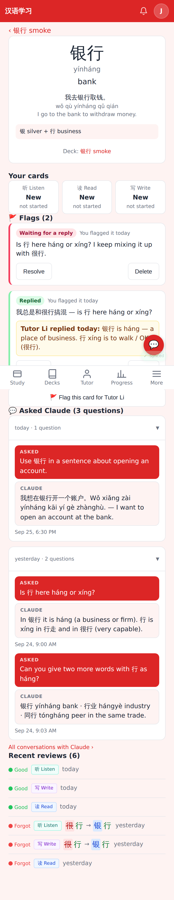
The student's card page (`/cards/:noteId`, from the deck page's History or a flag): the word, its three cards, flags (and a flag form), Claude conversations, recent reviews.

## Tutor

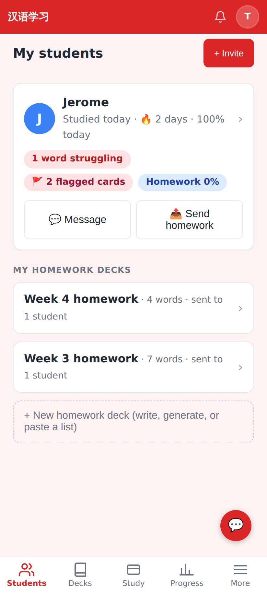
Students dashboard: a **🚩 n flagged cards** pill while any wait for a reply.

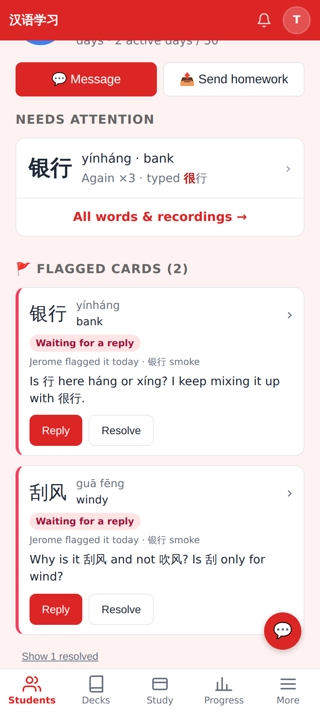
The student page: **Flagged cards** under Needs attention, each with the student's note, **Reply** and **Resolve**.

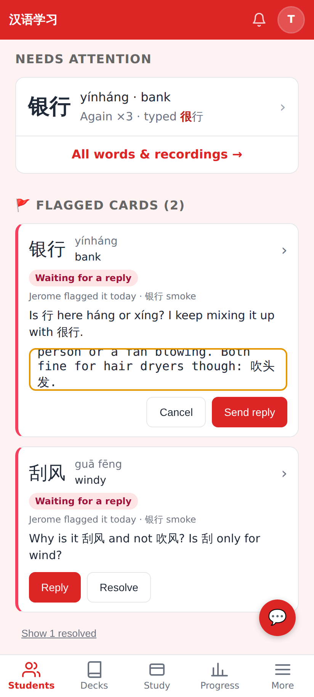
Replying inline. The reply resolves the flag, goes into the chat and is shown to the student once on that card.

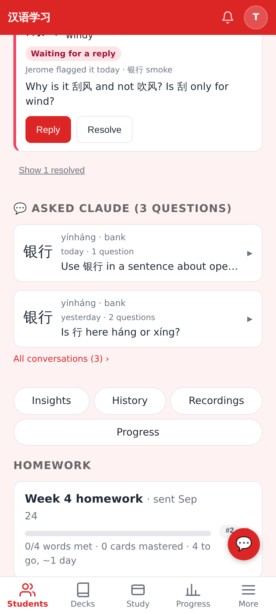
**Asked Claude**: the student's latest conversations with Claude about their cards; *All conversations* for the full list.

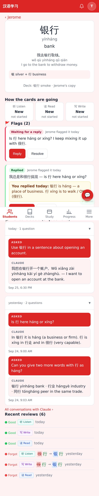
The tutor's card page (`/connections/:relId/cards/:noteId`, full page): note, how the three cards are going, flags with reply box, Claude conversations, recent reviews with typed answers.

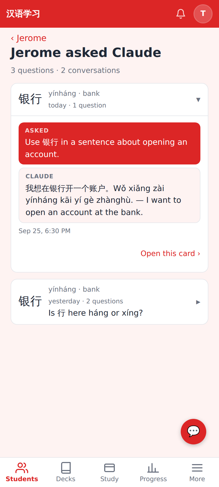
`/connections/:relId/claude-chats`: all of the student's conversations, newest first, one opened.
