# Word checks + 一/不 tone changes — screenshots

Web app at 412×915 (2×). Lab app shots are in [lab/](lab/).

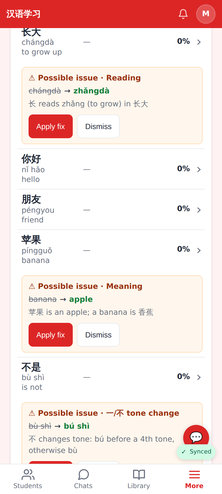
A new word with a likely mistake: "⚠ Possible issue", current → proposed, why, Apply fix / Dismiss.

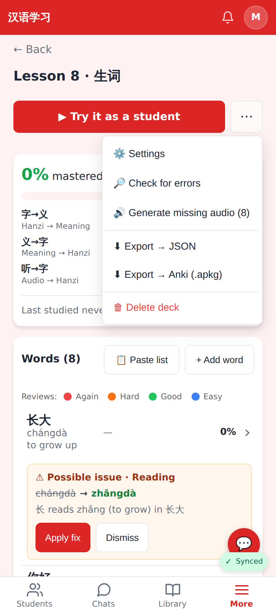
"🔎 Check for errors" in the deck's ⋯ menu.

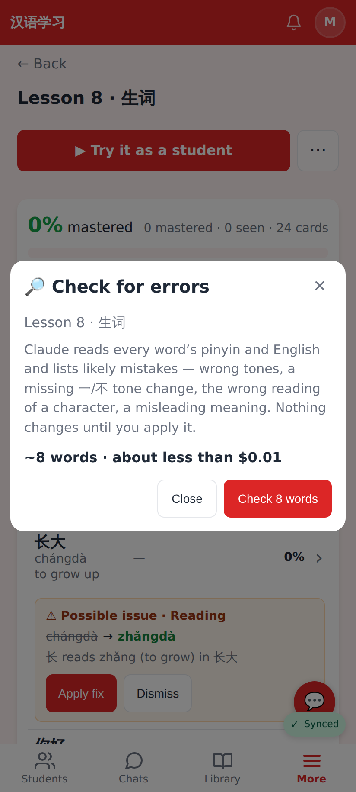
The estimate before anything runs.

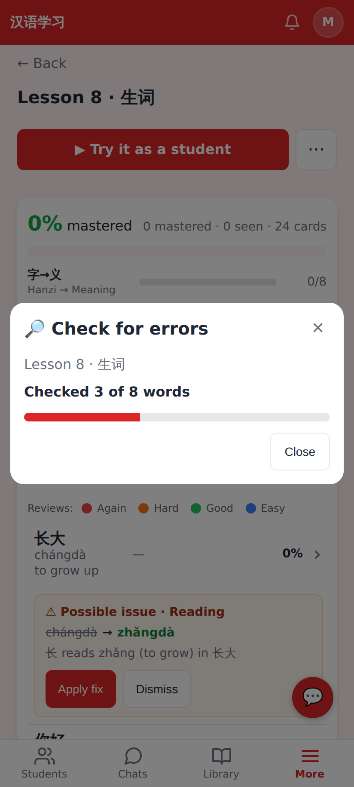
Progress while Claude checks the deck in batches.

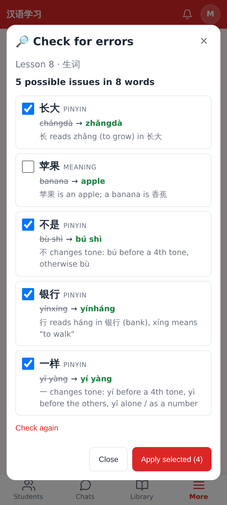
Current → proposed, the reason, a checkbox each (苹果 unticked) and Apply selected.

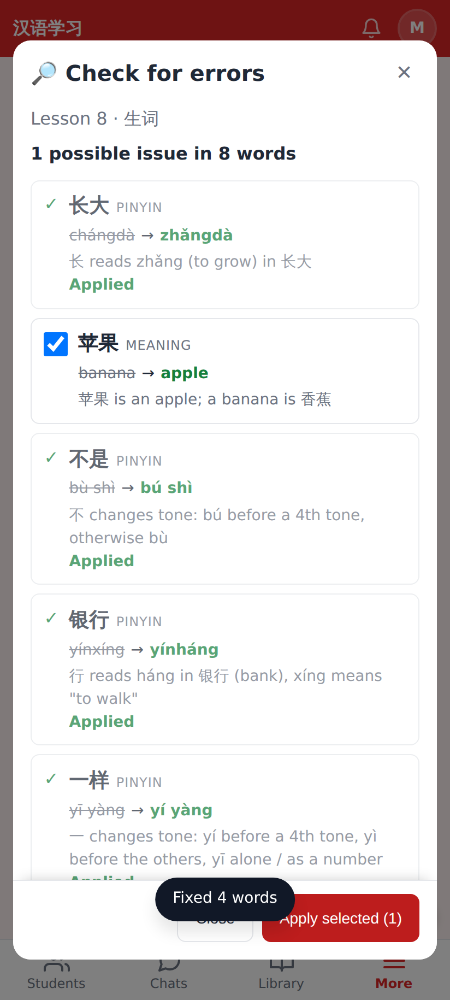
After Apply selected: only the ticked fixes changed.

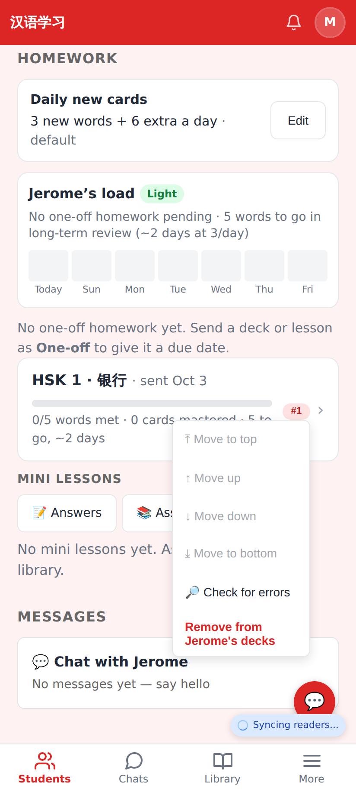
The tutor's student page: Check for errors on a homework deck she sent.

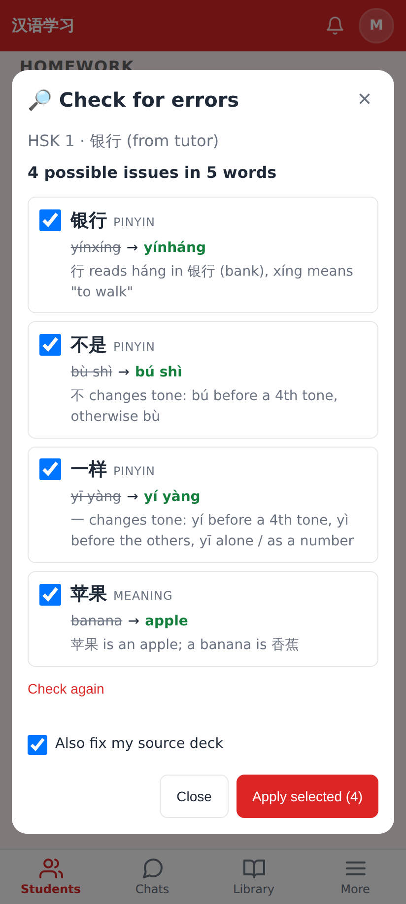
Checking the student's copy, with "Also fix my source deck".

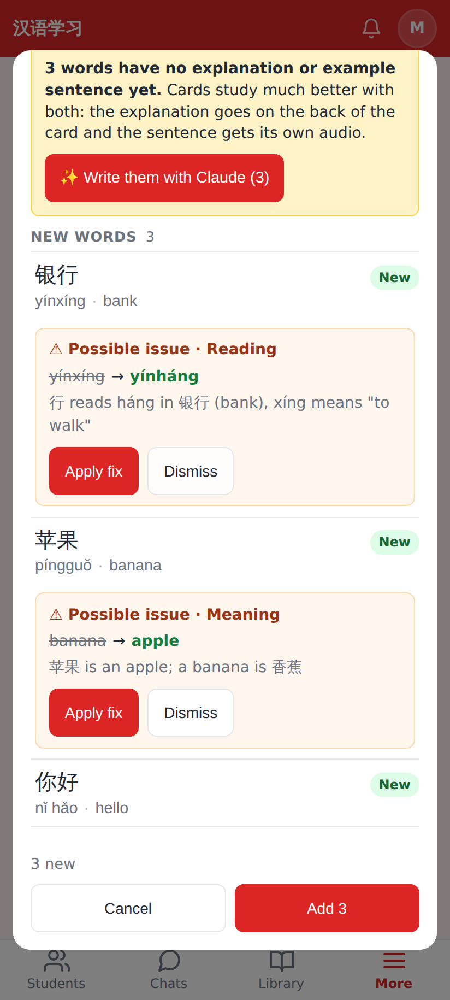
Paste a list flags rows before they are saved.

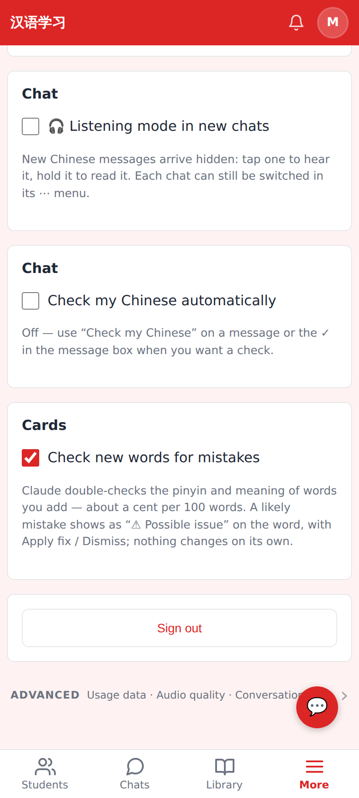
Settings → Cards → "Check new words for mistakes" (on by default for tutors).

## Lab app

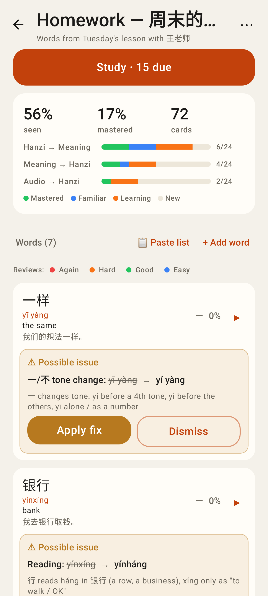
Deck detail: ⚠ Possible issue with Apply fix / Dismiss.

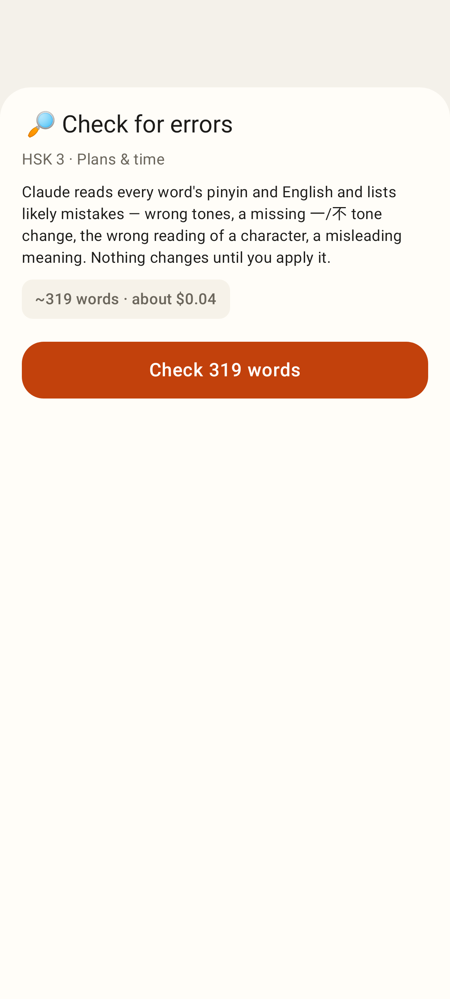
Check for errors: the estimate.

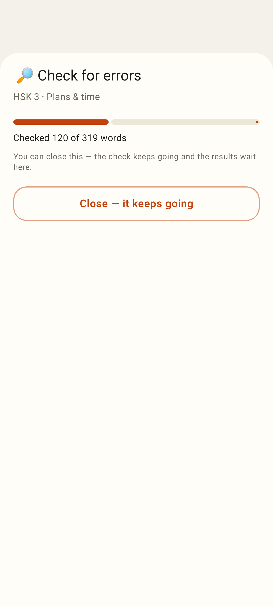
Progress.

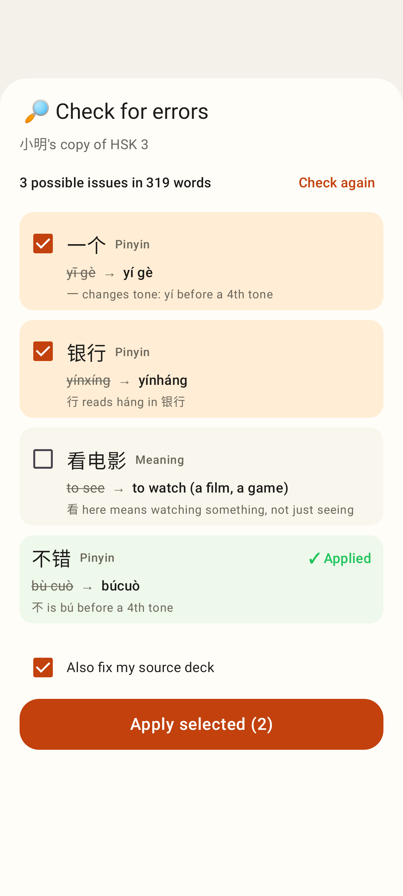
Review list on a student's copy, with "Also fix my source deck".

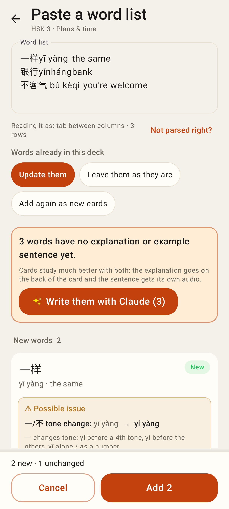
Paste a list preview warning.

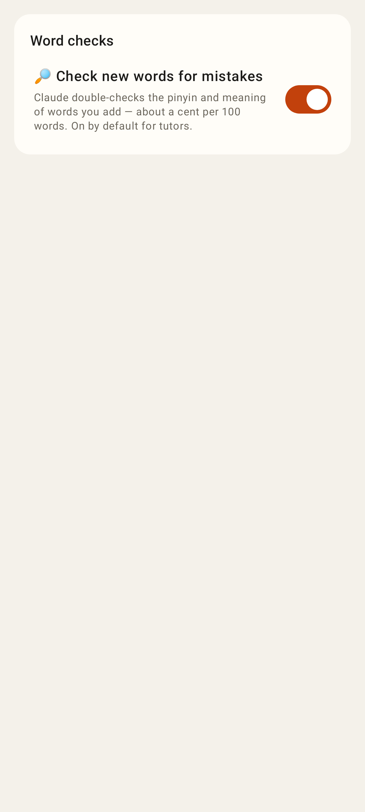
Settings switch.
