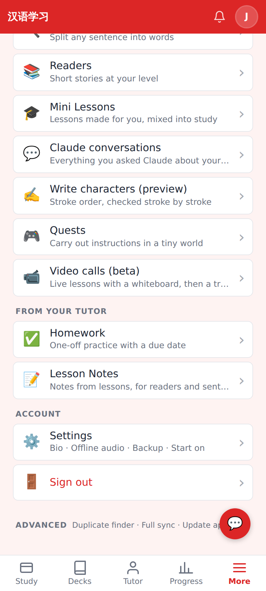
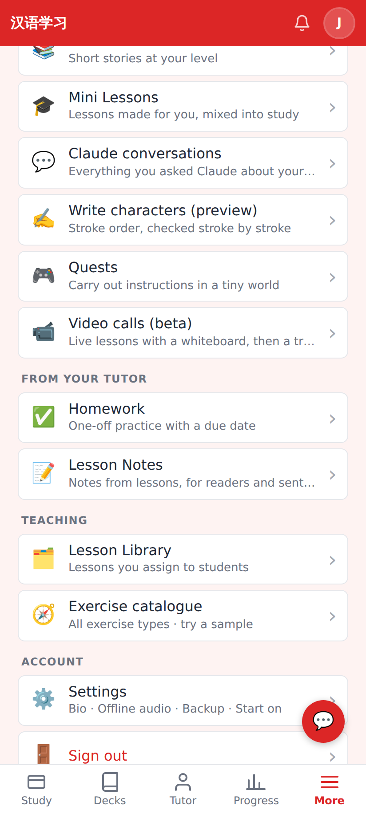
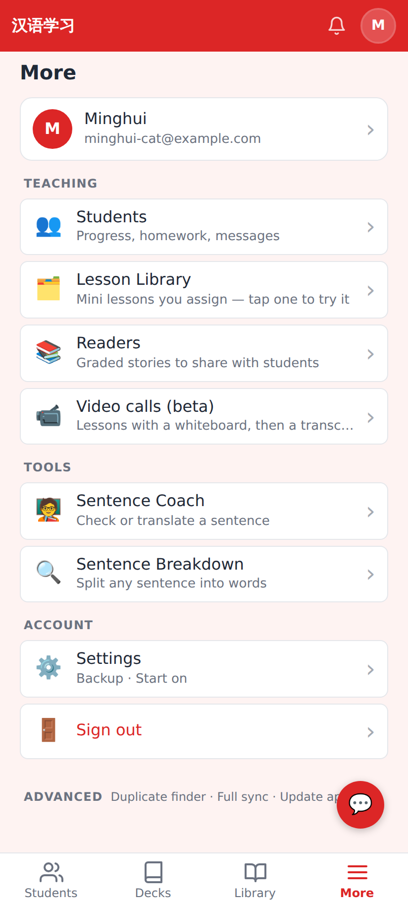
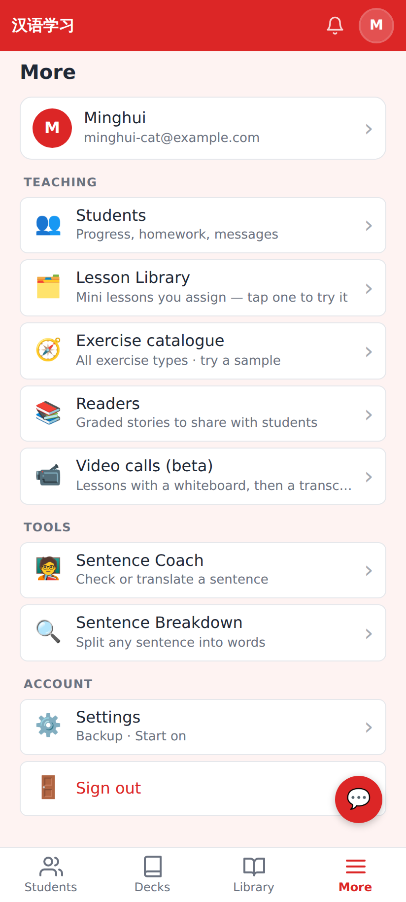
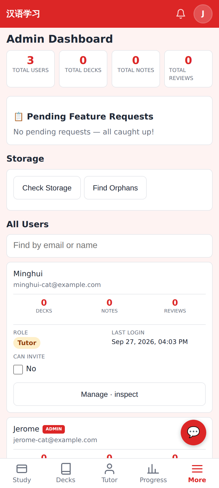
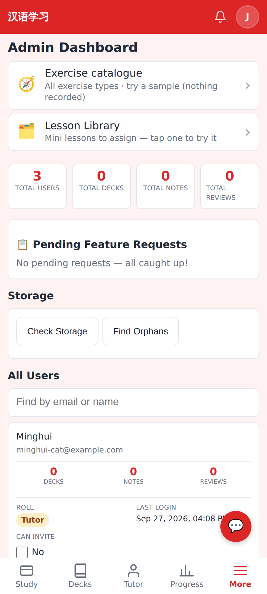
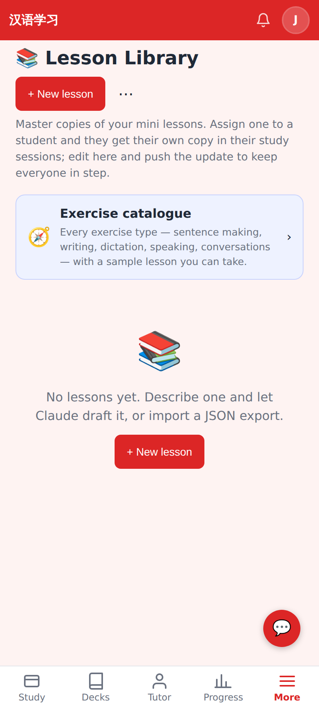
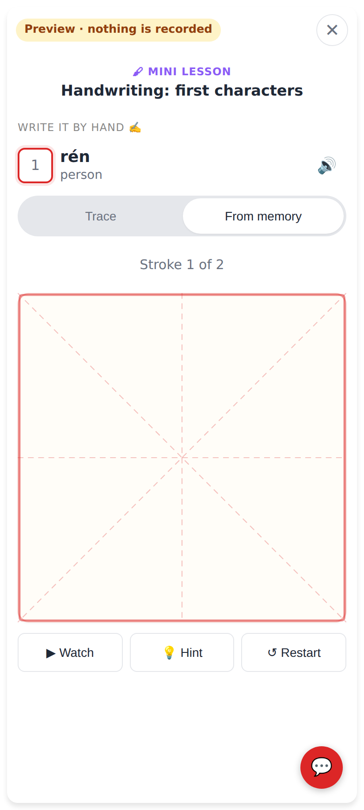

# Exercise catalogue entry points

Phone viewport (412×915 @2×). "Admin student" = role student + is_admin (Jerome); "tutor" = role tutor (Minghui).

Before — More for an admin who is a student with no students / library items: no Teaching section, no way to the catalogue.

After — admins always get More → Teaching → Lesson Library + **Exercise catalogue**.

Before — a tutor account's More → Teaching had the library but no catalogue row.

After — More → Teaching → **Exercise catalogue** right under Lesson Library.

Before — the admin page.

After — shortcuts to the Exercise catalogue and the Lesson Library at the top of the admin page.

Unchanged — the catalogue card already sits at the top of the Lesson Library (now reachable for admins from More).

"Try it" on a sample works for an admin who is a student — preview mode, nothing recorded.
