# Character sheet — screenshots

Web app, 412×915 @2× (Pixel Fold folded):

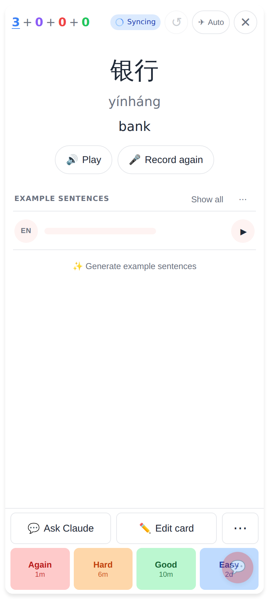
The card back of 银行 — each character is tappable.

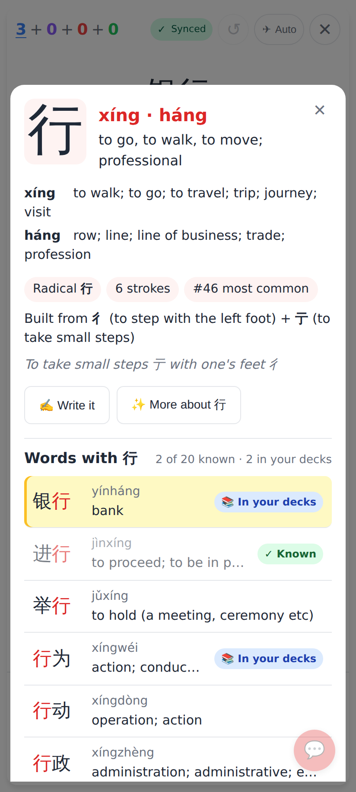
Tap 行: readings, meaning, radical / strokes / rank, components, etymology; "Words with 行" — the card's word first and highlighted, ✓ Known (dimmed) and 📚 In your decks badges.

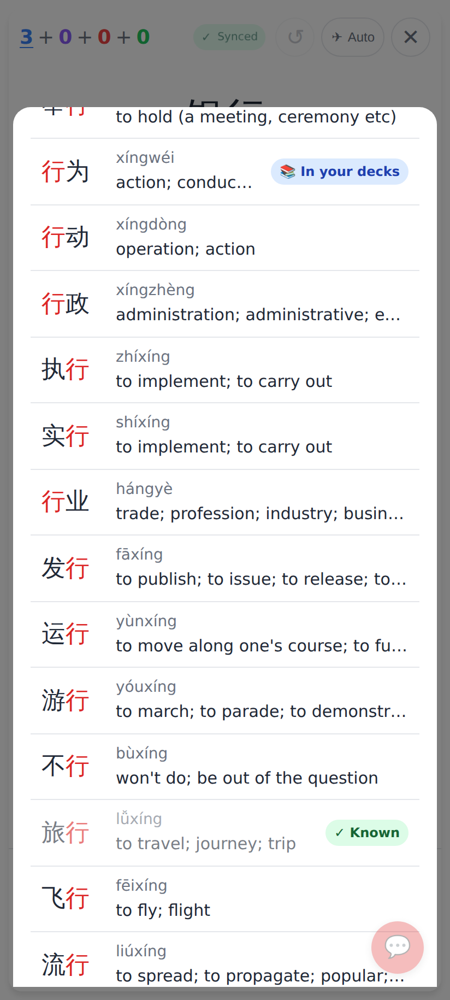
Further down the 20 frequent words, in frequency order.

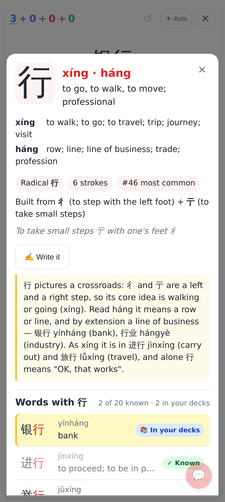
"✨ More about 行": a short card-independent explanation, cached for everyone.

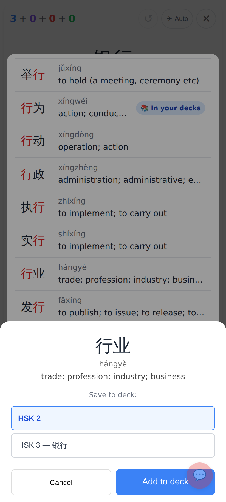
Tap 行业 (not in any deck): the add-card sheet, top deck preselected.

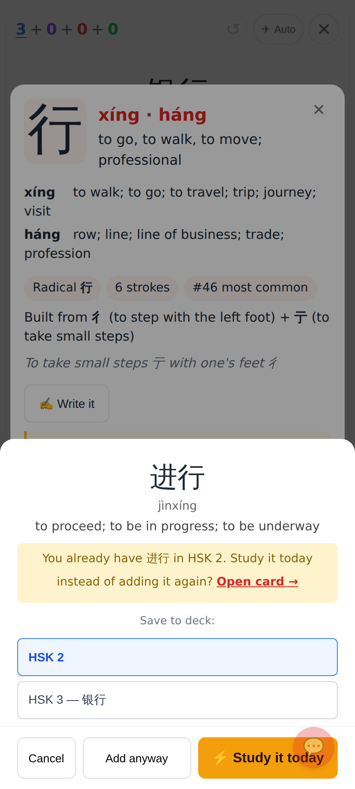
Tap 进行 (already known): ⚡ Study it today, Add anyway, Open card →.

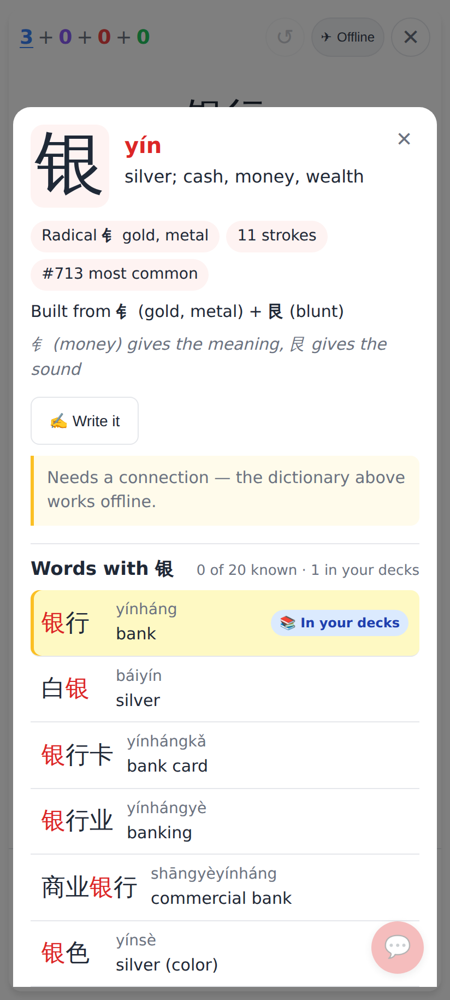
Offline: the dictionary is on the device (prefetched in sync); "More about" says it needs a connection.

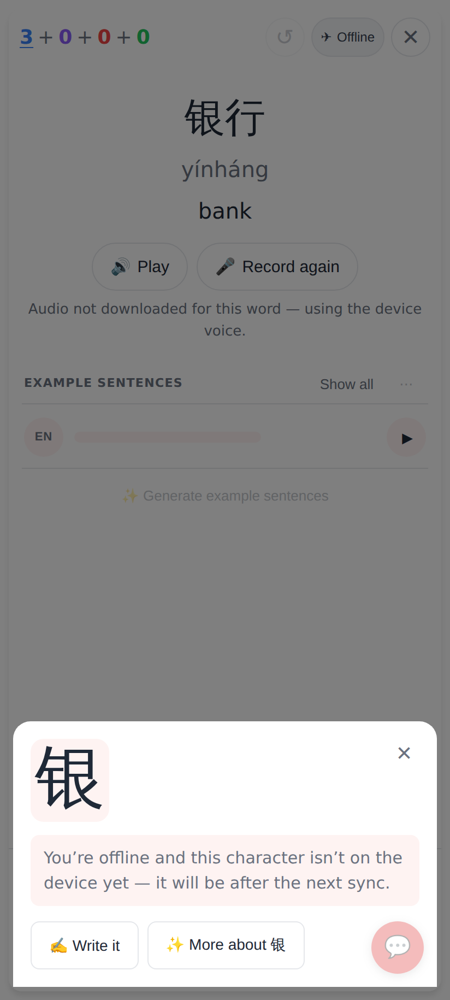
Offline and never fetched.

Lab app (Roborazzi, 412dp):

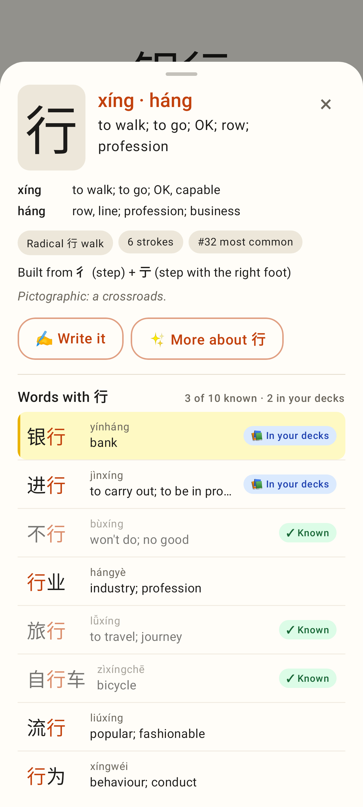
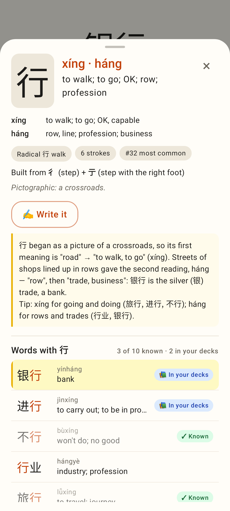
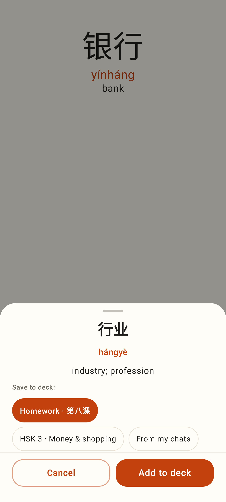
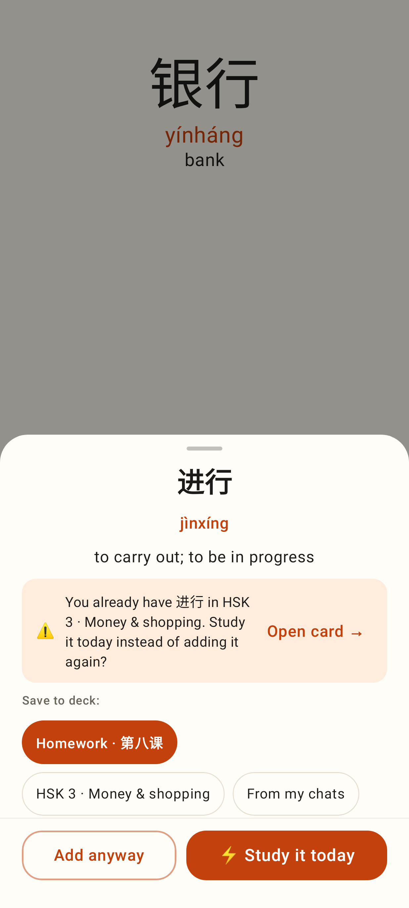
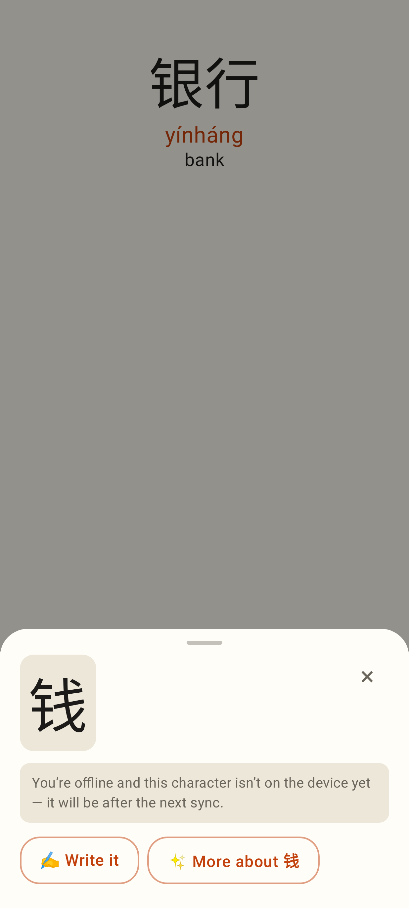
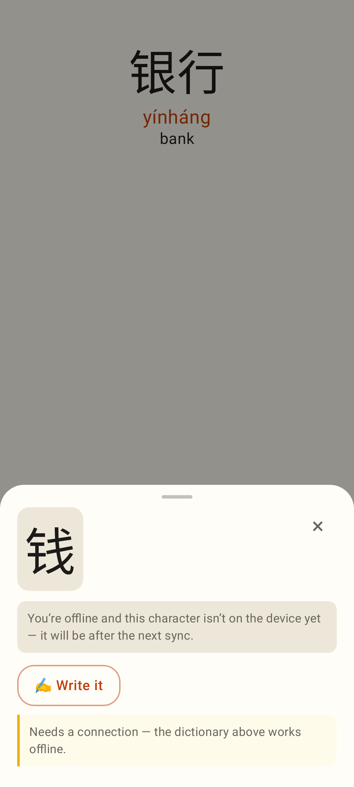
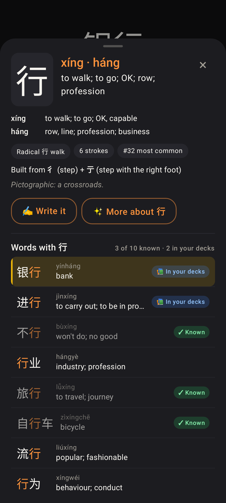
