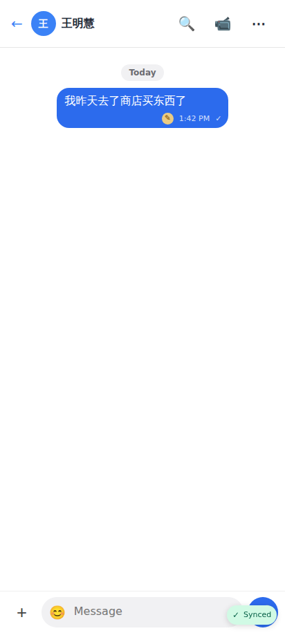
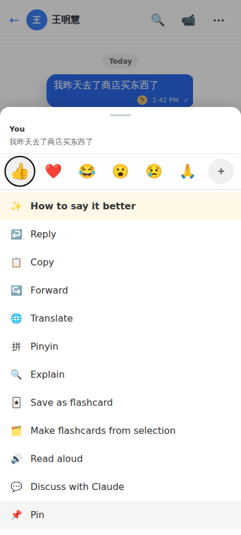
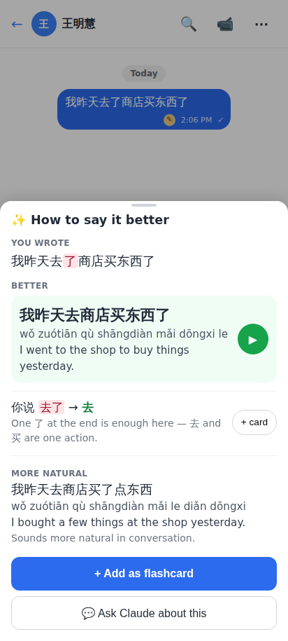
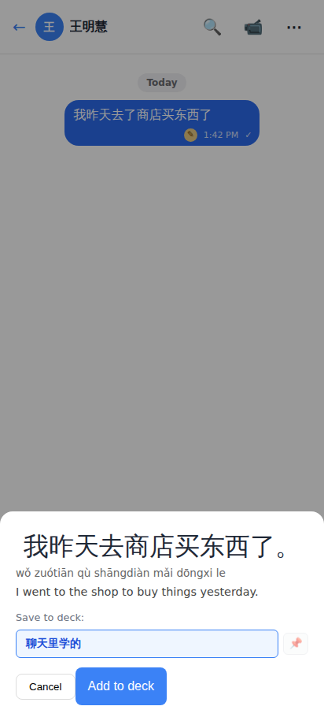
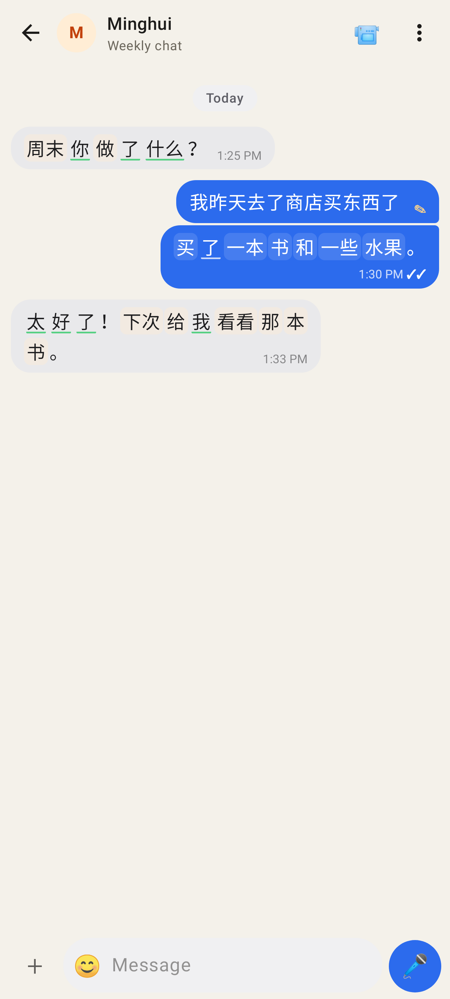
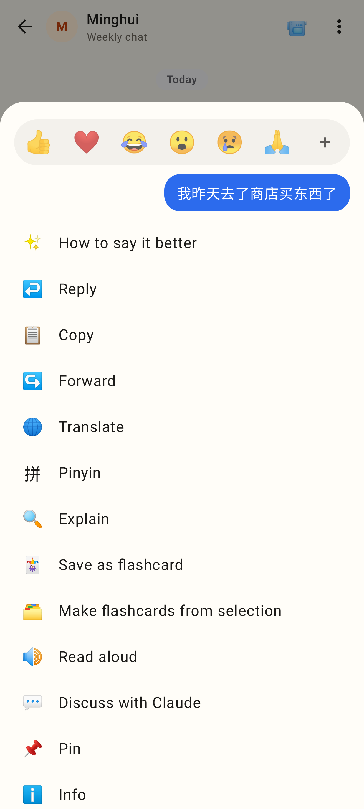
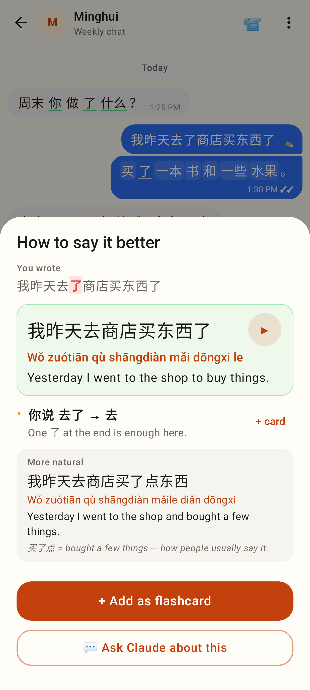
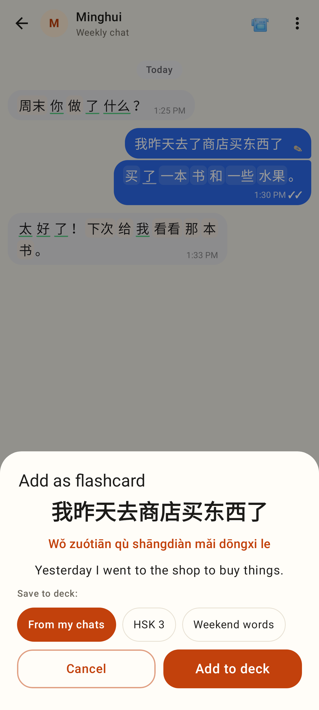

# Chat auto-check — "How to say it better"

Web (412×915):

The student's message got a quiet amber ✎ next to the time after the background check.

"✨ How to say it better" is the first item.

What I wrote (the extra 了 highlighted), the better sentence with pinyin and ▶, the mistake with why, a more natural way.

"+ Add as flashcard" opens the usual add-card sheet with the corrected sentence.

Lab app (412dp):

