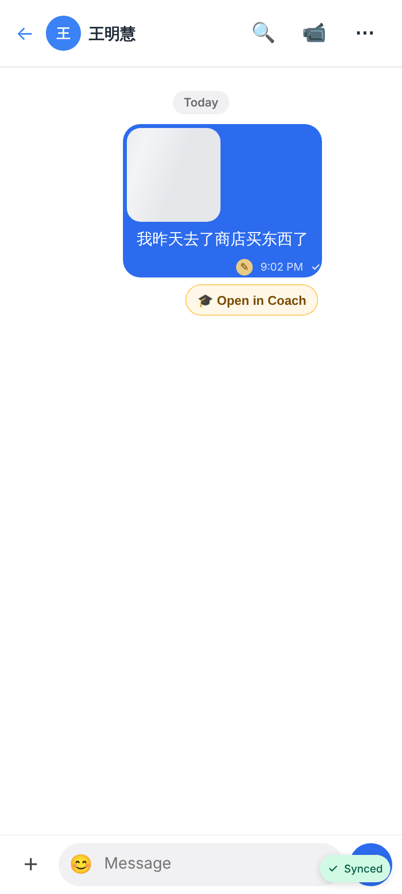
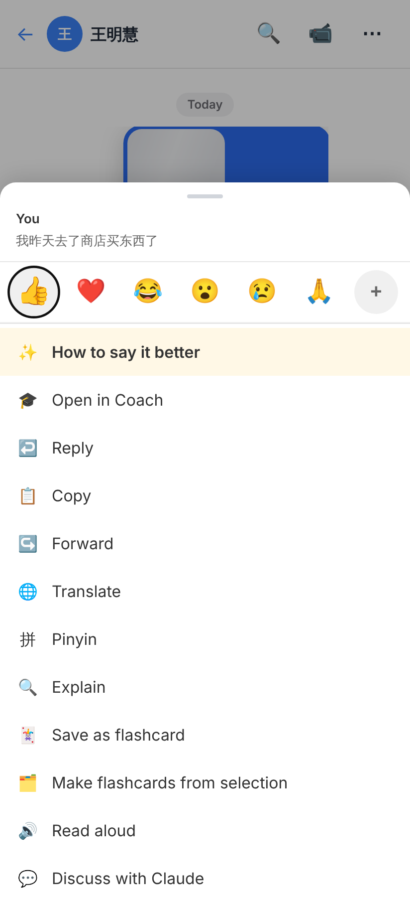
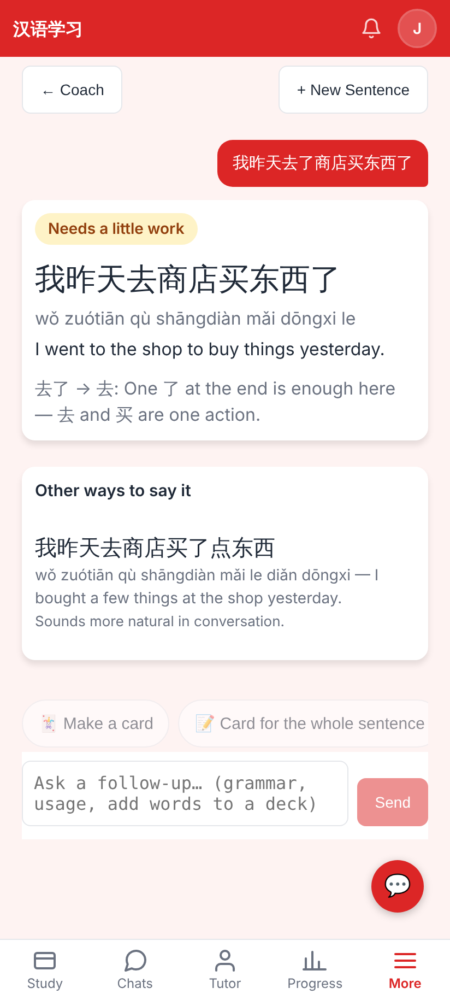
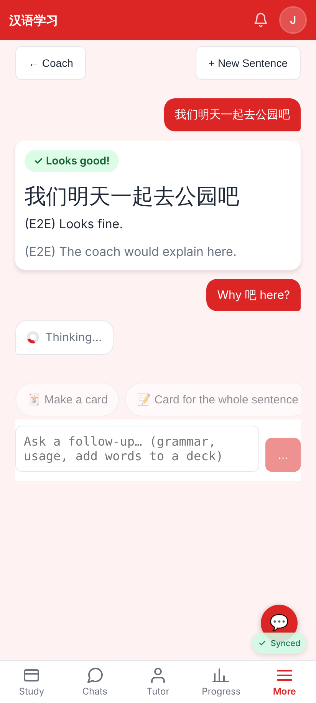
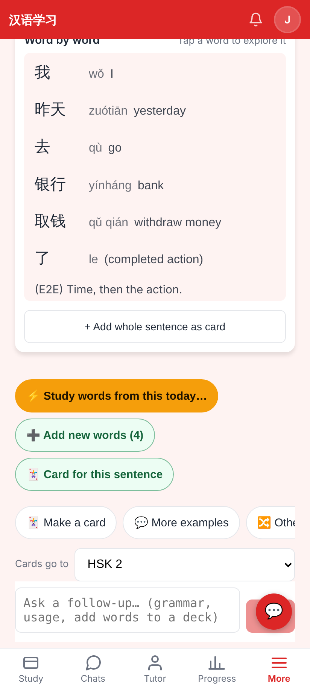
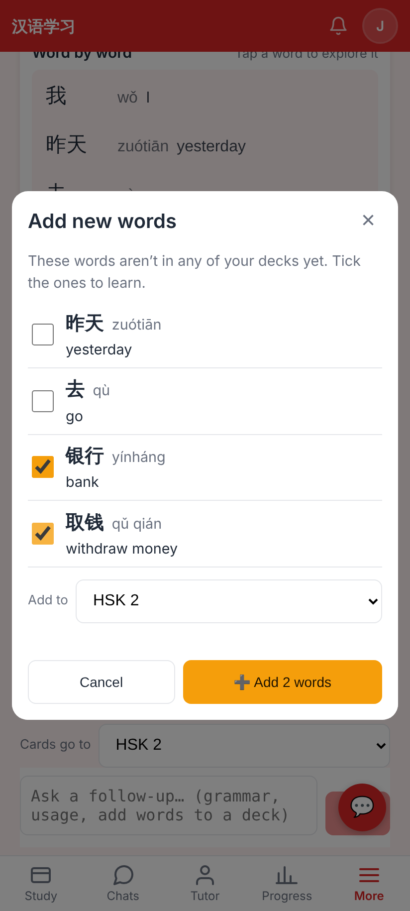
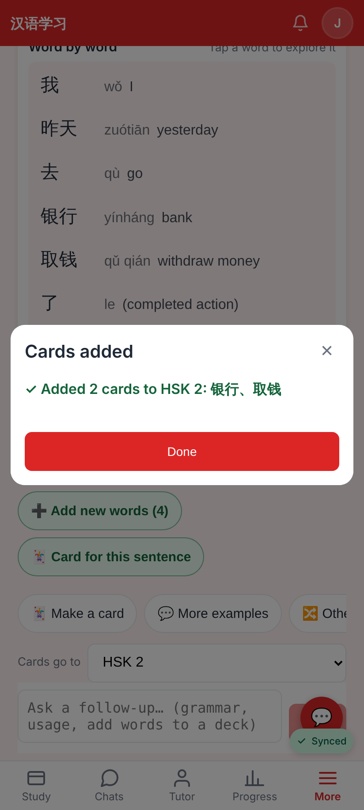

# Chat ↔ Coach — screenshots (412×915 @2×)

## Web

A photo with a Chinese caption is now auto-checked: the ✎ mark plus a small "🎓 Open in Coach" chip under the bubble.

The long-press menu: "How to say it better" first, "Open in Coach" second.

Open in Coach → the Coach shows the chat's check result at once (no second Claude call) and keeps it in the history.

A follow-up reply is written in the background — leaving the page no longer cancels it; coming back shows it.

Direct quick actions on their own wrapping row: ⚡ Study words… · ➕ Add new words (4) · 🃏 Card for this sentence.

"Add new words": only the words in none of his decks, nothing ticked by default, deck = top of the study queue.

Added in one batch call.
