# Chat add-card sheets: top deck preselected, button always visible

All shots at 412×915 (2×) with 25 decks; the study queue has "Homework · 第八课" on top.

## Web

| Before | After |
|---|---|
| 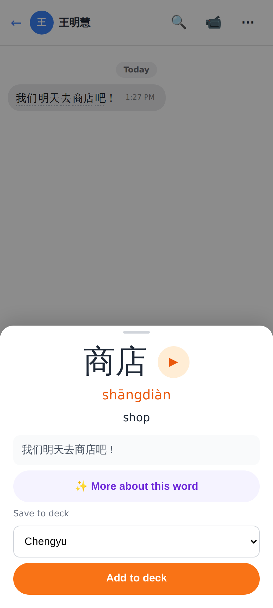 | 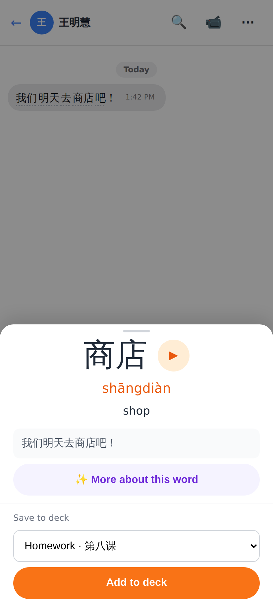 |
| 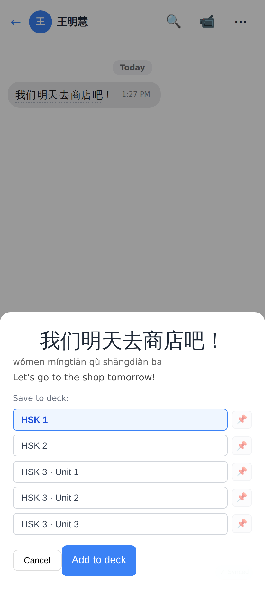 | 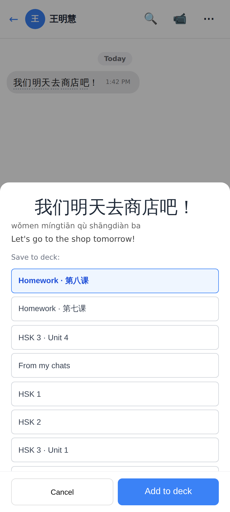 |
|  |  |

1. Word chip → + Add as card: was "Chengyu" (first alphabetically), now the top of the queue; the add part is pinned under the scrolling body.
2. ⋯ → Save as flashcard: was "HSK 1" first with 📌 buttons; now queue order, top deck selected, the deck list scrolls on its own and Cancel / Add to deck are pinned.
3. Make flashcards: was the last deck used (else the first); now the top deck every time (the footer was already pinned).

## Lab app

| Before | After |
|---|---|
| 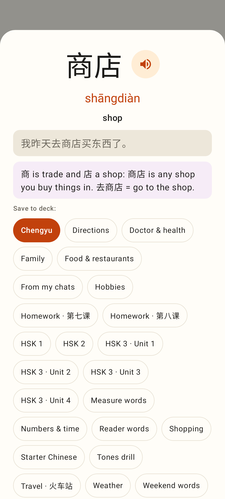 | 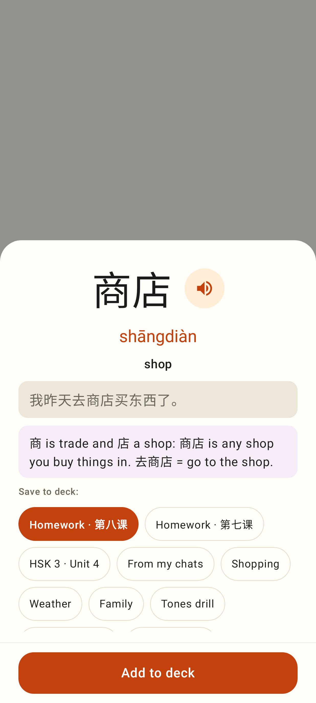 |
| 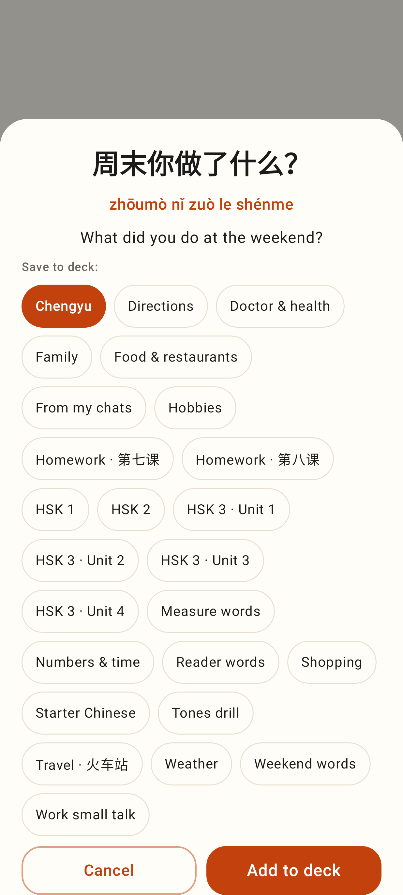 | 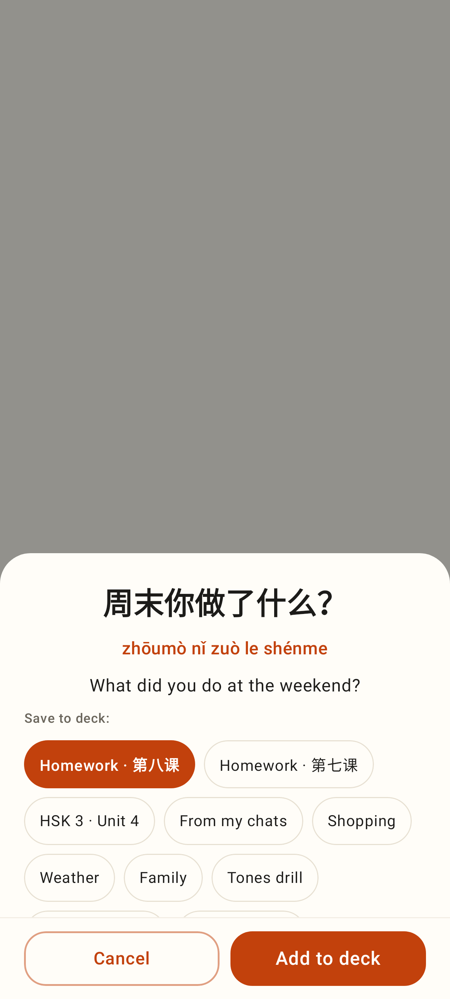 |
| 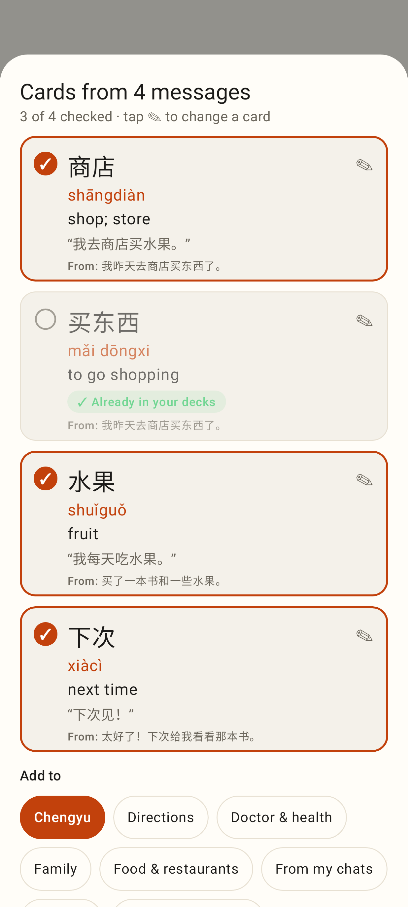 | 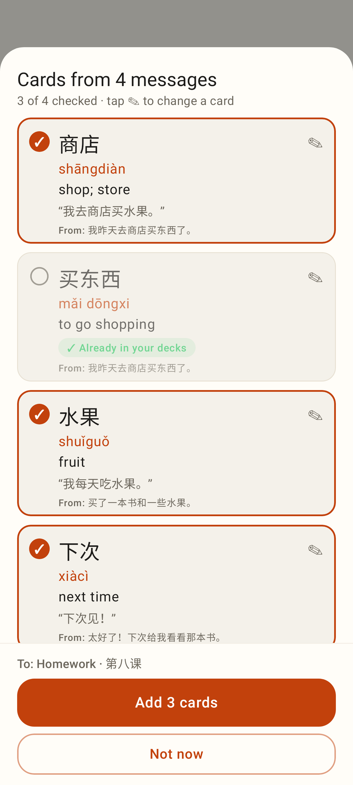 |

1. Word sheet: alphabetical chips filled the sheet and pushed "Add to deck" off screen; now the chips (queue order, top deck selected) scroll in a ~3-row region and the button is pinned.
2. Save as flashcard: same, with Cancel / Add to deck pinned.
3. Make flashcards: the cards and chips scroll; "To: Homework · 第八课" and Add N cards stay pinned.

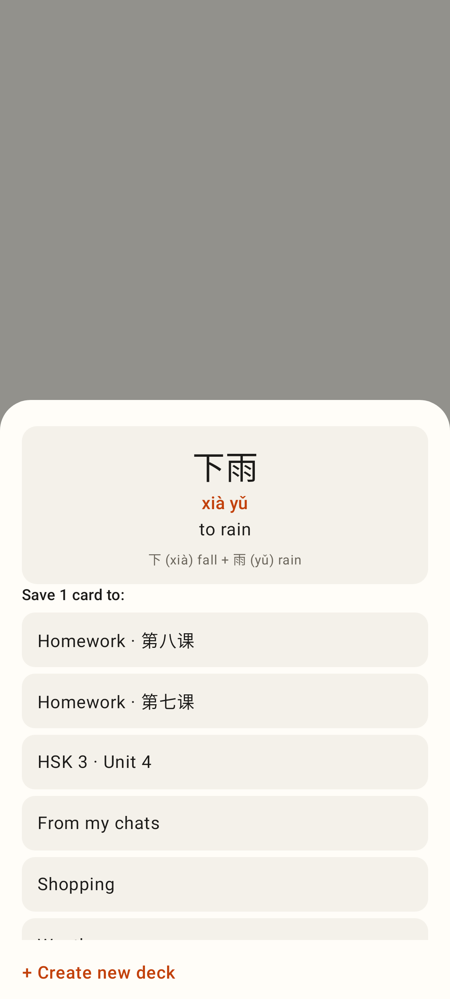
4. Tap-to-save list (Check result, Translate, a word from Word by word, Discuss): queue order, the rows scroll on their own so + Create new deck stays visible.

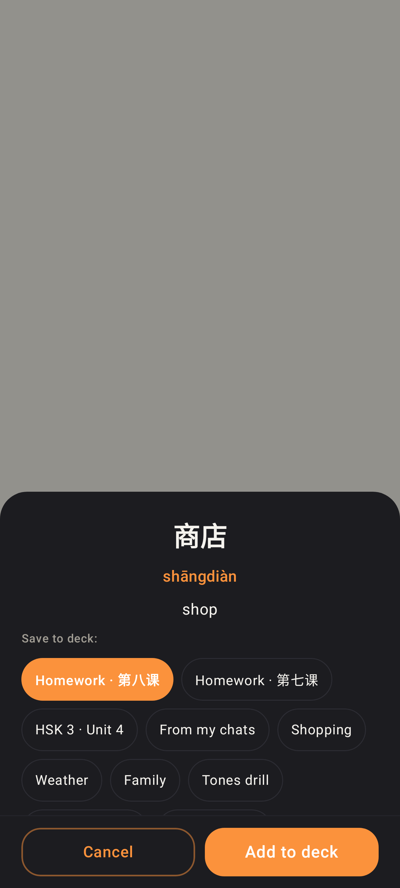
5. Dark theme.
