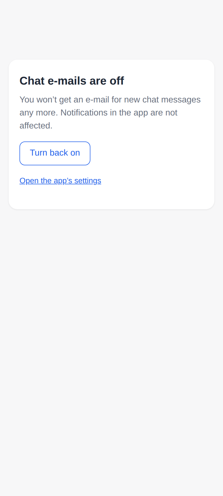
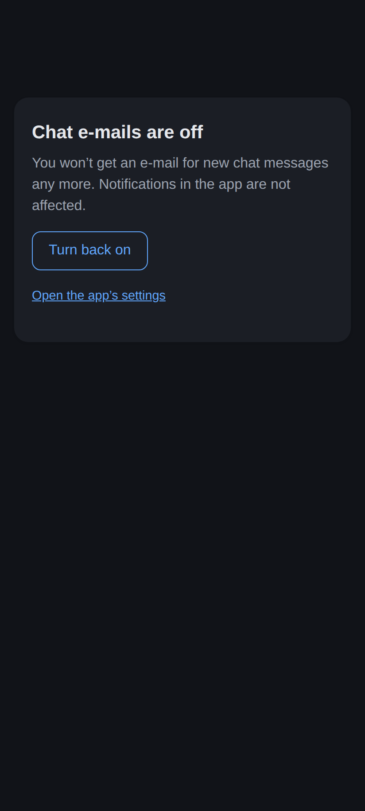
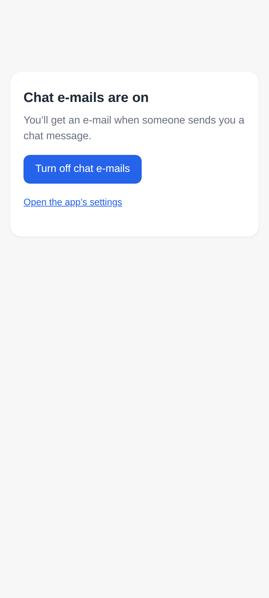
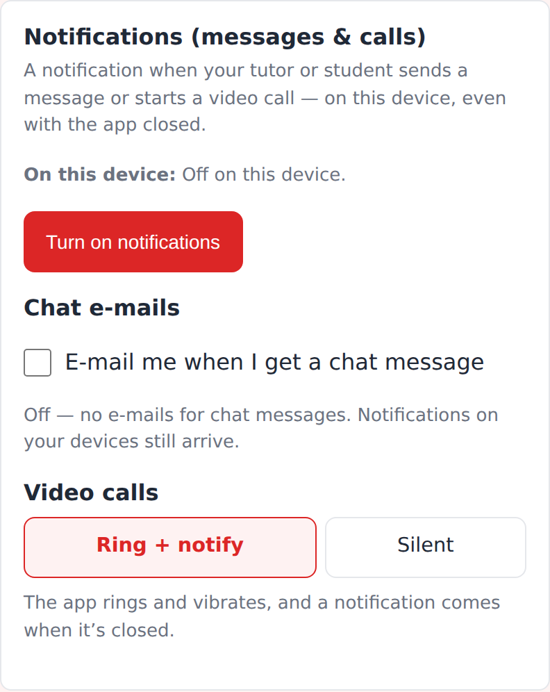
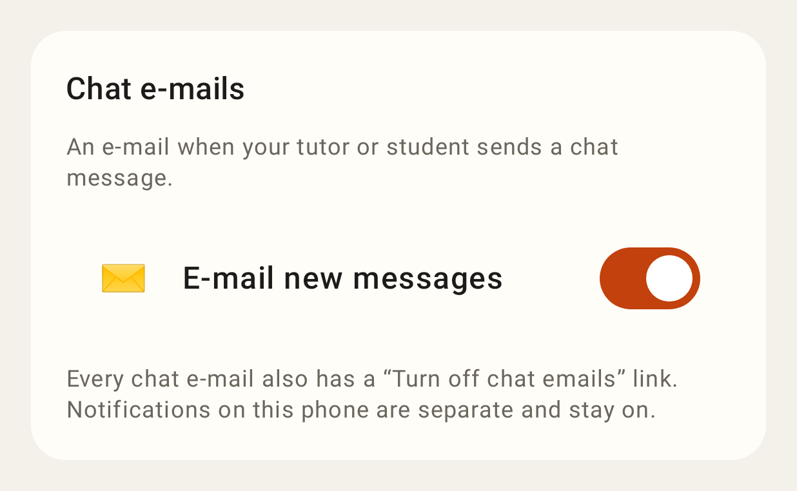
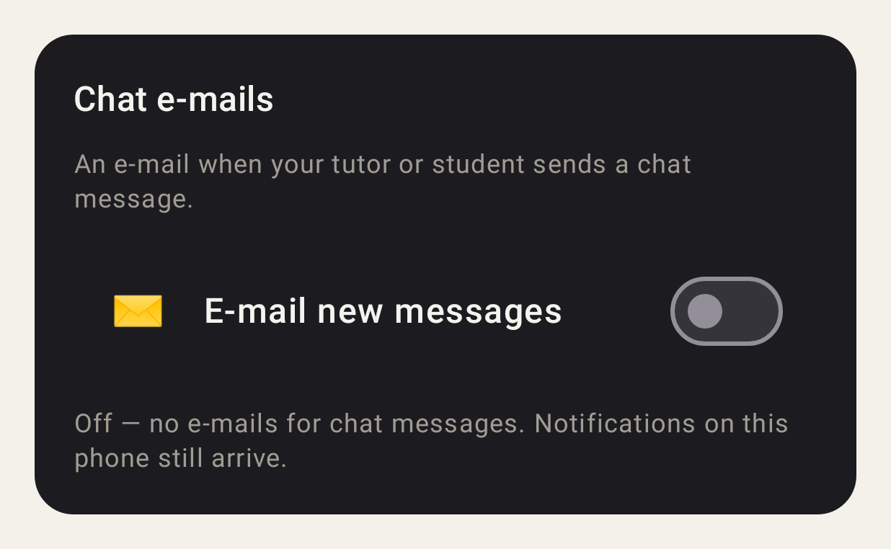

# Chat e-mail opt-out

The "Turn off chat emails" link in every chat e-mail: one tap, no sign-in — chat e-mails are off.

The same page in dark mode.

"Turn back on" switches them on again from the same page.

Web: Settings → Notifications → Chat e-mails (here off, after the link above).

Lab app: Settings → Chat e-mails.

Lab app, off, dark theme.
