# Chat PR 3 — learning tools in the chat (web)

Phone shots are 412×915 @2x; the tutor's correction flow is also shown at 1280 wide (Minghui uses desktop).
The Lab app's shots are in [lab/](lab/README.md).

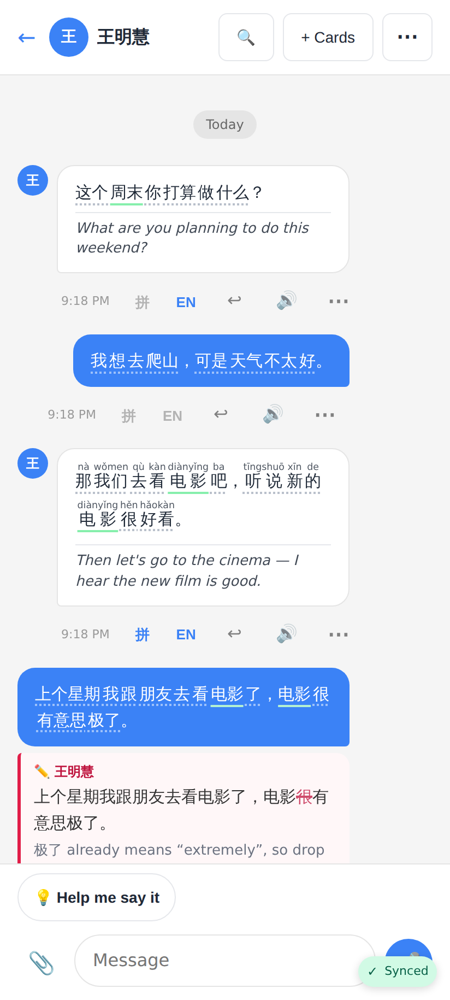
Word chips: a faint dotted underline means you can tap the word, and a green underline means it's already in a deck. 拼 puts pinyin over each word and EN shows the translation. Both toggles are remembered per conversation on the device.

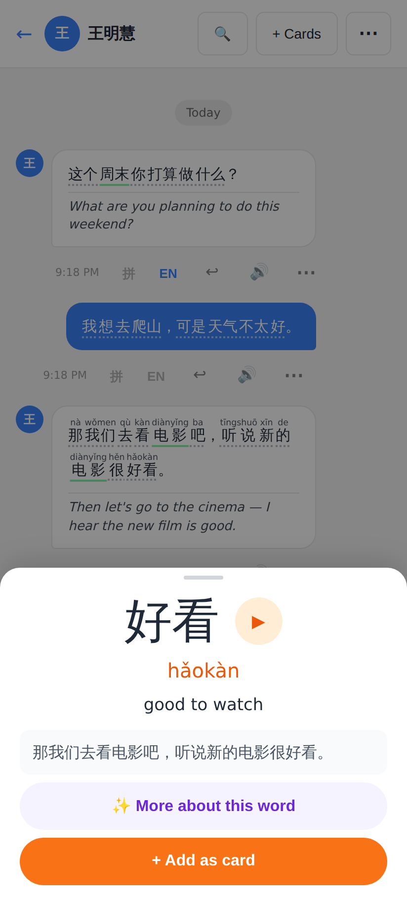
Tapping a word opens the reader's word sheet: ▶, the sentence, "More about this word" and "+ Add as card".

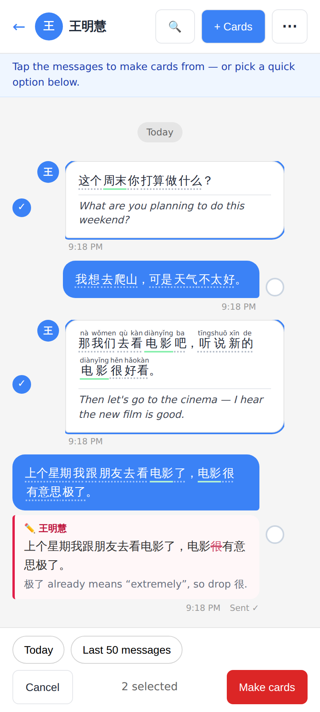
**+ Cards** (or ⋯ → Make flashcards) switches to picking mode. Tap messages to select them, or use the Today / Last 50 messages shortcuts.

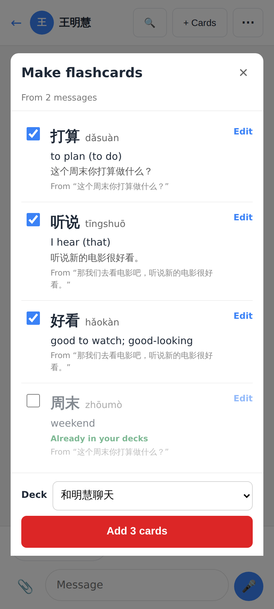
In the review, every card is ticked except words already in your decks. Each card shows the message it came from. The last deck you used is remembered. One tap adds the cards.

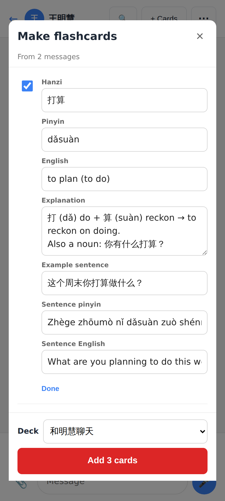
Edit opens all fields: hanzi, pinyin, English, explanation, example sentence.

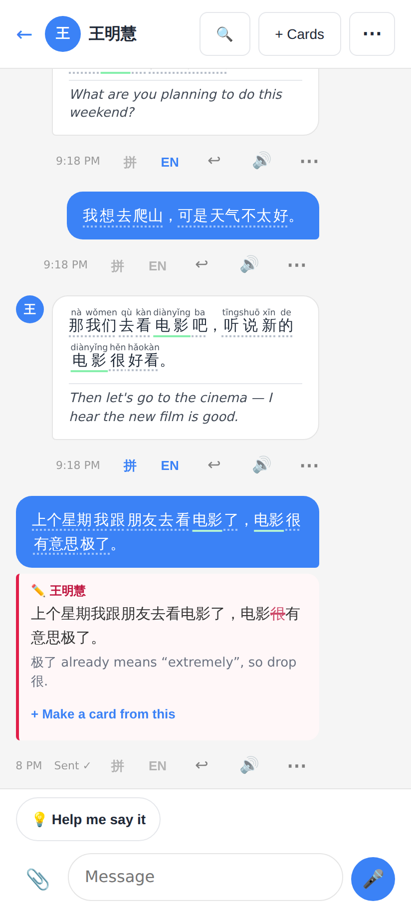
The tutor's correction under the student's message: struck-out and written-in characters with the tutor's note, plus "+ Make a card from this".

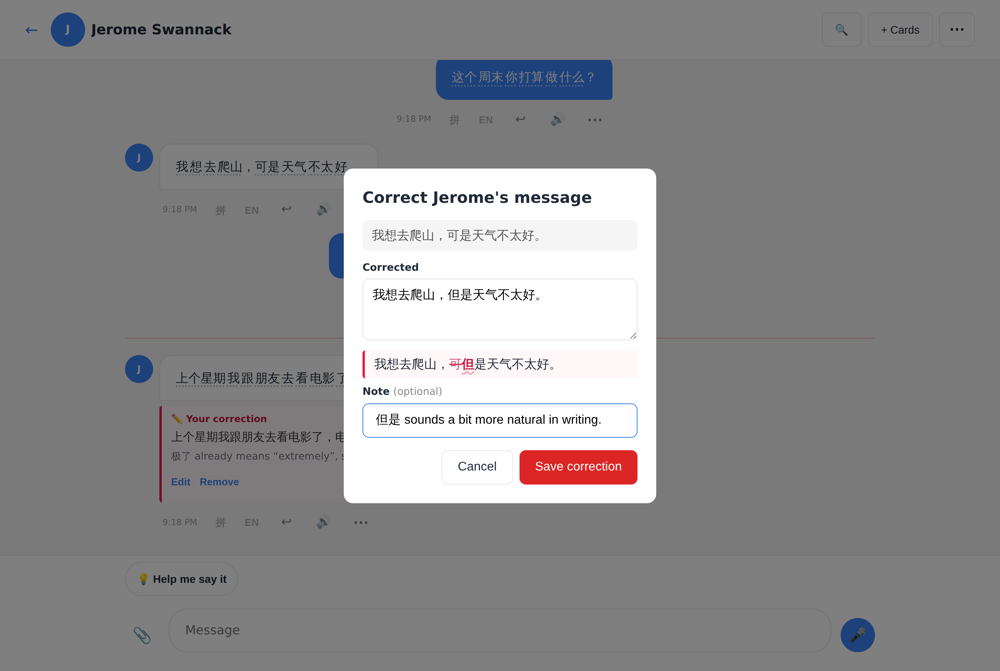
⋯ → Correct this: the message text is prefilled and editable, with a live red-pen preview and an optional note.

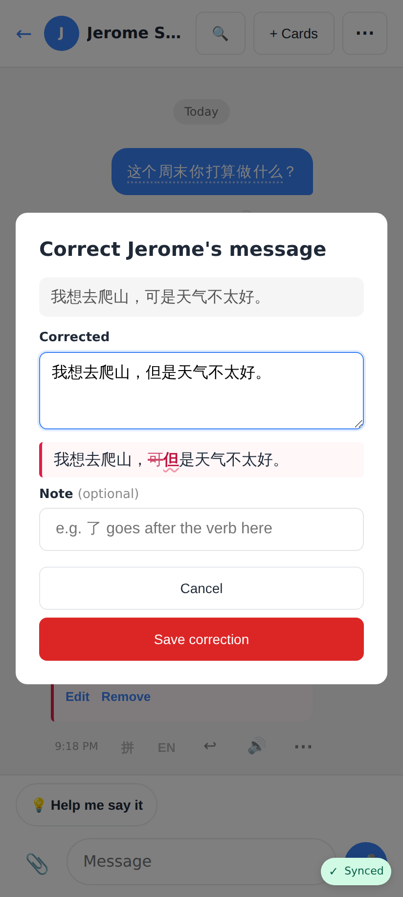
The same sheet on a phone.

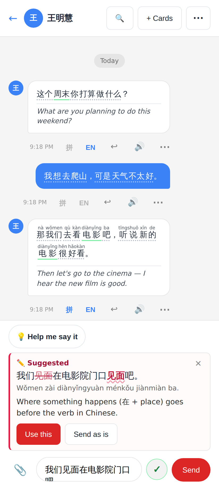
✓ on the compose box (shown to the learner when the draft has Chinese) shows the corrected sentence as a diff against the draft, with a short critique. Choose Use this or Send as is.

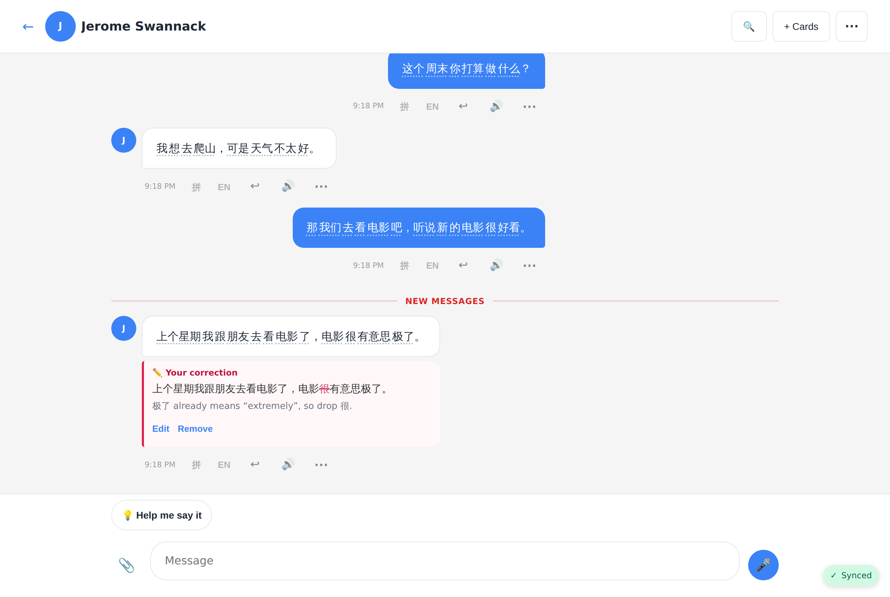
The tutor's view of a correction, with Edit / Remove.

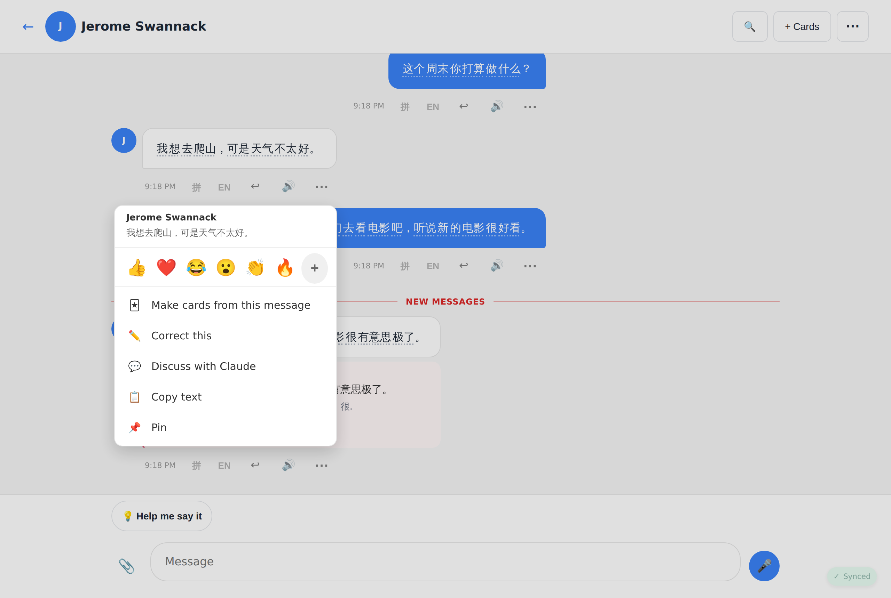
The tutor's ⋯ menu on the student's message: Make cards from this message, and Correct this.
