# Chat PR 3 — learning tools in the chat (Lab app)

Roborazzi shots of the native Lab app (`ChatLearningScreenshots`), phone 412 dp unless noted.

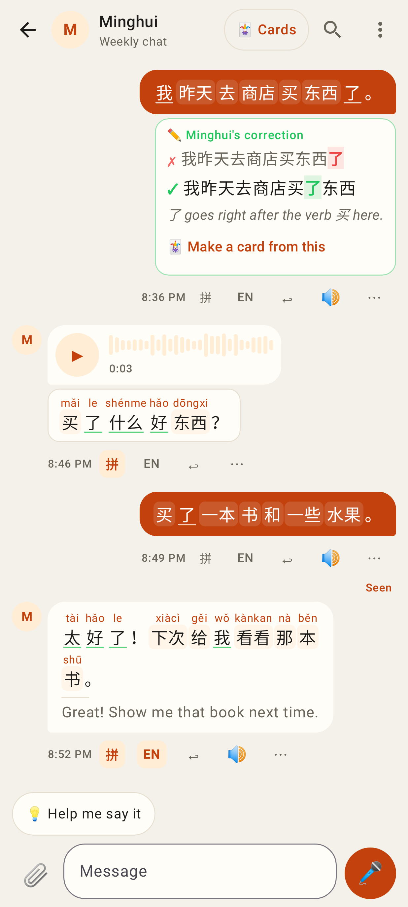
Word chips in every Chinese message (voice transcripts too); 拼 / EN next to the time show pinyin over each word and the translation. Words already in a deck are quieter (green underline). The tutor's correction sits under the student's message.

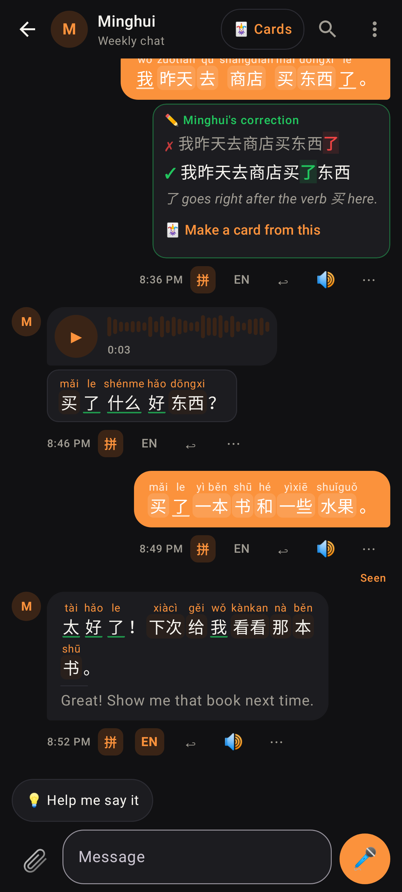
Dark theme with "Show pinyin for all" on.

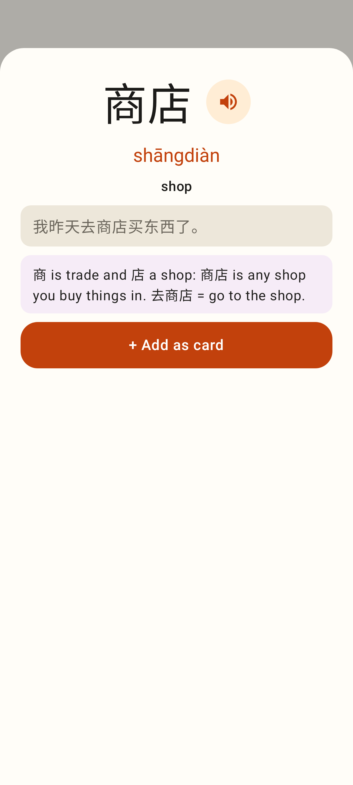
Tap a chip: the reader word sheet (▶, the sentence, More about this word, + Add as card).

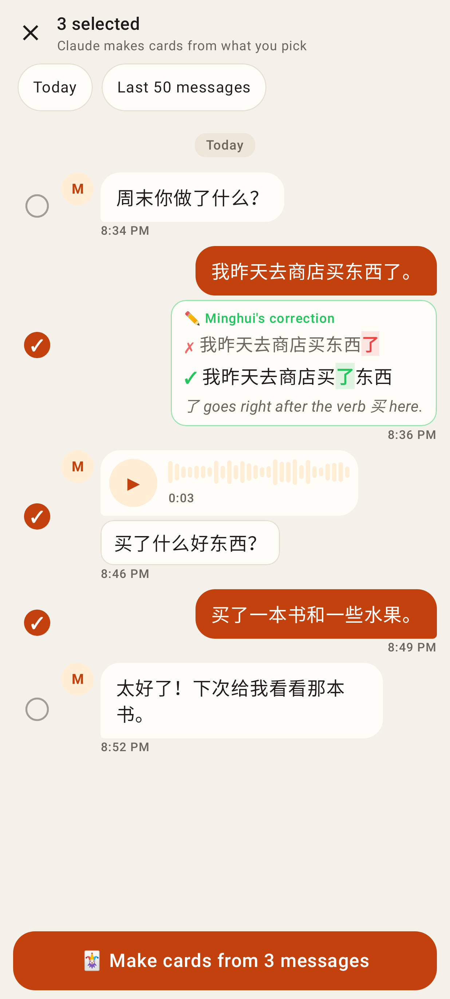
🃏 Cards → selection mode: round checks, Today / Last 50 messages quick picks, "Make cards from N messages".

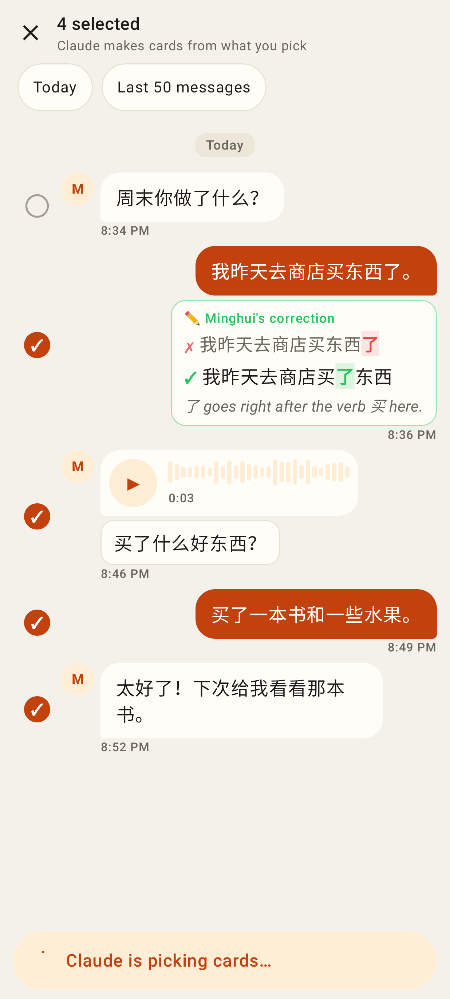
While Claude proposes cards.

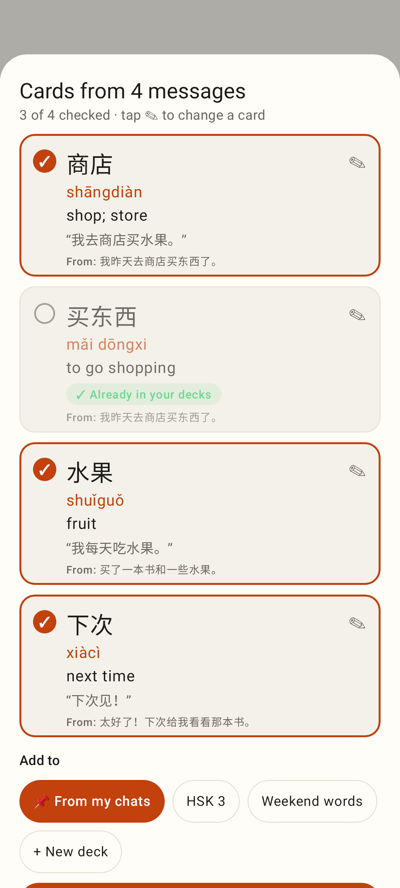
Review: checked cards, the one already in the decks unchecked, the message each came from, deck chips (last deck preselected).

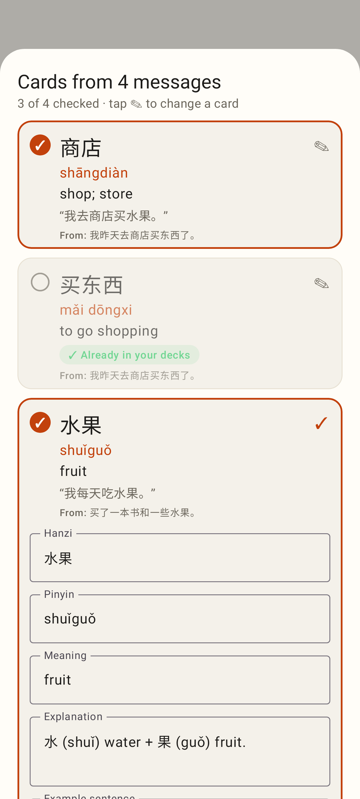
✎ opens a card's fields; + New deck.

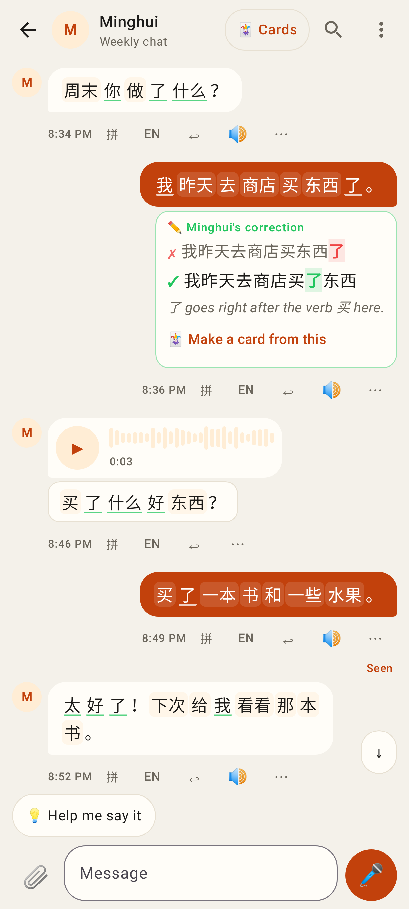
The student sees the tutor's correction as a character diff + note, with "🃏 Make a card from this".

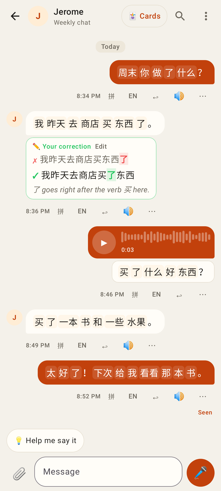
The tutor sees "Your correction · Edit" under the student's message.

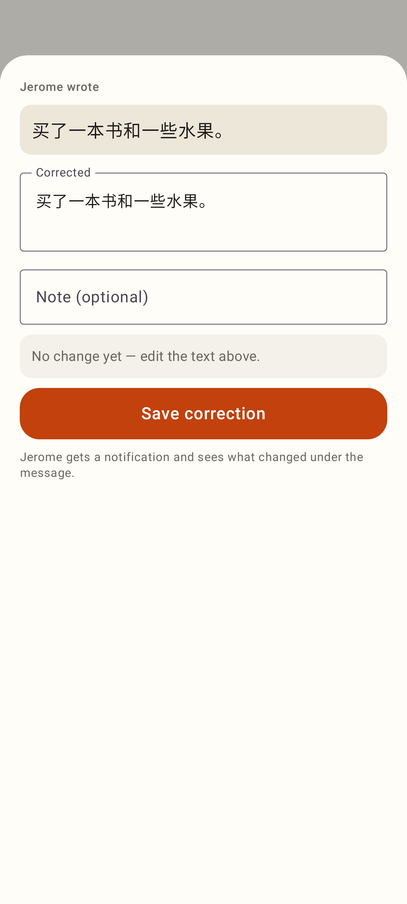
⋯ → Correct this: prefilled text, optional note, live diff.

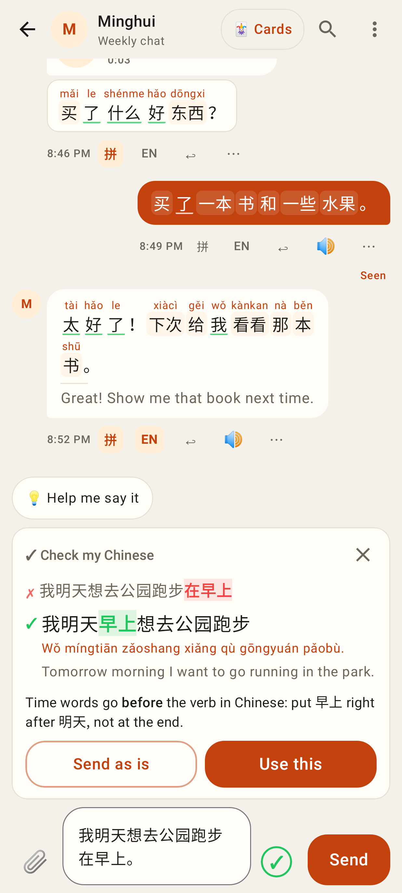
✓ in the composer → draft vs correction, pinyin, meaning, short critique, Send as is / Use this.

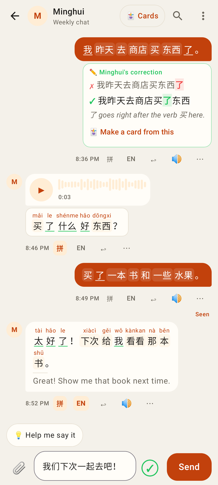
The ✓ appears when the learner's draft has Chinese.

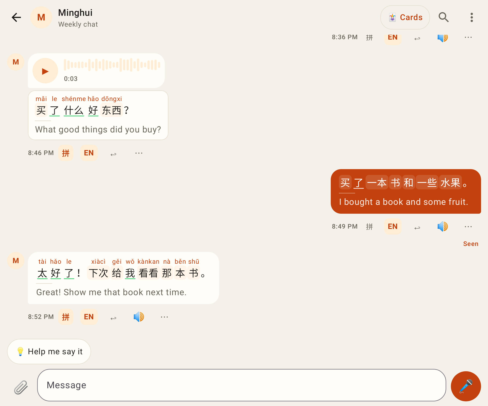
Unfolded Pixel Fold (841 dp) with translations for all.
