# Chat listening mode — screenshots

Web app at 412×915 (2×), the Lab app below (Roborazzi).

## Web

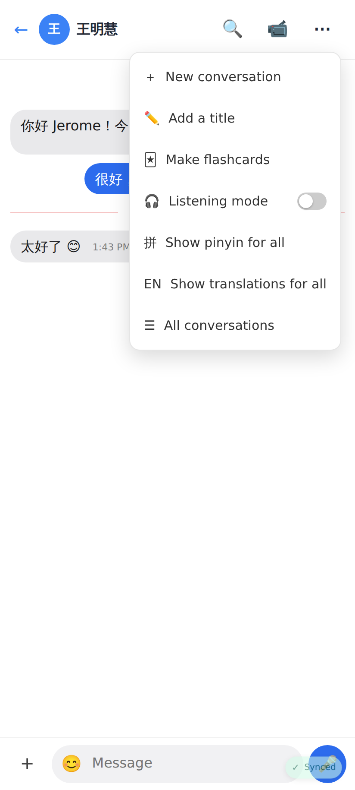
The chat's ⋯ menu: 🎧 Listening mode (off).

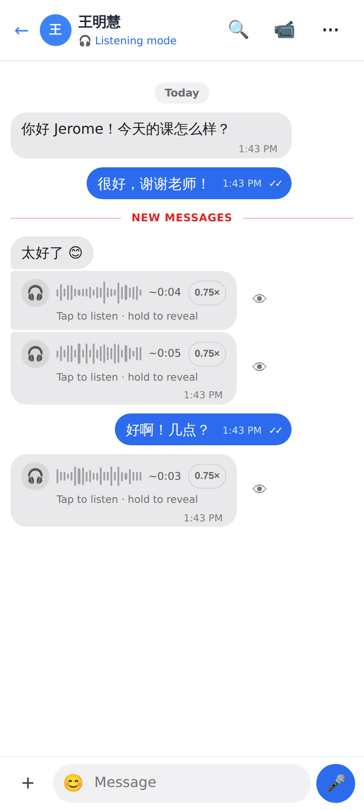
Mode on: history stays visible, the tutor's new Chinese messages arrive hidden — 🎧, bars, ~length, 0.75×, 👁. My own messages are never hidden.

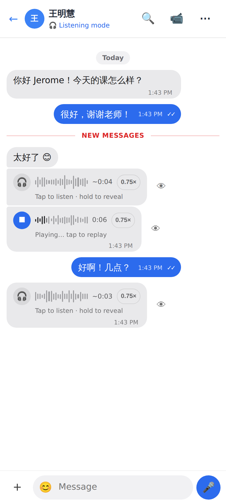
Tap: the clip plays (■, bars fill as it plays, real length, "Playing… tap to replay").

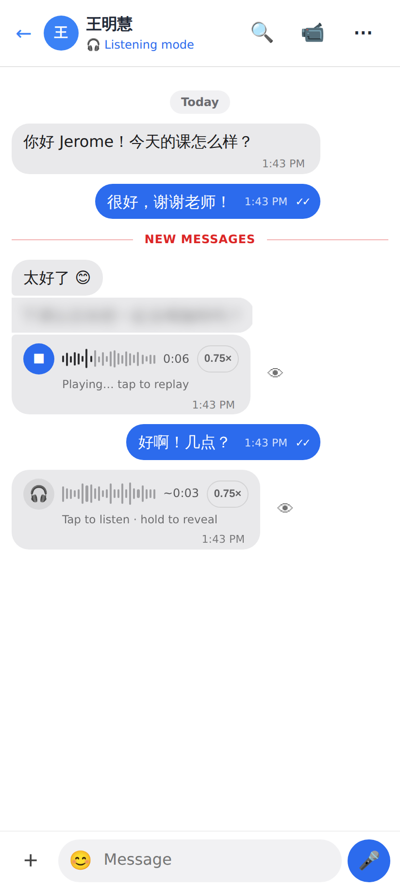
Hold: the text comes into focus (un-blur), no message menu.

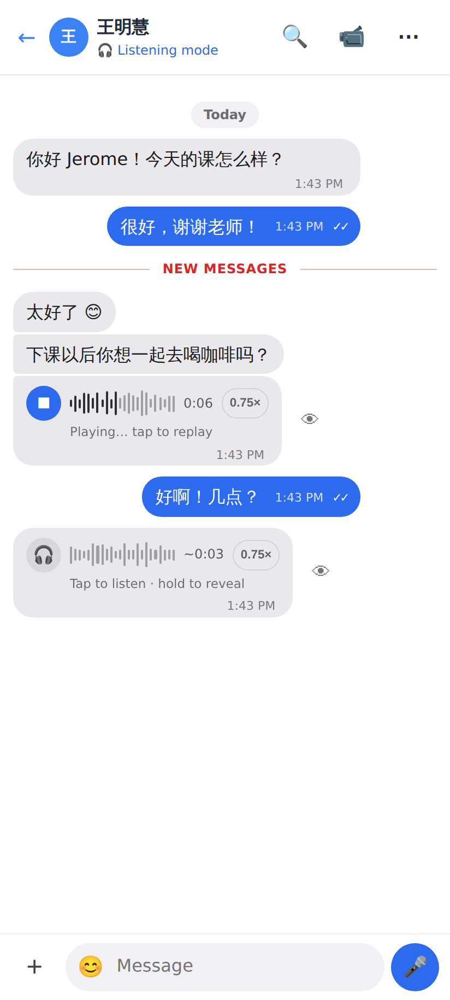
Revealed — stays revealed (stored on the device).

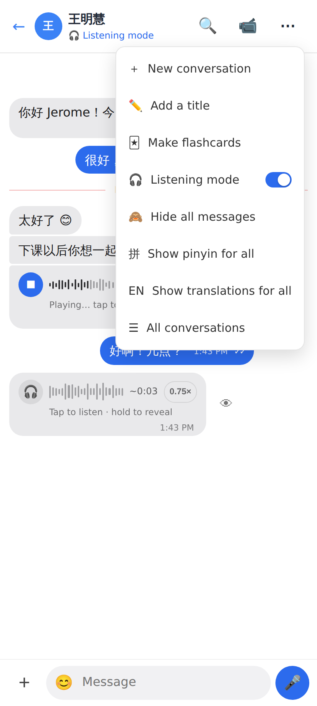
While on: the switch and 🙈 Hide all messages.

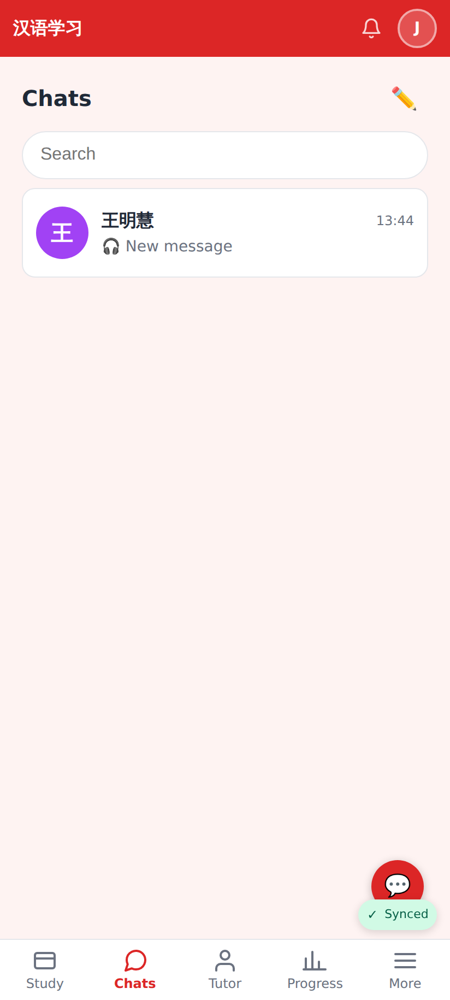
The Chats inbox never spoils a hidden message: "🎧 New message".

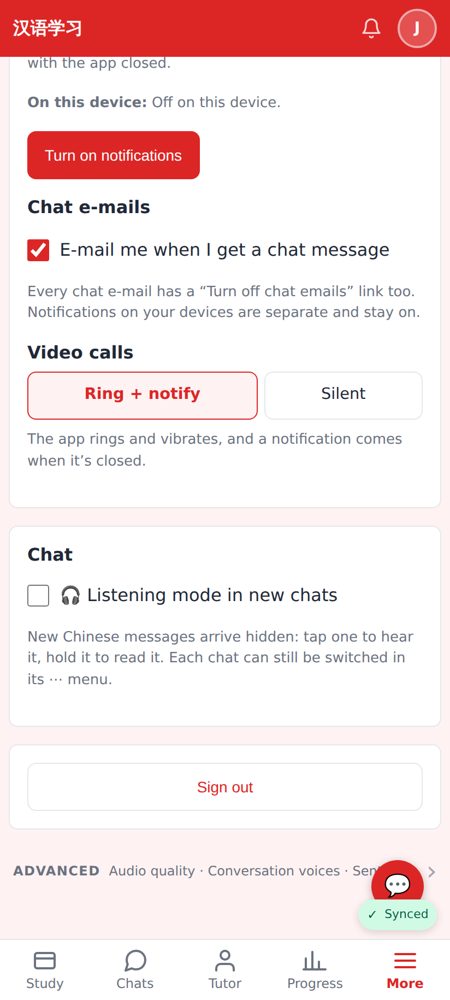
Settings → Chat → Listening mode in new chats (the default).

## Lab app (Roborazzi)

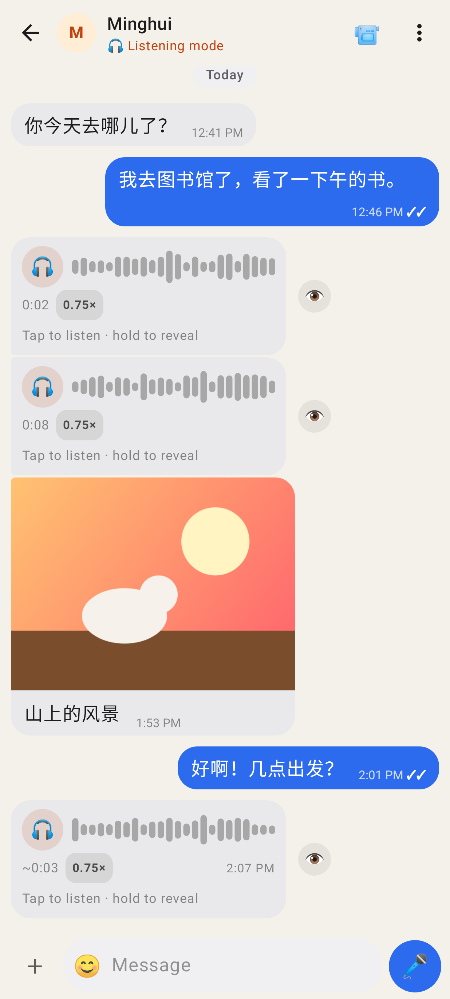
Hidden bubbles for the tutor's new messages.

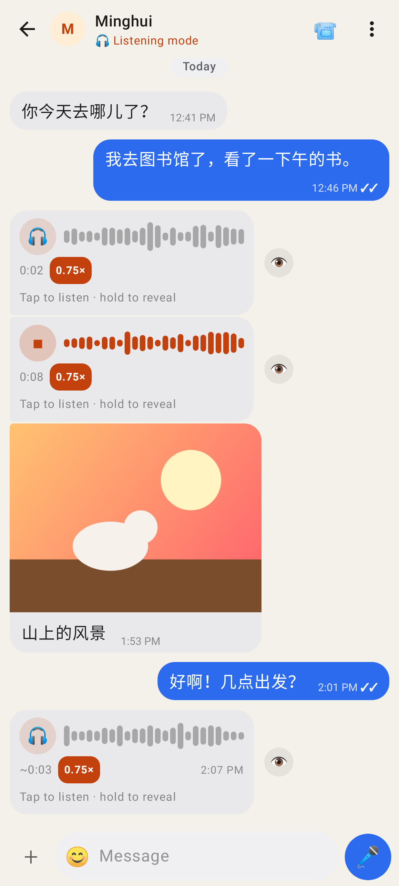
Playing at 0.75×.

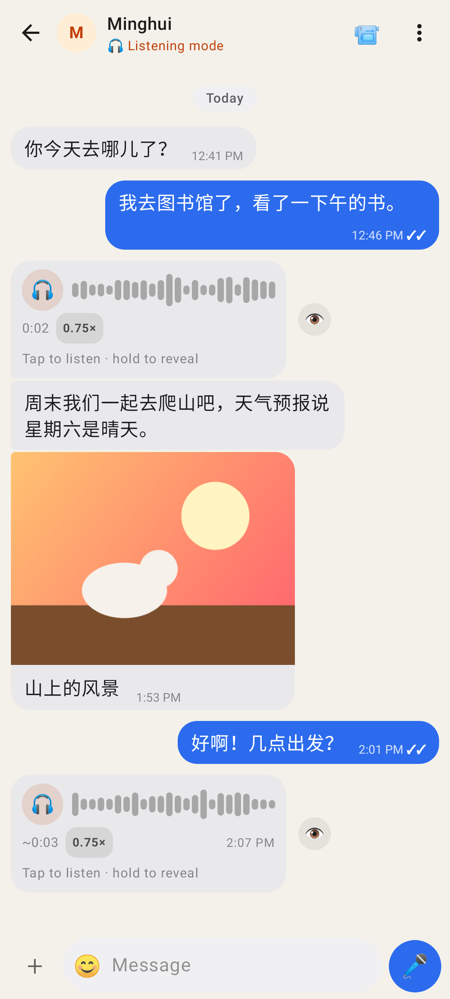
Revealed.

Mid-reveal (un-blur).

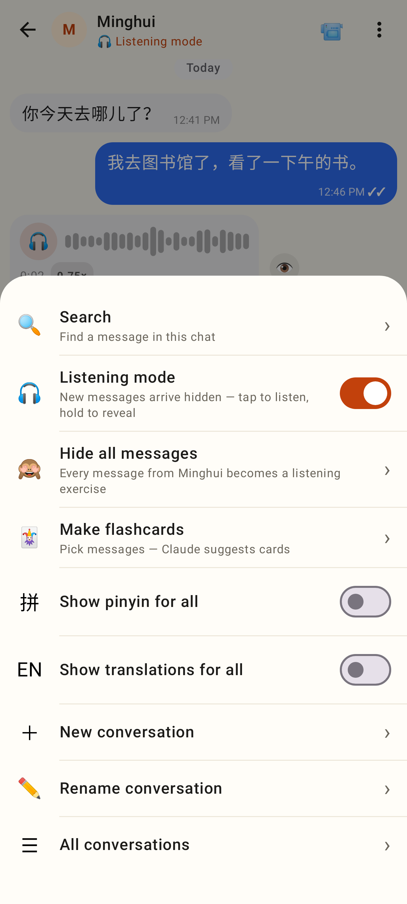
⋯ menu with Listening mode on + Hide all.

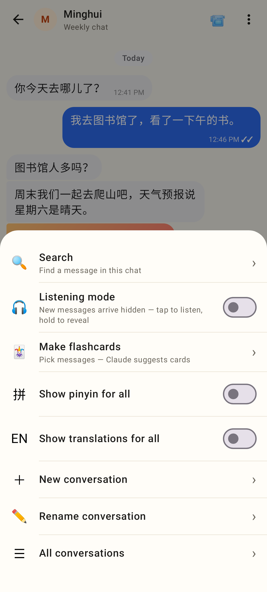
⋯ menu, mode off.

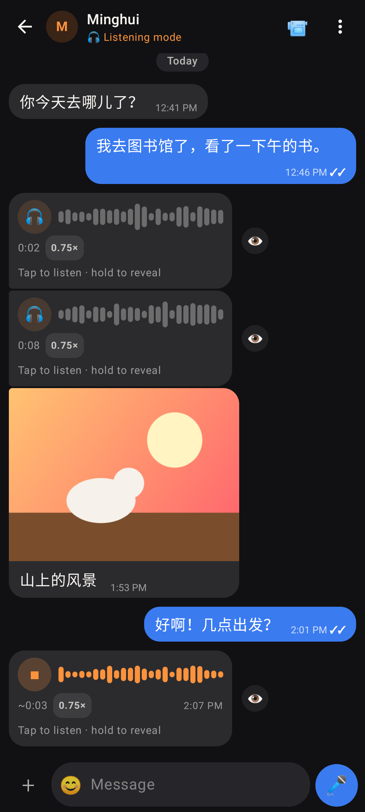
Dark theme.

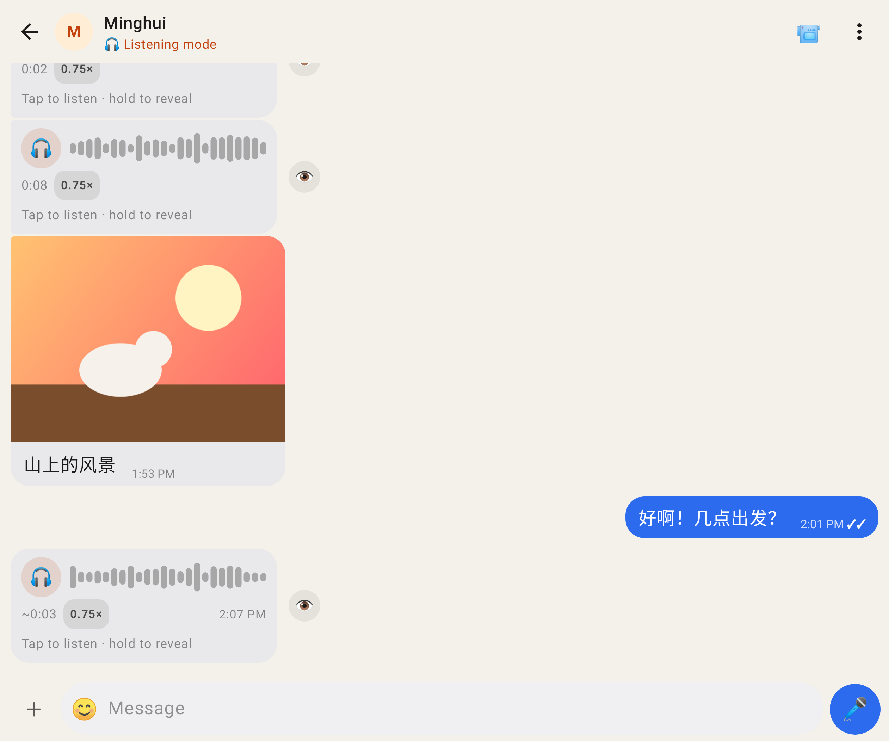
Unfolded (Pixel Fold).

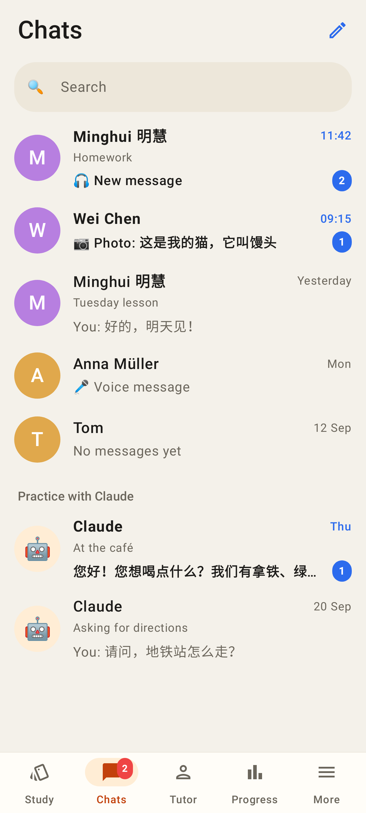
Inbox: 🎧 New message.

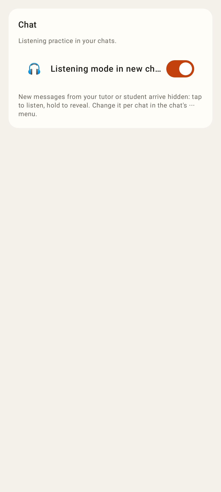
Settings → Chat.

