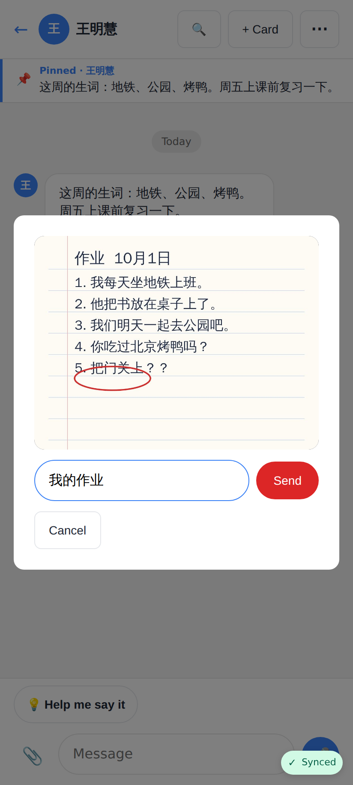
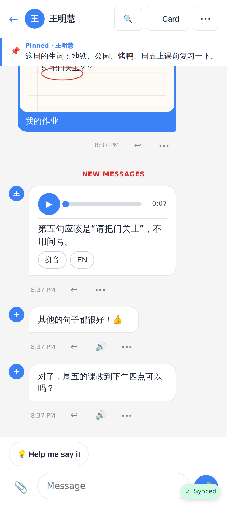
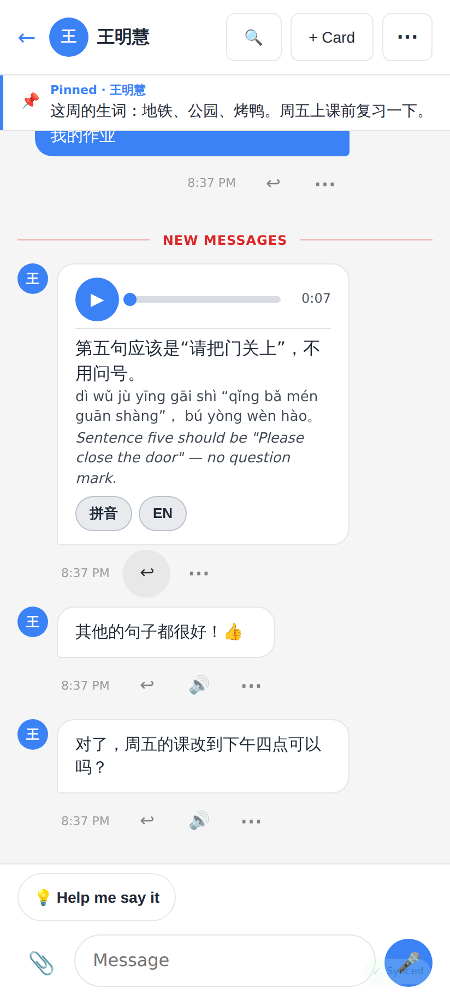
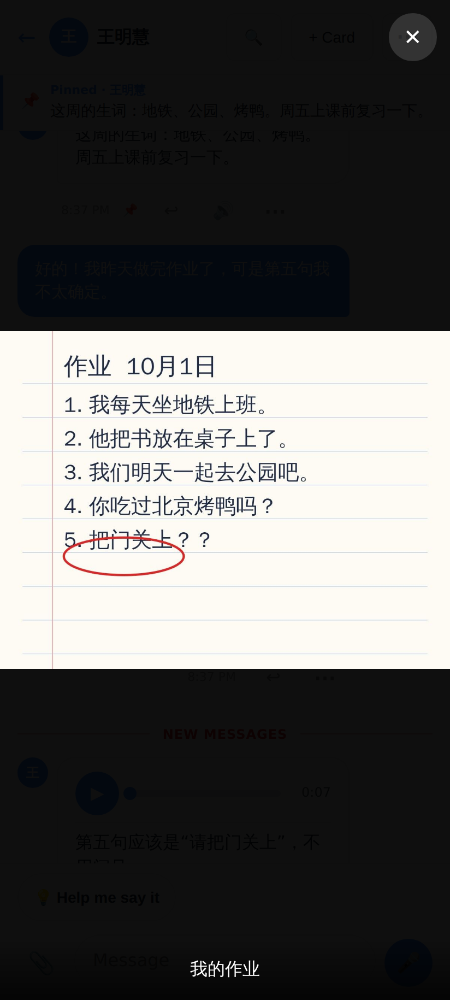
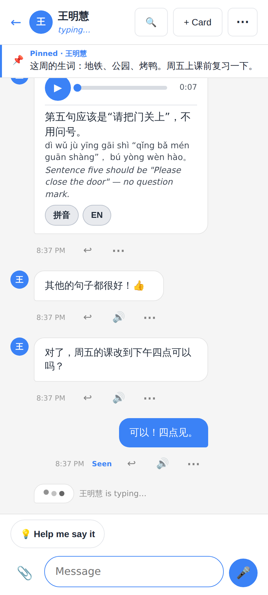
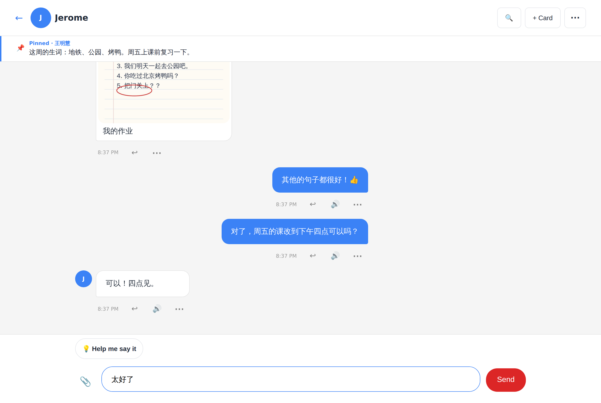
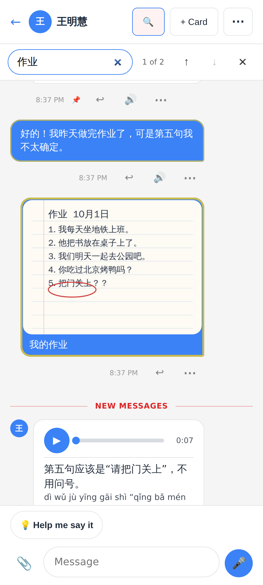
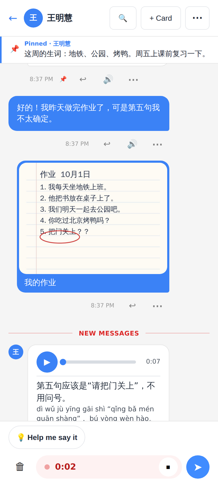
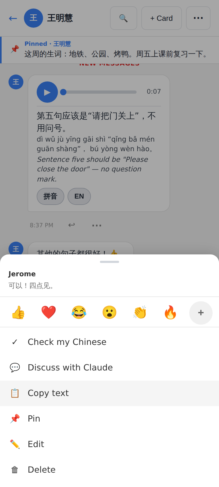
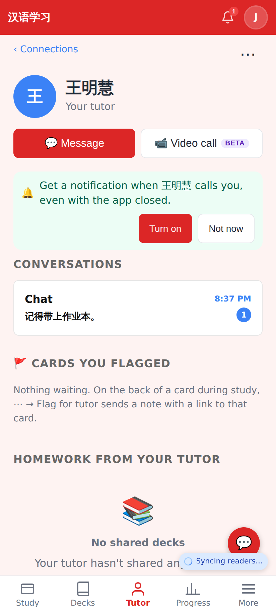

# Live chat & rich messages — web (PR 2)

Phone shots at 412×915 @2×, the desktop one at 1280×860 @2×. Real local app, seeded tutor (王明慧) + student (Jerome); the tutor's transcribed voice message is injected into the student's view (no transcription provider locally).

A picked photo, compressed on the device to ≤ 1600 px JPEG, with an optional caption before it goes.

Opening the chat lands on the "New messages" divider (read marker as it was before opening); pinned message bar at the top.

Photo bubble sized from its width / height; voice message with ▶, progress, duration, transcript and the 拼音 / EN toggles open.

Tap a photo → full-screen viewer (pinch / double-tap to zoom, Escape or ✕ to close).

"Seen" under my newest message once she has read it; "王明慧 is typing…" in the list and "typing…" in the header, live over the ChatHub socket.

The tutor's desktop view (1280 px): the conversation stays in a readable centred column.

🔍 → search this chat (汉字 / pinyin / English / captions / transcripts), "1 of 2" with ↑ / ↓; the current match is ringed.

🎤 (shown while the box is empty) → recording with a live timer; 🗑 discards, ⏹ stops to listen back, ➤ sends.

The ⋯ sheet on my own message now has Pin, Edit and Delete.

The conversation list: unread badge and the last message as the preview (📷 Photo / 🎤 Voice message for media).
