# Chat PR 2 — Lab app (Android, Roborazzi, Pixel Fold 412 dp / unfolded 841 dp)

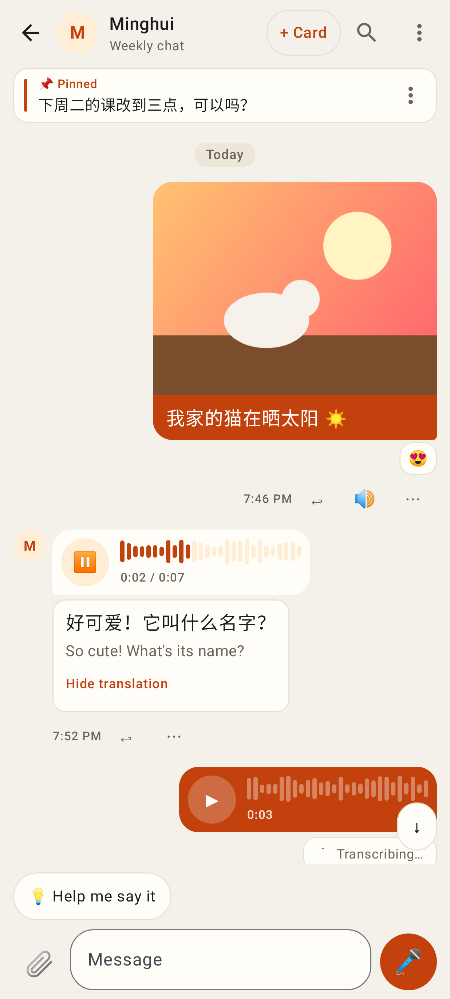
A photo with caption (aspect-ratio bubble, reaction), a voice message playing (waveform fills, 0:02 / 0:07) with its transcript + translation, my voice message still transcribing.

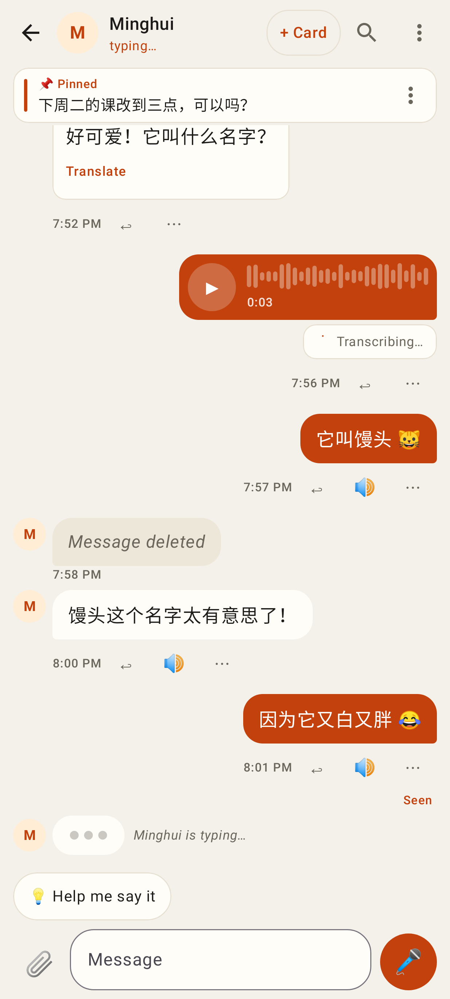
"Minghui is typing…" (bouncing dots, header subtitle), "Seen" under my newest message, "Message deleted".

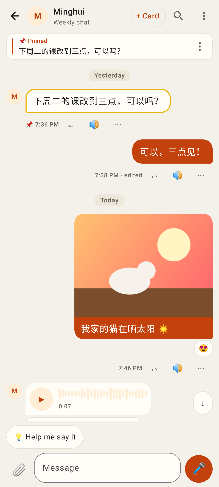
The pinned bar; tapping it jumps to the message and flashes it.

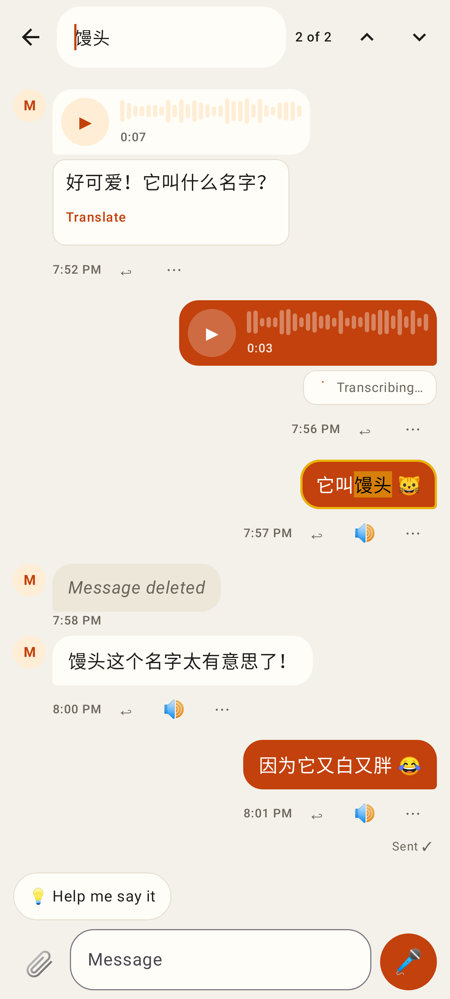
🔍 search: "2 of 2", ↑ / ↓, the current match highlighted and marked in the text.

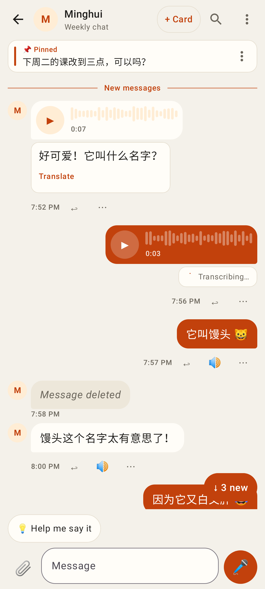
Opening at the "New messages" divider, with the floating "↓ 3 new" pill.

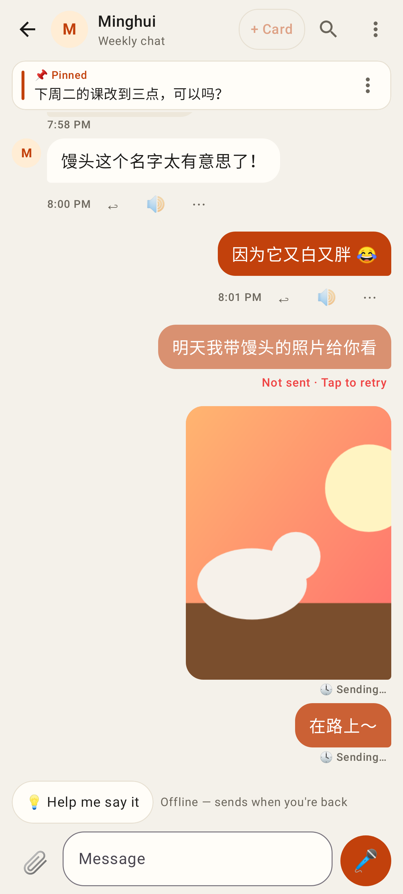
Offline: pending bubbles from the outbox (🕓 Sending…), a failed one ("Not sent · Tap to retry"), a pending photo.

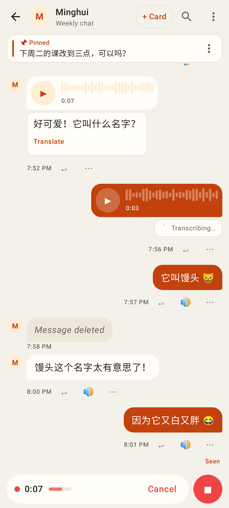
Hands-free recording: timer, level meter, Cancel, ■ stop.

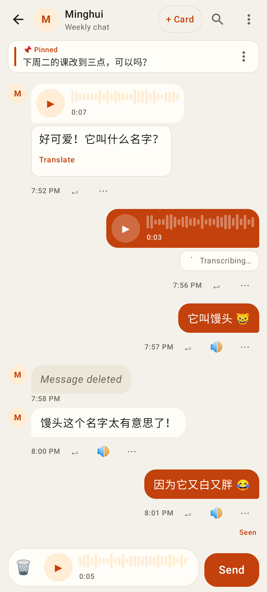
The recording's preview: 🗑, ▶, Send.

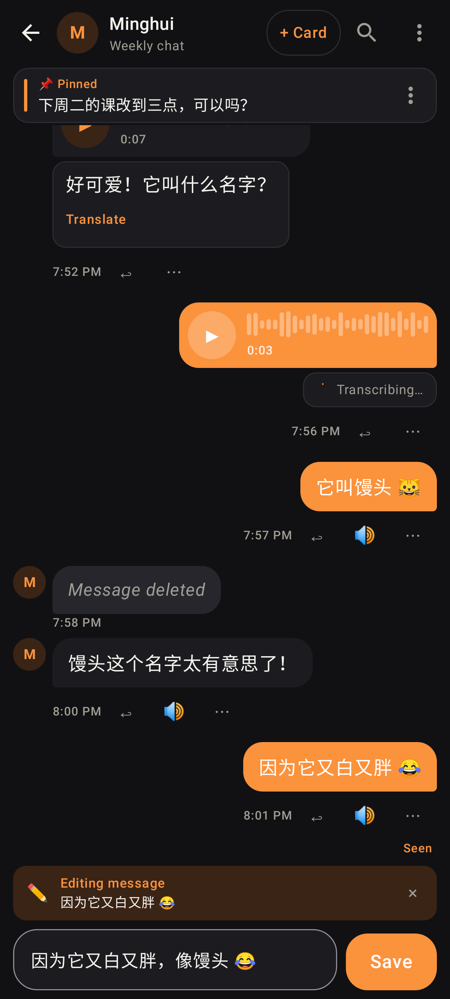
Editing my own message (dark theme), "· edited" label.

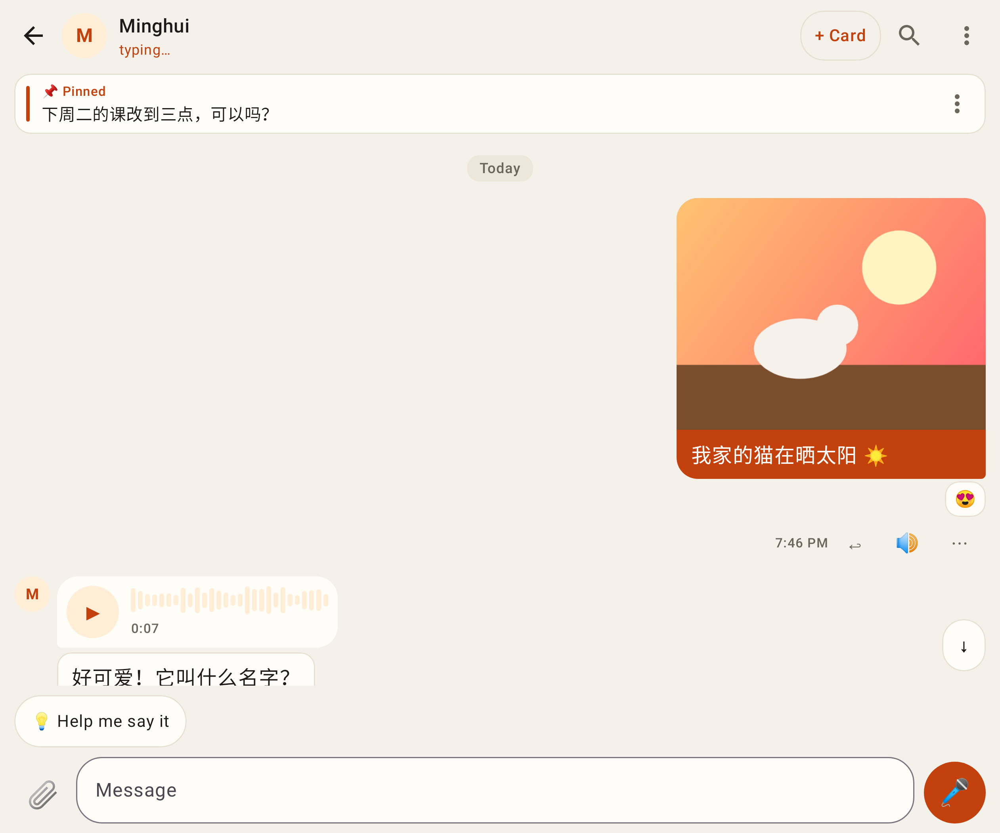
Unfolded (841 dp): bubbles capped at 480 dp.

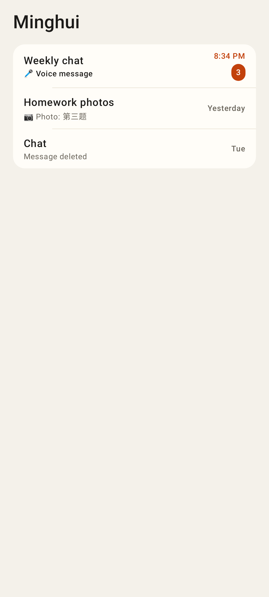
Conversation list: unread badge and 🎤 / 📷 / deleted previews.
