# Chat photo albums

Several photos sent at once are one album bubble (docs/CHAT.md "Photo albums").

## Lab app (412 × 915 dp)

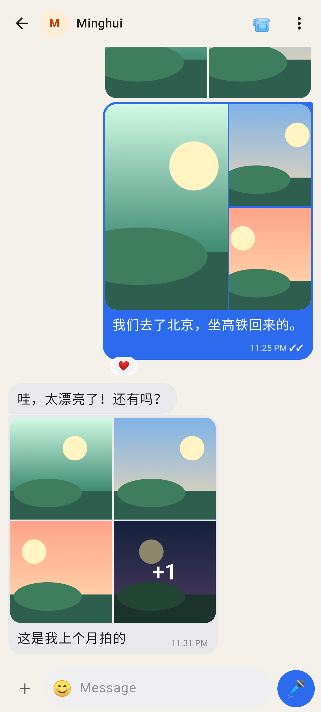
2 side by side, 3 = one big + two small with the caption under it and ✓✓ inside, 5 = 2 × 2 with "+1"; the ❤️ sits on the album's last photo.

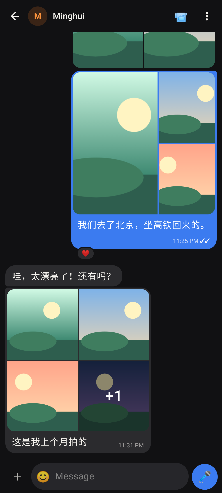
The same thread in dark mode.

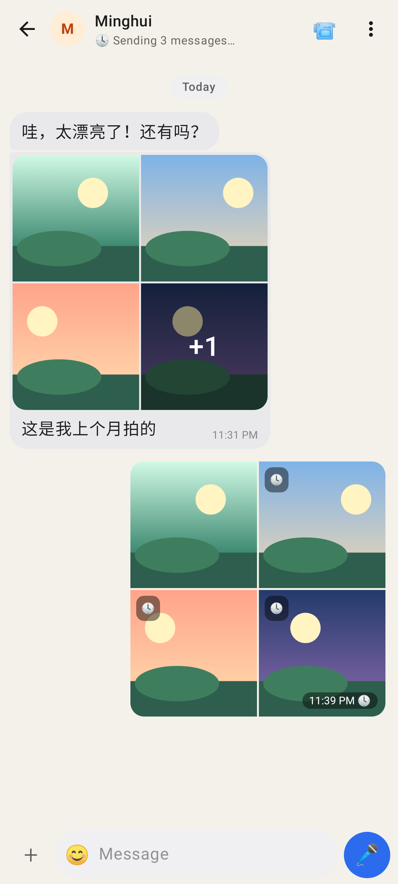
Four photos still in the outbox: one album, 🕓 per tile and on the time, "Sending 3 messages…" in the header.

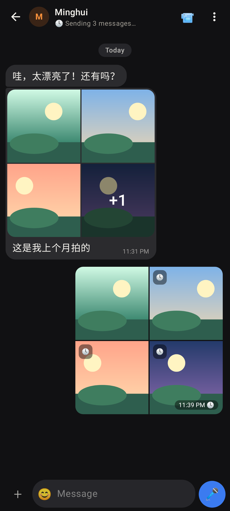
The same in dark mode.

The viewer (HorizontalPager) at "2 / 5" with Share / Forward and the album's caption.

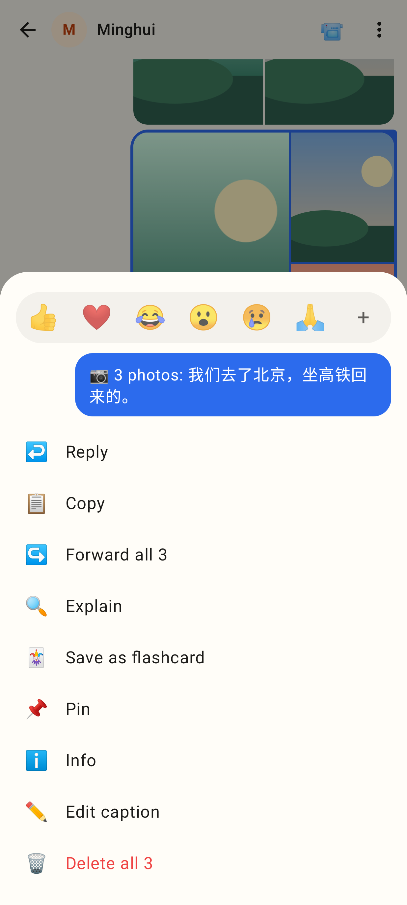
Long-press on an album: Reply, Copy, Forward all 3, Explain, Save as flashcard, Pin, Info, Edit caption, Delete all 3.

## Web (412 × 915, 2×)

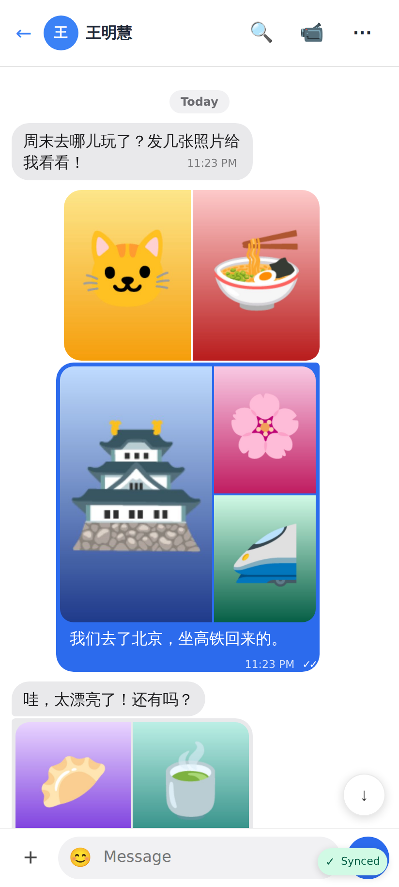
Two photos side by side, three with a caption.

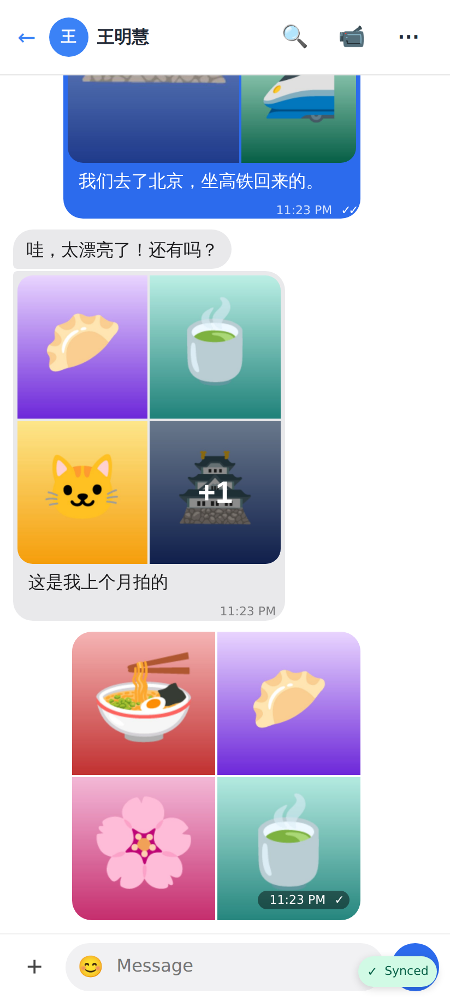
Five received (2 × 2 + "+1", caption), four sent (time + ✓ on the last tile).

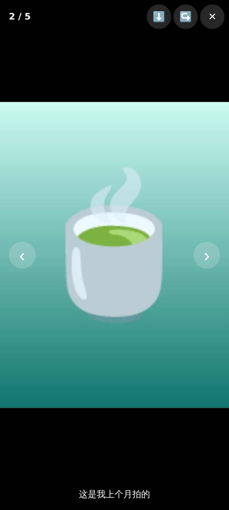
The viewer at "2 / 5": Save / Forward, the caption; Escape or back closes it.

Mid-swipe to the next photo.

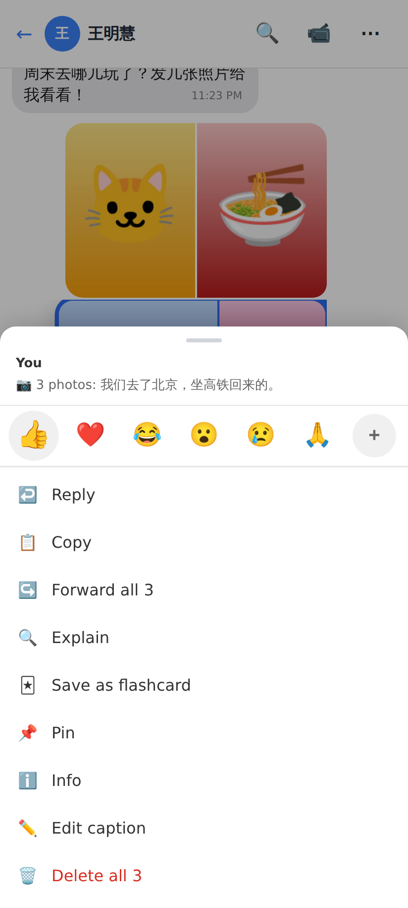
The album's menu: whole-album actions.

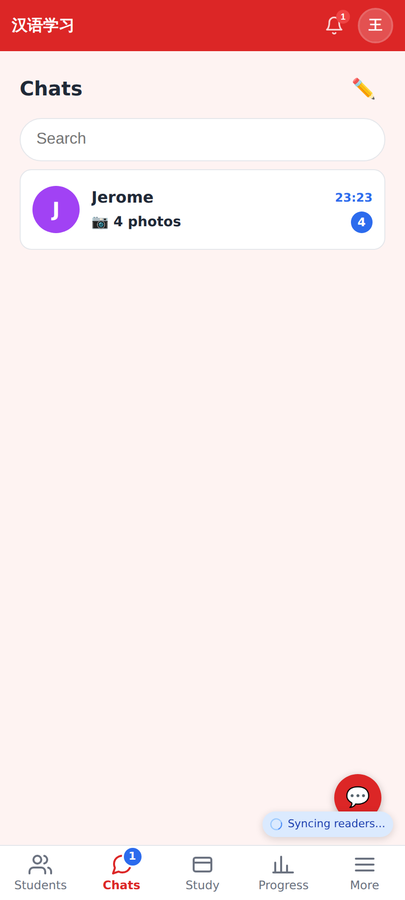
The Chats tab row says "📷 4 photos".

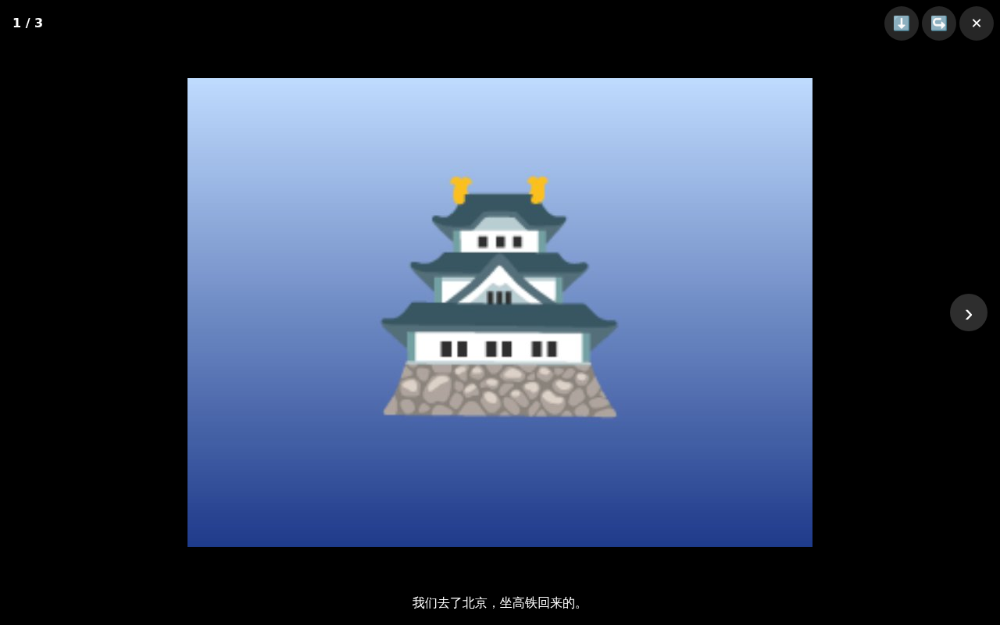
On a desktop the viewer has ‹ › arrows (and the arrow keys).
